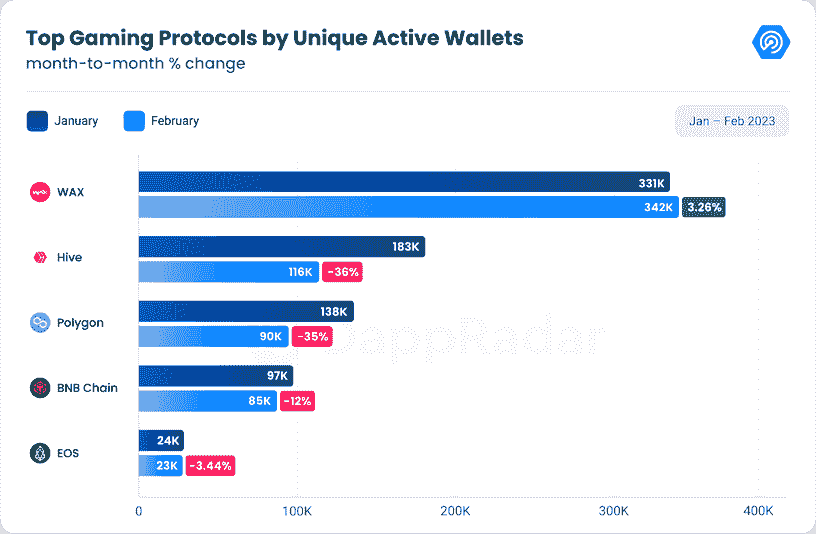
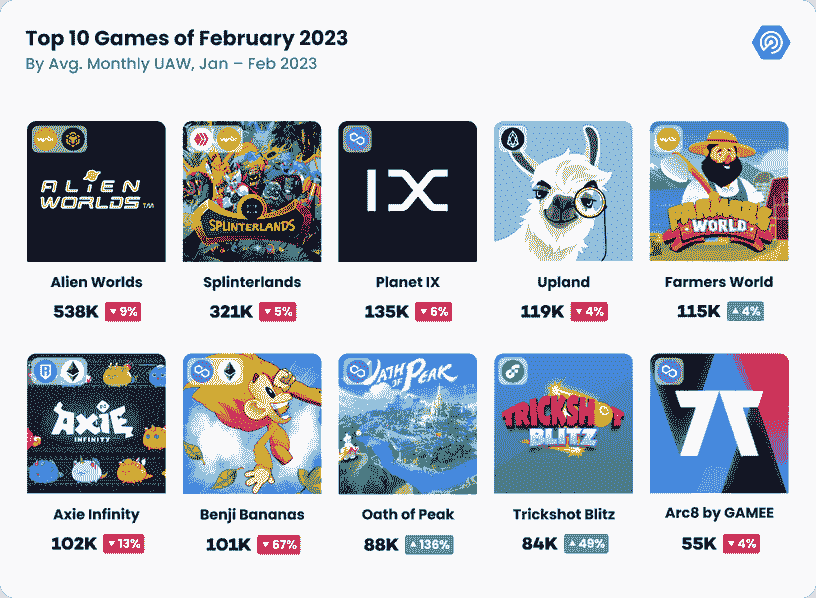
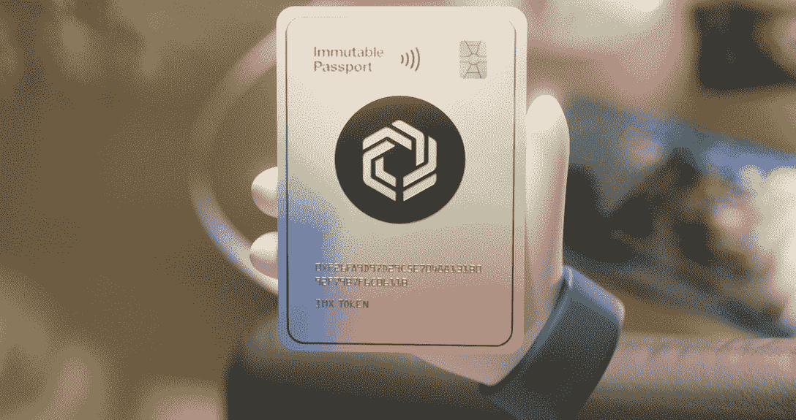
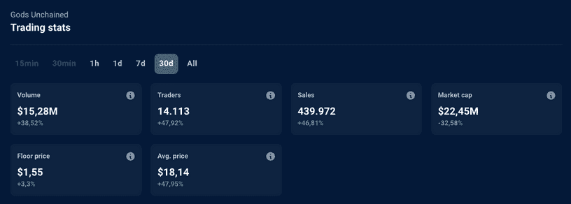
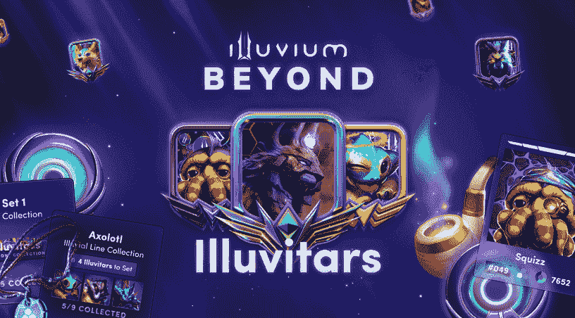
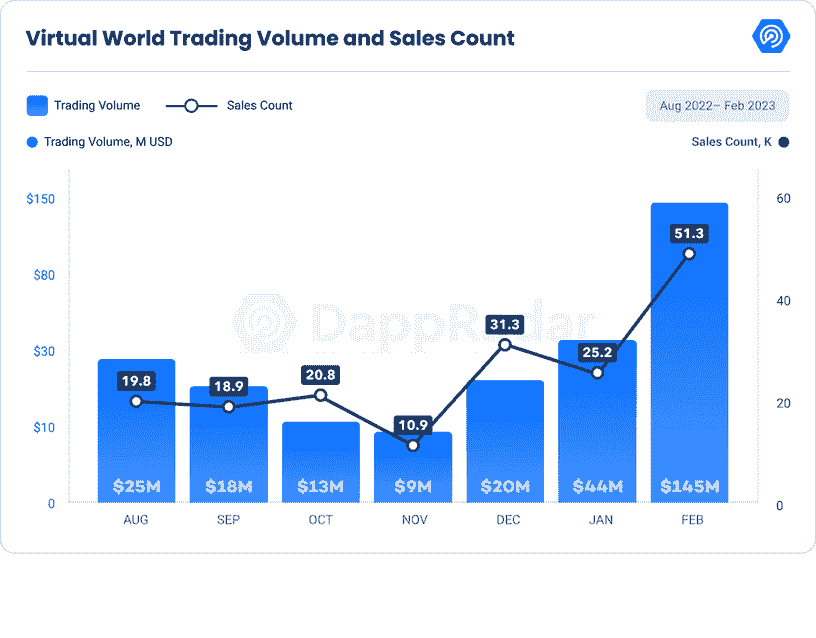
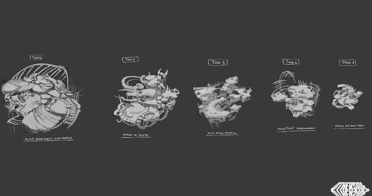
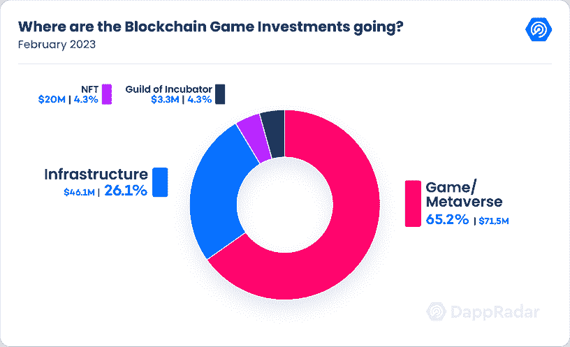
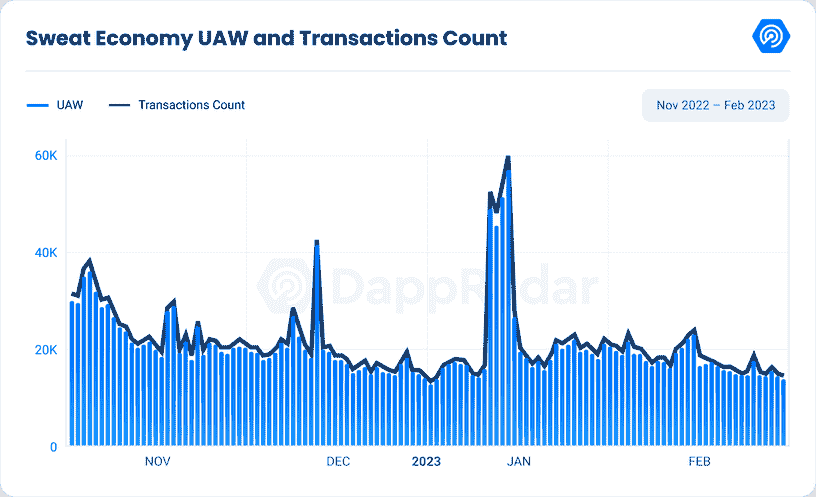
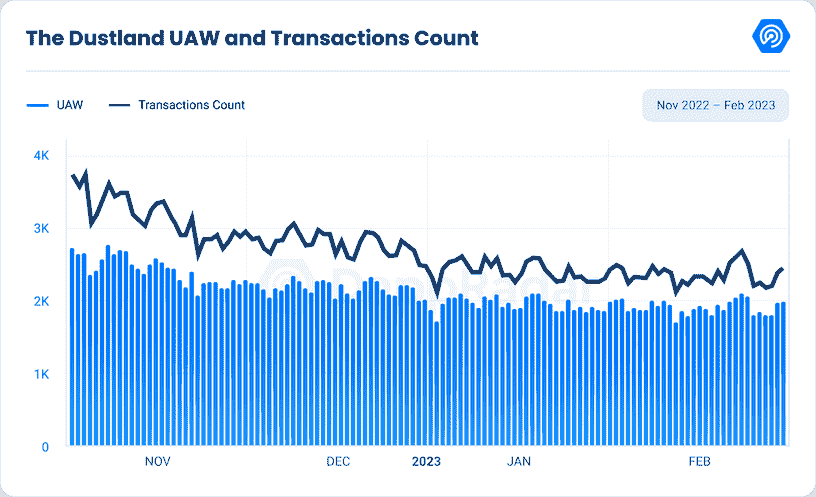

# 解锁激动人心的发展:为什么区块链游戏的下降月是误导

> 原文：<https://web.archive.org/web/https://dappradar.com/blog/unlocking-exciting-developments-why-a-down-month-for-blockchain-gaming-is-misleading>

## DappRadar x BGA 游戏报告#12

**尽管区块链产业在过去一年面临着挑战，但 2023 年已经有了一个充满希望的开端，特别是在游戏领域。DappRadar 2 月份的最新连锁数据分析令人鼓舞地揭示了该行业的增长和发展潜力，凸显了游戏在推动创新和进步方面的关键作用。**

## 关键要点

*   链上游戏活动在 2 月份下降了 12.33%，至 752，735 个每日唯一活跃钱包；尽管如此，游戏仍然占据了 dapp 行业活动的 45%。
*   《巅峰誓言》和《特技闪电战》的连锁使用率分别增长了 136%和 49%。
*   Unity 正在通过提供 13 个基于区块链的 SDK 进入 Web3 游戏世界，为游戏开发者提供连接 Web3 游戏的工具。
*   虚拟世界的交易数量翻了一番，达到 51，000 笔，交易量增加了 226%(1.45 亿美元)。
*   2 月份，对区块链奥运会和元宇宙项目的投资总计 1.48 亿美元。

## 目录

1.  [区块链游戏概述](https://web.archive.org/web/20230311205744/https://dappradar.com/blog/unlocking-exciting-developments-why-a-down-month-for-blockchain-gaming-is-misleading/#Chapter-1)
2.  [UAW 的《异世界》、《巅峰誓言》、《特技闪电战》等区块链游戏](https://web.archive.org/web/20230311205744/https://dappradar.com/blog/unlocking-exciting-developments-why-a-down-month-for-blockchain-gaming-is-misleading/#Chapter-2)
3.  [开启新的可能性:SDK 如何革新区块链游戏](https://web.archive.org/web/20230311205744/https://dappradar.com/blog/unlocking-exciting-developments-why-a-down-month-for-blockchain-gaming-is-misleading/#Chapter-3)
4.  [不可变 X 游戏护照:Web3 游戏的即时钱包入门解决方案](https://web.archive.org/web/20230311205744/https://dappradar.com/blog/unlocking-exciting-developments-why-a-down-month-for-blockchain-gaming-is-misleading/#Chapter-4)
    *   [被解放的神和伊鲁维公布激动人心的更新](https://web.archive.org/web/20230311205744/https://dappradar.com/blog/unlocking-exciting-developments-why-a-down-month-for-blockchain-gaming-is-misleading/#Chapter-4-1)
5.  [虚拟世界交易额猛增 226%，达到 1.45 亿美元](https://web.archive.org/web/20230311205744/https://dappradar.com/blog/unlocking-exciting-developments-why-a-down-month-for-blockchain-gaming-is-misleading/#Chapter-5)
6.  区块链奥运会和元宇宙项目筹集了 1.48 亿美元
7.  从血汗经济到基因宠物:移动挣钱的 dapps 下一步是什么？
8.  [结论](https://web.archive.org/web/20230311205744/https://dappradar.com/blog/unlocking-exciting-developments-why-a-down-month-for-blockchain-gaming-is-misleading/#Conclusion)

## 1.区块链游戏概述

区块链博彩业是一个快速发展的行业，在 2023 年 2 月，其每日唯一活跃钱包(dUAW)经历了一些波动。根据我们的数据[显示，2 月份连接到区块链博彩 dapps 的平均每日唯一活跃钱包为 752，735 个，较上月下降 12.33%。这一下降趋势与前几年一致，因为 2 月份往往是该行业的淡季。](https://web.archive.org/web/20230311205744/https://dappradar.com/industry-overview)

尽管有所下降，区块链博彩仍然是最具优势的领域，在行业独特的主动钱包中占据 45.43%的主导地位。然而，这一优势比上个月有所下降，当时为 48.5%。石基香蕉在 UAW 经历了最大的下跌 67%。然而，值得注意的是，DeFi 和 NFT 的业务出现了显著增长，正如我们在二月份的行业报告中所强调的那样。

纵观区块链顶级游戏协议，Wax 最为活跃，2 月份平均为 342，764 dUAW，较上月增长 3.26%。Wax 是审查期间唯一一个 dUAW 增长的区块链博彩协议。其他博彩区块链数据包括 Hive 的 116，930 dUAW，下降了 36.14%，Polygon 的 90，139 dUAW，下降了 35%，BNB 链的 85，363，下降了 12.18%，EOS 的 23，891，下降了 3.44%。

有趣的是，尽管它们不属于区块链顶级游戏协议，但由于其游戏 dapp Iskra 的受欢迎程度，Klaytn 本月的 dUAW 增长了 294.29%，达到 15，543 dUAW。Arbitrum 与游戏相关的 dUAW 也有所增长，增幅为 82.38%，达到 3，064。这是由《宝藏岛》的持续成功所推动的，这在我们与 BGA 合作的[上一份游戏报告中进行了分析。](https://web.archive.org/web/20230311205744/https://dappradar.com/blog/game-and-metaverse-tokens-rally-with-strong-on-chain-metrics)

## 2.UAW 的《异形世界》、《巅峰誓言》、《特技闪电战》等区块链游戏

区块链游戏是一个快速增长的行业，尽管经历了一个缓慢的月份，但 2023 年 2 月的区块链十大游戏就是一个证明。在本节中，我们将根据这些游戏的每月唯一活跃钱包(mUAW)来仔细了解它们，并深入了解它们的最新更新和发展。

位居榜首的是《外星世界》，尽管较上月下降了 9.69%，但 2 月份仍有 538，420 mUAW。外星世界的生态系统是由六个星球管理的，他们的金库是由他们的道“辛迪加”管理的。虽然看起来其中一个辛迪加遭受了 10 万美元的黑客攻击，但后来发现恶意行为者只是试图证明现有的漏洞，从而刺激了星际联邦的创建——一个由合格托管人组成的 DAO，其共同目标是促进 Alienworlds.io 内不同星球之间的合作和协调，并促进其社区的发展和增长。

夹板岛位居第二，为 321，880 mUAW，环比下降 5.23%。排在第三位的是行星九，为 135,890 mUAW，环比下降 6.65%。该游戏推出了 Cargo Drop 3，其中包括 NFT 和背包，并增加了漫游者——帮助玩家收获瓷砖的自动车辆。二月份，高地以 119，770 mUAW 排名第四，并继续为其玩家提供正在进行的活动，包括大型游戏挑战，狂欢节装饰品销售，以及 Susan G. Komen 基金会(乳腺癌意识)的筹款项目。

Axie Infinity 为 102，200 mUAW，环比下降 13.36%。然而，随着 MetaLend 的推出，这款游戏成为了头条新闻，metal end 是一种接受 NFTs 作为抵押品的贷款系统。此外，2 月 22 日 11:30 GMT，Axie Homeland Alpha 第一季开始，这将为游戏带来第一个版本的 AXS 奖励。而且，由于奖励现在可用，每个人都将看到他们的进度重置，他们必须再次从头开始建设他们的土地。

2 月份表现最好的游戏之一《巅峰之誓》的 mUAW 增长了 136%，达到 88，090。这款游戏因其独特的游戏性和 NFT 产品越来越受欢迎。2 月份另一款表现出色的游戏是 Trickshot Blitz，其 mUAW 增长了 49%，达到 84，160。

总之，2023 年 2 月，一些区块链奥运会的月度 UAW 有所下降，而另一些则有显著增长。然而，很明显，区块链游戏继续成为一个不断增长的行业，为玩家提供独特和迷人的体验。请关注这些顶级区块链游戏的未来更新和发展。

[DappRadar Games Ranking](https://web.archive.org/web/20230311205744/https://dappradar.com/rankings/category/games)

## 3.开启新的可能性:SDK 如何革新区块链游戏

区块链游戏世界正在快速发展，开发人员需要一系列工具来构建能够无缝集成不同功能的分散式应用程序。幸运的是，软件开发工具包(SDK)已经被开发出来，使这项任务更易于管理。SDK 为开发人员提供了一组预构建的模块和库，简化了构建 dapps 的过程，使区块链经验有限的开发人员能够快速轻松地构建应用程序。

SDK 提供了几种解决区块链游戏挑战的解决方案。首先，它们通过提供预构建的模块和库来简化开发过程，这些模块和库可用于快速轻松地开发复杂的 dapps。此外，它们还提供了安全可靠的基础设施，确保 dApp 平稳运行，免受安全威胁。

此外，SDK 可以轻松地将 dapps 与区块链网络集成，为开发人员提供对底层区块链基础设施的访问，并使他们能够构建可在分散平台上运行的分散应用。它们还提供用户友好的界面和工具，使开发人员能够轻松构建、测试和部署 dapps，即使他们对区块链技术的经验有限。

根据 [Alchemy Q4 报告](https://web.archive.org/web/20230311205744/https://www.alchemy.com/blog/web3-developer-report-q4-2022)显示，与 2021 年相比，2022 年以太坊 SDK 安装量增长了 87%,包括 ethers.js、web3.js、hardhat 和 web3.py。此外，与同一年的第三季度相比，第四季度的安装量增长了 16%。

Source: [Alchemy](https://web.archive.org/web/20230311205744/https://www.alchemy.com/blog/web3-developer-report-q4-2022)

几家公司正在为区块链游戏提供 SDK。例如，Mirror World 旨在改善新 Web3 用户的入职流程，同时为他们的资产提供最高级别的安全性。该公司为项目提供基础设施，通过具有灵活 API 的 SDK 无缝集成功能，使开发者可以轻松构建伟大的游戏。另一方面，ChainSafe 为 Web3 游戏开发人员提供开源节点实现和开发工具，通过简单的拖放预置，使开发人员能够构建市场、创建皮肤和实现高级定制。Unix 为游戏市场或与外部合同的连接以及高级定制提供了拖放式的预建工具。

领先的游戏开发平台 Unity 也在进军 Web3 游戏领域，在其在线商店推出了“去中心化”类别，并增加了对 13 个区块链软件开发工具包(SDK)的支持。其中包括 Dapper Labs 的 Flow 区块链、Algorand、Aptos、Immutable X、MetaMask、Solana 等，使游戏开发者能够与 Web3 gaming 连接。

2023 年 2 月，区块链游戏世界出现了几项激动人心的发展。在 SDK 的帮助下，开发人员正在创建分散的区块链游戏，允许玩家以分散的方式安全地拥有和交易游戏资产。通过简化开发流程、提供安全可靠的基础设施、提供与区块链网络的集成以及提供用户友好的界面，SDK 正在为游戏开启新的可能性，并为玩家和开发者创造新的机会。

## 4.不可变的 X 游戏护照:Web3 游戏的即时钱包入门解决方案

Web3 游戏工作室面临两大挑战:安全性和玩家加入。Web3 游戏拥有加密钱包的独特要求导致了玩家的困惑和怀疑。目前可用的大多数钱包解决方案都不是为游戏玩家设计的，并且有损于身临其境的游戏体验。为了解决这些问题，Immutable X 正在开发 Immutable Passport，这是一个用于 Web3 游戏的即时钱包登录解决方案。

Source: [Immutable X blog](https://web.archive.org/web/20230311205744/https://www.immutable.com/blog/immutable-passport)

不可变 Passport 是一种非托管的钱包和身份验证解决方案，通过无密码登录和自动创建钱包来简化用户登录。游戏开发者和用户都可以从中受益。

对于游戏玩家来说，Passport 提供了一个安全的数字钱包，防止欺诈。更重要的是，它提供了一个非托管的钱包解决方案，让玩家可以控制自己的钥匙和资产。此外，它允许游戏玩家仅使用他们的电子邮件和 OTP 方便地登录 Web3 游戏，并提供跨 Web3 游戏和市场的无缝认证。

由于 Passport 的简化用户体验，它可以帮助推动主流受众的采用。它使开发人员能够创建具有企业级安全性的 dapps，并在全球范围内扩展他们的项目。最终，该解决方案最大限度地提高了用户转化率和工作室收入。

同样值得注意的是，Passport 垂直整合了 Immutable 的整个技术体系，让游戏开发者能够访问市场、游戏玩家和基础设施，以充分利用网络。

Source: [Immutable X](https://web.archive.org/web/20230311205744/https://www.immutable.com/blog/immutable-passport)

不可变 Passport 计划于 2023 年 4 月发布，在接下来的几个月里将继续添加新功能。然而，开发人员将能够在未来几周内开始 Passport 集成。Immutable 的第一方游戏《被解放的神》(Gods Unchained)和《守护者协会》(Guild of Guardians)已经开始实施 Passport 作为他们的钱包和认证解决方案。

此外，以太坊的流行扩展解决方案 Polygon 最近推出了期待已久的零知识驱动的 ID 协议。该功能将允许开发者使用其 ID 服务为经过验证的用户推出独家内容，并满足监管合规义务，从而吸引更多用户和开发者使用其平台。三月底 Polygon 将推出他们的零知识 mainnet。

不可变的 X Gaming Passport 和 Polygon zkID 似乎是游戏开发人员的优秀解决方案，他们希望推动主流受众的采用，维护企业级安全性，并实现全球可扩展性。凭借无缝的玩家加入、无摩擦的购买以及智能启发式和 ML，Passport 确保了玩家的最佳游戏体验。

### 《被解放的神》和《伊鲁威姆》揭开了激动人心的更新

正如上一节所看到的，不可变 X 对区块链游戏变得越来越重要，看看它的顶级游戏，Illuvium 和 Gods Unchained 在 2 月份取得了重大进展。前者已经宣布推出结合了 PFP 收集和 NFT 聚会的新游戏 Illuvium Beyond，后者已经为其新的移动客户端进入了第一个公开的 pre-alpha。

《被解放的神》(Gods Unchained)是一款流行的区块链纸牌游戏，于 2023 年 2 月 24 日开始对其新的移动客户端进行首次公开测试。阿尔法前的测试最初是对人类议会的当选成员和那些能够进入奥林匹斯山的人开放的。预 alpha 测试将使受邀玩家能够在他们的 Android 设备上尝试众神无链游戏，并向开发团队提供反馈，以修复漏洞并增强用户体验。

诸神解放手机 alpha 测试将在 Android 设备上推出，iOS 版本将在稍后推出。任何在二月份玩过《被解放的上帝》的玩家都将有机会收到一份邀请，参加手机预测试。此外，Gods Unchained NFT 过去 30 天的交易量为 1528 万美元，环比增长 38.52%。有意思的是，交易者人数几乎翻倍，达到 14113 人。

Source: [DappRadar](https://web.archive.org/web/20230311205744/https://dappradar.com/multichain/games/gods-unchainedhttps://dappradar.com/multichain/games/gods-unchained)

另一方面，Illuvium 最近宣布推出 Illuvium Beyond，这是一款结合了 PFP 收集和 NFT 聚集的新游戏。超越伊鲁威以伊鲁威之星为中心，这是一个可收藏的，可定制的，代表来自伊鲁威界的伊鲁威人的 PFP 类型的 NFT。每一个 Illuvitar 的独特性都来自于玩家做出的定制选择。

Source: [Illuvium.io](https://web.archive.org/web/20230311205744/https://illuvium.io/news/illuvium-beyond-is-coming-on-march-7th-ranger)

Illuvium 将很快举行 D1sk 包的销售，其中包含随机的 Illuvitar 和三个配件。标准的 D1sk 包包含一个额外的 0 级 Illuvitar，而超级包包含一个额外的稀有 Illuvitar。第一波拍卖将于 3 月 7 日开始，届时将有 25 种不同的 Illuvials。一些 D1sk 包将被标记为“alpha”包，价格是正常价格的五倍。值得一提的是，Illuvium Land 在 2 月份的销售额超过了 84 万美元。

## 5.虚拟世界交易额猛增 226%，达到 1.45 亿美元

虚拟世界在过去的几个月里有了显著的增长，这种趋势一直持续到二月份。根据最新数据，交易量和销售数量大幅增加，达到 2022 年 5 月以来的最高水平。这一业绩主要是由 Otherdeeds 的成功和沙盒 2023 年的首次土地销售推动的。

2023 年 1 月，交易量达到 4450 万美元，比 2022 年 12 月增长 114%，而销售计数下降 19%，达到 25224。2 月份，交易量飙升至 1.45 亿美元，环比增长 226%。此外，销量增长了 103.5%，达到 51，346 辆，创下历史最高纪录。

Otherdeed 的表现再次令人印象深刻，产生了 1.37 亿美元的交易量，较上月增长了 263%。交易量的激增在很大程度上是由围绕宇迦实验室推出下水道通行证的炒作和对 Otherdeed 环境设计过程的幕后审视推动的，这创造了许多轰动效应。

Source: [news.yuga.com](https://web.archive.org/web/20230311205744/https://news.yuga.com/environments-from-concept-to-engine)

他物环境分为五层，每一层都决定了他物相对于其他环境的宏伟。一个设计系统被创造出来，以确保具有相同环境层的所有其他契约在大小和布局上相对平等，而相同层的土地之间的差异以资源、沉积物和人工制品的形式出现。“彼岸”包含 28 个独特的环境，共同构成了一个真正怪异而奇妙的元宇宙。

Source: [The Sandbox](https://web.archive.org/web/20230311205744/https://medium.com/sandbox-game/the-sandbox-voxel-madness-land-sale-4a9895eb4dca)

2 月 14 日，沙盒进行了 2023 年的第一次土地拍卖，名为“体素疯狂”。此次销售遵循沙盒的新抽奖系统，玩家必须拥有一个经验证身份(KYC)的帐户，并在其连接的钱包中持有 1，011 个沙盒令牌才能参加抽奖。任何未购买的地块都将在 OpenSea 上拍卖。此次销售的特色是合作伙伴附近的地块，如无敌、Voxies、切断绳索、地牢围攻等，其中包括销售合作伙伴提供的在沙盒中使用的 NFT 捆绑包。

虚拟世界 dapps 的增长是一个令人兴奋的发展，受到对 NFTs 和元宇宙技术日益增长的兴趣的推动。随着更多 dapps 的推出和新功能的增加，我们可以预计这种增长将持续一年，为用户和投资者提供新的机会。

## 6.区块链奥运会和元宇宙项目筹集了 1.48 亿美元

2023 年 1 月，我们看到区块链游戏投资筹集了令人印象深刻的 1.56 亿美元。现在，在 2023 年 2 月，我们继续看到该领域的强劲投资，总共筹集了 1.48 亿美元。虽然这可能略低于 1 月份的总额，但对于区块链游戏投资来说，这仍然是一个积极的开端。

在 2023 年 2 月筹集的 1.48 亿美元中，65.2%将用于游戏和元宇宙，26.1%将用于基础设施，4.3%将用于 NFTs。

2 月份的一个突出投资是奎托斯工作室，它筹集了 2000 万美元并收购了 IndiGG。克瑞托斯工作室正在 IndiGG 品牌下建立一个 Web3 游戏分散自治组织(DAO ),他们通过代币交换获得了这个品牌。有了这笔资金，克瑞托斯工作室计划在新兴市场为全球 Web3 游戏建立分销渠道。DAO 还将投资于识别、构建和开发世界上最有前途的 Web3 游戏。

奎托斯工作室对 IndiGG 的投资显示了 DAOs 在游戏行业日益增长的重要性。DAO 是一个分散的组织，由其成员管理，并在区块链上使用智能合约进行操作。通过建造一个 Web3 游戏 DAO，克瑞托斯工作室将自己定位在游戏新时代的最前沿。

此外，宋旻浩游戏公司筹集了 1500 万美元来开发具有 Web3 功能的 Dimensionals 可收藏角色游戏。这项投资将允许该公司建立一个令人兴奋的游戏，利用区块链技术的好处。此外，亚马逊还牵头投资了 2000 万美元给娱乐公司 Superplastic，该公司创造了 Janky 和 Guggimon 等人造名人。有了这笔投资，超塑可以进一步开发其创新的娱乐方式，并探索区块链技术在创造身临其境的游戏体验方面的潜力。

总的来说，我们肯定会看到向 DAO 世界的转变，尤其是在游戏方面。Dao 提供了一种组织和资助项目的新方式，与传统组织相比，它们提供了更多的透明度和权力下放。虽然我们还没有看到与 2022 年 2 月相同的投资水平，但今年年初对区块链游戏投资来说相对乐观。

## 7.从汗水经济到基因宠物:移动挣钱 dapps 的下一步是什么？

2022 年，移动赚取 dapp 成为 dapp 行业的流行趋势，为用户提供了仅通过完成任务或移动赚取令牌的机会。这些 dapps 在市场上获得了很多关注和动力，吸引了大量的用户群。然而，2022 年 Terra Luna 的崩溃导致许多 dapps 挣扎，一些人从此无法重新站稳脚跟。

尽管如此，这一领域的许多项目仍在继续建设，有些项目甚至引入了新的功能和改进来增强用户体验。2023 年 2 月，一些最受欢迎的移动挣钱 dapps 包括 Sweat Economy、Dustland、Stepn 和 Genopets。

汗水经济是最引人注目的赚钱运动之一，自推出以来势头强劲。该应用允许用户通过简单的移动来获得代币，最近几个月用户活动有所下降。尽管如此，汗水经济团队还是在 2023 年 2 月宣布推出美国汗水和汗水钱包。这一举措有望为用户创造新的机会，通过允许美国居民通过 Sweat Wallet 按照其当前 Sweatcoin 持有量的比例接收他们的汗水分配。

此外，该团队最近宣布，汗水英雄封闭测试正在进行中。这款新的 NFT 游戏允许用户在一场步战中竞争，以赢得汗水。对于那些希望通过完成简单任务来获得代币的用户来说，汗水经济仍然是一个受欢迎的选择。

Dustland 是另一个赚钱的 dapp，尽管用户活动略有下降，但仍然很受欢迎。该应用程序为用户提供了通过完成任务获得令牌的机会，并推出了一种新的令牌，名为 DOSE。剂量代币可以用来铸造 NFT，这增加了应用程序对用户的吸引力。

Stepn 是另一个面临挑战的移动赚钱应用程序，但即将推出新功能。该应用在 2022 年 5 月的峰值时期每月活跃用户超过 70 万，但这一数字后来有所下降。新功能将包括从 Web2 到 Web3 搭载消费者的需求端应用，为他们的 NFT 掉期交易提供流动性，并为他们提供启动自己项目的工具。

最后，Genopets 是索拉纳区块链上最成功的游戏之一，它为用户提供了通过完成任务获得代币的机会。该应用程序在 2 月份推出了两款新的迷你游戏——喂食和取物——允许用户与他们的基因宠物互动，并通过完成有趣和有趣的任务来赢得令牌。这些新功能为游戏增加了一个新的维度，并让用户参与到应用中。阅读本[指南](https://web.archive.org/web/20230311205744/https://dappradar.com/blog/how-to-play-win-genopets-guide-solana-web3)了解更多关于基因宠物的信息。

总之，尽管用户活动有一些波动，移动赚钱 dapp 仍然是 dapp 世界的流行趋势。汗水经济、Dustland、Stepn 和 Genopets 只是这个领域中最受欢迎的 dapps 的几个例子。随着新功能和开发的出现，这些 dapps 可能会在未来几个月继续增长并吸引新用户。

## 8.结论

区块链博彩业在 2023 年 2 月面临一些挑战，与上个月相比，链上游戏活动下降了 12.33%。然而，这些挑战并没有掩盖该行业的潜力和激动人心之处。尽管活动减少，区块链游戏仍然占 dapp 行业活动的 45%。这表明了对区块链游戏的持久兴趣和需求，以及它们改变游戏产业的潜力。

此外，Unity 通过向游戏开发商提供 13 个基于区块链的 SDK 进入 Web3 游戏领域，这是一项重大发展，可以促进行业的增长。它为游戏开发者提供了创建游戏并将其连接到区块链的工具，使他们能够探索新的收入来源，并为他们的玩家构建分散的游戏体验。

虚拟世界在 2023 年 2 月也有显著增长。虚拟世界的交易数量翻了一番，达到 51，000 笔，交易量增长了 226%，达到 1 . 45 亿美元。交易量的激增表明，人们对区块链游戏和虚拟世界中的虚拟土地和虚拟物品越来越感兴趣。

最后，对区块链奥运会和元宇宙项目的投资总计 1.48 亿美元，显示了该行业的持续兴趣和潜力。虽然 2023 年 2 月对区块链游戏公司来说可能是一个放缓的月份，但这并没有削弱区块链游戏的潜力和行业的增长前景。

总之，区块链博彩为玩家、开发商和投资者提供了令人兴奋的机会。尽管在 2023 年 2 月面临一些挑战，但该行业正显示出增长的迹象，随着新的发展和投资，它有可能改变我们所知的游戏行业。