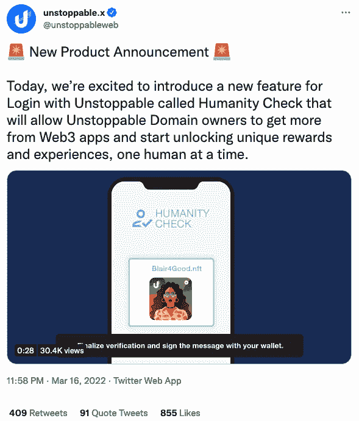
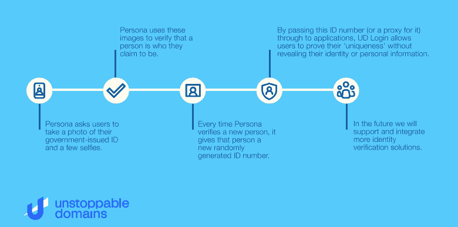

# 不可阻挡的领域人性检查区分你和机器人

> 原文：<https://web.archive.org/web/https://dappradar.com/blog/unstoppable-domains-humanity-check-distinguishes-you-from-bots>

## 第一个带有隐私保护身份验证的 web3 SSO 解决方案

Unstoppable Domains 引入了人性检查来区分人类和机器人，这一切都不会牺牲你的隐私。人性检查将为新推出的登录不可阻挡产品带来身份验证功能。

僵尸攻击已经困扰许多在线服务多年。他们因扫荡演唱会门票、抢购限量版运动鞋和其他抢手货而臭名昭著。随着去中心化金融和 NFT 的兴起，机器人不可避免地会加入追逐财富的行列。

去年 12 月，阿迪达斯放弃了与 Bored Ape 游艇俱乐部的首次 NFT 系列合作。然而，尽管适用了每人最多购买 2 件物品的规则，一名用户仍然设法使用机器人绕过障碍购买了 330 件 NFT。

想象一下一个公平的 NFT 交易，你知道允许名单上的每个人都是真正独特的人，而不是一个有 10，000 个钱包试图利用这个系统的机器人农场。由[不可阻挡的域名](https://web.archive.org/web/20221129135814/https://dappradar.com/ethereum/other/unstoppable-domains)进行的人性检查让你从这种焦虑中解脱出来，同时保护你的隐私。

## 什么是人性检查？

今年早些时候，[unstopped Domains 推出了 Login with Unstoppable(登录)，](https://web.archive.org/web/20221129135814/https://dappradar.com/blog/unstoppable-domains-introduces-a-universal-web3-login/)这是一种新的、简单的方式，用户可以方便地登录 dapps。这个单点登录(SSO)产品允许用户使用他们唯一的 NFT 域作为用户名。今天，不可阻挡的域名又向前迈进了一步，使用[人性检查](https://web.archive.org/web/20221129135814/https://twitter.com/unstoppableweb/status/1504125021421146115?s=20&t=13l2LEY44EFKi7Uzdju0oQ)来确保登录也验证真实的数字身份。

人性检验是一个经过验证的身份层，你可以附加到你的不可阻挡的领域。此外，它是 100%隐私，不会向 dapp 透露任何个人信息。使用 Humanity Check，您可以证明自己是一个真正独一无二的人，可以使用该应用程序，参与在线活动，并获得奖励。

### 企业使用案例

*   游戏:作为一个游戏，你可以空投免费功能，石龙子，和其他游戏中的元素，并保证一个奖励一个独特的用户规模
*   元宇宙:作为一个元宇宙项目，你可以授权访问新的体验和项目，空投奖励和令牌，并解锁特定的验证用户的新功能
*   NFT 项目:作为一个创建和分发 NFT 的项目，您可以突出已验证用户的 NFT，并以一对一的方式奖励已验证用户各自独特的 NFT 或令牌
*   DeFi:我的 DeFi dapp 可以通过提供入职奖励(代币、NFT、其他奖励)以及奖励现有已验证用户空投来鼓励新用户选择加入人性检查
*   DAO 项目:您是一个 DAO，希望通过向成员的钱包地址验证身份来实现一人一票的结构

## 它是如何工作的

Unstoppable Domains 与身份验证服务行业的领导者 [Persona](https://web.archive.org/web/20221129135814/https://withpersona.com/) 合作。Persona 提供了一个无缝且高度安全的验证流程。许多公认的加密货币平台因其出色的服务而信任 Persona。他们的客户包括 BlockFi、Swan、DAO Maker 等等。

Persona 要求用户通过政府颁发的 ID 来验证他们的身份，并为他们分配一个随机生成的 ID 号。不可阻挡的域名将使用这个唯一的 ID 号来验证每个人的身份。然后，它会将这些信息传递给 dapps，而不会泄露他们的私人信息。

实现人性检查很简单。对于不可阻挡的合作伙伴的现有登录，查看[更新的开发者文档](https://web.archive.org/web/20221129135814/https://docs.unstoppabledomains.com/login-with-unstoppable/humanity-check-for-login)。如果您是新登录者，[提交您的申请](https://web.archive.org/web/20221129135814/https://unstoppableweb.co/hc-devapp)，团队将帮助您顺利入门。

## 这对最终用户有什么好处

**你的隐私第一**人性检查旨在确保每个用户公平透明地体验 Web3。它增加了一个验证层，而不会牺牲你的隐私。当您通过身份验证过程时，dapps 通过 Humanity Check 创建的唯一 ID 号而不是您的个人信息来验证身份。不可阻挡将永远无法访问您通过人性检查共享的任何数据。

**100%选择加入，一切由您掌控**您对自己的数据以及与哪些 dapps 共享此验证拥有 100%的控制权。

**快速简单**流程只需几分钟即可完成，每个 NFT 域只需完成一次验证。

**获得成为你的奖励**很快，完成人性检查的人将在他们不可阻挡的域名档案中获得人性检查验证标记。此外，它将在 Unstoppable Domains 平台和登录集成应用程序上解锁新的奖励计划。随着越来越多的 Web3 公司使用这种验证模式建立奖励计划，对验证用户的更多激励很快就会到来。

## 一个不可阻挡的未来领域人性检查

在确保隐私的同时构建可靠的身份验证和强大的 KYC 解决方案并非易事。然而，只有保证公平、诚实和透明，创新和参与才能在 Web3 时代蓬勃发展。考虑到这一点，Humanity Check 努力为所有 dapp 用户提供公平、无欺诈的体验。

不可阻挡域名的下一步是邀请社区参与并从人性检查中获益。经过验证的用户将立即开始解锁各种 UD 特权，从积分到独家抽奖和奖品。在一个充满欺骗的混乱的数字世界里，我们不应该因为做真实的自己而受到奖励吗？

**链接**

[网站](https://web.archive.org/web/20221129135814/https://unstoppabledomains.com/?utm_source=bing&utm_medium=paid_search&utm_term=unstoppable%20domains&utm_content=1333708880098195&utm_campaign=AO_bau_con_paid_bing_search_brand_KPI-su-pur-roas_keywords_~_~&msclkid=a29d8f0e73fd1e6826beed36d4cb6a0c)

[推特](https://web.archive.org/web/20221129135814/https://twitter.com/unstoppableweb)

[不和](https://web.archive.org/web/20221129135814/https://discord.com/invite/b6ZVxSZ9Hn)

**免责声明** —这是一篇赞助文章。DappRadar 不认可本页面上的任何内容或产品。DappRadar 旨在提供准确的信息，但读者应该在采取行动之前总是自己做研究。DappRadar 的文章不能被认为是投资建议。