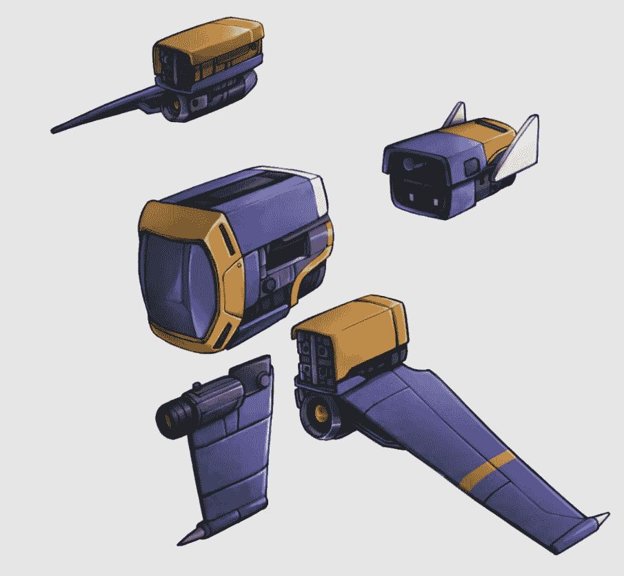

# 即将到来的 NFT 游戏西弗揭示宇宙飞船的设计

> 原文：<https://web.archive.org/web/https://dappradar.com/blog/upcoming-nft-game-sipher-reveals-spaceship-designs>

## 战利品盒将在几周内上市

以太坊上最受关注的游戏之一 Sipher 公布了玩家可以在游戏中使用的宇宙飞船的设计。虽然还没有飞船战利品盒的发布日期，但 Sipher 团队已经开始透露设计的 WIPs，以及飞船力学背后的一些技术细节。

根据宇宙飞船系列文章的[第一版](https://web.archive.org/web/20220925084355/https://atlas.sipher.xyz/spaceships/spaceships-overview-and-mixing-off-chain-on-chain)，战利品箱将是 NFT 箱子，里面装有允许玩家建造他们自己的[太空飞船](https://web.archive.org/web/20220925084355/https://dappradar.com/ethereum/games/sipherian-surge)的部件。重要的是，战利品盒子将是可交易的非功能性物品，允许玩家出售他们不需要的盒子，或者在二级市场如 [OpenSea](https://web.archive.org/web/20220925084355/https://dappradar.com/multichain/marketplaces/opensea) 上购买更多的盒子。

每个战利品盒将包含以下建筑部件之一:

1.  右翼
2.  左翼
3.  主要承运人
4.  一套武器系统
5.  一组推进器

重要的是，这五个部分可能有不同的稀有程度，传奇是最稀有的。当建造完成时，越稀有的部分会给你的船带来越好的统计数据。

一旦玩家打开他们的战利品箱，并且拥有了建造一艘宇宙飞船所需的全部五个零件，他们就必须去宇宙飞船场地。在那里，他们将能够组合所有的部件，并准备好他们的宇宙飞船去探索西弗世界。

## 西弗通过离线流程规避天然气费用

由于 Sipher 是一个基于以太坊的平台，汽油费仍然是 Sipher 团队和有兴趣玩游戏的玩家社区最关心的问题之一。为了给玩家带来易用性，并限制玩家在平台上执行行动所需的资金，Sipher 决定将造船过程转移到链外。

如果团队决定推出链上造船，这将为玩家积累了大量的交易费用。像领取一个战利品盒，打开它，把所有的零件融合在一起，建造宇宙飞船这样的行为都会产生单个的链上交易费用。为了避开以太坊区块链昂贵的一面，Sipher 团队决定将造船过程离线保存在其内部服务器上。

然而，如果玩家希望交易他们的战利品盒子，他们可以通过 Sipher 平台铸造它们来轻松地将它们变成可交易的 NFT。这一过程将把战利品箱转化为链上资产，这将产生交易费用。然而，拥有保持资产链外的选项给了玩家一个选择。可以说，这种选择和自由对社区很重要。

重要的是，为了降低铸造和交易战利品盒 NFT 的成本，Sipher 引入了对第二层解决方案[多边形](https://web.archive.org/web/20220925084355/https://dappradar.com/rankings/protocol/polygon)的支持。这意味着所有铸造的战利品盒子都将存在于多边形区块链上。这已经成为以太坊项目的普遍做法，因为多边形区块链的天然气费用要低得多。

## 西弗是什么？

目前，西菲尔团队在市场上有两个 NFT 系列，每个都是独特的游戏角色:西菲尔浪涌和西菲尔闪光。该团队将出售更多作为游戏角色的 NFT 系列。当 Sipher 推出他们的第一款游戏时，这将是一款自上而下的动作游戏。然而，他们希望将该平台发展成为一款成熟的在线角色扮演游戏。

[https://web.archive.org/web/20220925084355if_/https://www.youtube.com/embed/rfpoPpomVeU?feature=oembed](https://web.archive.org/web/20220925084355if_/https://www.youtube.com/embed/rfpoPpomVeU?feature=oembed)

随着更多关于造船过程的信息浮出水面，DappRadar 将继续监测 Sipher 平台。如果你想了解更多关于 Sipher 的信息，请查看他们的官方 dapp 页面。此外，你可以在[的推特](https://web.archive.org/web/20220925084355/https://twitter.com/dappradar)上关注 DappRadar，第一时间了解最新的区块链博彩新闻。

 NewsletterUnsubscribe at any time. [T&Cs](https://web.archive.org/web/20220925084355/https://dappradar.com/terms) and [Privacy Policy](https://web.archive.org/web/20220925084355/https://dappradar.com/privacy-policy)