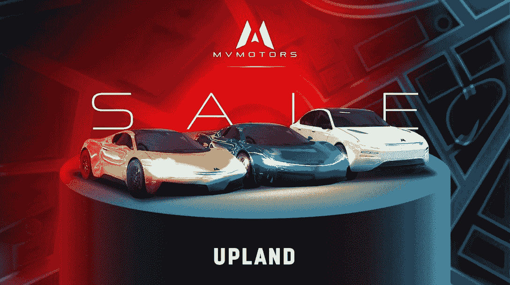
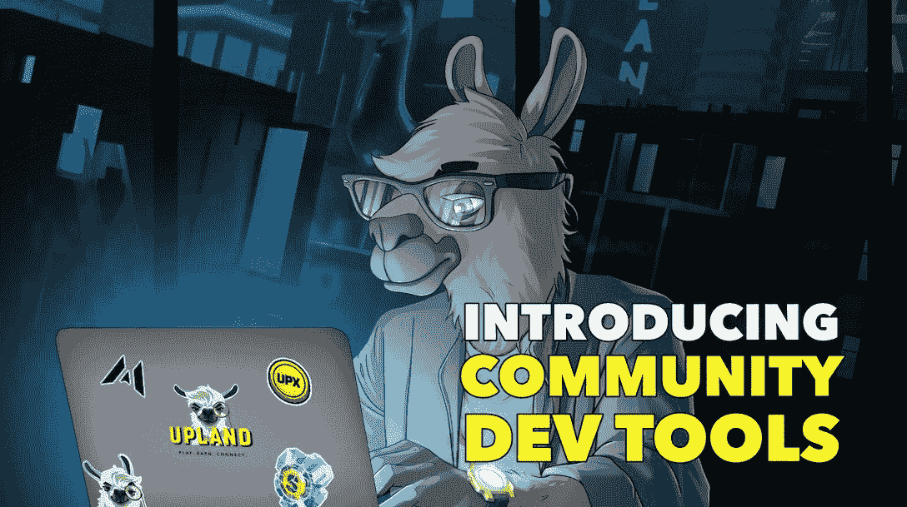
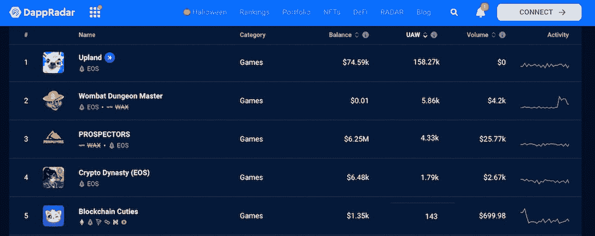

# 高地联合创始人解释为什么 Web3 游戏将取代 Web2 游戏

> 原文：<https://web.archive.org/web/https://dappradar.com/blog/upland-co-founder-explains-why-web3-games-will-replace-those-of-web2>

## 高地的数字经济可以提取价值，并将其反馈到现实世界。

dapp 空间正在向各个方向发展。在 DappRadar，我们跟踪 50 多个网络中的 dapps 和 NFT，为用户带来数据驱动的见解。此外，我们还推出了一个特别采访系列，聚焦于幕后团队，Dapp 开发者。

我们今天的嘉宾是艾丹·朱克曼，高地公司的联合创始人兼首席执行官。元宇宙财产交易游戏在 EOS 网络上长期排名靠前，并定期进入 DappRadar 游戏排名的前 10 名。

[https://web.archive.org/web/20221130130746if_/https://www.youtube.com/embed/ERNn35_iqtE?feature=oembed](https://web.archive.org/web/20221130130746if_/https://www.youtube.com/embed/ERNn35_iqtE?feature=oembed)

[Check out the Upland Single Dapp Page](https://web.archive.org/web/20221130130746/https://dappradar.com/eos/games/upland)

## 告诉我们你的情况

我是艾丹·朱克曼，高地公司的联合创始人兼首席执行官。自称游戏，区块链，产品，和吉他呆子。让我起床的是我对我关心的人的兴奋、承诺和责任——我的家人、朋友、高地团队和高地社区成员。

## 你和区块链人的第一次互动是什么？

我的第一次互动是加密货币，但真正引发我真正兴奋的是 NFTs 的引入，这是我通过 Crypto Kitties 了解到的。

## 除了高地，你最常用的 dapps 是什么？

Metamask.

## 在你所有的 NFT 和游戏中，你最喜欢哪一个？为什么？

我试图让我的公开谈论严格围绕高地 dapps 和 NFT，但我会说，在个人层面上，我对投机和社会声望不太感兴趣，而对创新和实用性更感兴趣。

## 你最近在开发哪些新功能或技术优化？这将如何影响高地玩家，尤其是新玩家？

哇，有这么多可以选择的。从高地社区的兴奋程度来看，汽车，以及私人运输机械和赛车，似乎都在其中。

但我个人最感兴趣的两个特性与将 Upland 转变为第 1 层元宇宙有关。

第一个是最近推出的第三方开发工具，允许任何新的或现有的游戏、应用程序或服务无缝连接到高地经济、机制和玩家群，以便在元宇宙执行他们的 Web3 战略。

第二个是我们称之为 NFT 门户的解决方案，它允许 Uplanders 既可以将高地本地的 NFT 输出到其他区块链，也可以将来自其他区块链的 NFT 输入到高地元宇宙。

[https://web.archive.org/web/20221130130746if_/https://www.youtube.com/embed/7fF4YjJ1Y4g?feature=oembed](https://web.archive.org/web/20221130130746if_/https://www.youtube.com/embed/7fF4YjJ1Y4g?feature=oembed)

## 在开发 Upland 时，您曾经或现在面临哪些重大挑战？你能和我们分享一下吗，你的建议如何帮助他人？

高地是建立在 100%的专有技术，解决了大众消费者受众真正所有权的可及性问题，而不损害价值主张。问题是——作为世界上第一批解决这个问题的团队之一，没有“问谷歌”或堆栈溢出备忘单。

当解决复杂的 UX 问题，同时突破交易量的界限和交易可逆性的限制时，这变得更加具有挑战性。但是奖励和回报是高地今天是世界上极少数的生态系统之一。

我们的整个经济(所有可替代和不可替代的数字资产)是由区块链**驱动的，默认情况下是由**驱动的，就土地所有者和每日活跃用户而言，它也是总部位于区块链的元宇宙最大的经济体。

*Upland is the most popular game on DappRadar EOS Ranking and is ranked 6th on DappRadar Game Ranking.*

[Get more info about Upland](https://web.archive.org/web/20221130130746/https://dappradar.com/eos/games/upland)

## 开发去中心化应用的关键是什么，真正的去中心化，易用性，简单的用户入门，还是别的什么？请解释原因。

在我看来，最重要的事情是首先确定价值主张是什么，以及它如何/为什么需要去中心化。

不同的问题需要不同程度的权力下放来解决，100%权力下放的系统非常罕见，即使人们认为是这样。

一旦价值主张得到巩固，解决方案就需要易于使用和直观。就面向消费者的产品而言，包括非硬核游戏，我也高度相信 99%的产品必须以移动设备为先的心态。

## 你在地平线上看到了什么重要的机会？您认为这对您的项目有何影响？

开放的元宇宙。元宇宙(大写的 M)现在还不存在，但是当它最终成形的时候——它将包括封闭和开放的世界。

在高地，我们坚信支持开放经济、真正所有权和社区治理的开放世界将是其中最大和最激动人心的部分。高地正在建设成为事实上的，非虚构的元宇宙的一部分，这是映射到现实世界。

## 高地是 EOS 上的顶级游戏。你能和我们分享一下你为什么选择这个区块链吗？这对最终用户意味着什么？

高地玩家不需要知道哪个区块链在后台运行，除非他们决定深入研究。我们花费了大量时间和精力来提出一个整体解决方案，该解决方案为最终用户消除了区块链的复杂性，同时仍然坚持真正所有权的所有好处。

我们选择 EOS 是因为它满足了我们的所有需求，并为我们提供了必要的工具，使 Upland 成为一个可以大规模采用的产品。该技术让我们实现了一些巨大的数字，例如超过 400 万 NFT，每秒钟生成的最高值超过 50 NFTs(每秒钟推送数百个交易)，所有这些都是在我们的用户没有支付汽油费的情况下实现的。

[View more stats about Upland](https://web.archive.org/web/20221130130746/https://dappradar.com/eos/games/upland)

它还允许我们编写创新的功能，如我们的免费游戏模式，允许新玩家在享受真正的所有权之前体验高地。

我们正处于主流区块链技术采用的早期阶段，这导致早期采用者倾向于一个区块链或另一个。

如今，消费者不知道一款游戏是在 AWS 还是谷歌云上运行。我真诚地相信，随着进一步的大规模采用，他们仍然不知道正在使用哪个区块链，但用户将关注使用区块链带来的价值主张。

## 虚拟财产交易游戏也可以在 Web2 世界中使用。但是，Upland 有哪些功能是 Web2 或《老一套》中的类似产品所没有的？

高地已经建立了一个庞大、现实的数字经济，一个开放的市场，由真正的所有权和通过直接交易法定货币将价值提取回现实世界的能力驱动。

极少数游戏和世界一开始就有这种功能，更不用说虚拟财产交易游戏了。今天的高地不仅仅是一个虚拟财产交易游戏。这是第一层元宇宙。一个让其社区成为 web3 企业家的平台。

[Explore Upland’s Layer 1 Metaverse](https://web.archive.org/web/20221130130746/https://dappradar.com/eos/games/upland)

## 你认为 Web3 游戏会逐渐取代 Web2 游戏吗？为什么？

绝对可以，只是需要多久的问题。这可能需要几十年的时间。

我对此的推理相当简单。想象两个娱乐价值完全相同的游戏产品。其中一个经营着没有真正所有权和社区治理机制的伪经济，另一个则相反。消费者总是会选择后者。

当你今天在现实世界中购买一件实物时，很难想象你不会拥有它，也不能出售它。数字游戏资产和游戏经济也会发生同样的事情。

## 人们怎样才能参与进来并更多地了解你的项目？近期有什么值得用户期待的吗？

Upland 可在苹果应用商店和谷歌 Play 商店移动设备上通过网络或移动网络获得。这非常容易开始，但我建议新玩家[加入我们的 Discord](https://web.archive.org/web/20221130130746/https://discover.upland.me/discord) 并加入我们令人敬畏的社区，该社区随时准备帮助新人获得顺利的入职体验。

[Access Upland via Single Dapp Page](https://web.archive.org/web/20221130130746/https://dappradar.com/eos/games/upland)