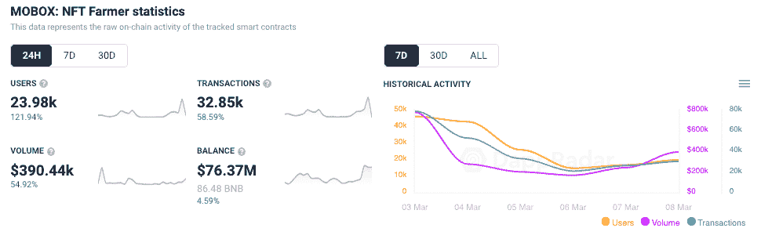
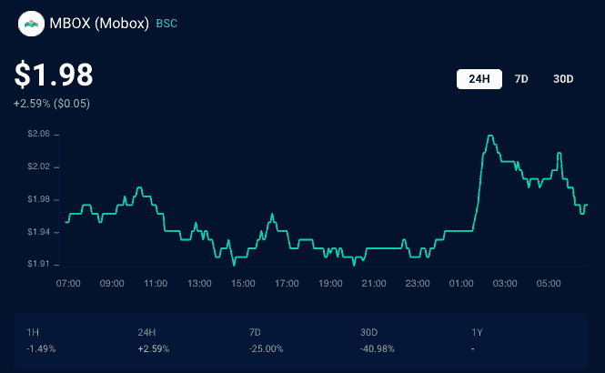

# 用户活动激增，因为 Mobox 揭示了 Moland 防御

> 原文：<https://web.archive.org/web/https://dappradar.com/blog/user-activity-surges-as-mobox-reveals-moland-defense>

## 领先的 BSC 游戏平台为玩家扩展了产品组合

领先的 BSC 游戏 [Mobox NFT 农民](https://web.archive.org/web/20221007164234/https://dappradar.com/binance-smart-chain/games/mobox-nft-farmer)本周在 Twitter 上调侃了一款名为 Moland Defense 的新游戏，该声明显著增加了用户活跃度。塔防游戏的发布不仅增加了活动，而且还积极影响了原生 MBOX 令牌的价格。

通过官方的 Mobox Twitter 渠道发布的简短声明并没有透露太多，只是通知社区为即将到来的 alpha 测试做好准备，旁边还有一个简短的[预览视频](https://web.archive.org/web/20221007164234/https://twitter.com/MOBOX_Official/status/1501398712580710400)。在撰写本文时，该视频已经获得了近 7000 次观看。

[https://web.archive.org/web/20221007164234if_/https://www.youtube.com/embed/kdlyVlZLJgc?feature=oembed](https://web.archive.org/web/20221007164234if_/https://www.youtube.com/embed/kdlyVlZLJgc?feature=oembed)

3 月 9 日的宣布引起了 [Mobox 平台](https://web.archive.org/web/20221007164234/https://dappradar.com/binance-smart-chain/games/mobox-nft-farmer)上的活动高峰，新老玩家都来看热闹。在过去的 24 小时里，连接到 Mobox 的钱包数量飙升了 120%以上，达到近 24，000 个。这些钱包完成了 32，850 笔交易，通过 dapp 的智能合约推动了超过 39 万美元的交易量。

此外，[原生 MBOX 令牌](https://web.archive.org/web/20221007164234/https://dappradar.com/hub/token/bsc/MBOX?from=0x3203c9e46ca618c8c1ce5dc67e7e9d75f5da2377)的价值略有上升，在发布后从 1.95 美元升至 2.06 美元。然而，现在已经恢复到公告发布前的水平。

## 越来越强大

从坚实的 DeFi 产品开始， [BSC 在 2021 年慢慢成为 GameFi 之家](https://web.archive.org/web/20221007164234/https://dappradar.com/blog/2021-dapp-industry-report/#games)。在《异形世界》和《Axie Infinity》于 7 月底合并为顶级游戏后，BSC 成为了该运动的热门选择。然而，在 BSC 上第一批游戏的[快速增长和随后的](https://web.archive.org/web/20221007164234/https://dappradar.com/blog/2021-dapp-industry-report/#games)下降之后，Mobox 脱颖而出。

Mobox 是一款嵌入了大量 DeFi 特性的游戏，它结合了 NFT 作为可玩角色，可以说是 GameFi 运动的准确代表。到 2021 年底，Mobox 成功保持了其用户群，并在这一年结束时成为业内第五大游戏，平均每天吸引超过 24，000 次 UAW。

已经在 [BSC 和 dapp 游戏类别中打下坚实的基础，](https://web.archive.org/web/20221007164234/https://dappradar.com/rankings/protocol/binance-smart-chain/category/games) Mobox 看起来将兑现其承诺，继续开发其极具吸引力、以财务为动机的游戏平台。值得期待的可能是 Mobox 向其他网络的扩张，如 Harmony 和 Avalanche，GameFi 在这些网络中开始腾飞。Mobox 可能会展开翅膀，进一步扩大用户群。

 NewsletterUnsubscribe at any time. [T&Cs](https://web.archive.org/web/20221007164234/https://dappradar.com/terms) and [Privacy Policy](https://web.archive.org/web/20221007164234/https://dappradar.com/privacy-policy)

***以上不构成投资建议。此处给出的信息仅供参考。请行使尽职调查，做你的研究。作者持有 ETH、BTC、AGIX、HEX、LINK、GRT、CRO、OMI、不变 X、ENS、GALA、AVASTR、GMEE、CUBE、RADAR、FLOW、FTM、BNB、SPS、WRLD、ATOM 和 ADA。***