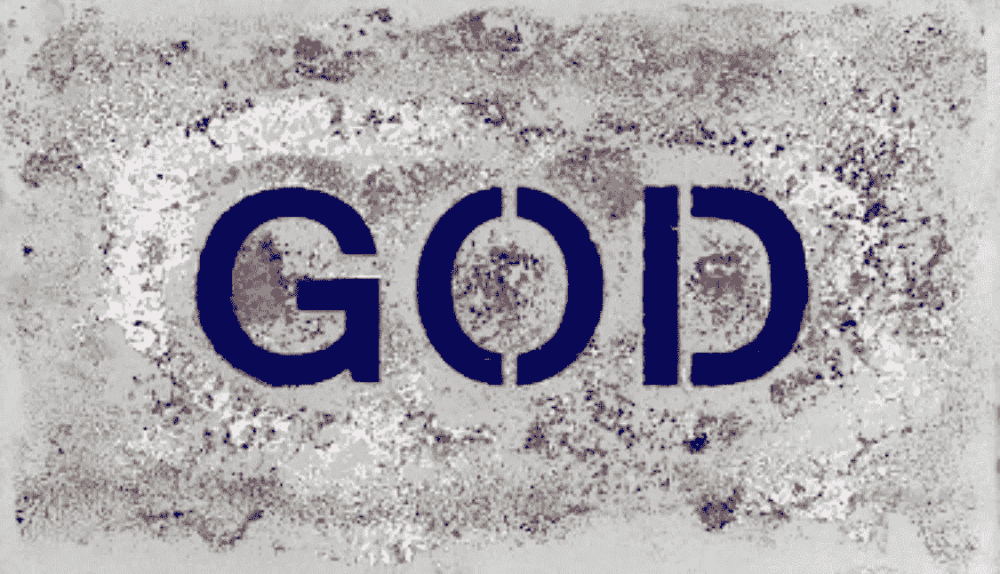

# 瓦尔·基尔默和坎普·基尔默在索姆空间进入元宇宙

> 原文：<https://web.archive.org/web/https://dappradar.com/blog/val-kilmer-enters-the-metaverse-with-kamp-kilmer-in-somnium-space>

## 这位电影明星发起了 Kamp Kilmer，这是一个关于艺术和合作的 web3 项目

好莱坞明星瓦尔·基尔默宣布了 Kamp Kilmer，这是一个 web3 体验，将包括 Somnium 空间中的专用 Kilmer 世界。Somnium Space 透露的官方预告显示了一个废弃的拍摄场地。它包括一些标志性的道具，如臭名昭著的蝙蝠战车。

根据[预告](https://web.archive.org/web/20220925024414/https://twitter.com/SomniumSpace/status/1498738753019523072)，Kamp Kilmer 虚拟世界将向瓦尔·基尔默所有的艺术活动致敬。这当然包括他的众多电影。Somnium 团队努力从 Kilmer 的好莱坞成功的广泛列表中重现重要的项目和时刻。

[https://web.archive.org/web/20220925024414if_/https://www.youtube.com/embed/rmEYCtZv8Xo?start=3&feature=oembed](https://web.archive.org/web/20220925024414if_/https://www.youtube.com/embed/rmEYCtZv8Xo?start=3&feature=oembed)

除了 Somnium Space 中的虚拟世界，Kamp Kilmer 还为艺术家提供了一个更广泛的 web3 协作项目。官方网站展示了许多 NFT 的收藏和其他项目。所有这些结合在一起，形成了多样化的瓦尔·基尔默网络 3 体验。

## 瓦尔·基尔默拥抱网络 3

瓦尔·基尔默已经大举进军 web3 领域。坎普·基尔默将主持由这位电影明星创作和启发的各种艺术项目。令人印象深刻的是，自 3 月初以来，Kilmer 已经宣布了几个 NFT 项目，与数字艺术领域的各种人合作，包括 Remo Camero。

他们将第一个瓦尔·基尔默·NFT 系列命名为 Kamp Kilmer 品牌“爱治愈拼贴画”。这个项目是与 Camero 合作完成的，代表了 Kilmer 大量剪贴簿的拼贴，从广告，名人新闻，艺术书籍和目录中收集而来。此外，Kilmer 将添加个人物品，从头像、通话记录到旧钱包和粉丝礼物。爱情治愈拼贴系列中的 NFT 很快售罄，现在可以在 [OpenSea](https://web.archive.org/web/20220925024414/https://opensea.io/assets/0xc43614beeda11133b952fd8af9c41d7dab1d742c/2581) 上买到。令人印象深刻的是，收藏家们只需支付汽油费就能买到一幅 NFT 爱心拼贴画。

瓦尔·基尔默和坎普·基尔默的下一个项目是上帝面板项目。这个 NFT 系列可能会在 4 月份降价。上帝小组需要成为一个巨大的协作工作。重要的是，Kamp Kilmer 社区的成员将能够为 God Panels 项目做出贡献。

根据官方神面板页面的消息，一个神面板创世纪 NFT 的拥有者将能够把两块神面板组合在一起，创造出第三个衍生件。或者，艺术家将能够“合作”一个创世纪作品，创造一个独立的，新的艺术作品，其中融入了他们自己的艺术风格和愿景。

## 关注社区和协作

从 Kamp Kilmer 体验的一开始，这位电影明星就明确表示协作和社区参与是这个项目的关键。Kamp Kilmer Discord 官方服务器为会员提供了完全沉浸在瓦尔·基尔默体验中的机会。

重要的是，Discord 服务器还托管 [Val 的小屋](https://web.archive.org/web/20220925024414/https://discord.com/channels/926637308470497350/948710619127898112)，一个粉丝和社区成员向瓦尔·基尔默提问的频道。这个几乎无限的问答环节揭示了瓦尔·基尔默的个人观点和愿望，尤其是关于 Kamp Kilmer 项目的未来。

随着 web3 体验不断吸引新成员，DappRadar 将继续监督 Kamp Kilmer。如果你迫不及待地想参与上帝面板项目，你现在可以在二手市场上购买爱治愈拼贴画。在[推特](https://web.archive.org/web/20220925024414/https://twitter.com/dappradar)上关注 DappRadar，首先了解最新的 NFT 新闻。

 NewsletterUnsubscribe at any time. [T&Cs](https://web.archive.org/web/20220925024414/https://dappradar.com/terms) and [Privacy Policy](https://web.archive.org/web/20220925024414/https://dappradar.com/privacy-policy)