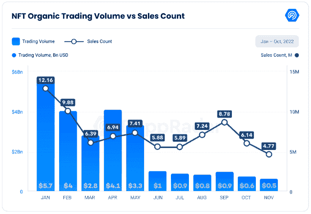
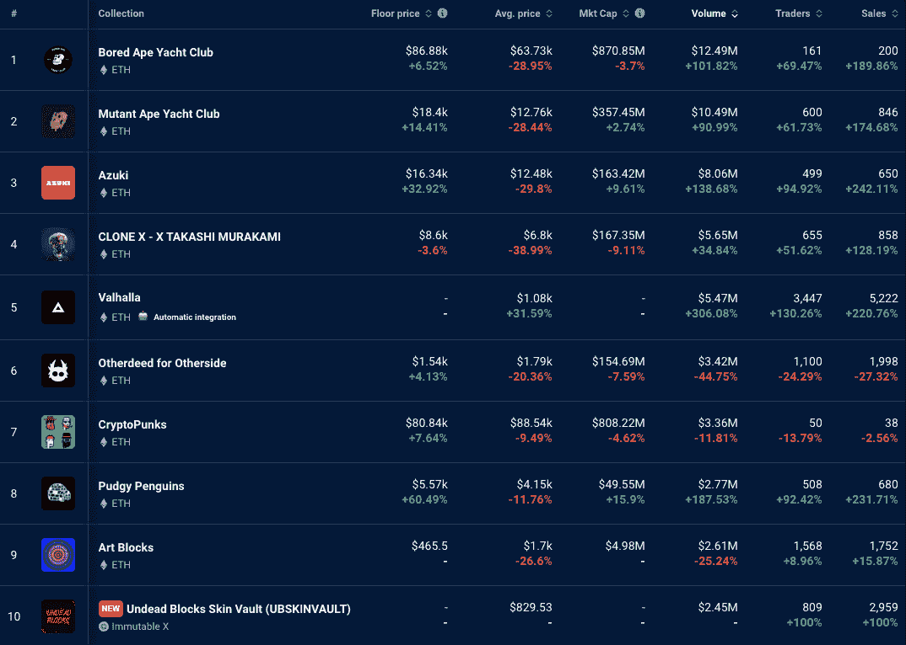

# 瓦尔哈拉和矮胖企鹅进入十大收藏

> 原文：<https://web.archive.org/web/https://dappradar.com/blog/valhalla-and-pudgy-penguins-enter-top-10-collections>

## 这两个项目的特色是朋克、猿、艺术块等等

本周最受欢迎和最昂贵的 NFTs 展示了一个新的系列，一个正在回归昔日荣耀的系列。Valhalla 是 FLOKI 的一个项目，它将是一个全新的元宇宙游戏平台，拥有自己的数字收藏品。经过一年专注和深思熟虑的重建，矮胖企鹅正在卷土重来。

[Explore NFT Data](https://web.archive.org/web/20221223232126/https://dappradar.com/nft)

## 顶级藏品交易量激增

众所周知，2022 年下半年对 NFT 市场来说不是一个好年景。DappRadar 上周报告称，11 月份整体交易量和销售数量分别下降了 17.47%和 22.24%。

[<picture></picture>](https://web.archive.org/web/20221223232126/https://dappradar.com/blog/defi-activity-highlights-dapp-industrys-resilience-against-ftx-disaster#The-NFT-market-continues-its-downward-trend)

[Source: DappRadar](/web/20221223232126/https://dappradar.com/blog/DappRadar)

始于 5 月份的下降趋势仍在继续，11 月份 NFT 交易量为全年最低。本月有价值 5.46 亿美元的数字产品被买卖，远低于 1 月份 57 亿美元的高点。你可以[点击这里](https://web.archive.org/web/20221223232126/https://dappradar.com/blog/defi-activity-highlights-dapp-industrys-resilience-against-ftx-disaster/#The-NFT-market-continues-its-downward-trend)阅读完整报告，了解更多信息。

不过，消息也不全是坏消息。对于一些收藏来说，过去一周的线上活动激增。四件宇迦实验室藏品的底价都上涨了:

*   [无聊猿游艇俱乐部](https://web.archive.org/web/20221223232126/https://dappradar.com/ethereum/collectibles/bored-ape-yacht-club)上涨 6.52%
*   [变异猿游艇俱乐部](https://web.archive.org/web/20221223232126/https://dappradar.com/ethereum/collectibles/mutant-ape-yacht-club)上涨 14.41%
*   [另一边](https://web.archive.org/web/20221223232126/https://dappradar.com/ethereum/collectibles/otherdeed-for-otherside)上涨 4.13%
*   [隐朋克](https://web.archive.org/web/20221223232126/https://dappradar.com/ethereum/collectibles/cryptopunks)上涨 7.64%

在交易量最大的 10 件藏品中，有 8 件的交易量和交易量都有所上升。增长的幅度是惊人的。下表显示，八个系列中有七个系列的销售额增长了 100%以上。只有[艺术板块](https://web.archive.org/web/20221223232126/https://dappradar.com/hub/nft-collection/art-blocks-curated)的销售额增长不到 100%，增幅为 15.87%。

[<picture></picture>](https://web.archive.org/web/20221223232126/https://dappradar.com/nft/collections)

[DappRadar’s NFT Collections Explorer](https://web.archive.org/web/20221223232126/https://dappradar.com/nft/collections)

DappRadar 的 [NFT 收藏品浏览器](https://web.archive.org/web/20221223232126/https://dappradar.com/nft/collections)显示，上周许多收藏品的连锁销售活动有所上升。其中包括瓦尔哈拉和矮胖企鹅，一个是全新的系列，另一个是正在经历复兴期的既定项目。

[Explore NFT Collections](/web/20221223232126/https://dappradar.com/blog/DappRadar%E2%80%99s%20NFT%20Collection%20Explorer%20shows%20on-chain%20sales%20activity%20rose%20for%20many%20collections%20last%20week.%20Among%20them%20were%20Valhalla%20and%20Pudgy%20Penguins,%20one%20a%20brand%20new%20collection%20and%20the%20other%20an%20established%20project%20going%20through%20a%20resurgent%20period.)

## 矮胖企鹅继续鼓舞人心的复苏

矮胖企鹅于 2021 年 7 月在 NFT 牛市的高峰期推出。人们很快发现创始人 ColeThereum 有一段拉地毯的历史，2022 年 1 月，知名社区成员表达了对矮胖企鹅领导层的担忧。

2022 年 4 月，Luca Netz 支付了 750 ETH(当时约 250 万美元)来控制这个项目。接下来发生的事情被称为“最伟大的回归故事”，本周，Pudgy Penguins 作为市场上交易量最大的收藏品之一，重返 DappRadar 的前 10 名。

The Pudgy Penguins live on

该系列复兴的原因可以归结为其富有远见和经验丰富的团队，他们在成功营销方面有着良好的记录。他们利用可爱的矮胖企鹅艺术品，在节日期间发布了一系列实体玩具。

> 很快。[pic.twitter.com/7TPCGfjvfK](https://web.archive.org/web/20221223232126/https://t.co/7TPCGfjvfK)
> 
> — Luca Netz 🐧 (@LucaNetz) [December 10, 2022](https://web.archive.org/web/20221223232126/https://twitter.com/LucaNetz/status/1601383265390452736?ref_src=twsrc%5Etfw)

Pudgy Penguins IRL toys

该项目也有一个伟大的社会媒体存在和一个忠诚的社区，在其动荡的历史中保持对品牌的忠诚。考虑到这一点，难怪过去一周:

*   底价上涨 60.49%，至 5570 美元。
*   市值增长 15.9%，至 4955 万美元。
*   交易额增长了 187.53%，达到 277 万美元。
*   交易人数增长了 92.42%，销售人数增长了 231.71%。

世界标准时间 12 月 13 日下午 6 点，达普拉达尔将和矮胖企鹅的救星卢卡·内茨一起坐在推特上。在“拯救地毯”的对话中，我们将讨论地毯拉手和救赎。

[Interview with Pudgy Penguins CEO Luca Netz](https://web.archive.org/web/20221223232126/https://dappradar.com/blog/rug-rats-a-conversation-with-pudgy-penguins-ceo-luca-netz)

## 弗洛基项目瓦尔哈拉内 5 大 NFT 收藏

Valhalla 是弗洛基的 NFT·元宇宙游戏，旨在将 meme token 的影响力扩展到 Web3，并使生态系统在未来更加可持续。NFTs 于 11 月 22 日开始销售，一天后就销售一空。现在该系列的底价约为 0.877 ETH。

A Valhalla character

在过去的一周里，交易者买卖了价值 547 万美元的 Valhalla NFTs，考虑到当前市场的低迷状态，这对于一个新项目来说是一个令人印象深刻的数额。DappRadar 的数据显示，Valhalla 的连锁指标全面上升。

*   过去一周，该系列的平均售价上涨了 31.59%。
*   交易量增长了 306.08%
*   交易它们的用户数量上升了 130.26%。
*   销售计数为 220.76%。

该系列的链上指标上升的一个原因是，FLOKI 在 12 月 11 日发布了一些 alpha，链接到免费的 Valhalla 演示和如何玩游戏的说明。当社区看到项目兑现承诺并推出实际产品时，他们对未来充满信心。

> [#Valhalla](https://web.archive.org/web/20221223232126/https://twitter.com/hashtag/Valhalla?src=hash&ref_src=twsrc%5Etfw) 战斗竞技场试玩在乐观歌尔里测试网上免费试玩:【https://t.co/pLyCDRhsxg】
> 
> PC 上怎么玩:
> 
> 有问题吗？加入我们的电报！[https://t.co/ZLzCfV3mXU](https://web.archive.org/web/20221223232126/https://t.co/ZLzCfV3mXU)pic.twitter.com/sIBtTRsfrh
> 
> — FLOKI (@RealFlokiInu) [December 11, 2022](https://web.archive.org/web/20221223232126/https://twitter.com/RealFlokiInu/status/1602032007302811650?ref_src=twsrc%5Etfw)