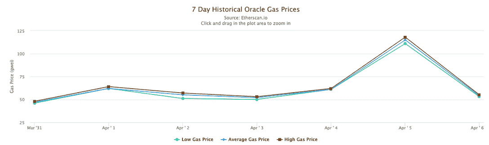
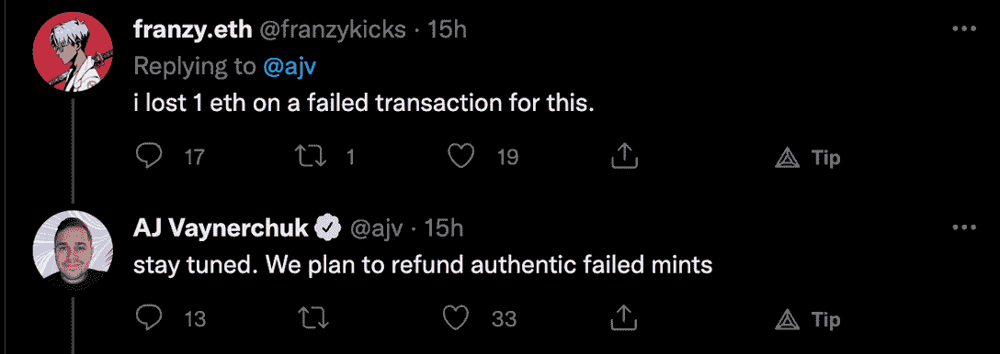
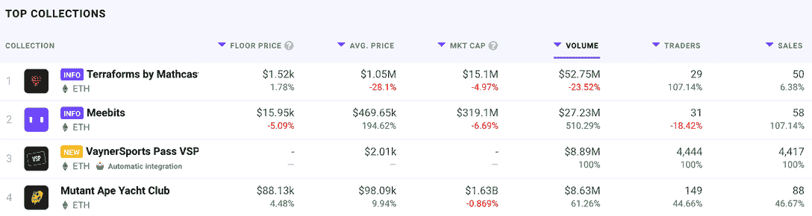

# VaynerSports Mint:汽油费产生三倍于创造者的利润

> 原文：<https://web.archive.org/web/https://dappradar.com/blog/vaynersports-mint-gas-fees-generate-three-times-the-creators-profit>

## NFT 收藏家对造币厂和整个项目组织感到愤怒

**新推出的 NFT 系列 VaynerSports 备受期待的发布会受到过高的汽油费的影响，使发布会比销售收入贵 3 倍。在粉丝们数周的期待之后，昨晚这个新项目诞生了。** **然而，VaynerSports Pass NFTs 的活动并没有真正按计划进行。**

***概要:***

*   ***[让气战开始](https://web.archive.org/web/20221004125918/https://dappradar.com/blog/vaynersports-mint-gas-fees-generate-three-times-the-creators-profit/#begin)随着急切的粉丝竞相出价***
*   ***韦内斯波特斯造币厂吸引了[超过 2600 万美元的天然气费](https://web.archive.org/web/20221004125918/https://dappradar.com/blog/vaynersports-mint-gas-fees-generate-three-times-the-creators-profit/#mint-generated)***
*   ***[社区反弹](https://web.archive.org/web/20221004125918/https://dappradar.com/blog/vaynersports-mint-gas-fees-generate-three-times-the-creators-profit/#Community-backlash)在*发布后和发布期间**
*   ***[什么是 VaynerSports？](https://web.archive.org/web/20221004125918/https://dappradar.com/blog/vaynersports-mint-gas-fees-generate-three-times-the-creators-profit/#VaynerSports)***

昨晚举行了官方造币会。令人印象深刻的是，就在 AJ Vaynerchuk 在 Twitter 上发布公告几秒钟后，一场全面的天然气战争开始了。VaynerSports 是本周最受追捧的造币厂之一，这得益于 Vayner Media 和 Gary Vee 在 NFT 的成功项目。

因此，许多 NFT 的收藏家，其中一些人带着装满 ETH 的袋子，焦急地等待着。他们的 MetaMasks 连接到 VaynerSports 官方网站。只有 15，555 个 VaynerSports NFTs，所以需求远远超过了供应。

## 让天然气战争开始吧

当需求超过供应时，确保造币厂成功的策略之一是提高你愿意为交易支付的汽油费。价格越高，你的交易处理得越快。最重要的是，你得到 NFT 的机会越大。

不幸的是，这种策略导致了气体战争现象。随着越来越多的人增加汽油费，以太坊网络交易的平均价格飙升。在 VaynerSports 造币厂时期，平均油价飙升至 4377 gwei，相当于 4200 美元。

当收藏家们争相抢夺一辆 NFT 跑车时，造币厂产生了高达 26，364，407 美元的汽油费。更令人担忧的是，该系列本身的销售额减少了三倍，约为 800 万美元。数量上的惊人差异在社交媒体上引发了严重的反弹。该收藏的创作者 AJ Vaynerchuk 承认，如果他有机会回到过去，他会通过引入白名单来做一些不同的事情。

## 社区反弹和回应

关于 VaynerSports 造币厂期间激烈的天然气战争的消息开始迅速传播。不幸的是，不愿放弃数千美元汽油费的收藏家们两手空空。以太坊区块链处理交易的方式允许收藏家支付汽油费但没有收到 NFT，因为没有剩下来铸造。因此，crypto Twitter 爆发了抱怨。

许多账户称造币厂是失败的，并发帖抱怨汽油费资金损失。AJ Vaynerchuk 迅速行动起来。他承诺在铸币局之后的相当长一段时间内保持活跃，以试图缓解这些担忧。

在铸币厂的第二天发布的一条推文中，Vaynerchuk 解释说，他已经制定了一个退款策略，以补偿那些可以证明他们在失败的交易中损失了资金的收藏者。此外，这位企业家承诺创建一个 VaynerSports Discord 频道，同时暂时积极监控 Twitter 上的反馈。

## 什么是 VaynerSports？

VaynerSports 是 15，555 个独特的生成性 NFT 的集合，提供对运动员和 NFT 收藏品的 Vayner 网络的访问。AJ 的兄弟加里·维(Gary Vee)开创了 NFT“体验通行证”的先河，推出了他的“VeeFriends”系列和他的最新作品“T2 飞鱼俱乐部”。遵循大致相同的蓝图，VaynerSports 旨在创建一个志同道合的体育迷和运动员网络，他们将作为俱乐部成员获得独家访问权和福利。VaynerSports NFTs 是这个俱乐部的通行证。

昨晚造币期间，对这些可收藏的通行证的需求猛增。令人印象深刻的是，尽管造币厂相当麻烦，但该系列在过去 24 小时内吸引了创纪录的二级市场销售。根据 [DappRadar 数据](https://web.archive.org/web/20221004125918/https://dappradar.com/nft/collections)，VaynerSports 通行证在所有受监控的藏品中产生了最高的 NFT 交易量(不包括 LooksRare 平台上其他两个项目的可疑活动)。

在写这篇文章的时候，一件 vayners sports NFT 的平均价格在 2000 美元左右，这对于像 MAYC 这样的收藏来说并不算多。然而，尽管每张 NFT 的价格相对较低，但 VaynerSports Passes 在过去 24 小时内创下了 4417 张的销售记录，成功攀升了排行榜。

据 AJ Vaynerchuk 称，详细的路线图和福利包将在未来几天内发布。目前，很明显，这些通行证将使业主获得体育赛事，会员专属表演和直播，并获得即将举行的 NFT 造币厂。

DappRadar 将继续监督 VaynerSports 项目，因为它从最初不令人满意的 mint 经验中恢复过来。尽管开局不利，但随着越来越多的收藏者希望成为独家 VaynerSports 体验的一部分，人们对该系列的兴趣越来越大。要想第一时间获得最新的 NFT 新闻，请在 Twitter 上关注 DappRadar，并加入我们的 T2 不和谐社区。

 NewsletterUnsubscribe at any time. [T&Cs](https://web.archive.org/web/20221004125918/https://dappradar.com/terms) and [Privacy Policy](https://web.archive.org/web/20221004125918/https://dappradar.com/privacy-policy)