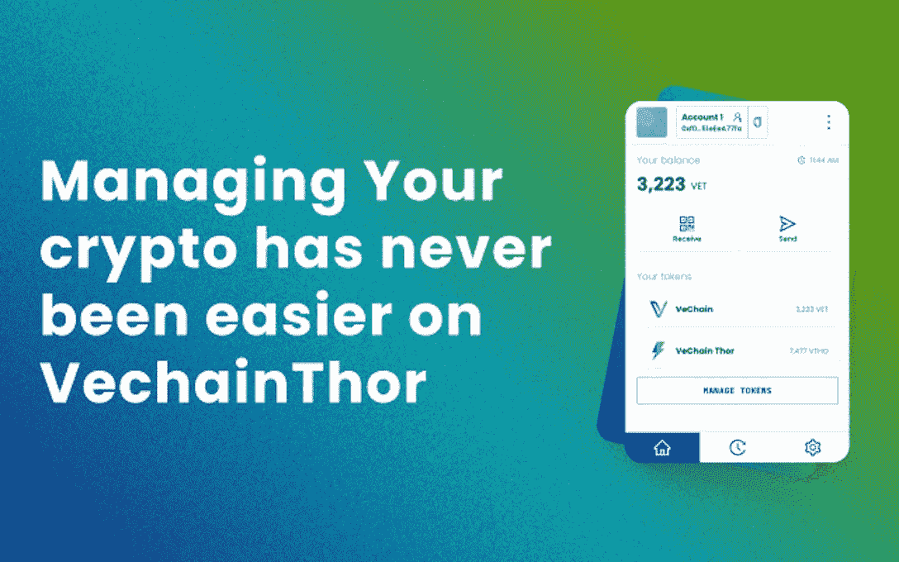
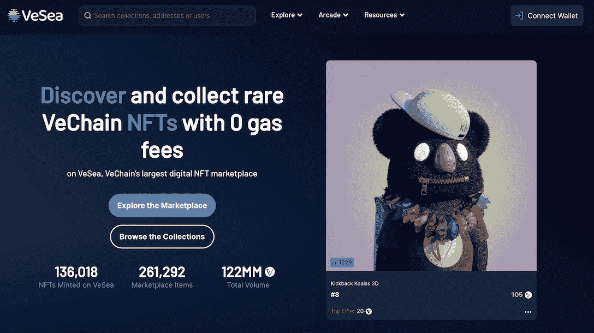
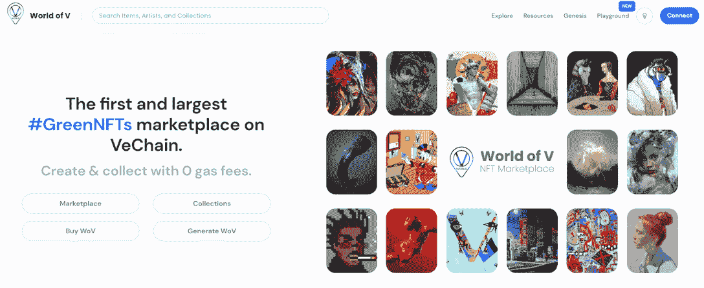
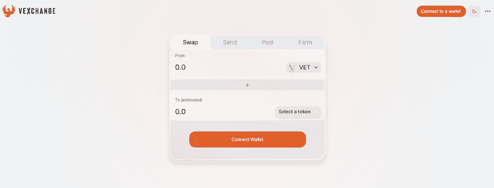
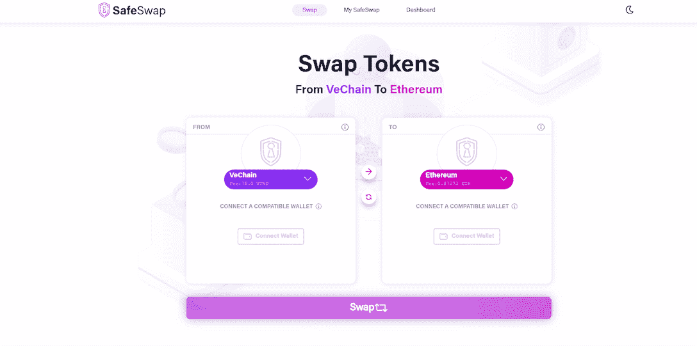
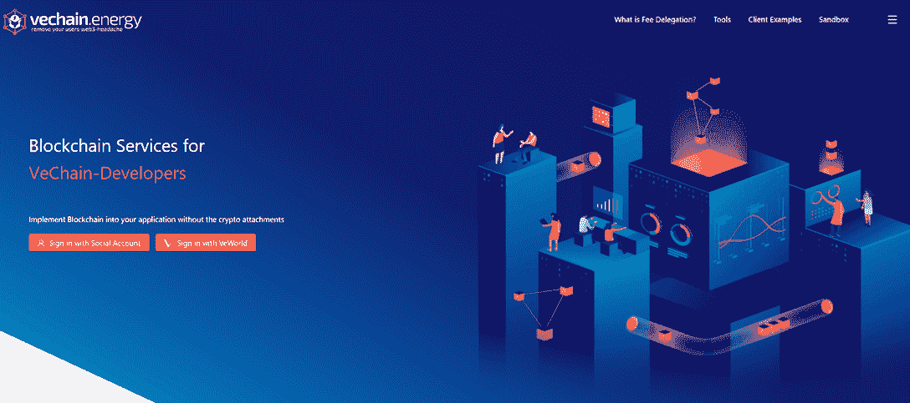

# Vechain Dapps 现已在 DappRadar 上市

> 原文：<https://web.archive.org/web/https://dappradar.com/blog/vechain-dapps-now-listed-on-dappradar>

## 在 vechain 区块链上探索 NFTs、DeFi、社交和游戏应用

DappRadar 很高兴宣布将 vechain 及其 dapps 生态系统整合到 DappRadar 中。这使得全球用户可以通过 vechain 排名发现和分析广泛的 dapps。此外，用户可以通过我们的用户友好界面轻松查看每个 vechain dapp 的指标，如交易量、交易数量和历史表现。

## 什么是 vechain

Vechain 是一个由 VechainThor 驱动的生态系统，VechainThor 是一个第 1 层区块链，具有强大的功能，旨在支持大规模采用区块链技术。它有一个低成本和高度可扩展的架构，有一个快速增长的团队和开发人员社区。费用委托等吸引人的功能意味着用户永远不必支付汽油费，这使得该平台成为寻求启动分散应用程序的建筑商的理想选择。

Vechain 及其合作伙伴致力于促进 Web3 和可持续发展生态系统的采用，最近发布了一份新的白皮书，并成为主要的全球合作伙伴，以透明和信任为核心创建一个公平的世界。

Web3 使每个人都能成为自己成果的所有者和共同创造者，从安全、可信和透明的信息和价值传递中受益。Vechain 致力于促进其开发者和用户社区的发展，帮助他们发展壮大并利用 Web3 & VechainThor 的力量，无论他们的需求是什么。

[Explore the vechain ecosystem](https://web.archive.org/web/20230308074534/https://apps.vechain.org/#all)

## 会见 vmworld——vechain 的门户

VeWorld 是 vechain 新的官方完全去中心化的网络钱包。用户可以安全地管理和拥有他们的数字资产，并创建/导入新的或现有的钱包。此外，钱包甚至允许用户连接他们的硬件钱包，以增加保护。

除了自由签署交易和数字证书之外，VeWorld 还允许用户浏览建立在 vechain 上的 dapps，同时享受自我托管的权力。由于其简单的界面，在 VechainThor 网络上管理和传输加密资产变得前所未有的简单。

VeWorld 有许多功能正在开发中，包括菲亚特上/下坡道、NFT 浏览器、native DEX、跨链桥、桌面/钱包版本等等。

[Install VeWorld](https://web.archive.org/web/20230308074534/https://www.veworld.net/)

## Vechain dapps 来到 DappRadar

Vechain 的社区已经建立了一个多样的 dapps 生态系统。从 NFT 市场到 DeFi，从 NFT 收藏到游戏，vechain 的多功能平台为各种形状和大小的建筑商提供了一个强大的基础。

### 市场:

#### **vesee**

VeSea 是区块链大道上的一个大型 NFT 市场，由 NFT 爱好者为 NFT 爱好者建造。这个市场使得买卖 NFT 变得快捷和容易。最重要的是，用户在使用 VeSea 时将不必担心汽油费。

不管一个人对 NFTs 的经验水平如何，VeSea 为每个人都提供了一些东西。它为个人提供了一个平台来发现独特和罕见的 NFT，展示他们的创作，并与其他 NFT 收藏家联系。

[Discover VeSea](https://web.archive.org/web/20230308074534/https://www.vesea.io/)

#### 虚拟世界

虚拟世界是另一个位于维琴岛的大型 NFT 市场。它具有独特的功能，包括艺术家能够创建“物理”集合(与数字 NFT 对应的物理产品)，同时免除用户的煤气费。

其他新颖的功能包括社交登录、忠诚度计划和帮助连接 Web2 和 Web3 环境的服务。

[Discover World of V](https://web.archive.org/web/20230308074534/https://worldofv.art/)

### **DeFi**

#### 交换

Vexchange 是区块链汽车公司的第一个分散交易所。它为用户交易 VIP-180 令牌(vechainThor 网络上的本地令牌)提供了一种快速安全的方式。除了无缝交换数字资产，用户还可以通过在平台内下注代币来获得奖励。

[Discover Vexchange](https://web.archive.org/web/20230308074534/https://vexchange.io/swap)

#### 原子互换

SafeSwap 是 vechain 的第一个原子交换平台，允许在流行的区块链之间切换资产的安全路径，包括以太坊、多边形和币安智能链。

dapp 由 SafeHaven 构建，safe haven 是一个提供许多其他独特区块链服务的分散式继承平台。

[Discover SafeSwap](https://web.archive.org/web/20230308074534/https://app.safeswap.io/)

### **电力公司/开发商**

#### 能源公司

vechain.energy 是一个本地工具套件，可以帮助开发人员和构建人员以简单直观的方式开始使用 vechain。该平台提供了许多功能，旨在使在 VechainThor 上的构建尽可能简单和无缝。此外，它还提供其他服务，如 vechain.energy 沙箱，允许用户部署预制的合同、NFT 和令牌。

建设区块链从未如此容易。

[Discover vechain.energe](https://web.archive.org/web/20230308074534/https://vechain.energy/)

## 向 DappRadar 提交您的 vechain dapps

dappRadar 邀请 vechain 的 Dapp 开发人员向 DappRadar 提交他们的应用程序，并在全球 Dapp 商店上为不断扩大的 vechain 生态系统创造更多可见性。

有兴趣了解更多关于 vechain 和可能性的人可以从 [vechain 网站](https://web.archive.org/web/20230308074534/https://www.vechain.org/)和[开发者文档开始。](https://web.archive.org/web/20230308074534/https://github.com/vechain)

[Submit your vechain dapps now](https://web.archive.org/web/20230308074534/https://dappradar.com/submit-dapp)