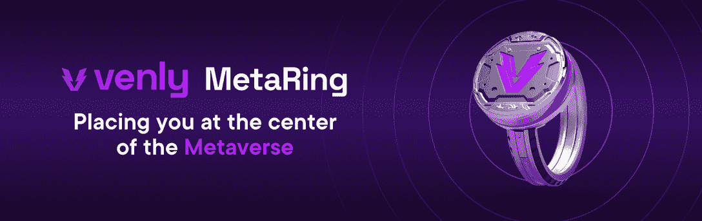
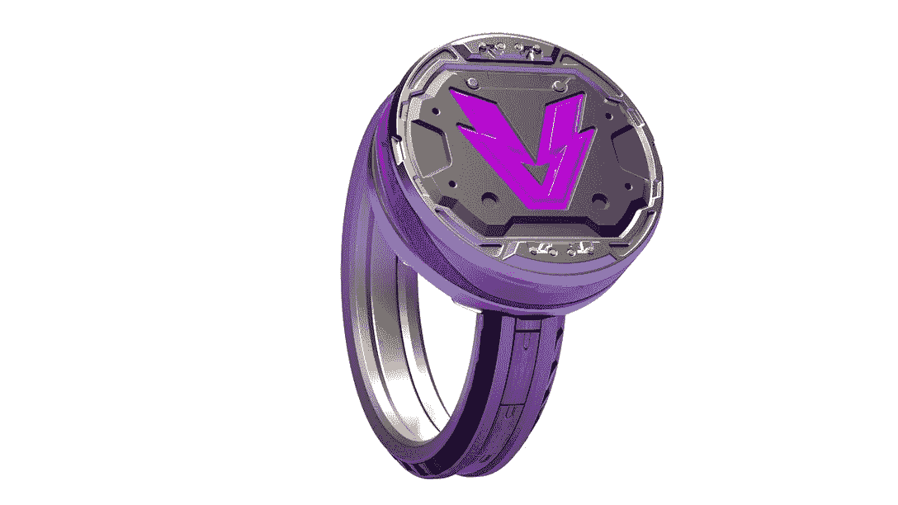

# Venly MetaRing:你的跨元宇宙通行证

> 原文：<https://web.archive.org/web/https://dappradar.com/blog/venly-metaring-your-cross-metaverse-pass>

## Venly MetaRing 允许用户在不同的虚拟土地、平台和游戏之间移动

Venly MetaRing NFT 为用户提供无缝的跨项目元宇宙体验。传统视频游戏领域的一个显著缺点是无法在项目之间进行交互。Venly 推出了 MetaRing，为用户提供无障碍、跨平台的元宇宙体验。

元宇宙的繁荣一直吸引着大品牌在那里寻找他们的下一个财富。从像 Meta 这样的科技巨头到像 Louis Vuitton 这样的时尚品牌，[名单还在继续](https://web.archive.org/web/20230127144135/https://dappradar.com/blog/10-major-brands-in-the-metaverse)。元宇宙无疑是下一个大的技术趋势。根据[彭博情报](https://web.archive.org/web/20230127144135/https://www.bloomberg.com/professional/blog/metaverse-may-be-800-billion-market-next-tech-platform/)，2024 年全球元宇宙市场可能接近 8000 亿美元。

最广为接受的观点是，一家公司无法建设和维护整个元宇宙。未来的元宇宙是一个拥有新经济生态系统的虚拟世界。它需要不同类型的创新公司参与建设元宇宙的过程。

本着同样的愿景，Venly 推出了 MetaRing，为用户提供无障碍、跨平台的元宇宙体验。

## 什么是 venly 计量

在传统的电子游戏世界中，用户不可能在不同的游戏之间进行交互。这是该领域长期存在的一个显著缺点。用户的游戏内资产和游戏体验通常被锁定在项目平台本身内。信徒们将元宇宙视为跨项目虚拟体验的解决方案。Venly 是这类期望的最早实践者之一。

作为区块链不可知论者，Venly 尽可能保持其产品的灵活性。目前，该团队已经与区块链领域的知名公司建立了合作关系，如 Polygon、币安、Avalanche 和 Hedera。这意味着通过 MetaRing，用户将能够在不同的虚拟土地、平台和这些平台上的游戏中体验元宇宙。此外，该戒指提供了独特的好处，并解锁特殊的游戏内设施，并让 NFT 所有者提前进入。通过 MetaRing，用户可以获得无缝的元宇宙体验和专属特权。目前，Venly 已经加入了 14 个世界的合作伙伴关系，如沙盒，火神锻造，基巴之家，Aavegotchi 和 TGC.World。

## MetaRing 产地和购买流程

MetaRing Origin 是第一款上市销售的 MetaRing。该项目将在未来增加其他类型的戒指。值得注意的是，由于每个版本的供应都有上限，因此只有 1000 个 MetaRing 来源。单个单位的价格是 1000 美元。大部分供应品(900 枚金属环或 90%)将在 [Venly 市场](https://web.archive.org/web/20230127144135/https://venly.market/search)出售。至于可用性，它将基于先到先得的原则只提供给 [Venly Discord](https://web.archive.org/web/20230127144135/http://venly.io/discord) 会员。

**如何购买**

MetaRing Origin 将于欧洲中部时间 3 月 3 日下午 1:30 在 Venly 市场上市。以下步骤将引导您顺利完成购买过程。如果您已经注册了 Venly，请跳到 3:

1.  加入恶毒的[纷争](https://web.archive.org/web/20230127144135/https://discord.com/invite/eFFJe6yQPj)
2.  访问 [Venly 钱包](https://web.archive.org/web/20230127144135/https://www.venly.io/product-wallet)或 [Venly 市场](https://web.archive.org/web/20230127144135/https://venly.market/search)创建账户
3.  登录 Venly 市场
4.  使用本指南将以太坊上的 USDC 添加到您的市场余额中。 *(！)请注意，将资金添加到您的 Venly 钱包并不等同于将资金添加到您的市场余额。这些是独立的过程。*
5.  通过 Venly Discord 公告频道上的链接购买 Venly MetaRing
6.  一旦你有了库存，你也可以在市场上出售

**常见问题的快捷方式**

*   [廉价钱包](https://web.archive.org/web/20230127144135/https://help.venly.io/en/)
*   [Venly Market](https://web.archive.org/web/20230127144135/https://help.venly.market/en/)

## 关于 Venly

Venly 是一家区块链技术提供商，提供工具和产品来帮助公司从区块链技术中获益。全球愿景是为最终用户构建开发人员友好的产品和直观的界面。一切的核心是简单、优质的 UX 和顶级的安全性。

被公认为数字先锋，为 Atari、育碧、Bondly、Shopify 等公司和其他行业领导者提供突破性创新。

Venly 提供的产品和服务包括 Venly Wallet、Venly Market、NFT 工具和 Shopify NFT 应用。

[网站](https://web.archive.org/web/20230127144135/https://venly.io/) | [Venly 市场](https://web.archive.org/web/20230127144135/https://venly.market/) | [Venly 钱包](https://web.archive.org/web/20230127144135/https://wallet.venly.io/) | [推特](https://web.archive.org/web/20230127144135/https://twitter.com/Venly_io) | [不和](https://web.archive.org/web/20230127144135/https://discord.com/invite/eFFJe6yQPj) | [LinkedIn](https://web.archive.org/web/20230127144135/https://www.linkedin.com/company/venly-io/)

通过以下链接了解更多关于 Venly MetaRing 的信息:

[网站](https://web.archive.org/web/20230127144135/http://metaring.one/) | [推特](https://web.archive.org/web/20230127144135/http://twitter.com/metaringone) | [Instagram](https://web.archive.org/web/20230127144135/http://instagram.com/metaring.one) | [不和](https://web.archive.org/web/20230127144135/http://venly.io/discord)

**免责声明** —这是一篇赞助文章。DappRadar 不认可本页面上的任何内容或产品。DappRadar 旨在提供准确的信息，但读者应该在采取行动之前总是自己做研究。DappRadar 的文章不能被认为是投资建议。