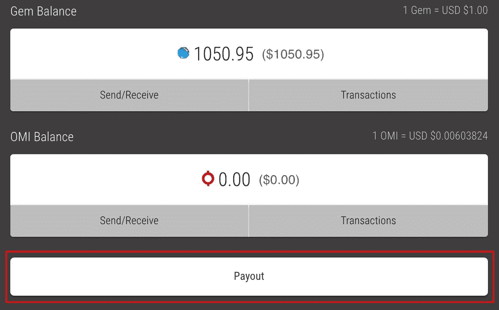
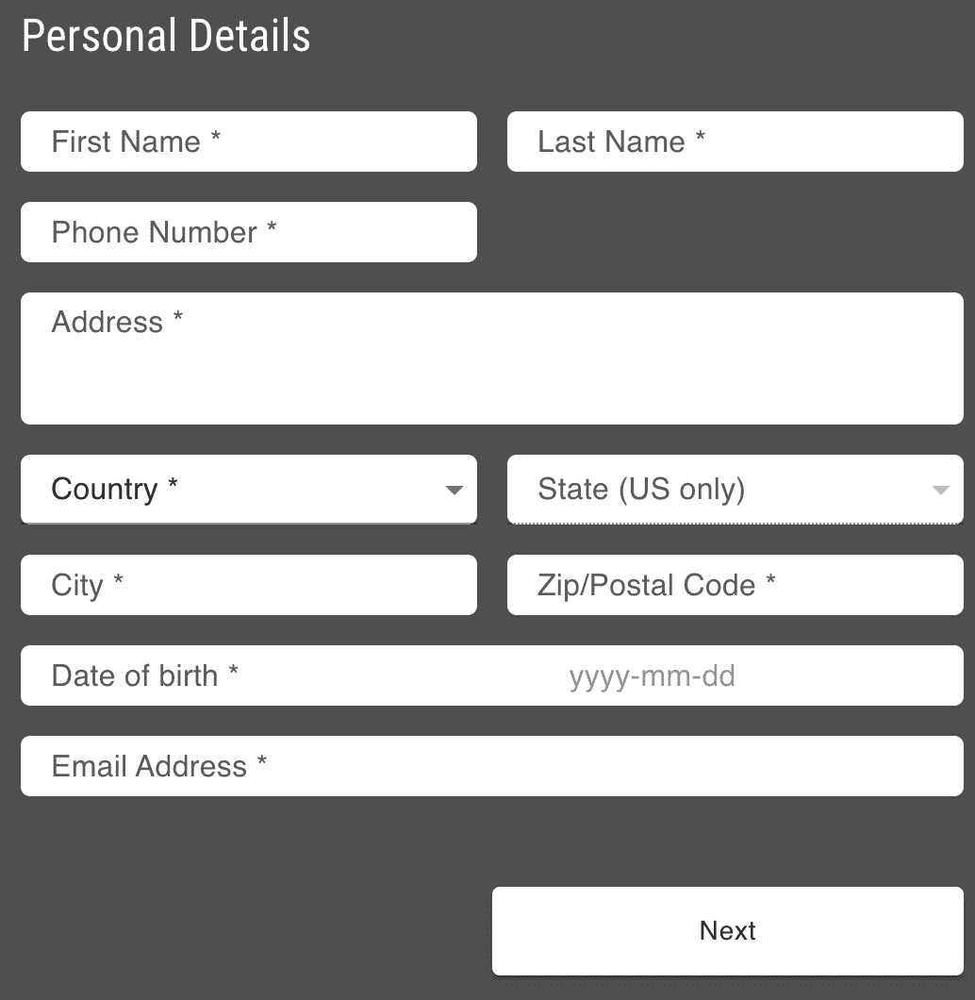
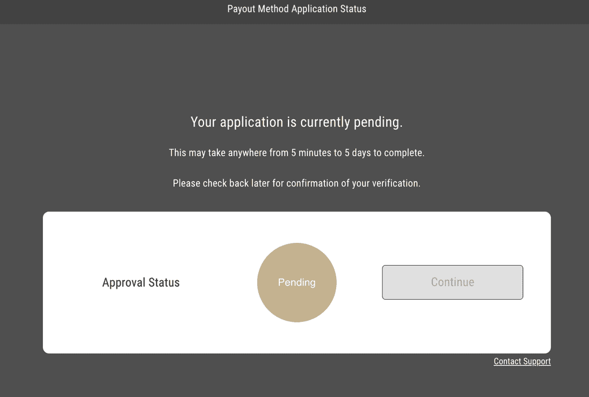
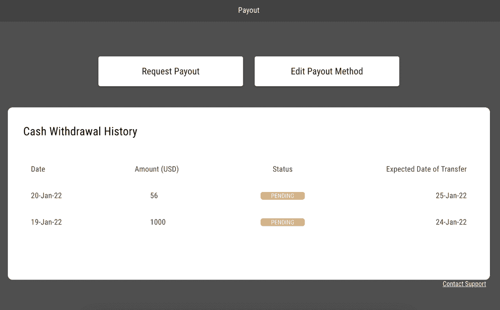

# VeVe NFT 市场允许用户兑现

> 原文：<https://web.archive.org/web/https://dappradar.com/blog/veve-nft-marketplace-to-allow-users-to-cash-out>

## VeVe 支付详情:你需要知道的

### 更新日期:2012 年 7 月 18 日

所有 VeVe 用户现在可以完成 KYC，然后要求支付。尚未验证帐户的用户可以遵循 web beta 主页和 VeVe 应用程序提示，然后使用下面的[说明完成步骤。](https://web.archive.org/web/20230202090559/https://dappradar.com/blog/veve-nft-marketplace-to-allow-users-to-cash-out/#How-to-Use-the-Payout-Feature)

从 2022 年 7 月 30 日晚上 11:59(太平洋时间)开始，只有经过验证的用户(KYC)可以访问所有 VeVe 功能，包括参与 drops 和在市场中购买和销售。如果你是 iOS 用户，你需要在 [VeVe 网站上 KYC。](https://web.archive.org/web/20230202090559/https://app.veve.me/)欲了解更多信息，请访问 [KYC 和支付指南](https://web.archive.org/web/20230202090559/https://forms.veve.me/kycpayoutguide)。

*注意:如果您所在的国家使用 IBAN 标准，请提供 IBAN。*

—

本周，VeVe 公布了期待已久的菲亚特下坡道机制的细节。支付功能还在测试阶段，有几个用户在测试这个系统，每周邀请不同的用户群加入这个项目。

对于那些参与 VeVe NFT 市场的人来说，这个消息是受欢迎的，因为许多人已经足够幸运地翻转 NFT 以获得重大收益。现在，随着 [VeVe 开始开放 beta 支付功能](https://web.archive.org/web/20230202090559/https://medium.com/veve-collectibles/veve-payout-details-what-you-need-to-know-23bb2a6bd26a)，收藏者将能够将他们的宝石转换成几种法定货币，并直接提取到他们的银行账户。

[自 2021 年年中](/web/20230202090559/https://dappradar.com/blog/veve-x-marvel-comics-nft-drop/)推出以来，VeVe 凭借其独一无二的数字收藏品，利用全球公认的知识产权，吸引了全球用户和数字收藏品崇拜者的想象力。然而，它也[捕获了大量的法定货币](/web/20230202090559/https://dappradar.com/blog/unraveling-the-mysteries-of-the-veve-nft-marketplace/)，应用程序将其转换为原生的应用内货币宝石，每个宝石代表一美元。用户花费 fiat 来获得宝石，用于在 VeVe 上买卖 NFT，而没有办法将宝石交换回 fiat——直到现在。

有趣的是，几个电报集团正在以远低于 1:1 的价格在 VeVe 之外为菲亚特交易宝石。我们建议你远离这些渠道，并遵循官方的指导方针，以保持安全，并获得相当数量的菲亚特为您的宝石。

## 什么是支付功能？

支付允许 VeVe 用户从他们的 VeVe 钱包中提取宝石到他们的银行账户作为法定货币(例如，美元)。要使用该功能，用户必须完成 KYC(了解您的客户)并在提款前获得批准。

提交给 KYC 审批的信息由 VeVe 的 MTL 合作伙伴— [BlueSnap](https://web.archive.org/web/20230202090559/https://home.bluesnap.com/about-bluesnap/) 安全存储。BlueSnap 是一家全球支付网关和商户账户提供商，在 200 多个地区和 47 个国家提供金融服务和支付。

***注意:支付功能处于测试阶段。下面的 KYC 流程和支付请求截图仅是测试版。此外，这些信息将是有效的，因为 VeVe 用户被邀请测试和使用匝道。***

## 如何使用支付功能

首先，您需要登录 VeVe 网络钱包。VeVe 支付功能仅通过 VeVe 网络钱包提供，可在 [https://omi.veve.me](https://web.archive.org/web/20230202090559/https://omi.veve.me/) 找到。

要登录，请使用您登录 VeVe mobile 应用程序时使用的电子邮件帐户和密码。您将收到一封 2FA 电子邮件以完成登录过程，之后您将看到您的宝石和 OMI 钱包和余额。在钱包余额下方，您会发现“支付”按钮。

***注意:我无法使用我的 VeVe iOS 设备凭据在编写时登录 web 应用程序。然而，几个拥有 Android 帐户的同事成功访问了 web 帐户。已联系 VeVe 请其置评。***

最初，该按钮对大多数用户来说是不可访问的/灰显的，所以如果您还不能访问该功能，请保持耐心。

## 完整的 KYC

KYC 或“了解您的客户”法规要求您提供身份证明文件来完成金融交易。用户需要完成此流程，然后才能进行任何撤销。

你需要输入你的个人信息，这是一个相对简单的过程。您还需要提供一些政府颁发的身份证明的初步信息(身份证号码):

*   带有社会安全号码的身份证(仅限美国)
*   护照
*   驾驶执照

准备好继续后，只需点击“开始 KYC 流程”输入信息。

您只需输入与您选择的 ID 形式相关的号码。如果你是美国公民，你将被要求提供你的社会安全号码的最后四位数字。此外，不要为您的电话号码输入国家代码。

然后，BlueSnap 将通过所提供的电子邮件联系用户，请求提供实际的 ID 文档。这封电子邮件将包含一个链接，带您到一个安全的门户网站上传您的身份验证。

## 输入支付方式

提交您的详细信息和 ID 号后，您将进入支付方式屏幕。您将输入您的基础货币和银行帐户详细信息，以接收您的付款。在写作时，你可以选择接受澳元，加元，欧元，英镑，HKD，日元，新西兰元和美元。

如果您的本币不是列出的货币之一，您仍然可以使用该功能。但是，VeVe 建议联系您的银行，确保他们可以为您进行货币兑换，并照常将您的当地货币存入您的帐户。

一旦您提交了您的个人和银行信息，您将会看到您的 KYC 申请正在等待处理。我们的 MTL 提供商将向您发送一封电子邮件，要求您提供身份证明文件以及您控制您所提供详细信息的银行账户的证据。这封电子邮件将包含一个安全上传设施的链接，以维护您的信息安全。

KYC 申请获得批准后，您可以通过单击“编辑付款方式”随时更改您的银行详细信息。该过程与初始设置相同，MTL 提供商将再次与您联系，以验证新的银行信息。

## 需要多长时间？

提交信息后，您应该期望 MTL 提供商在接下来的五个工作日内联系您，要求验证您的文件。他们会批准或拒绝你的 KYC 申请。同时，您将看到下面的“待定”屏幕。

当您获得批准后，待定状态将更新为已批准，您可以通过单击继续进入支出请求屏幕。

一旦你的 KYC 申请被批准，你可以要求支付。现在或将来要这样做，只需再次点击网络钱包主屏幕上的支付按钮，您将看到下面的支付主屏幕。

用户可以在此页面上申请新的支付、编辑他们的支付方式以及查看他们的提款历史。只需点击“请求支付”按钮即可开始。输入您想要提取的宝石数量，最多 50k 个。该屏幕还将详细列出每笔交易 10%的费用，以及您将获得的宝石总价值。

单击“下一步”继续，您将看到最后一个确认屏幕。如果您对详细信息满意，请点击“接受并提交”以处理支出。支付请求在五个工作日内处理完毕，可能需要 15 天才能到达账户。

## 费用和取款次数

处理支出时需要注意一些数字。这些详细信息也会在您提出支付请求时提供给您。

1.  您必须拥有 1000 颗宝石的最低余额才能触发支付交易。
2.  最低取款额是 50 宝石。
3.  任何支付交易都将收取 10%的费用。
4.  七天最高提现金额(目前)50000 宝石。
5.  提款平均需要 7-14 天处理并到达您的账户。这个速度很大程度上取决于你的银行机构和传统的金融系统(电汇/SWIFT)。因此，从批准之时起，您应该允许最多 15 个工作日的时间将您的支出记入您的帐户。

您的银行也可能会收取电汇费用，这是国际/SWIFT 网络交易的典型做法。这通常是 35 美元左右，如果适用的话，您可能还会被收取货币转换费。很明显，这个数字是由你的银行确定和收取的，而不是 VeVe。

## 随身携带您的 Web3 之旅

使用 DappRadar 移动应用程序，再也不会错过 Web3。查看最受欢迎的 dapps 的性能，并关注您投资组合中的 NFT。您在 DappRadar 上的帐户会与我们的移动应用程序同步，这样您很快就可以选择实时接收提醒。

[Download the DappRadar app now](https://web.archive.org/web/20230202090559/https://dappradar.app.link/blog)[<picture></picture>](https://web.archive.org/web/20230202090559/https://play.google.com/store/apps/details?id=com.portfolio.dappradar)

***以上不构成投资建议。此处给出的信息仅供参考。请行使尽职调查，做你的研究。作者持有 ETH、BTC、AGIX、HEX、LINK、GRT、CRO、OMI、不可变 X、GALA、AVASTR、GMEE、CUBE、RADAR、FLOW、FTM、BNB、SPS、WRLD、ATOM 和 ADA。***