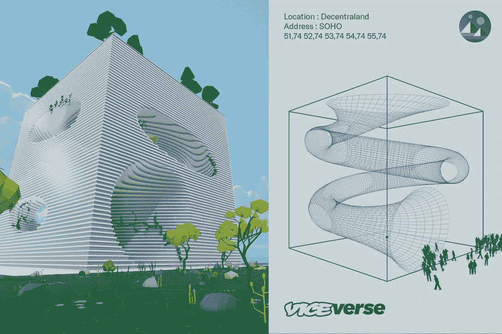
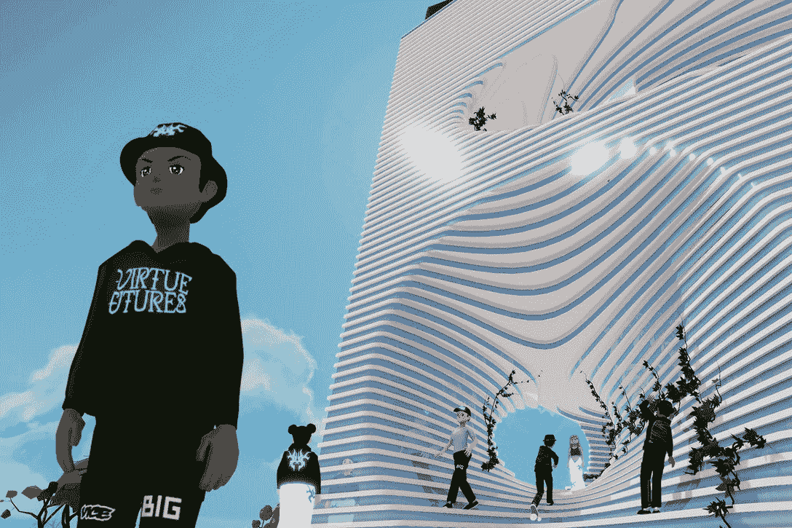
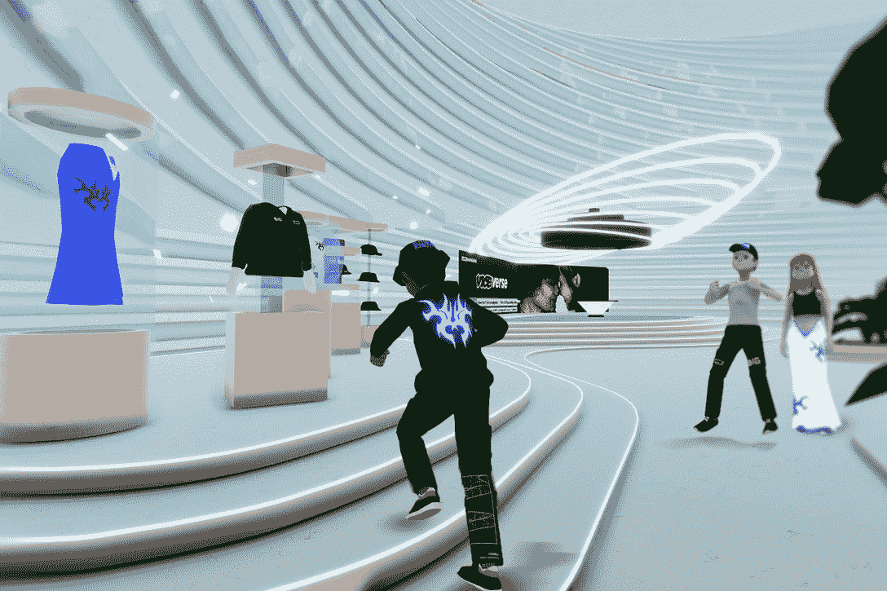

# Vice 媒体集团在分散的土地上揭开了总部的面纱

> 原文：<https://web.archive.org/web/https://dappradar.com/blog/vice-media-group-unveils-hq-in-decentraland>

## 汇聚全球创意员工——几乎是

**美德环球，由 VICE**[**驱动的创意机构，在元宇宙为 VICE 传媒集团(VMG)创建了一个办公室**](https://web.archive.org/web/20221127162447/https://www.cityam.com/vice-media-unveils-metaverse-hq/) **。该虚拟建筑将向包括美德和 VICE 在内的多家 VMG 企业开放，并将作为该集团在 distribland 的永久住所。**

[分散王国是一个基于虚拟世界浏览器的平台](https://web.archive.org/web/20221127162447/https://dappradar.com/ethereum/marketplaces/decentraland)。用户可以通过法力加密货币购买虚拟土地作为 NFT，这种货币使用[以太坊区块链](https://web.archive.org/web/20221127162447/https://dappradar.com/rankings/protocol/ethereum)。它于 2020 年 2 月向公众开放，由非营利组织[分散化基金会](/web/20221127162447/https://dappradar.com/blog/metaverse-land-in-decentraland-ahead-of-bored-apes-top-10-nft-sales/)监管。

该计划由“美德未来”发起，这是“美德”内部的一个创新部门，旨在帮助品牌以文化相关的方式寻找新的平台、技术和空间。2021 年年中，美德期货团队[推出了可口可乐的第一款 NFT](/web/20221127162447/https://dappradar.com/blog/coca-cola-sells-first-nft-for-565000/) ，标志着 2021 年品牌和机构如何利用区块链技术的众多例子之一。

## 分散的罪恶

该空间建在分散式区域内，将作为该机构的虚拟创新实验室，团队可以在这里试验 NFTs、DAOs 和 Web3，将见解直接应用于寻求飞跃的品牌。

Virtue Futures 的全球 ECD 创新 Morten Grubak 表示:*“元宇宙的创意机会非常令人兴奋，因为我们已经在帮助品牌导航这个新空间，所以我们在那里设立办事处是有意义的。通过与 BIG 的世界知名建筑师合作，这一愿景呈现出新的现实。”*

Bjarke Ingels Group (BIG)设计了虚拟建筑，这是曼哈顿金字塔和 T2 谷歌山景北校区 T3 背后的先锋建筑公司。

## 元宇宙新闻社

新闻服务台可以看到 Vice 开始处理元宇宙新闻以及现实世界的事件。自 1994 年以来，Vice 已经开辟了一个坚实的利基市场，提供注重文化的、引人入胜的、有时甚至是完全有争议的[内容。](https://web.archive.org/web/20221127162447/https://www.vice.com/en/article/z3nz7y/were-all-speculating-inside-the-wildly-hyped-metaverse-real-estate-rush)

他们可能会报道和报道不断增长的分散平台内部发生的事情和事件。类似于 somn ium Times(T1)这样的媒体，专门报道来自 Somnium Space 虚拟世界的元宇宙新闻。

全球美德组织表示，分散的总部是他们全球无国界团队设置的中心节点。客户和协作者可以在这里开会、演示和亲自演示项目。它也将作为数字社区社会学的数字领域研究的发射台。

## 元宇宙疯狂

最近，韩国电子巨头三星[在他们位于](https://web.archive.org/web/20221127162447/https://dappradar.com/blog/samsung-unveils-new-galaxy-s22-phone-in-decentraland)[的分散虚拟世界](https://web.archive.org/web/20221127162447/https://dappradar.com/ethereum/marketplaces/decentraland)的虚拟 837X 空间展示了他们新的 S22 设备系列。而今年早些时候，位于分散地的[时尚街房产](https://web.archive.org/web/20221127162447/https://dappradar.com/hub/assets/eth/0x959e104e1a4db6317fa58f8295f586e1a978c297/4339)以 242 万美元的价格售出。此外，[几周前，麦当劳申请了十项专利](https://web.archive.org/web/20221127162447/https://dappradar.com/blog/mcdonalds-metaverse-restaurants-to-feature-food-delivery-service),为推出一家以真实和虚拟商品为特色的虚拟餐厅奠定基础，并进一步计划提供送货上门服务。

随着对眼球和相关性的争夺继续进行，组织越来越多地与区块链接触，去年由 META 引发的元宇宙病毒正在升温。

 NewsletterUnsubscribe at any time. [T&Cs](https://web.archive.org/web/20221127162447/https://dappradar.com/terms) and [Privacy Policy](https://web.archive.org/web/20221127162447/https://dappradar.com/privacy-policy)

***以上不构成投资建议。此处给出的信息仅供参考。请行使尽职调查，做你的研究。作者持有 ETH、BTC、AGIX、HEX、LINK、GRT、CRO、OMI、不可变 X、GALA、AVASTR、GMEE、CUBE、RADAR、FLOW、FTM、BNB、SPS、WRLD、ATOM 和 ADA。***