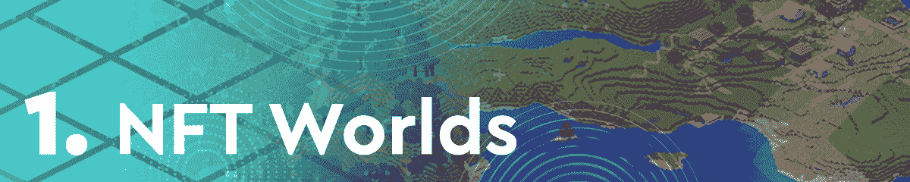
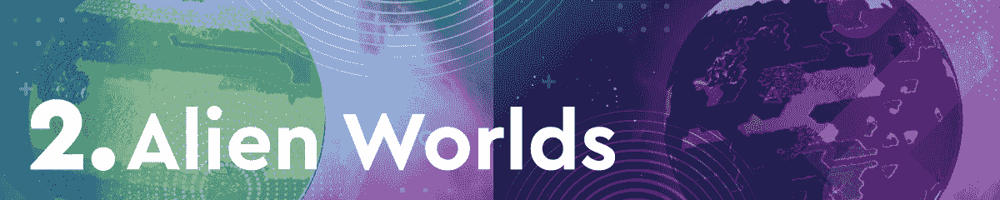
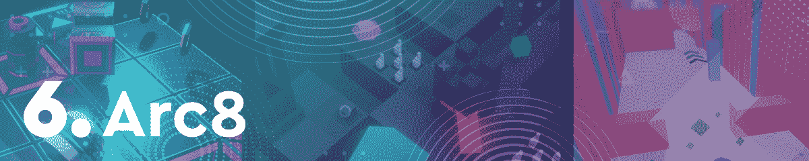
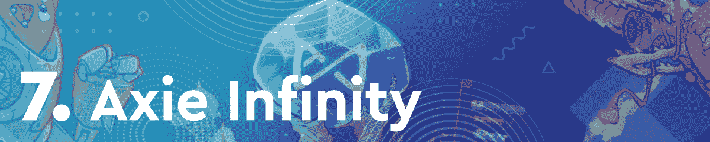
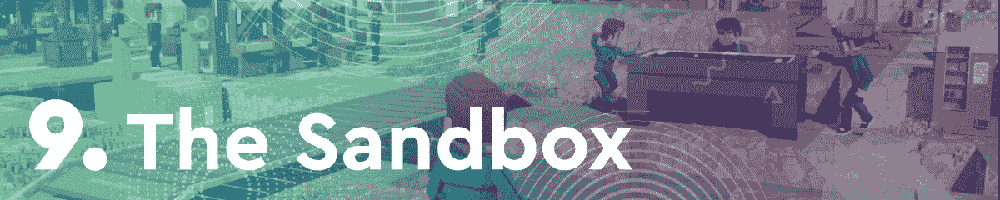
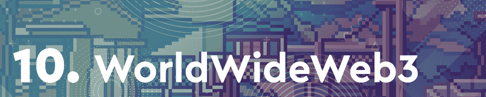

# 虚拟世界接管区块链游戏空间

> 原文：<https://web.archive.org/web/https://dappradar.com/blog/virtual-worlds-take-over-the-blockchain-gaming-space>

## 《NFT 世界》、《分散的土地》、《沙盒》,等等都进入了二月份区块链十大游戏排行榜

虚拟世界和元宇宙平台正稳步成为游戏领域关注的焦点。令人印象深刻的是，一些在这个领域更有名气的公司，如分散的土地和沙盒，正在落后。与此同时，新人 NFT 世界连续几周高居排行榜榜首。

自去年年底以来，元宇宙一直是区块链空间最热门的话题之一。然而，随着 2022 年的头几个月，虚拟世界真的开始发光了。2 月份排名前十的游戏 dapps 中有四个是广泛的虚拟世界平台。

除了元宇宙平台，玩赚游戏也吸引了大量的注意力。市场先锋 Axie Infinity 尽管其本土代币 AXS 的性能下降，但仍然晋级。此外，新人 Pegaxy 已设法确保在图表中的位置。这要归功于一条新的改良 3D 赛道的推出。

浏览以下本月十大区块链游戏的完整列表。单击相应的图片，了解每个平台的更多信息。或者，看看下面的视频，它总结了排名，可以快速查看。

[https://web.archive.org/web/20220930103726if_/https://www.youtube.com/embed/Sno6A0fKf_o?feature=oembed](https://web.archive.org/web/20220930103726if_/https://www.youtube.com/embed/Sno6A0fKf_o?feature=oembed)

## 二月份区块链十大游戏

本月，NFT 世界凭借其[本土代币 WRLD](https://web.archive.org/web/20220930103726/https://dappradar.com/hub/token/polygon/WRLD?from=0xD5d86FC8d5C0Ea1aC1Ac5Dfab6E529c9967a45E9)212%的估值增长，完全主导了游戏领域。此外，游戏引入了无汽油的游戏内交易，极大地改善了用户体验。

蜡像巨头[外星世界](https://web.archive.org/web/20220930103726/https://dappradar.com/wax/games/alien-worlds)本月排名第二，尽管[TLM](https://web.archive.org/web/20220930103726/https://dappradar.com/hub/token/bsc/TLM?from=0x2222227e22102fe3322098e4cbfe18cfebd57c95)价格下跌 2.6%，外星世界本月排名第二。该游戏在 2 月份吸引了近 100 万个独特的活动钱包。

基于多边形的赛马游戏 Pegaxy 对其平台进行了大量改进，使其在本月排名第三。随着新的 3D 赛道和新的角色设计，游戏玩家开始关注赛马游戏。他们可以通过赢得比赛[获得 PGX 代币](https://web.archive.org/web/20220930103726/https://dappradar.com/hub/token/polygon/PGX?from=0xc1c93D475dc82Fe72DBC7074d55f5a734F8cEEAE)。

纸牌交易游戏[spliter lands](https://web.archive.org/web/20220930103726/https://dappradar.com/multichain/games/splinterlands)本月下降了几个名次。然而，该游戏仍然占据了一席之地，本月有超过 50 万个独特的活动钱包连接到其平台。 [SPS 养殖](https://web.archive.org/web/20220930103726/https://dappradar.com/hub/token/bsc/SPS/BNB?from=0x1633b7157e7638c4d6593436111bf125ee74703f)仍是炒作的一大部分。

虚拟世界[分散土地](https://web.archive.org/web/20220930103726/https://dappradar.com/ethereum/marketplaces/decentraland)在二月份排名攀升，这要归功于一些知名企业在该平台上购买土地的重要公告。其中包括 JP 摩根和 DJ RAC。[法力是虚拟世界生态系统的原生令牌](https://web.archive.org/web/20220930103726/https://dappradar.com/hub/token/eth/MANA/ETH?from=0x0f5d2fb29fb7d3cfee444a200298f468908cc942)。

基于手机的迷你游戏平台 Arc8 本月排名第六，推出了第一个正式的完整赛季。随着其完整游戏功能的发布，人们对该平台的兴趣有所上升。此外，该平台的[原生令牌 GMEE](https://web.archive.org/web/20220930103726/https://dappradar.com/hub/token/polygon/GMEE/MATIC?from=0xcf32822ff397ef82425153a9dcb726e5ff61dca7) 在过去 30 天的估值上涨了 8%。

游戏赚钱巨擘 Axie Infinity 本月排名下降了好几个名次，因为其在 T2 的本土品牌 AXS(T3)的估值下跌了 5%以上。然而，该游戏引入了许多重要的更新，包括第 20 季的开始，以及其原始版本的推出。

虚拟房地产交易游戏 Upland 在过去几周保持了稳定的良好表现。吸引了超过 330，000 个独特的活动钱包，并宣布了众多具有里程碑意义的地块销售，Upland 在 2 月份排名第七。

虚拟世界[沙盒](https://web.archive.org/web/20220930103726/https://dappradar.com/ethereum/games/the-sandbox)这个月相当成功，推出了单个[沙盒](https://web.archive.org/web/20220930103726/https://dappradar.com/hub/token/eth/SAND/ETH?from=0x3845badade8e6dff049820680d1f14bd3903a5d0)，以及其土地 NFTs 的智能合同迁移。然而，由于 SAND 的估值在过去三十天内损失了接近 2%的估值，该平台本月排名第九。

这个月，尽可能多的 NFT 收藏令人兴奋。这与迄今为止最大的虚拟世界任务之一相结合，使该平台在 2 月份的区块链十大游戏排名中占据一席之地。

## 虚拟世界是未来

元宇宙揭示了 web3 空间的一个全新方面，以及区块链技术所能提供的功能。自从脸书去年更名为 Meta 以来，虚拟世界已经开始获得密码爱好者和主流观众的更多关注。

重要的是，沙盒和分散土地等领域的先驱现在正面临着来自该领域新来者的激烈竞争。NFT 世界于 2021 年 10 月推出，然而，该平台已经高居排行榜榜首。由于创新的空投令牌结构，以及游戏中的原生令牌 WRLD，该游戏最近出现了一波活动浪潮。

随着更多虚拟世界的出现，达普拉达将继续监控区块链的游戏空间。如果你想了解更多关于区块链游戏的信息，请浏览完整的 [DappRadar 顶级游戏排名](https://web.archive.org/web/20220930103726/https://dappradar.com/rankings/category/games)。此外，你可以在[的 Twitter](https://web.archive.org/web/20220930103726/https://twitter.com/dappradar) 上关注 DappRadar，首先了解最新的区块链博彩新闻。

 NewsletterUnsubscribe at any time. [T&Cs](https://web.archive.org/web/20220930103726/https://dappradar.com/terms) and [Privacy Policy](https://web.archive.org/web/20220930103726/https://dappradar.com/privacy-policy)