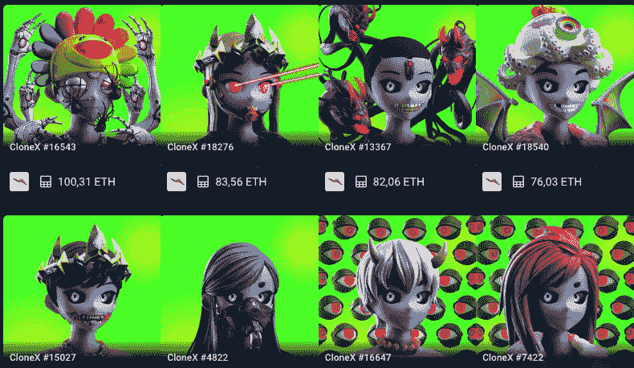
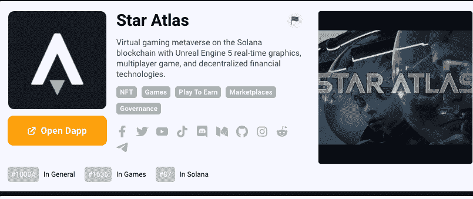
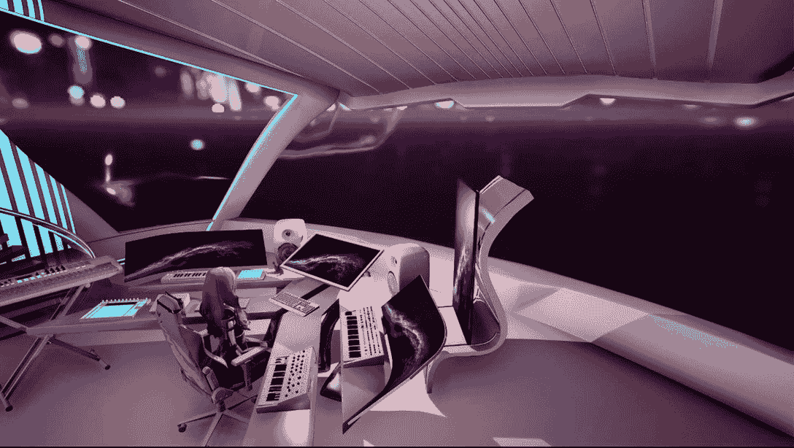
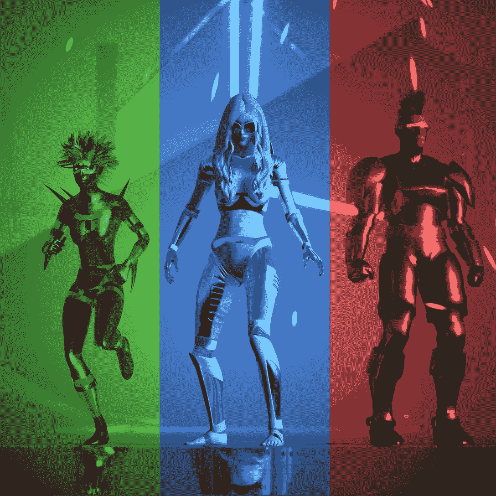

# VNCCII 想把音乐游戏化

> 原文：<https://web.archive.org/web/https://dappradar.com/blog/vnccii-wants-to-gamify-music>

## 一个艺术家可以成为自己的 dapp

DappRadar 启动了一系列与行业影响者的新访谈，在这些访谈中，我们从品牌、营销和艺术专业人士的角度深入探讨了网络游戏、游戏和元宇宙等 Web3 主题。

音乐人长期以来一直遭受着娱乐产业的不平等待遇，但是现在他们有可能通过使用区块链技术的 [NFTs](https://web.archive.org/web/20220925235823/https://dappradar.com/nft) 发行他们的作品来赚钱。然后，他们保持对自己创作的作品的所有权，并独立于唱片公司，而唱片公司通常牢牢控制着这个行业。

支付轨道和冗长支出的传统结构适合当权者。要突破到另一边，将需要一个强大的独立艺术家和标签的草根运动来推动一个新的范式。一个迫使当前组织的手，让他们别无选择，只能接受一种新的业务方式。

## 我们如何建立 Web3 创造者经济？

VNCCII 是引领这场推动变革的强大运动的天才艺术家之一。她体现了创作者经济作为一个多学科的音乐艺术家/歌手-词曲作者/制作人/现场表演者和更多的杂务。

但是不要从我这里拿走它。这是 VNCCII 从她的全息船虚拟音乐工作室！

<https://web.archive.org/web/20220925235823im_/https://wp.dappradar.com/wp-content/uploads/2022/08/dappradar.com-vnccii-is-gamifying-music-with-storytelling-in-the-metaverse-vnccii-dappradar-reduced-1-1.mp4>

VNCCII has a special message for you! 

## 告诉我们您和 VNCCII 的情况

VNCCII 是我的多媒体/元宇宙/Web3 项目。我是一个多学科的自学创新的未来学家、技术专家、元宇宙说书人、全球主题演讲人、哲学家和音乐艺术家/创作歌手/制作人/现场表演者。

自 2018 年以来，我一直以名为 VNCCII 的 3D 头像代表我的项目。她被定位为一个虚构的超级有感觉的人工智能超级英雄角色，来交流我的多媒体故事，因为我对音乐和游戏的融合特别有热情。

此外，我还对科幻小说中的超级人工智能概念及其对人类的影响着迷。人工智能每天都在变得越来越先进，这是我的使命的一部分，让人类能够与人工智能共生和平共处。

我现在正准备发布我即将推出的太空人工智能歌剧科幻小说，伴随着我的[元宇宙](https://web.archive.org/web/20220925235823/https://dappradar.com/blog/category/metaverse)音乐专辑和现场数字舞台表演。VNCCII 是众多不同角色中的主角，适合改编为数字现场娱乐节目、电影、音乐剧、动画、时装秀、虚拟房地产、宇宙世界建筑和区块链游戏。

最近，我一直在倡导网络 3 创造者经济，并在各种会议上支持元宇宙讲故事的力量，如 [SuperVerse Dubai](https://web.archive.org/web/20220925235823/https://www.superverse.me/) 、[创意大会](https://web.archive.org/web/20220925235823/https://www.creativityconference.is/speakers)以及将于 9 月举行的[沉浸在葡萄牙](https://web.archive.org/web/20220925235823/https://www.immerseglobalnetwork.com/igs-europe)。总的来说，这个项目背后的“为什么”和意图是挑战社会的期望，并授权和提升人类的意识。

[https://web.archive.org/web/20220925235823if_/https://www.youtube.com/embed/N6NY9hTOxPU?feature=oembed](https://web.archive.org/web/20220925235823if_/https://www.youtube.com/embed/N6NY9hTOxPU?feature=oembed)

Source: [Level Up 2 Nirvana (Oficial Music Video)](https://web.archive.org/web/20220925235823/https://www.youtube.com/watch?v=N6NY9hTOxPU)

## 你是如何发现 Web3 的？

作为一个具有前瞻性思维的独立创意者，我总是寻找最终能够赋予艺术家权力和解放艺术家的解决方案和前沿技术。当我在毕普·克里斯蒂的拍卖会后发现 NFTs 时，我受到启发，去了解更多关于 Web 3 生态系统以及 NFTs 将价值归属于艺术家的力量，而不是孤立的集中式 Web 2 平台。

这个概念激发了一场新的文化数字复兴。在我看来，我将 NFT 视为通向开放和可互操作的元宇宙以及元金融经济的门户，元金融经济是可替代和不可替代资产之间复杂的金融相互作用。

## 你现在在做什么？

我目前正致力于推出一个 IP 专营权(TBA ),这将遵循我写的科幻太空歌剧 A.I 小说的故事情节。还将有一个现场的数字舞台表演，将与这个故事情节同步。

我一直受到华特·迪士尼和他的创新与想象工程精神的鼓舞。我热衷于探索机会，通过未来的技术创新，包括游戏化、动作捕捉、虚拟制作、VR、AR 和 XR，为客人创造快乐的物理体验，创造新的多感官 4D 体验。

这是一个长期愿景，将随着时间的推移不断发展，并为 VNCCII 品牌、知识产权特许经营和社区建立公平。从 Web 3 和元宇宙的角度来看，当社区成为这个故事中的积极利益相关者时，他们将获得和代理数字体验，扮演积极的共同创造者角色。是的，就像领导一场文化大革命。我们走吧！

[https://web.archive.org/web/20220925235823if_/https://www.youtube.com/embed/Bpmp52MZJ4Q?feature=oembed](https://web.archive.org/web/20220925235823if_/https://www.youtube.com/embed/Bpmp52MZJ4Q?feature=oembed)

Source: [i-LIBERATE (Oficial Music Video)](https://web.archive.org/web/20220925235823/https://www.youtube.com/watch?v=Bpmp52MZJ4Q)

## 如何将音乐游戏化，让它“物理化”？

首先，我在 2018 年通过采用 VNCCII 的虚拟化身身份将音乐游戏化。从那以后，我一直在发布我在虚幻游戏引擎中制作和创意指导的歌曲的音乐视频。

这些音乐视频中的每一个都有实时的用户环境，可以充实到游戏体验或实时社交空间中，以庆祝这些微分支 VNCCII 故事情节。

除了音乐视频，我还通过实验独立动作捕捉(我使用 Rokoko mocap 套装)探索了 VTuber 的概念，在她的 HOLOSHIP 虚拟音乐工作室中作为我的 VNCCII 虚拟角色实时说话。音乐游戏化有无限可能。我的下一个挑战是通过讲故事将它带到现场，真正创造一个让你难忘的“数字”体验！

[https://web.archive.org/web/20220925235823if_/https://www.youtube.com/embed/MFBoFz8LJBg?feature=oembed](https://web.archive.org/web/20220925235823if_/https://www.youtube.com/embed/MFBoFz8LJBg?feature=oembed)

Source: [I Came I Saw I Conquered (Oficial Music Video)](https://web.archive.org/web/20220925235823/https://www.youtube.com/watch?v=MFBoFz8LJBg)

## 作为一个需要推销自己作品的艺术家，你如何看待元宇宙，哪个元宇宙是你的最爱，如果有的话？

正如我的朋友托尼·帕里西所说，世界上只有一个元宇宙！艺术家在元宇宙推销自己的机会多得很。我相信战略伙伴关系是富有成效的，但我也想强调艺术家成为他们自己的平台或 DAPP 的力量，作为更大的总体战略的一部分。

## 选择一个你认同的 NFT 收藏和游戏，并告诉我们为什么

我喜欢 RTFKT CloneX 和 T2，他们为持有者提供的工具。他们与村上隆的合作也是传奇。在一天结束的时候，它是关于人们聚集在一起分享共同的激情和愿景，共同建设一个更加光明的未来。

[<picture></picture>](https://web.archive.org/web/20220925235823/https://dappradar.com/hub/nft-explorer/collection/clonex)

Source: [DappRadar NFT Collection Explorer (CloneX)](https://web.archive.org/web/20220925235823/https://dappradar.com/hub/nft-explorer/collection/clonex)

就区块链游戏而言，[我与迈克尔·瓦格纳对《星际地图》所做的事情产生了共鸣。很高兴看到团队利用虚幻引擎 5 和游戏中的市场和派系构建了一个高质量的游戏，这也是故事的一部分。在我的 IP 发布后，我将在 UE5 中基于 IP 构建游戏体验，让社区作为共同创造者、玩家和文化鉴赏家参与进来。](https://web.archive.org/web/20220925235823/https://dappradar.com/blog/star-atlas-ceo-on-the-next-step-in-the-coordination-of-human-labor)

[<picture></picture>](https://web.archive.org/web/20220925235823/https://dappradar.com/solana/games/star-atlas)

Source: [DappRadar](https://web.archive.org/web/20220925235823/https://dappradar.com/solana/games/star-atlas)

## 在你的“未来人类”直播节目中与元宇宙思想领袖交谈，有什么难忘的教训吗？

自从“未来人类”vodcast 节目开始以来，我获得了许多宝贵的见解和友谊。迄今为止收到的最好的反馈是，vodcast 节目让他们想起了华特·迪士尼对“明日世界”的愿景——实际的乐观主义。

我相信，我们必须通过对话和突破来推动社会前进，而不要散布恐惧和愤世嫉俗，这种恐惧和愤世嫉俗源于一种有限的心态。我选择站出来成为一名领导者，激励他人释放他们无拘无束的创造力，坦然接受真实的自我。

这种积极的思想领导的灵感和拥抱“玩”的感觉已经通知了我在节目中采访的人。我真的很重视凯茜·哈克(第二集)所说的话，那就是我们都是世界的建设者，元宇宙是属于每一个人的。

我也非常重视 [Mike Pell(第 13 集)](https://web.archive.org/web/20220925235823/https://youtu.be/KmDAl-alpvU)关于通过设想突破“浮出水面”的说法，以及“所有这一切的核心是沟通…是人…你所做的任何事情都与技术无关，它总是与人有关”。"

Source: [VNCCII](https://web.archive.org/web/20220925235823/https://www.vnccii.com/)

## 你对希望进入创作者经济并与粉丝联系的音乐艺术家有什么建议？

我的建议是“了解你自己”。每个企业家都应该有一个使命和愿景声明，艺术家也不例外。我从一开始就像一个创业公司一样对待 VNCCII 项目，这提高了我的商业敏锐性和我创造“为什么”的使命。

我的建议是拥抱突破性的创新和发明。利用技术来满足你的创造性需求，而不是相反。我们正处于人类历史的关键时刻，在这里我们可以塑造未来。让它有价值。

当你的粉丝和社区感受到所有多媒体的参与，并被视为“客人”或积极的共同创造者时，他们会为此感谢你。回想起来，沃尔特的主题公园是成功的，因为他没有把它们视为消费者，而是受欢迎的客人。此外，我不认为他们是粉丝。我把他们视为集体使命中的社区成员，以塑造一个更好的未来时间表。

Source: VNCII

## 五年后 NFTs 和音乐产业的未来会是什么样子？

我没有水晶球，所以我不能说。我希望看到的是一个开放的、可互操作的、逐步去中心化的元宇宙。我希望看到把关概念的演变，这样创意艺术家就能够通过直接向虚拟角色以及他们自己的社区和分散平台利用他们自己的创作并从中获利。

更重要的是，我希望看到音乐行业创造真实的集体社会影响，在那里我们听到和看到新的超级巨星闪耀和更多样化的声音。因为我是一个汽车说教式的元宇宙战略家/哲学家和企业家，我从根本上理解勇气的本质，以及为创意者收回权力和主权的必要性。

我相信，当经过深思熟虑、战略性地、有效地实施时，NFTs 是获得授权的一个很好的途径。最后，我希望看到现场娱乐在音乐高科技舞台表演方面达到一个新的高度，与主题公园级别的沉浸式 4D 体验交织在一起。是时候找回乐趣，激励下一代体验快乐、乐观，推动人类前进了！

## 人们在哪里可以找到你的作品？

他们可以去 https://www.vnccii.com/。

 NewsletterUnsubscribe at any time. [T&Cs](https://web.archive.org/web/20220925235823/https://dappradar.com/terms) and [Privacy Policy](https://web.archive.org/web/20220925235823/https://dappradar.com/privacy-policy)