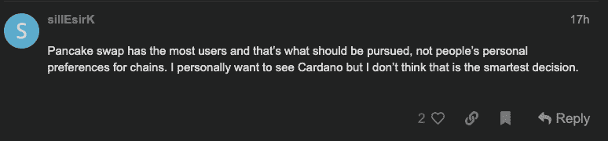
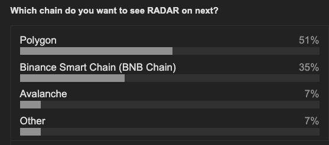
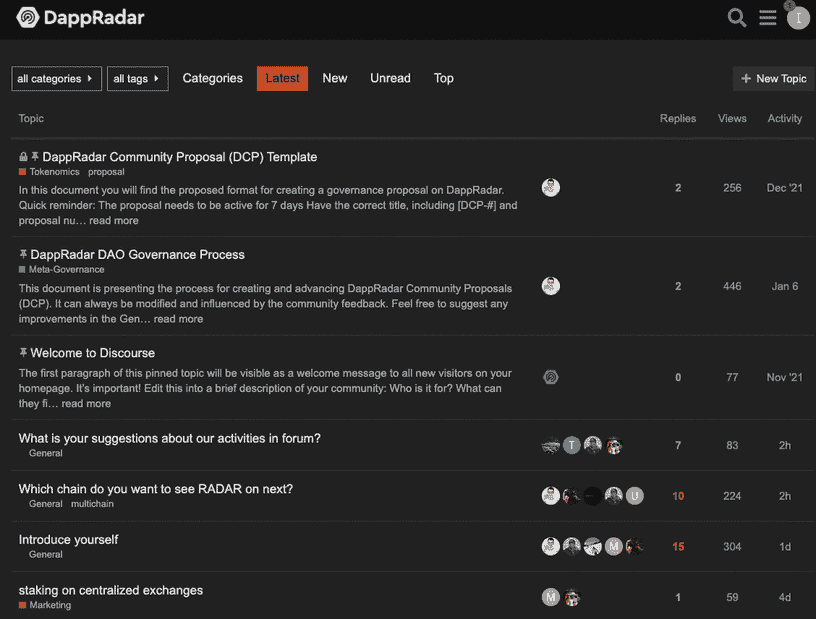

# 现在投票决定雷达是去 BSC、Polygon、Avalanche 还是另一个生态系统

> 原文：<https://web.archive.org/web/https://dappradar.com/blog/vote-now-on-whether-radar-goes-to-bsc-polygon-avalanche-or-another-ecosystem>

## 分散决策发生在 DappRadar 上

由你们 DappRadar 社区来决定雷达令牌的下一步是在 BSC、Polygon、Avalanche 还是其他地方。即使 DappRadar 跟踪超过 35 个区块链，用户也只能在以太坊上找到原生雷达令牌，但是雷达需要多链！

DappRadar 在四年前开始了它的旅程，追踪一些以太坊 dapps。快进到今天，我们是世界领先的 dapp 分析和分发网站，监控[超过 35 个区块链及其各自的生态系统](https://web.archive.org/web/20221227122613/https://dappradar.com/rankings)跨越数千个 dapp。

RADAR 是赋予社区成员影响 DappRadar 决策的令牌，于 2021 年 12 月作为以太坊上的 [ERC-20 令牌发布，可供](/web/20221227122613/https://dappradar.com/blog/what-is-the-difference-between-ethereum-and-bitcoin/)[以太坊 dapps](https://web.archive.org/web/20221227122613/https://dappradar.com/rankings/protocol/ethereum) 的用户认领。

RADAR 最终将部署在所有主要连锁店上，但我们希望从能给产品和组织带来最大利益的连锁店开始。[还鼓励投票者](https://web.archive.org/web/20221227122613/https://forum.dappradar.com/t/which-chain-do-you-want-to-see-radar-on-next/253/1)分享他们为什么认为在该链上部署雷达令牌会给生态系统、DAO 和社区带来好处。

## 关键点:

*   任何注册账户的人都可以记录投票并影响投票结果
*   选民不需要拿着雷达来登记投票
*   一旦正式起草，该提案将由雷达持有人投票表决

你希望在哪个链条上看到雷达？

## 有机会充分发表意见

投票已经开始几天了，社区已经倾向于在 Polygon next 上发布雷达，BNB 链目前排名第二。鉴于 [DappRadar 用户行为报告](/web/20221227122613/https://dappradar.com/blog/blockchain-user-behavior-report-nfts-games-less-sensitive-to-global-crypto-trends/)表明我们的大多数用户主要访问以太坊、币安和 Polygon dapps，这并不奇怪。

## 如何去爱

投票在可预见的未来是开放的，但我们鼓励人们尽快投票，因为一旦收集到足够的选票，投票将会关闭。

1.  进入 DappRadar 论坛[页面](https://web.archive.org/web/20221227122613/https://forum.dappradar.com/t/which-chain-do-you-want-to-see-radar-on-next/253/1)。
2.  如果您还没有帐户，请单击页面右上角的注册。
3.  如果是第一次注册，请转到您的邮箱并点击确认邮件。
4.  确认您的帐户，您将被引导[回到此页面](https://web.archive.org/web/20221227122613/https://forum.dappradar.com/)。
5.  单击“最新”选项卡，向下第五个是雷达投票–单击该选项卡。

1.  用户有四种选择，值得注意的是，一人一票。所以要让它有价值。
2.  如果你愿意，请留下评论，说明你为什么做出这样的选择。

## 雷达持有者的利益

如果你已经在以太坊把雷达当成 ERC-20，你可能会想，如果雷达在另一个链上发射，对你有什么好处。首先，雷达令牌持有者拥有一种特殊的影响力，我们认为你不应该认为这是理所当然的。此外，Polygon 或币安上的雷达意味着交易者可以一次性付费将其雷达连接到其他网络。然后通过 QuickSwap 和 PancakeSwap 等 dex 享受快速和廉价的交易和收益农业和赌注。

将代币引入新的生态系统可以刺激急需的交易量，这对稳定的价格增长至关重要。从长期来看，可用流动性和交易量的增加应该会对 RADAR 产生积极影响。

最后，一些交易者只坚持以太坊 dapps。其他人完全避免以太坊 dapps，而是更喜欢在币安和 Polygon 上进行交易。即由于这些链上涉及的成本低得多。雷达在这些链上变得可用，这为新的受众和潜在的索赔者打开了大门，他们在以太坊上等待更低的费用来提出索赔。

投票现已开始—[让你的声音](https://web.archive.org/web/20221227122613/https://forum.dappradar.com/t/which-chain-do-you-want-to-see-radar-on-next/253/1)塑造 DappRadar 的未来。此外，请记住，以太坊区块链[雷达空投令牌认领](https://web.archive.org/web/20221227122613/https://dappradar.com/token/overview)将在大约两周内关闭。

[<picture></picture>](https://web.archive.org/web/20221227122613/https://dappradar.com/token/airdrop)[<picture></picture>](https://web.archive.org/web/20221227122613/https://docs.dappradar.com/v/radar-token/radar-tokenomics )[<picture></picture>](https://web.archive.org/web/20221227122613/https://discord.gg/dappradar) NewsletterUnsubscribe at any time. [T&Cs](https://web.archive.org/web/20221227122613/https://dappradar.com/terms) and [Privacy Policy](https://web.archive.org/web/20221227122613/https://dappradar.com/privacy-policy)