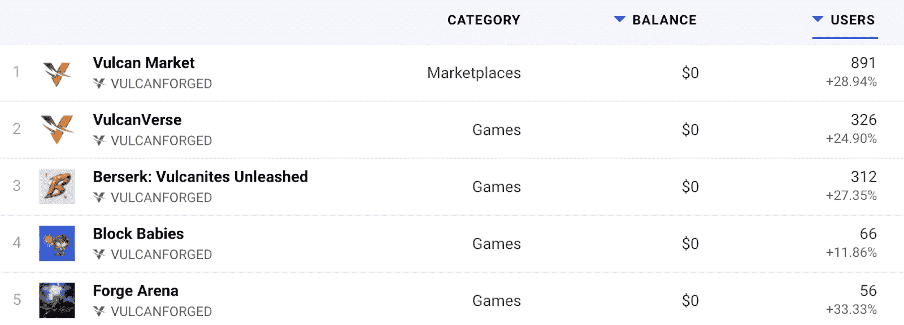
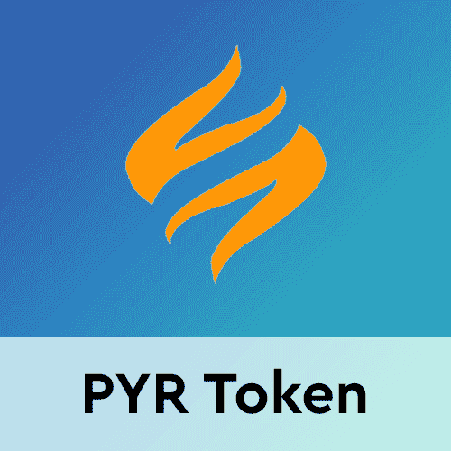
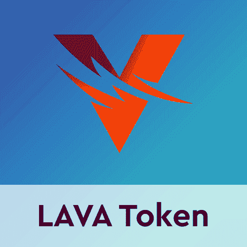

# 火神锻造用熔岩提升游戏盈利

> 原文：<https://web.archive.org/web/https://dappradar.com/blog/vulcan-forged-boosts-play-to-earn-with-lava>

## 在瓦肯锻造的生态系统中，通过无数的奖励途径获得熔岩

Vulcan Forged 是发展最快的游戏生态系统之一，二级本地令牌 LAVA 在该协议的成功中发挥了巨大作用。根据 [**DappRadar 数据**](https://web.archive.org/web/20220929042604/https://dappradar.com/rankings/protocol/vulcanforged) **显示，仅在过去的 24 小时内，火神锻造的生态系统就吸引了超过 1600 个独特的活跃钱包。**

在瓦肯锻造的生态系统中，从玩到赚的机制吸引了许多玩家。谢天谢地，Vulcan Forged 提供了各种有趣的 dapps。尽管生态系统中的所有 dapps 都经历了用户数量的增加，但 Forge Arena 表现突出。它的访客数量增加了 30%以上。

在过去的几个月里，随着越来越多的开发者转向游戏平台的这种奖励机制，游戏赚取运动已经稳步增长。所有连锁店的粉丝都享受着为他们在游戏中的努力赢得真正的金钱奖励的能力。

Vulcan Forged 是一个独特的游戏生态系统，依赖于两个本地令牌。这些代币促进了所有 dapps 的健康游戏体验。PYR 是瓦肯人锻造的生态系统中的主要象征。它在为供应链上的交易提供经济机制方面扮演着重要角色。另一方面，熔岩允许玩家在多个火神锻造的 dapps 上为他们的活动索取奖励。

## 在瓦肯锻造的生态系统中赚取熔岩

PYR 和熔岩都会在火神锻造上提供奖励机会。然而，虽然 PYR 被设计为购买物品和游戏相关的非功能性游戏的主要货币，熔岩是一个奖励令牌。

熔岩不仅允许玩家兑换游戏内奖励。这也给他们提供了一个提升游戏角色或购买新土地的机会。重要的是，瓦肯锻造团队设计了许多奖励途径，回馈玩家与生态系统中的 dapps 互动。火神锻造生态系统中的每一个 dapp 都让玩家获得熔岩。这意味着玩家在火神锻造的生态系统中与 dapps 互动越多，他们就会收到越多的熔岩。

目前，火神锻造的八个游戏中有三个启用了熔岩经验值奖励。在未来，该团队正在寻求融入更多的熔岩。他们将在生态系统中的更多 dapps 中引入 LAVA XP 奖励。更重要的是，Vulcan Forged 主办了类似于 [Cedalion program](https://web.archive.org/web/20220929042604/https://dappradar.com/blog/earn-lava-with-vulcan-forged-cedalion-program/) 的活动，并提供了更多赚取熔岩的机会。

随着 2022 年更多 dapps 的发射，DappRadar 将继续监测 Vulcan 锻造的生态系统。如果你想了解更多关于瓦肯锻造的 dapps，以及链条的原生令牌，请查看下面的链接。你也可以在 Twitter 上关注 DappRadar，了解最新的游戏新闻。或者，加入 DappRadar PRO，获得独家 Discord 频道和讨论。

[<picture></picture>](https://web.archive.org/web/20220929042604/https://dappradar.com/rankings/protocol/vulcanforged)[<picture></picture>](https://web.archive.org/web/20220929042604/https://dappradar.com/hub/token/polygon/PYR/USDC)[<picture></picture>](https://web.archive.org/web/20220929042604/https://dappradar.com/hub/token/polygon/LAVA/USDC?from=0xb4666B7402D287347DbBDC4EA5b30E80C376c0B3) NewsletterUnsubscribe at any time. [T&Cs](https://web.archive.org/web/20220929042604/https://dappradar.com/terms) and [Privacy Policy](https://web.archive.org/web/20220929042604/https://dappradar.com/privacy-policy)