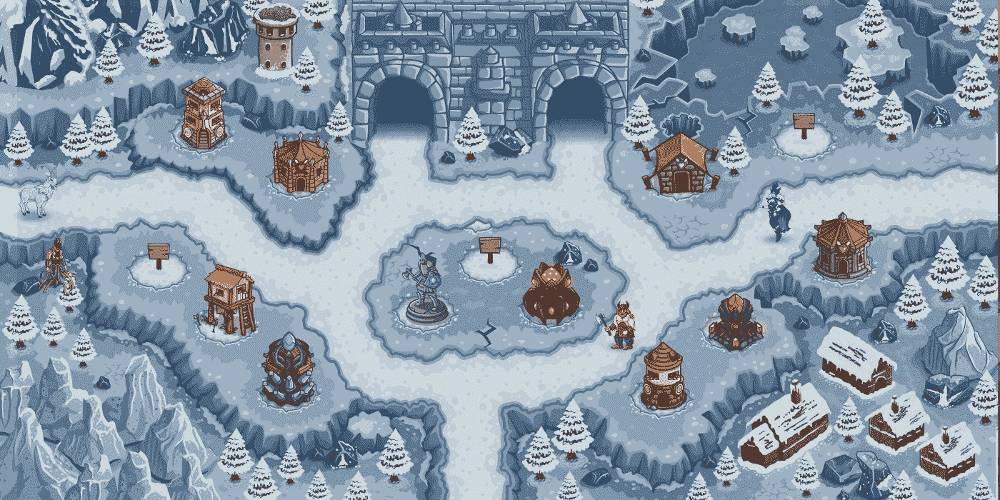
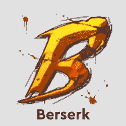

# 火神锻造狂乱通行证给更多玩家带来熔岩

> 原文：<https://web.archive.org/web/https://dappradar.com/blog/vulcan-forged-frenzy-pass-brings-lava-to-more-players>

## 三个以上的火神锻造游戏将带来熔岩奖励

火神锻造是区块链上最大的游戏生态系统之一，它的原生熔岩令牌是游戏赚取功能的重要元素。为了给更多的玩家带来“玩即赚”的游戏，火神锻造公司最近宣布了狂热通行证。

在狂热通行证机制之前，粉丝有机会通过类似狂战士的战斗类游戏赚取熔岩令牌。然而，本着游戏赚钱的真正精神，开发团队想出了一种方法，将熔岩奖励带到其他游戏中，如火神的塔防，神庙逃亡和地狱。

狂热通行证带来的是一种盈利机制，它计算玩家在游戏中每次“运行”的表现，并基于此奖励他们熔岩。像《狂战士》这样的战斗游戏允许一个更容易的基于胜率的赚钱机制。然而，有了新的狂热通行证，玩家将从他们在瓦肯锻造生态系统中的所有活动中受益。

## 火神锻造提升 PYR 效用

虽然熔岩是瓦肯人锻造的达普斯生态系统的主要奖励象征，但 PYR 在经济和治理方面也扮演着重要角色。为了给 PYR 持有者带来额外的效用，狂热通行证将用 PYR 代币购买。

重要的是，有两个不同层次的狂热通行证。每月狂热通行证将花费 1 PYR，并授予玩家在 30 天的有限时间内赚取权利。另一方面，希望永远受益于赚钱狂潮的玩家可以购买狂潮无限通行证。它没有截止日期。然而，无限通行证的价格是 10 PYR。

此外，狂热通行证计划也将有利于生态系统中的战斗风格的游戏。例如，拥有狂乱通行证的狂战士玩家将可以“租借”更高级别的狂战士卡，在更高级别的联赛中收获熔岩。

狂热通行证是一个创新的机制，将推动整个生态系统的游戏赚取机制。此外，它将提高熔岩和 PYR 的效用。火神锻造是区块链最受欢迎的游戏工作室之一，他们的游戏每月吸引数百名玩家。随着狂热通行证的通过，所有这些玩家现在都离赢得游戏的真正价值奖励更近了一步。

随着更多关于疯狂山口的细节浮出水面，达普雷达将继续监视瓦肯锻造的生态系统。要了解更多关于《火神锻造》及其游戏的信息，请查看他们的官方 [DappRadar 排名页面](https://web.archive.org/web/20220929111536/https://dappradar.com/rankings/protocol/vulcanforged)。此外，你可以在他们的[官方推特账号](https://web.archive.org/web/20220929111536/https://twitter.com/VulcanForged)上阅读更多关于 Vulcan 伪造的狂热通行证和玩赚游戏的信息。

[<picture></picture>](https://web.archive.org/web/20220929111536/https://dappradar.com/vulcanforged/games/berserk-vulcanites-unleashed)[<picture></picture>](https://web.archive.org/web/20220929111536/https://dappradar.com/vulcanforged/games/forge-arena)[<picture></picture>](https://web.archive.org/web/20220929111536/https://dappradar.com/vulcanforged/games/vulcanverse) NewsletterUnsubscribe at any time. [T&Cs](https://web.archive.org/web/20220929111536/https://dappradar.com/terms) and [Privacy Policy](https://web.archive.org/web/20220929111536/https://dappradar.com/privacy-policy)