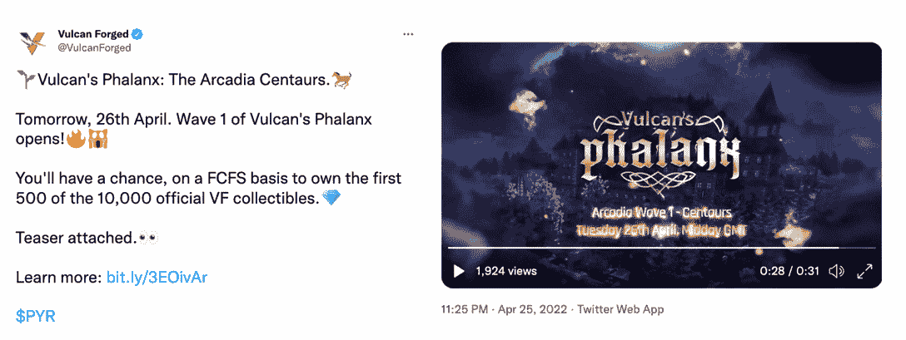
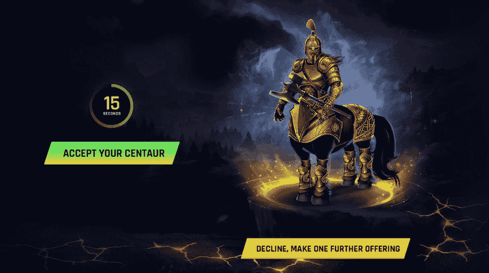

# 火神的 NFT 替身方阵增加了收益

> 原文：<https://web.archive.org/web/https://dappradar.com/blog/vulcans-phalanx-nft-avatars-give-earnings-a-boost>

## 这些独特的 NFT 游戏头像可以增加你的熔岩收入，提高游戏中的技能

4 月 26 日，火神锻造公司公布了第一批方阵 NFT 头像，首批发布了 500 个独特的半人马。这些 NFT 允许玩家增加他们的收入，同时也为他们提供了增强的游戏选项。要获得一个，玩家需要支付 25 个 PYR 代币。

**总结**

*   **[火神锻造](https://web.archive.org/web/20221207011003/https://dappradar.com/rankings/protocol/vulcanforged)为其唯一的头像系列——方阵 NFTs——引入了五波铸造工艺。**
*   这些 NFT 化身的收藏可以让他们的持有者受益匪浅，包括赌注倍增、游戏内统计数据增加以及更多 NFT 掉落的机会。
*   第一波铸造开始于四月，结束于八月。

自 2020 年底以来，NFT 头像点燃了一股热潮。各种 NFT 头像收藏已经出现了数百万美元的交易量。加密倡导者认为，NFT 头像将在许多方面扰乱当前的业务运营方式。然而，随着巨额财富涌入这一新兴行业，大多数 NFT 头像不过是价格过高的 jpegs 图片。幸运的是，变化正在发生。专注于游戏的区块链和生态系统 Vulcan forced 将通过推出 Vulcan Forged Phalanx 系列为 NFT 化身注入活力。

## 什么是火神锻造方阵？

火神锻造方阵是一个 NFT 收藏，由 10，000 个独特的收藏头像组成。他们来自不同的部落，每个部落都有不同的技能和能力，从普通的到传奇的。值得一提的是，每个半人马都是独一无二的，但有些会带有更稀有的物品，更稀有的物品可能会带来更好的额外津贴。

Vulcan Forged 致力于为 NFT 和游戏爱好者提供最具创新性的 dapps，提供极致的用户体验。长枪系列是瓦肯锻造团队将想法付诸实践的又一个绝佳范例。因此，方阵 NFT 可以为瓦肯锻造的生态系统增添活力。

*   在瓦肯锻造生态系统中，方阵 NFT 是你的“我的锻造”档案的唯一化身。
*   他们为球员提供了一个稍微好一点的 NFT 掉落的机会。
*   这些 NFT 可以提高玩家在游戏中的统计数据。
*   它们为熔岩打桩提供了一个乘数。
*   拥有稀有物品的头像可以进一步增加玩家的游戏属性。

## 如何铸造第一波方阵

第一波方阵 NFT 头像由 2000 个代币组成，铸造期从 4 月到 8 月，4 月的 NFT 人物是半人马。要获得这些神话战士，用户首先需要[去官网](https://web.archive.org/web/20221207011003/https://phalanx.vulcanforged.com/)支付 25 PYR。这将允许他们铸造一个半人马。之后，系统会随机生成一个角色。此时，用户可以选择接受这个半人马或者支付 5 PYR 再掷一次骰子——但是他们只能重掷一次。NFTs 的铸造以先到先得的方式进行，并已于 4 月 26 日开始。

瓦肯锻造团队正在努力为方阵非战斗部队带来更多的额外津贴和用例。如果你想知道更多关于铸造时间表、津贴细节和不断发展的角色属性，请关注以下频道的《瓦肯锻造》。

链接:

[不和谐](https://web.archive.org/web/20221207011003/https://discord.gg/vulcanverse)
[推特](https://web.archive.org/web/20221207011003/http://twitter.com/vulcanforged)
[中](https://web.archive.org/web/20221207011003/http://vulcanforgedco.medium.com/)
[电报](https://web.archive.org/web/20221207011003/http://tg.me/veriarti)