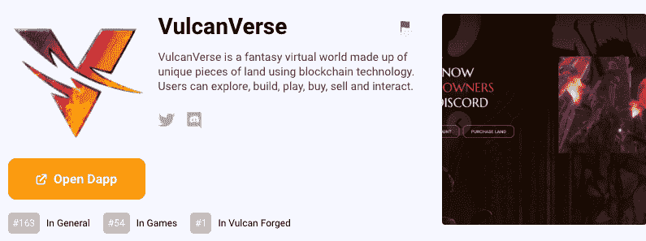

# Vulcan varse ama–dappdays 亮点

> 原文：<https://web.archive.org/web/https://dappradar.com/blog/vulcanverse-ama-dappdays-highlights>

## 土地桩，NFTs，极乐世界，实施战斗系统，以及更多来自瓦肯诗句。

8 月 11 日，作为我们 DappDays 庆祝周的一部分，DappRadar 接受了 VulcanVerse 的采访。

VulcanVerse 是一款大型多人在线角色扮演游戏，简称 MMORPG。幻想游戏是火神锻造生态系统的一部分，还有各种游戏和一个 [NFT 市场](https://web.archive.org/web/20220926010305/https://dappradar.com/nft/marketplaces)。在这个生态系统经济中，玩家可以交易他们在游戏中的资源和资产。

[<picture></picture>](https://web.archive.org/web/20220926010305/https://dappradar.com/vulcanforged/games/vulcanverse)

## 瓦肯星系的经济是如何运作的？

> [PYR](https://web.archive.org/web/20220926010305/https://dappradar.com/hub/token/eth/PYR/ETH?from=0x430ef9263e76dae63c84292c3409d61c598e9682) 是我们的主要标志，用于我们的市场，我们的 Vulcan DEX，一旦我们上线，它将很快更名为 Elysium Swap。在 Vulcan DEX 上，您可以为 Vulcan Forged 项目和第三方项目投资流动性对。
> 
> 你将奖励游戏中使用的有价值的资产，而不是通货膨胀，这也让人们接触到我们生态系统中的其他项目。
> 
> Jason McIvor

## 土地桩是如何工作的？

如果你是 [VulcanVerse](https://web.archive.org/web/20220926010305/https://vv.vulcanforged.com/) 的土地所有者，你可以通过锁定你的 PYR 获得赌注奖励来参与土地赌注过程。

> 想要平整土地的玩家必须在 PYR 下注来平整他们的土地，并且在新的资产被开发时，两次平整之间有一段很长的时间。基本上，当我们到达 3 级资产释放，我们打开 3 级土地桩。
> 
> Jason McIvor

## VulcanVerse 上有哪些 NFT？

受火神节希腊罗马时代启发的元宇宙提供了许多参与的角度。你可以作为土地所有者、玩家、stavuker 和流动性提供者参与 VulcanVerse。此外，通过 Cedalion 奖学金计划，该游戏有许多对土地所有者和非所有者都有潜在利润的 NFT。

> 我们有土地让所有者进入瓦肯星系。你也可以根据我们奖学金项目的收入份额从所有者那里租用土地。我们也有火神，这在很多火神锻造游戏中都有使用。
> 
> 在 VulcanVerse 里面，他们是允许用户打草料的，我们也为他们准备了一个新的改进的间谍元素。然后我们有了 NFT 神，他们为游戏性和收入潜力增加了很多好处，对于游戏本身来说，他们允许某些用户独家访问视觉资产，只有当你拥有特定的神时，你才能在你的土地上放置这些资产。NFT 服装、NFT 大厦资产、钓鱼竿等。
> 
> Jason McIvor & Christina Zafirakis

观看 AMA，了解更多关于 VulcanVerse 激动人心的路线图！

[https://web.archive.org/web/20220926010305if_/https://www.youtube.com/embed/T-ByPiUSTlc?feature=oembed](https://web.archive.org/web/20220926010305if_/https://www.youtube.com/embed/T-ByPiUSTlc?feature=oembed)

## 时间戳

[00:00](https://web.archive.org/web/20220926010305/https://www.youtube.com/watch?v=T-ByPiUSTlc)–简介

[07:55](https://web.archive.org/web/20220926010305/https://www.youtube.com/watch?v=T-ByPiUSTlc)–Vulcan verse 拖车

[10:09](https://web.archive.org/web/20220926010305/https://www.youtube.com/watch?v=T-ByPiUSTlc)–预告片说明

[12:42](https://web.archive.org/web/20220926010305/https://www.youtube.com/watch?v=T-ByPiUSTlc)–你如何看待以游戏赚钱作为一种商业模式？

[15:05](https://web.archive.org/web/20220926010305/https://www.youtube.com/watch?v=T-ByPiUSTlc)–玩赢与玩赢

[16:36](https://web.archive.org/web/20220926010305/https://www.youtube.com/watch?v=T-ByPiUSTlc)–所有权的重要性

[17:21](https://web.archive.org/web/20220926010305/https://www.youtube.com/watch?v=T-ByPiUSTlc)–Vulcan verse 经济

[18:10](https://web.archive.org/web/20220926010305/https://www.youtube.com/watch?v=T-ByPiUSTlc)–土地标桩

[18:41](https://web.archive.org/web/20220926010305/https://www.youtube.com/watch?v=T-ByPiUSTlc) – Lava Token

[19:38](https://web.archive.org/web/20220926010305/https://www.youtube.com/watch?v=T-ByPiUSTlc)–Vulcan verse 上的 NFTs

[20:00](https://web.archive.org/web/20220926010305/https://www.youtube.com/watch?v=T-ByPiUSTlc)–你如何降低进入门槛？

[26:15](https://web.archive.org/web/20220926010305/https://www.youtube.com/watch?v=T-ByPiUSTlc)–任务是如何进行的？

[32:26](https://web.archive.org/web/20220926010305/https://www.youtube.com/watch?v=T-ByPiUSTlc)–玩家可以将 VulcanVerse 的哪些方面带入其他 Vulcan 锻造的生态系统？

每个游戏中都有熔岩池吗？

[38:01](https://web.archive.org/web/20220926010305/https://www.youtube.com/watch?v=T-ByPiUSTlc)–极乐世界是什么？

[47:00](https://web.archive.org/web/20220926010305/https://www.youtube.com/watch?v=T-ByPiUSTlc)–路线图

## 感兴趣的链接

[什么是 VulcanVerse？介绍](https://web.archive.org/web/20220926010305/https://dappradar.com/blog/what-is-vulcanverse-an-introduction)

[如何入门 VulcanVerse？](https://web.archive.org/web/20220926010305/https://dappradar.com/blog/how-to-get-started-with-vulcanverse)

[如何参与价值 300 万美元的 VulcanVerse Land Staking？](https://web.archive.org/web/20220926010305/https://dappradar.com/blog/how-to-participate-in-the-3m-vulcanverse-land-staking)