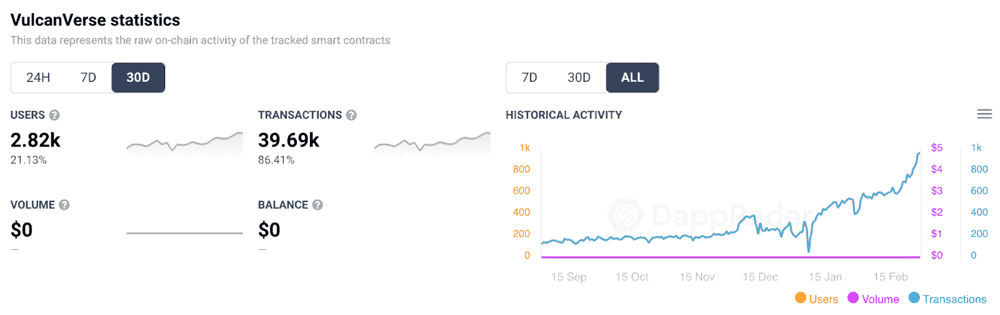
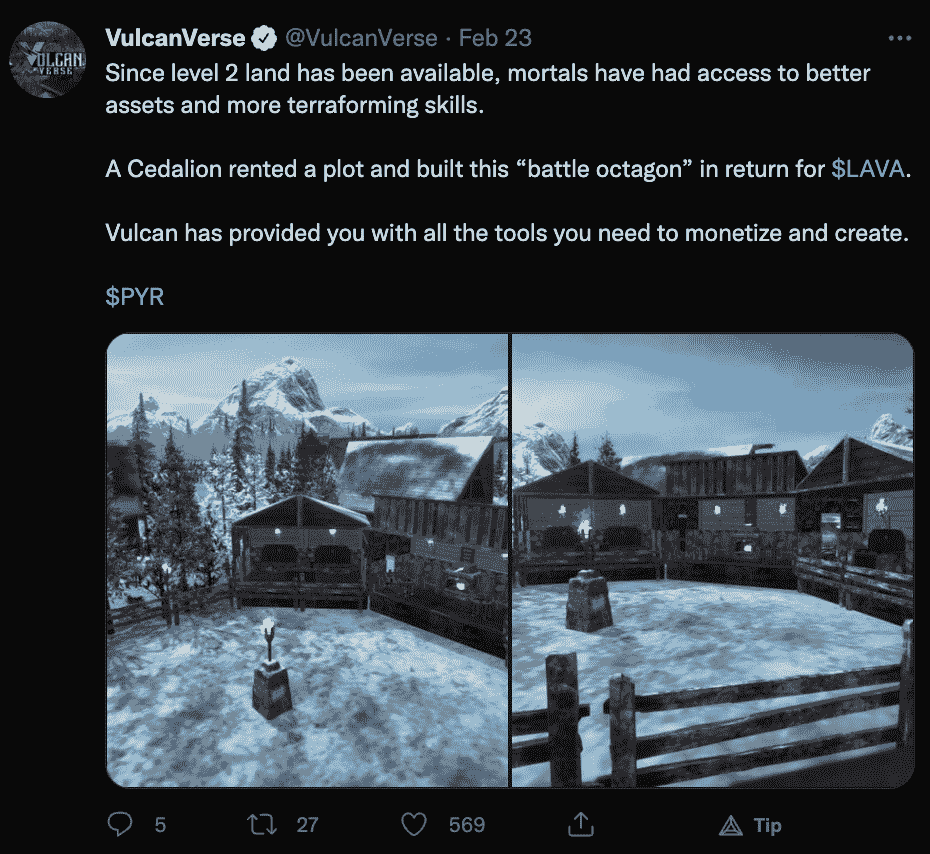
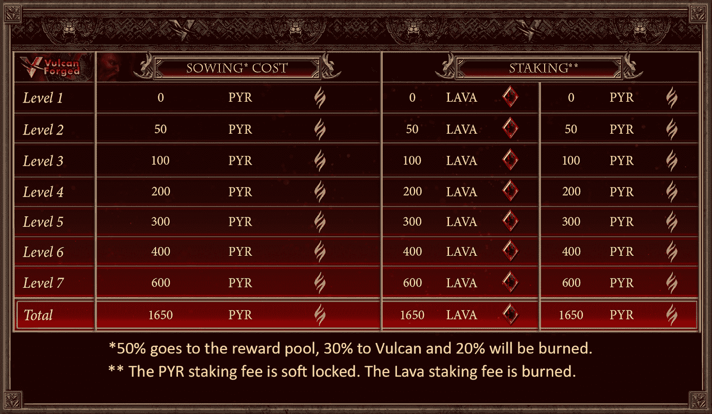
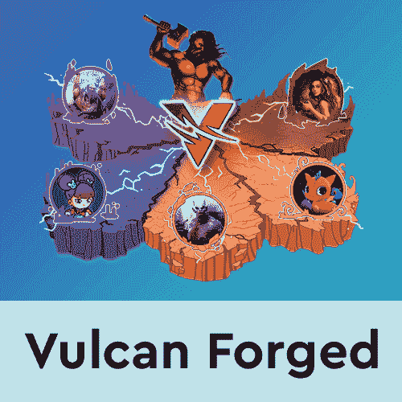

# vulcanvarse 在 2 月份将用户基数提高了 20%

> 原文：<https://web.archive.org/web/https://dappradar.com/blog/vulcanverse-boosts-user-base-20-in-february>

## 玩家现在可以获得 2 级土地和更好的物品

在过去的 30 天里，VulcanVerse 吸引了超过 2，800 个不同的活跃钱包，将其用户群提高了近 20%。该平台上的这种活动高峰主要是由于最近推出的 2 级陆地 NFTs。

与游戏互动的活跃钱包的增加也导致了处理交易数量的增加。二月份， [VulcanVerse](https://web.archive.org/web/20221001231912/https://dappradar.com/vulcanforged/games/vulcanverse) 智能合约处理了近 40，000 笔交易。这是意料之中的，因为游戏中的许多动作都作为交易记录在链上。无论你购买新的土地，新的物品或角色，或者你建立你的游戏世界，这些行为都成为区块链交易。

在过去的三十天里，VulcanVerse 是 Vulcan Forged 生态系统中访问量第三大的 dapp。活动的激增是游戏背后的开发者引入的几个重要更新的结果。

这些更新中最重要的是推出二级地块。这些情节给了创作者和玩家更多的机会和灵活性，在 VulcanVerse 创造新的领域和定制的体验。例如，一个玩家创造了一个八角战斗竞技场，这反过来奖励他熔岩令牌。

除了 2 级土地，VulcanVerse 团队在整个 2 月发布了一系列更新和新功能，对活动也有积极的影响。其中包括推出火山石租赁和引入火山石防御技能。重要的是，防御技能允许玩家保护他们的土地，并阻止其他火神在那里觅食。

## 在 VulcanVerse 上玩到赢

瓦肯锻造的生态系统提供了一系列激动人心的游戏赚钱机会，瓦肯宇宙就是其中之一。土地所有者在游戏中的活动可以获得熔岩奖励。重要的是，为了升级你的土地并开始获得更多的熔岩，你需要先播种。这需要一次性投资 PYR 代币，这是瓦肯锻造生态系统的原生货币。

一旦土地播种，20 天的冷却期结束，玩家有机会升级和提高他们的地块。这反过来会带来更多的熔岩赌注奖励。查看下表，了解每升一级奖励池增加多少。

值得注意的是，VulcanVerse 仍处于测试模式。这意味着有更多令人兴奋的功能和更新，玩家必须留意，尤其是一旦整个游戏正式推出。

如果你想了解更多关于 VulcanVerse 和整个 Vulcan 锻造的 dapps 生态系统的信息，请查看下面的链接。此外，你可以在 [Twitter](https://web.archive.org/web/20221001231912/https://twitter.com/dappradar) 上关注 DappRadar，并加入我们的 [Discord](https://web.archive.org/web/20221001231912/https://discord.gg/4ybbssrHkm) 社区，首先了解最新的游戏赚钱新闻。

[<picture></picture>](https://web.archive.org/web/20221001231912/https://dappradar.com/rankings/protocol/vulcanforged)[<picture></picture>](https://web.archive.org/web/20221001231912/https://dappradar.com/hub/token/polygon/PYR/USDC)[<picture></picture>](https://web.archive.org/web/20221001231912/https://dappradar.com/hub/token/polygon/LAVA/USDC?from=0xb4666B7402D287347DbBDC4EA5b30E80C376c0B3) NewsletterUnsubscribe at any time. [T&Cs](https://web.archive.org/web/20221001231912/https://dappradar.com/terms) and [Privacy Policy](https://web.archive.org/web/20221001231912/https://dappradar.com/privacy-policy)