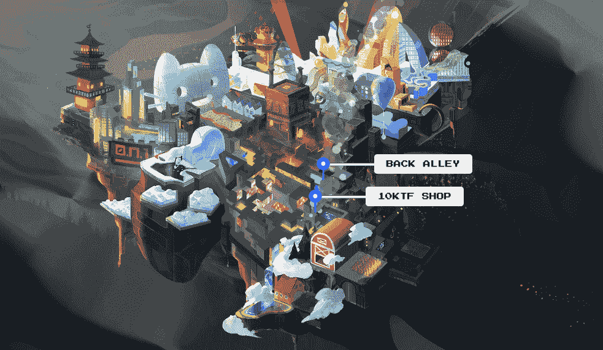

# Wagmi-san 的 Digiphysical Shop 10KTF 实现了 1000%的交易增长

> 原文：<https://web.archive.org/web/https://dappradar.com/blog/wagmi-sans-digiphysical-shop-10ktf-blows-up-1000-trading-increase>

## Wagmi-san 是一位以精致配饰闻名的工匠

10KTF 是一家由虚构人物 Wagmi-san 经营的精品数码商店。最近，它在交易量、交易者数量和销售额方面取得了惊人的增长。它最近的流行可能是由于各种原因。

**概要:**

*   [**10KTF**](https://web.archive.org/web/20221127143403/https://dappradar.com/ethereum/collectibles/10ktf) **是一家精品数码店，在元宇宙一个叫新东京的城市里有一个虚构的店主。**
*   **为选中的系列打造专属周边 NFT，包括** [**【无聊猿游艇俱乐部】**](https://web.archive.org/web/20221127143403/https://dappradar.com/ethereum/collectibles/bored-ape-yacht-club)**[**酷猫**](https://web.archive.org/web/20221127143403/https://dappradar.com/ethereum/collectibles/cool-cats)**[**女人的世界**](https://web.archive.org/web/20221127143403/https://dappradar.com/ethereum/collectibles/world-of-women) **。******
*   ****到目前为止，Wagmi-san 已经发布了几个系列，最初的系列以 1.285 瑞士法郎的底价交易。****
*   ****最近，10KTF 与古驰合作了一个特殊系列，目前的交易价格为 1.49 ETH。****

 ****看到非主流的 NFT 收藏品在激烈的竞争中杀出一条血路总是令人兴奋的。在 DappRadar 的 NFT 排行榜上，Wagmi-san 今天备受瞩目，交易量在过去 24 小时内飙升了 1000%以上，记录了 513 名交易者和 553 笔交易。

## 10KTF 是什么，Wagami-san 是谁？

10KTF 项目可以追溯到 2021 年 9 月，当时它首次开始在 Twitter 上披露信息。这是一家位于虚拟城市新东京的数码商店。店主是一位名叫 Wagmi 的老绅士，他为著名的 NFT 项目制作手工配件，如 Bored Ape Yacht Club、Cool Cats、0N1 Force 等。最早的藏品目前的起拍价为 1.45 ETH。与此同时，24 小时交易量达到 258 万美元，而该项目的交易量达到了 5886 ETH(1700 万美元)。

Source: OpenSea

10KTF 的主角以密码缩写 Wagmi 命名，代表“我们会成功的”。加密社区广泛使用建立信心和保持希望的缩写。在日语中，三是对某人的尊称。因此，产生了 Wagmi-san 这个别名。

10KTF 官网上展示的新东京世界，描绘了一个非常像吉卜力工作室电影《千与千寻》中的世界。住在这座城市的 Wagmi-san 是一位受人尊敬的世界著名工匠，他为精选系列打造专属周边 NFT。

## 10KTF 的故事情节随着时间的推移而展开

Wagmi-san 的第一个系列仅面向[酷猫](https://web.archive.org/web/20221127143403/https://dappradar.com/ethereum/collectibles/cool-cats)、[矮胖企鹅](https://web.archive.org/web/20221127143403/https://dappradar.com/ethereum/collectibles/pudgy-penguins)、[无聊猿游艇俱乐部](https://web.archive.org/web/20221127143403/https://dappradar.com/ethereum/collectibles/bored-ape-yacht-club)、[变异猿游艇俱乐部](https://web.archive.org/web/20221127143403/https://dappradar.com/ethereum/collectibles/mutant-ape-yacht-club)(仅限 1-10K)、[女人世界](https://web.archive.org/web/20221127143403/https://dappradar.com/ethereum/collectibles/world-of-women)、[无聊猿养狗俱乐部](https://web.archive.org/web/20221127143403/https://dappradar.com/ethereum/collectibles/bored-ape-kennel-club)和 [0n1 力量](https://web.archive.org/web/20221127143403/https://dappradar.com/ethereum/collectibles/0n1-force)的主人。它们由创世纪版本的 Wagmi-san 数字工匠工艺品组成。

后来，10KTF 业主收到了 Wagmi-san 空投。这些空投物资包含铸造或制作一种独特的 NFT 服装系列“空白”所需的材料和工具。2022 年 3 月下旬，时装品牌古驰加入和歌山，在新东京市展开合作。收藏家们现在可以用带有古驰标志的时装来装饰他们的照片样张。目前，10KTF 古驰圣杯收藏的底价为 1.34 ETH，累计交易量为 2,600 ETH。

## 即将到来的下降推动 10KTF 的受欢迎程度

古驰可能会增加最近 10KTF 的牵引力。但是，也许该项目的巨大增长的真正驱动力是即将到来的下降。根据项目的[时间表](https://web.archive.org/web/20221127143403/https://10ktf.com/timeline)，10KTF 业主将掉落实物。它包括古驰时尚产品吗？我们还不知道，但这绝对值得期待。

此外，Boss_Taoz 的服装和配饰正在进行中，Wagmi-san 也向 NFT 世界的新宠 [Moonbirds](https://web.archive.org/web/20221127143403/https://dappradar.com/ethereum/collectibles/moonbirds) 发出了邀请。毫无疑问，Wagmi-san 的独立时装店正在以前所未有的速度扩张，它的目标是通过其跨界战略成为元宇宙的至尊。
dapradar 将继续监视 Wagmi-san 的 10KTF 的最新进展。在[推特](https://web.archive.org/web/20221127143403/https://twitter.com/dappradar)、[不和谐](https://web.archive.org/web/20221127143403/https://discord.gg/4ybbssrHkm)和 [Youtube](https://web.archive.org/web/20221127143403/https://www.youtube.com/c/DappRadar) 上关注我们，跟上区块链世界的动态。****