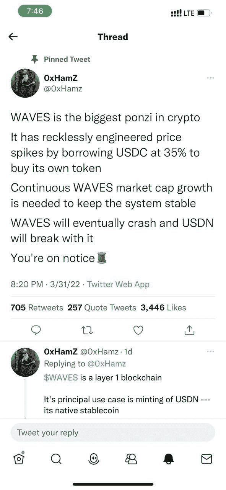
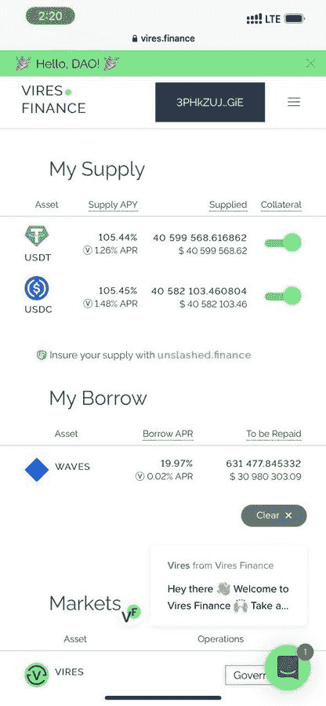
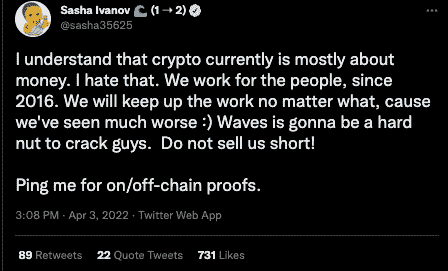
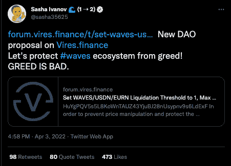
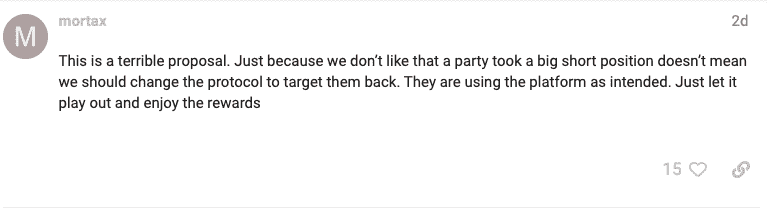
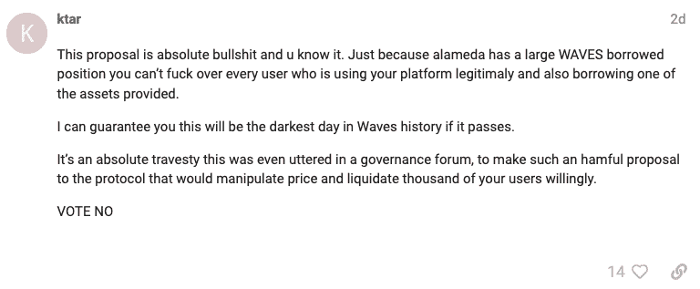
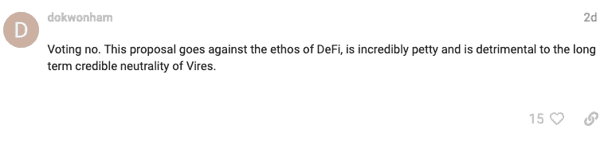

# Waves 首席执行官在价格操纵指控中向阿拉米达研究公司开火

> 原文：<https://web.archive.org/web/https://dappradar.com/blog/waves-ceo-fires-shots-at-alameda-research-amidst-price-manipulation-allegations>

## “俄罗斯以太坊”的本地代币在过去 30 天里上涨了 99%

WAVES 首席执行官萨沙·伊万诺夫(Sasha Ivanov)在接受采访时发表的一篇文章似乎暗示 Waves 在 Waves 最近的价格上涨中扮演了某种角色，之后他在 Twitter 上回击了价格操纵的指控。之后，Ivanov 声称 Alameda Research 操纵了 WAVES 价格，并组织了一些活动来引发恐慌抛售 WAVES，以从空头头寸中获利。阿拉米达否认了这些指控。

## 摘要

*   Waves 区块链的创始人 Sasha Ivanov 对交易公司 Alameda 提出了指控，但该公司否认了一切。
*   一项针对阿拉米达的提案已经提交给 Waves governance forum。

## 背景故事

关于彭博的文章暗示 Waves 最近的价格上涨与俄乌战争有某种联系。它还提到了 2 月 23 日冲突开始前一天发生在 FTX 交易所的一笔交易。

在文章中，伊万诺夫将[波的强烈增长](https://web.archive.org/web/20221129140550/https://dappradar.com/rankings/protocol/waves)归因于几个锚点。其中包括推出其美国公司“成长中的 TVL”，以及发布新的路线图。他进一步提到，一年多前，Waves 就已经与俄罗斯撇清了关系。此外，他是乌克兰后裔，而不是许多人认为的俄罗斯人。3 月 31 日，当一名旁观者在[的一条推文开始获得关注时，它进一步升级，引发了从威里斯金融公司撤出流动性。](https://web.archive.org/web/20221129140550/https://twitter.com/sasha35625/status/1510589969521422339/photo/1)

采访者问伊万诺夫是否与 FTX 的交易有关。然而，由于 FTX 在以太网上有一个 WAVES native token 的包装版本，Ivanov 被这个问题吓呆了。他公开表示，他不相信也不追随非本土代币，只创造了包装以太坊版本，让 WAVES 在 FTX 上市，并收取 150 万美元的上市费。

## 事情变得复杂了

这时爆米花出来了，整个崩溃变得更有趣了。Waves 声称他们从不出售或出租 WAVES T1，这促使 Ivanov 考虑谁可以借 WAVES T3 给 T2。搜寻开始了，他的发现让他相信有更强大的力量在起作用。他声称，一个阿拉米达研究公司的电子邮件账户和钱包地址在 3 月 20 日左右开始借用 WAVES。然后[把它送到币安](https://web.archive.org/web/20221129140550/https://wavesexplorer.com/address/3PHkZUJpS3AfmnXBNLCBmpqL25GJZb1hGiE/tx)，推测是为了出售和降低价格。这大约与 FUD 竞选活动开始的时间相同。FUD 意味着恐惧、不确定和怀疑，我们可以用普通语言将其翻译为宣传。

**email**: [[email protected]](/web/20221129140550/https://dappradar.com/cdn-cgi/l/email-protection) verified
**address**: 3PHkZUJpS3AfmnXBNLCBmpqL25GJZb1hGiE

那么这一切意味着什么呢？Ivanov 与 Alameda Research 关联的账户是第一个推高 FTX 价格的账户，但在平仓获利后，随后的做空交易失败了，因为价格一直在上涨。伊万诺夫声称，需要借款和 FUD 来压低价格，使卖空交易再次有利可图。伊万诺夫以下面的话结束了他的推特帖子。

## 还能是什么？

阿拉米达确实揭示了可能发生了什么的线索，同时又置身于讨论之外。“人们现在应该看看 WAVES 的融资利率，”阿拉米达联合首席执行官萨姆·特拉布科在推特上说。

为了澄清他的意思，融资利率是支付给持有多头或空头头寸的交易者的金额。基本上，如果大部分参与者做多，那么他们会向做空者支付少量的未平仓交易。当这种情况发生时，融资利率可能会上升，并为做空代币的人提供潜在的资金来源——这是一种广泛使用的机制，旨在使永久代币的价格与现货价格保持一致。

在这一事件中，融资利率为负，因此可以想象阿拉米达采取了长期立场，以利用高负利率。然而，一种常见的策略是通过在现货市场出售代币来对冲头寸。如果阿拉米达这么做了，他们就能从融资利率中获得收益，同时将风险降至最低。

## 新的治理提案针对阿拉米达

尽管有上面提到的反复，一个新的治理提议还是出现了。这一提议得到了萨沙·伊万诺夫的支持，并将阿拉米达置于其关注的焦点。为了瞄准阿拉米达的资金，该提案要求社区投票决定所有借入 WAVES 和 USDN 的人的清算率为 0.1%。USDN 是一种稳定的货币，由 Vires Finance 上的 WAVES token 支持，这是 WAVES 上最大的贷款协议。

该提案的内容意味着，如果它成功通过，阿拉米达将不得不购买约 650，000 波，或价值约 3000 万美元，以保持其地位。对伊万诺夫来说，该提议足以清算那些做空者，因为 0.1%的低清算率将迫使卖空者停止交易。此外，该提议意味着，只要 WAVES 价格稍有波动，任何有贷款权限的人都会立即平仓。

然而，Waves 社区对这个提议并不感到兴奋。大多数人在治理平台上表达他们的感受[。压倒一切的共识是，如果该提案获得通过，将会对金融机构的使用者造成伤害，他们将承受清算的大部分冲击。这一举动也可能使越权成为一项正在向前推进的死亡议定书。此外，社区很快指出该提议违背了分散金融的精神。](https://web.archive.org/web/20221129140550/https://forum.vires.finance/t/set-waves-usdn-eurn-liquidation-threshold-to-1-max-borrow-apr-for-all-assets-to-400/128)

## 越来越糟

在所有这些敌意中，更糟糕的是，美元支持的 Waves 稳定的美元在 4 月 3 日失去了与美元的联系，然后在 4 月 4 日大幅下跌。跌至最低点时仅为 0.82 美元，此后略有回升，截至发稿时约为 0.92 美元(T1)，标志着复苏。

Waves 提出的建议是这种失败的挂钩的主要驱动力，因为网络及其稳定的核心的不确定性在增加。然而，另一个巨大的原因似乎是几周前做出的一项修改，限制特定交易商在 WAVES 和 USDN 之间进行直接互换。现在，只有持有大量 NSBT(中微子的治理令牌)的交易者，才能在不需要交易所流动性的情况下，在他们之间互换令牌。

## 敬请期待

这一事件看起来远没有结束，我们将继续为您带来更新和治理提案的结果。现在，你可以在 DappRadar 上[跟踪和分析 Waves dapp](https://web.archive.org/web/20221129140550/https://dappradar.com/rankings/protocol/waves)，包括[的权限财务](https://web.archive.org/web/20221129140550/https://dappradar.com/waves/defi/vires-finance)。

 NewsletterUnsubscribe at any time. [T&Cs](https://web.archive.org/web/20221129140550/https://dappradar.com/terms) and [Privacy Policy](https://web.archive.org/web/20221129140550/https://dappradar.com/privacy-policy)

***以上不构成投资建议。此处给出的信息仅供参考。请行使尽职调查，做你的研究。作者持有多种加密货币的头寸，包括 BTC、瑞士法郎和雷达。***