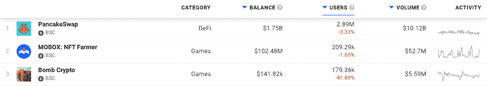
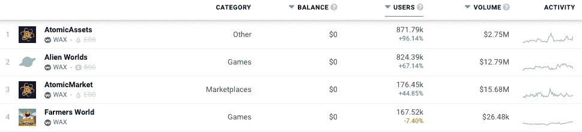
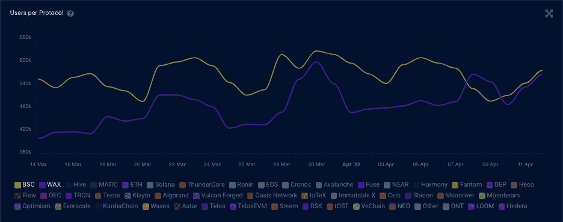
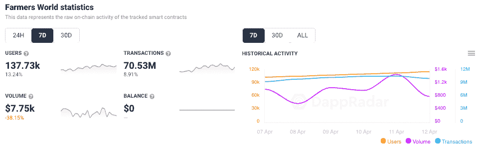
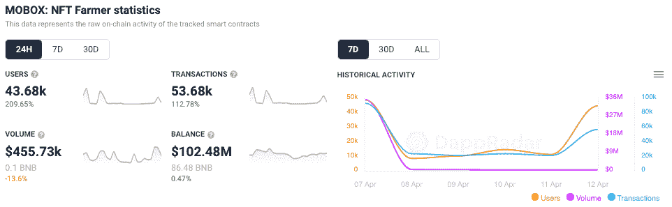
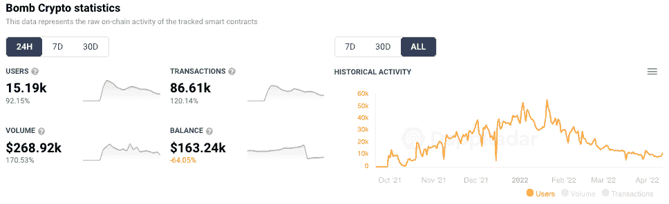

# WAX 和 BNB 连锁店争夺活跃用户

> 原文：<https://web.archive.org/web/https://dappradar.com/blog/wax-and-bnb-chain-fight-it-out-for-active-users>

## 这两家连锁店每天吸引超过一百万的活跃用户

BNB 连锁店和 Wax 陷入了一场势均力敌的战斗，每个网络每天吸引超过 50 万活跃用户到它的各种 dapps。这两个网络严重依赖游戏 dapp，随着区块链游戏继续在行业内引领 dapp 的使用，DeFi 机制被融入进来以吸引新用户。

## 摘要

*   **WAX 和 BNB 连锁店每天都吸引大约 50 万个不同的活跃钱包**
*   **游戏 dapps 领先使用，少数是最主要的力量**
*   《蜡像》的新版本可能会超过 BNB 链

当大多数人的目光仍然锁定在 TVL 和最高价值的 NFT 销售额时，另一场战争正在激烈进行，以吸引最独特的活跃钱包。唯一活跃钱包是区块链空间中广泛用于测量 dapp 使用的指标。但是，钱包不是人。相反，钱包是由一个人控制的区块链地址，一个人可以有不止一个钱包。尽管存在细微差别，但在两大领先电视网一决雌雄之际，这些数字令人印象深刻。

在过去的 12 个月里，BNB 连锁店一直保持着对 Wax 的优势，但拐点正在出现，如果 Wax 的领先 dapps 能够继续推动更多的用户，它似乎将扭转这一趋势。

## **Wax 有一个越来越大的游戏库**

在过去的 30 天里，BNB 链上连接钱包数量排名前三的 dapps 是 PancakeSwap、Mobox NFT Famer 和 Bomb Crypto。这三者都包括游戏化、NFTs 和 DeFi 的元素。这三个 dapp 占每天与 BNB 连锁 dapp 互动的活跃钱包的大约 35 万。

Wax 的情况略有不同，这四家顶级 dapps 都涉足游戏和 NFT 领域。通过原子资产和市场，我们看到游戏中大量的 NFT 物品交易和创造正在发生。而外星人世界和农民世界依靠自己的两条腿站立，并以其游戏化的金融机制吸引了大量的注意力。这四个因素加在一起，占据了 Wax 用户活动的最大份额，约占整个 UAW 的 90%。

4 月 7 日，BNB 链条上的 UAW 似乎大幅下跌，在那一刻，蜡扭转了趋势。然而好景不长，现在两人并驾齐驱。可以说，在任何一个链条上，再有一两个 dapps 受到严重欢迎，就可以为他们提供脱离困境所需的助推器。

截至发稿时， [BNB 连锁店有 11 家博彩公司](https://web.archive.org/web/20221127143045/https://dappradar.com/rankings/protocol/binance-smart-chain/category/games)，每家每天吸引超过 1000 个活跃钱包，而 [Wax 有 18 家](https://web.archive.org/web/20221127143045/https://dappradar.com/rankings/protocol/wax/category/games)。这一微小的优势以及“玩即赚”游戏仍然吸引着业内大多数眼球的事实可能会给 Wax 带来优势。

像 Wax 上的 Famers World 这样的游戏吸引了成千上万的用户，他们希望通过玩游戏来赚钱并了解 DeFi。此外，像[区块链格斗家](https://web.archive.org/web/20221127143045/https://dappradar.com/wax/games/blockchain-brawlers)这样的新进入者将游戏性作为其核心，同时也为玩家提供了赚钱的机会。

在 BNB 链上，Mobox 在该领域处于领先地位，最近增加的 MOMOverse 和 avatar NFTs 受到了积极的欢迎。我们看到 Mobox 的活跃用户钱包在过去 24 小时内激增，总数超过 43，000。

自 2021 年底抵达以来，炸弹加密也是 BNB 链上的一个新发现。受复古炸弹人启发的“玩赚即付”游戏见证了炸弹人 NFTs 的底价大幅上涨。与此同时，活跃用户数量在过去 24 小时内增长了 92%以上，通过 dapp 的智能合约推动了约 87，000 笔交易。

## BNB 链和蜡在它长期运行

另一个有趣的地方是，BNB 链条和 Wax 都有雄厚的资金，并不急于在 TVL 获得数十亿美元的投资。两者都在以平静和有计划的方式进行他们的使命，几乎没有外部压力来阻碍建立稳固的社区。随着越来越多的人投入到他们各自的 dapp 生态系统中，并开始提升他们的参与度，或许还有他们的投资，这种策略可能会有回报。

当然，在讨论 TVL 时，BNB·钱恩有明显的优势。该网络拥有超过 140 亿美元的锁定资产，而 [WAX 通过其 dapps 在 TVL](https://web.archive.org/web/20221127143045/https://defillama.com/chain/Wax) 拥有 440 万美元。差别很大。但当 Wax 的目标是制作有趣的游戏和 dapps，通过提供平稳的入职和有趣的体验来吸引观众，从而带来收入时，这没有什么区别。

 NewsletterUnsubscribe at any time. [T&Cs](https://web.archive.org/web/20221127143045/https://dappradar.com/terms) and [Privacy Policy](https://web.archive.org/web/20221127143045/https://dappradar.com/privacy-policy)

***以上不构成投资建议。此处给出的信息仅供参考。请行使尽职调查，做你的研究。作者持有多种加密货币的头寸，包括 BTC、瑞士法郎和雷达。***