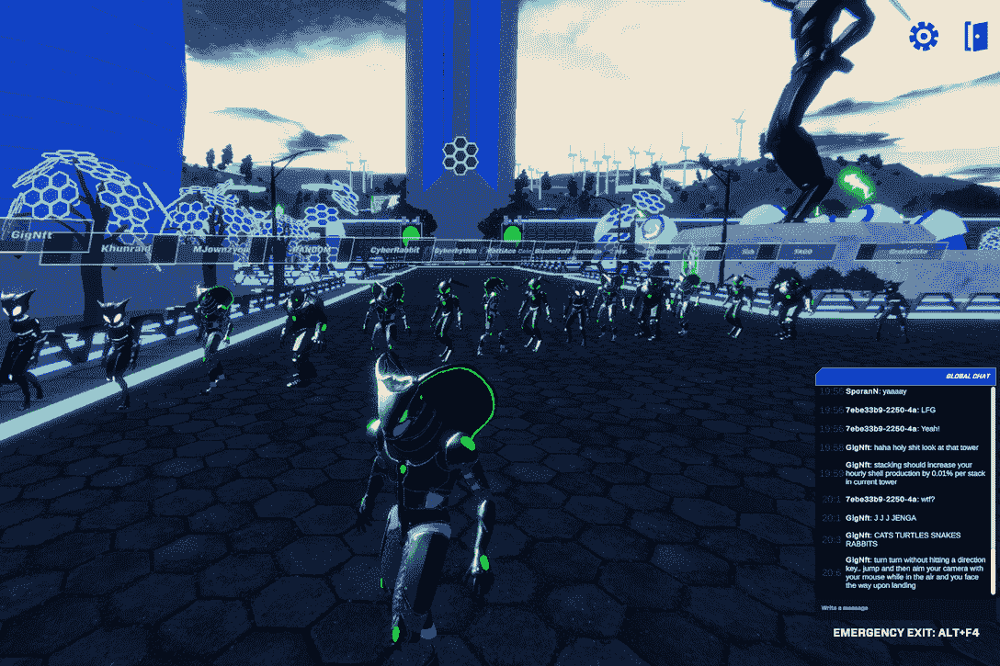
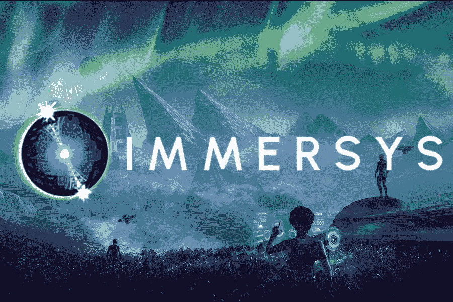
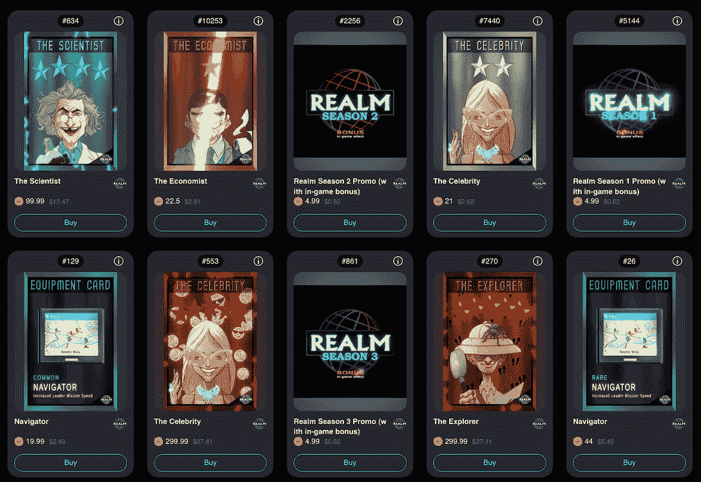

# Wax 区块链在赛车、元宇宙和策略游戏类型中的主导地位不断扩大

> 原文：<https://web.archive.org/web/https://dappradar.com/blog/wax-blockchain-dominance-expands-in-racing-metaverse-and-strategy-game-genres>

## 绿兔游戏、Immersys 和 Realm 都出现了显著的 30 天增长。

蜡像区块链已经发展成为一个多元化的游戏生态系统。赛车、虚拟世界或策略游戏的玩家可以在 Wax 的网络上找到符合他们口味的 dapps。在过去的 30 天里，许多蜡像游戏的用户显著增加，即使在加密熊市中也是如此。

**概要:**

*   [Wax](https://web.archive.org/web/20221004011947/https://dappradar.com/rankings/protocol/wax) 是一家领先的区块链网络，旨在促进 Web3 游戏应用的发展。
*   顶级游戏如[《外星世界》](https://web.archive.org/web/20221004011947/https://dappradar.com/multichain/games/alien-worlds)和[《采矿网络》](https://web.archive.org/web/20221004011947/https://dappradar.com/wax/games/miningnetwork)继续受到游戏玩家的欢迎。
*   此外，Wax 在其网络上的新兴游戏中的受欢迎程度也有了显著提高。这些游戏分别是[绿兔游戏](https://web.archive.org/web/20221004011947/https://dappradar.com/wax/games/green-rabbit-game)、 [Immersys](https://web.archive.org/web/20221004011947/https://dappradar.com/wax/games/immersys) 、[境界](https://web.archive.org/web/20221004011947/https://dappradar.com/wax/games/realm-nft)。
*   Wax 已成为区块链行业的重要市场参与者，尤其是它对博彩业的破坏。
*   DappRadar 让你了解更多关于蜡的最新发展。您可以:
    *   [了解什么是蜡及其工作原理？](/web/20221004011947/https://dappradar.com/blog/what-is-wax/)
    *   [追踪 Wax 最受欢迎的 dapps](https://web.archive.org/web/20221004011947/https://dappradar.com/rankings/protocol/wax) 。
    *   [发现蜡上的 NFTs】。](https://web.archive.org/web/20221004011947/https://dappradar.com/nft/protocol/wax)
    *   成为[外星世界](/web/20221004011947/https://dappradar.com/blog/how-to-play-alien-worlds-like-a-pro/)和[采矿网络](/web/20221004011947/https://dappradar.com/blog/the-miningnetwork-game-on-wax-attracted-more-than-800k-users-within-30-days/)的专家。

如今，许多开发者和游戏玩家都非常喜欢这样一个概念，即没有人可以阻止、限制或删除任何人的访问和游戏中的资产。像 Wax 这样的 Web3 技术提供商可以实现一种动态的、用户驱动的游戏体验，这种体验是由一种分散的模型驱动的。此外，它将权力从科技巨头转移回用户手中。

因此，越来越多的游戏加入了 Wax 的多功能区块链游戏生态系统，并取得了成功。虽然这些游戏来自不同的流派，具有不同的游戏性和游戏内经济，但 Wax 可以满足开发者和玩家的复杂需求。

如果你正在考虑分散你的游戏收入组合，请继续阅读，找出最近在 Wax 上引领增长的新兴游戏。

## 沉浸在绿色兔子游戏的 3D 赛车中

[https://web.archive.org/web/20221004011947if_/https://www.youtube.com/embed/Z4YwR_jxPLE?feature=oembed](https://web.archive.org/web/20221004011947if_/https://www.youtube.com/embed/Z4YwR_jxPLE?feature=oembed)

由 Unity 开发的[绿兔游戏](https://web.archive.org/web/20221004011947/https://dappradar.com/wax/games/green-rabbit-game)是一款多活动的冒险游戏，让玩家体验身临其境的 3D 视觉效果。为了玩，玩家必须收集官方的绿兔收集物 NFT，它们以不同的稀有物打包。

绿兔 NFT 对玩家的多种目的的成功至关重要，例如支持角色塑造和为称为外壳的生态系统令牌下注。2022 年 4 月，绿兔团队首次将 3D 赛车引入游戏，将游戏的可玩性和深度提升到一个新的高度。

值得注意的是，在过去的 30 天里，绿兔的受欢迎程度一直在上升，用户增加了 14%，产生了超过 300，000 笔交易。

## Immersys 的元宇宙激励体验

[https://web.archive.org/web/20221004011947if_/https://www.youtube.com/embed/BCkh4jXEUgM?feature=oembed](https://web.archive.org/web/20221004011947if_/https://www.youtube.com/embed/BCkh4jXEUgM?feature=oembed)

[Immersys](https://web.archive.org/web/20221004011947/https://dappradar.com/wax/games/immersys) 是 Wax 上增长最快的游戏之一，30 天内活跃钱包增长 180%。这个 3D 虚拟世界允许玩家产生 NFT，佩戴 NFT，并下注以获得 FATAE 令牌作为奖励。

在 Immersys 最新发布的版本中，游戏推出了战斗模式。玩家可以通过全身虚拟形象体验新的战斗，它支持 PVE 和 PVP。如果这还不够好，那么战斗可以让第三人称视角带来更令人兴奋的玩家体验，同时让用户一决高下。

让我们不要忘记，用户赢得 NFT 战利品后，他们在战斗中的胜利和找到新的蓝图的能力。Blueprint 是锁在用户加密钱包中的不可转让的 NFT。它的功能是作为用户唯一特征或身份的“所有权证明”验证器。

为了交易这些 NFT 资产，用户可以去市场，如[原子枢纽](https://web.archive.org/web/20221004011947/https://dappradar.com/wax/marketplaces/atomicmarket)和[石油板块](https://web.archive.org/web/20221004011947/https://dappradar.com/wax/marketplaces/neftyblocks)。

Immersys 现有游戏的另一个关键特征是 NFT 赌注，这是获得命运令牌的主要方式。获得命运的另一种方式是在 [Alcor 交易所](https://web.archive.org/web/20221004011947/https://dappradar.com/wax/exchanges/alcor-exchange)购买蜡。至于公用事业，用户可以将命运花在 NFT 和蓝图制作上，购买 NFT 工具和其他关键设备来赢得游戏。

## 用 Realm 测试你的决策能力

[https://web.archive.org/web/20221004011947if_/https://www.youtube.com/embed/NAFlDaGBV28?feature=oembed](https://web.archive.org/web/20221004011947if_/https://www.youtube.com/embed/NAFlDaGBV28?feature=oembed)

领域是另一款最近很受欢迎的游戏。这是一个资源管理游戏，玩家战略性地利用他们的 NFT。该游戏让玩家通过挖掘资源、解锁区域、赚取 RLM 代币等方式建立自己的王国。

三种类型的 NFT 促进了领域的游戏性。他们是领导者、帮助者和推动者，服务于不同的目的。游戏要求玩家建造建筑，训练助手，并进行升级/扩张来建造他们的领域。

做出正确的决定将影响玩家进步的速度和成功的程度。比如如何使用 Leader NFTs？如何更好的训练帮手完成任务？如何增加他们的资源，拓展境界？这些只是玩家需要思考的几个关键问题。

有了这样精心设计的，基于技能的游戏，战术迷们一定会被吸引到这个游戏中来。事实上，Realm 在过去 30 天里吸引了超过 3250 名用户，增长了 17%。

## 蜡像游戏生态系统的可持续性

今天，在线游戏的特点仍然是企业和高度集中的性质。这种模式剥夺了用户对游戏内资产和数据的所有权。幸运的是，随着 Web3 技术的发展，这种情况将迎来改善。

蜡制游戏生态系统在过去的一个月里已经有了健康的增长，这让我们确信 Web3 将彻底改变游戏行业。除了新游戏的持续上升，Wax 的顶级游戏仍然很有吸引力，[外星世界](https://web.archive.org/web/20221004011947/https://dappradar.com/multichain/games/alien-worlds)增长了 13%，[采矿网](https://web.archive.org/web/20221004011947/https://dappradar.com/wax/games/miningnetwork)增长了 80%。

要深入了解 Wax 如何重塑用户与 Web3 游戏的互动方式，请阅读 [DappRadar 的终极 Wax 指南](/web/20221004011947/https://dappradar.com/blog/what-is-wax/)。

了解更多关于 Wax 的信息:

[网站](https://web.archive.org/web/20221004011947/https://wdny.io/carbon-offset-virls/)
[推特](https://web.archive.org/web/20221004011947/https://twitter.com/WAX_io)
[不和](https://web.archive.org/web/20221004011947/https://go.wax.io/Discord)