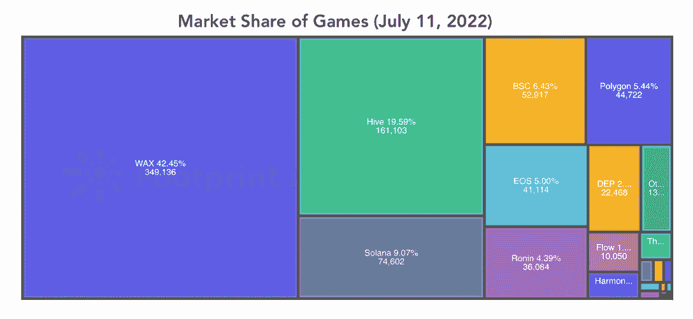

# Wax 以 42%的市场份额统治着 GameFi 领域

> 原文：<https://web.archive.org/web/https://dappradar.com/blog/wax-dominates-the-gamefi-space-with-a-42-market-share>

## 《农耕时代》和《火星上的百万人》是最新的新星

就 GameFi 用户数量而言，蜡像区块链一直占据市场主导地位。得益于其高效且经济实惠的区块链基础设施，Wax 正在引入一系列 GameFi 项目，使其成为最具活力的区块链生态系统之一。

总结:

*   在当前的加密熊市中，游戏是表现最好的领域。
*   [Wax](https://web.archive.org/web/20221002042011/https://dappradar.com/rankings/protocol/wax) 的用户占 [GameFi 市场](https://web.archive.org/web/20221002042011/https://dappradar.com/rankings/category/games)的 42%，遥遥领先于竞争对手 [HIVE](https://web.archive.org/web/20221002042011/https://dappradar.com/rankings/protocol/hive) 、 [Solana](https://web.archive.org/web/20221002042011/https://dappradar.com/rankings/protocol/solana) 、 [Polygon](https://web.archive.org/web/20221002042011/https://dappradar.com/rankings/protocol/polygon) 、 [BNB 智能链](https://web.archive.org/web/20221002042011/https://dappradar.com/rankings/protocol/binance-smart-chain)。
*   《农业时代》和《火星上的百万人》是两款可以在 Wax 上观看的游戏，30 天的交易量分别增长了 126%和 426%。

随着加密市场的持续低迷，曾经利润丰厚的市场正在见证投机者的大规模逃离。据 [DappRadar 行业报告 Q2 版](/web/20221002042011/https://dappradar.com/blog/dapp-industry-report-q2-nfts-and-web3-games-keep-enduring-market-conditions-as-shockwaves-from-the-terra-collapse-reach-cefi-and-vcs/)显示，Q2 期间，211 万个独立活跃钱包(UAW)连接到区块链 dapps，比上一季度减少 11%。

然而，游戏行业无视熊市趋势，UAW 仅比上一季度下降 5%。此外，当进一步研究当前游戏市场的具体情况时，我们可以发现 Wax 在 GameFi 用户中最受欢迎。这种生命迹象表明，顶级游戏玩家可能正准备卷土重来。

## Wax 的用户占 GameFi 市场的 42%

以太坊仍然是大多数 dapps 的首选链，因为区块链创造了智能合约的黄金标准。与此同时，Solana 是许多 DeFi 和 NFT 项目青睐的后起之秀，因为它具有当前以太坊无法提供的出色效率、可伸缩性和可负担性。然而，关于 GameFi 终端用户的偏好，Wax 毫无疑问是第一位的。

在撰写本文时，所有 GameFi 参与者中有 42.45%来自 Wax，远远超过 HIVE (19.59%)、Solana (9.07%)、Polygon (5.44%)和 BNB 智能链(6.43%)。

Source[:](https://web.archive.org/web/20221002042011/https://www.footprint.network/topic/GameFi/GameFiOverview) [footprint](https://web.archive.org/web/20221002042011/https://www.footprint.network/topic/GameFi/GameFiOverview)

如下图所示，一些区块链在过去的一个月里用户数量有所下降。相反，Wax 反而保持了对用户的吸引力，并出现了阶段性的显著用户反弹。

Source[:](https://web.archive.org/web/20221002042011/https://www.footprint.network/topic/GameFi/GameFiOverview) [footprint](https://web.archive.org/web/20221002042011/https://www.footprint.network/topic/GameFi/GameFiOverview)

## 蜡上的新星

GameFi dapps 在熊市趋势中在 Wax 上的生存甚至繁荣证明了 Wax 的生态系统是托管 GameFi 的理想选择。GameFi dapps 不是一个投机的游乐场，而是可以像传统视频游戏一样吸引玩家。

最重要的是，GameFi dapps 通过用户驱动和可持续的经济模式为玩家提供了独特的游戏体验。就像蜡上的一样。除了空前的明星如[外星世界](https://web.archive.org/web/20221002042011/https://dappradar.com/multichain/games/alien-worlds)和[农民世界](https://web.archive.org/web/20221002042011/https://dappradar.com/wax/games/farmers-world)之外，几个不太知名的游戏在活跃度上也取得了令人印象深刻的提升。

例如，[农耕时代](https://web.archive.org/web/20221002042011/https://dappradar.com/wax/games/age-of-farming)是一款以古代为背景的 NFT 纸牌游戏。“玩赚”功能允许用户通过玩游戏来赚取 NFT 和代币。在过去的 30 天里，这款游戏已经注册了超过 242 万笔交易，增长了 126%。

另一款最近大受欢迎的游戏是火星上的百万富翁游戏，这是一款基于网络的游戏，拥有出色的视觉效果。该游戏允许玩家在真实的火星地形上搜寻资源、开发土地和交易玩家拥有的经济。在过去的 30 天里，百万火星上的交易量增长了 426%，产生了 183，000 笔交易。

## 最后的想法

简而言之，Wax 建立了一个充满活力的区块链生态系统，使 NFT 和 GameFi 项目蓬勃发展。具体来说，区块链能够以极低的成本处理大量交易，并且不会增加最终用户的任何成本。此外，本地市场 AtomicMarket 促进了 NFT 资产的顺利和经济的交换。

了解更多关于蜡的信息

[网站](https://web.archive.org/web/20221002042011/https://wdny.io/carbon-offset-virls/)

[推特](https://web.archive.org/web/20221002042011/https://twitter.com/WAX_io)

[不和](https://web.archive.org/web/20221002042011/https://go.wax.io/Discord)

**免责声明** —这是一篇赞助文章。DappRadar 不认可本页面上的任何内容或产品。DappRadar 旨在提供准确的信息，但读者应该在采取行动之前总是自己做研究。DappRadar 的文章不能被认为是投资建议。