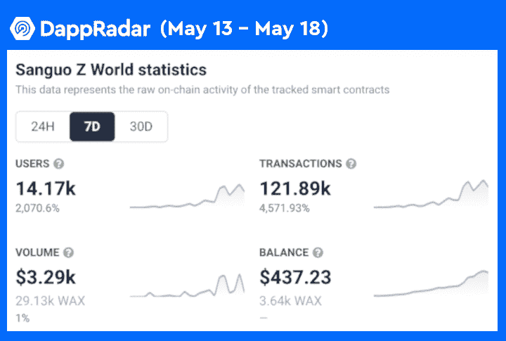
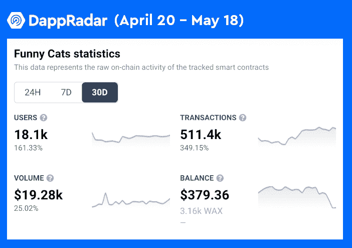
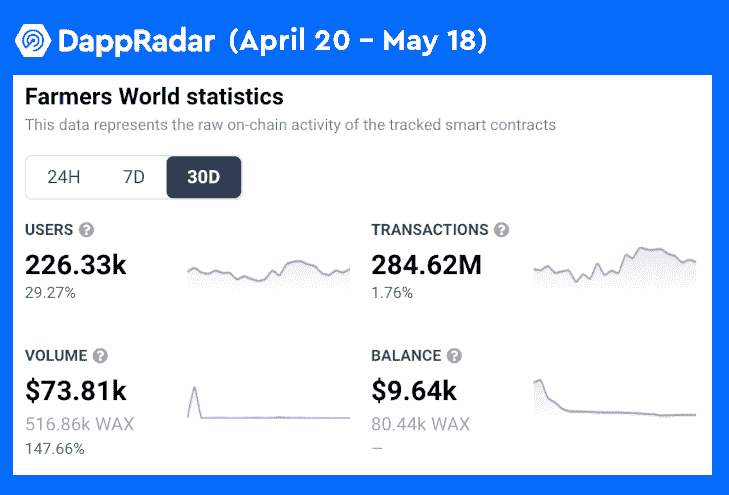

# 蜡游戏获胜，也是在这个秘密熊市

> 原文：<https://web.archive.org/web/https://dappradar.com/blog/wax-games-winning-also-during-this-crypto-bear-market>

## 三国 Z 世界、逗猫、农夫世界指标领先

尽管加密行业不景气，但许多蜡像游戏 dapps 见证了出色的数据性能。这表明，在密码行业的游戏和投资领域，用户行为有很大的不同。此外，对高质量区块链游戏的需求似乎是刚性的。

**概要:**

*   **Wax gaming dapps 在过去一个月保持了用户活跃度，新游戏《三国 Z 世界》用户增长领先，7 天增长 2000%。**
*   **滑稽猫和农民世界也取得了令人印象深刻的用户参与度，滑稽猫的 30 天交易增长了 349%，农民世界的 30 天用户增长了 29%。**
*   在 4 月和 5 月，Wax 生态系统每周吸引了大约 330 万个独立的活跃钱包，而一年前只有 250 万个。

虽然加密市场在估值和市值方面受到严重打击，但区块链的活动却在增长。根据 2022 年 4 月 DappRadar BGA 游戏报告，游戏 dapps 以超过 123 万的每日唯一活跃钱包(UAW)与区块链游戏互动，打破了一项活动记录。更令人印象深刻的是，蜡像区块链上的游戏似乎正在推动这一趋势。

在 30 天指标中脱颖而出的游戏有《三国 Z 世界》、《滑稽猫》、《农民世界》[。](https://web.archive.org/web/20220704234427/https://dappradar.com/wax/games/farmers-world)与此同时，外星世界也是蜡像区块链的驱动力之一。

## 《三国 Z 世界》——用户增长的新冠军

《三国 Z 世界》是一款游戏赚钱的游戏，为用户提供了各种令人兴奋的游戏，如指挥战斗、制作角色、解锁隐藏功能，当然，还包括收集 NFT 和其他游戏内宝藏以在二级市场上交易。

文化和历史元素无疑增加了三国 Z 世界的吸引力。值得一提的是，这款游戏在不到一个月前推出，但它已经见证了 7 天用户数量高达 2000%的增长。此外，交易数量激增了 4，500%，有超过 14，000 名玩家与游戏互动。

## 有趣的猫——可爱的猫总是掌权

有趣的猫是一个游戏，以赚取五只可爱的猫为特色的冒险游戏。双令牌机制促进了游戏中的经济，他们有有趣的名字，猫和猫薄荷。玩家可以用猫开新地点，买猫，猫薄荷是用来补充玩家猫的能量的。

就像猫无法抗拒猫薄荷一样，玩家也无法将目光从这些可爱的小猫身上移开。DappRadar 四月份的一篇文章透露，滑稽猫记录了 223，025 笔交易，与之前的 30 天相比增长了 231%。几乎三个星期后，这些可爱的猫显然仍然掌权。最新的 30 天指标显示，该游戏产生了 51.14 万笔交易，同比增长 349%。

## 农民世界——空前的明星

《农民世界》是蜡像馆区块链史上的明星。农耕模拟游戏让玩家可以坐以待毙，被动赚取奖励。一个被动的，采矿游戏与战略游戏相结合，使农民世界成为一个愉快的游戏，以赚取广泛的玩家基础。

在去年 8 月推出后不久，该游戏见证了令人难以置信的增长，UAW 增长超过 86，000%，在一个月内达到 11，000。在撰写本文时，农民世界有 226，336 名玩家在过去 30 天内参与了该游戏，增加了 29%。可以说，《农民世界》的稳定表现是玩家渴望高质量区块链游戏的有力证据。

## 蜡像——乐趣仍在继续

在 2022 年第二季度的中途，Wax 已经推出了一系列令人敬畏的功能，以增强用户在其生态系统中的体验。

元宇宙最喧闹的 P2E 游戏《区块链争吵者》(Blockchain Brawler)将于 5 月 24 日推出全新的头像系统。这将允许用户自定义他们的斗殴者个人资料图片，并在排行榜上炫耀。此外，ChainChamps 登陆 Wax 的生态系统，成为第一个利用人工智能评估 NFT 价值的实时市场。这种独特的功能可以帮助收藏家快速获得顶级便宜货，并更准确地评估 NFT。

了解更多关于 Wax 的信息:

[网站](https://web.archive.org/web/20220704234427/https://wdny.io/carbon-offset-virls/)

[推特](https://web.archive.org/web/20220704234427/https://twitter.com/WAX_io)

[不和](https://web.archive.org/web/20220704234427/https://go.wax.io/Discord)

**免责声明** —这是一篇赞助文章。DappRadar 不认可本页面上的任何内容或产品。DappRadar 旨在提供准确的信息，但读者应该在采取行动之前总是自己做研究。DappRadar 的文章不能被认为是投资建议。