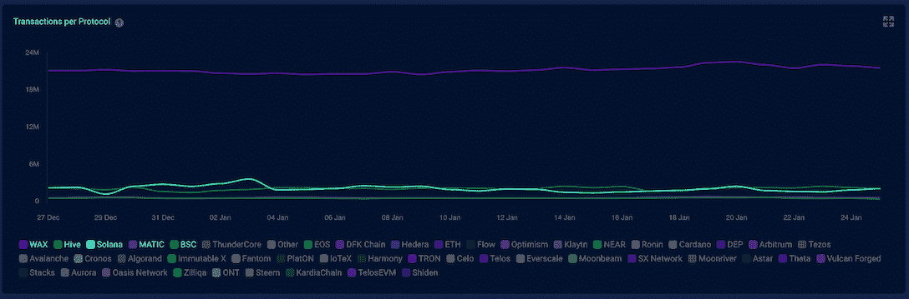
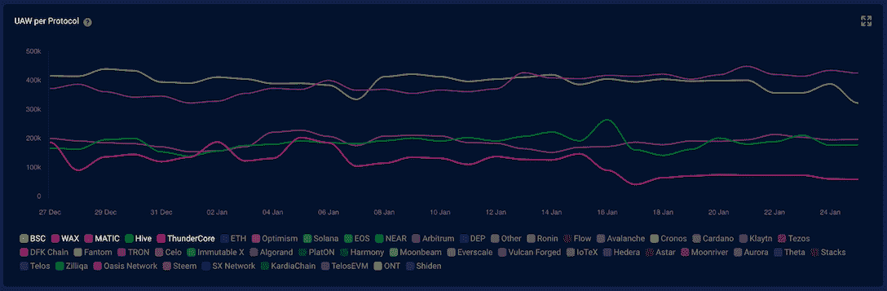
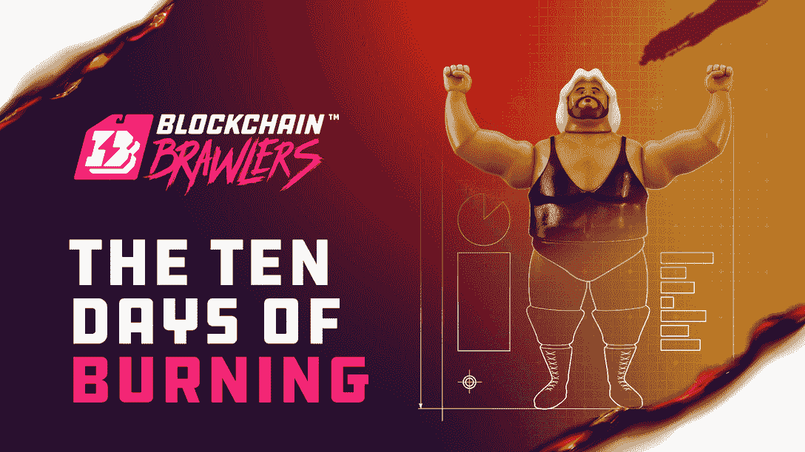
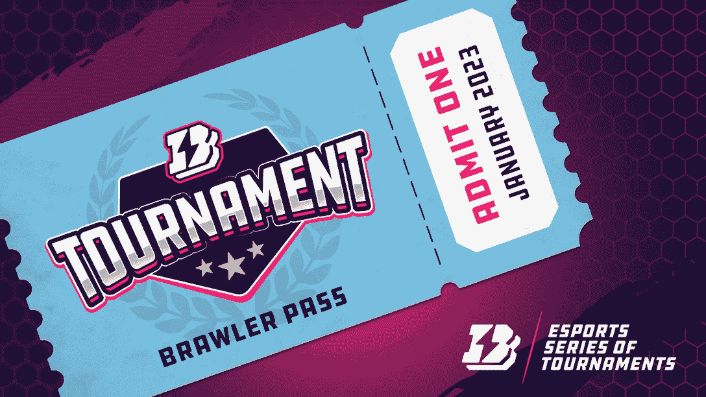
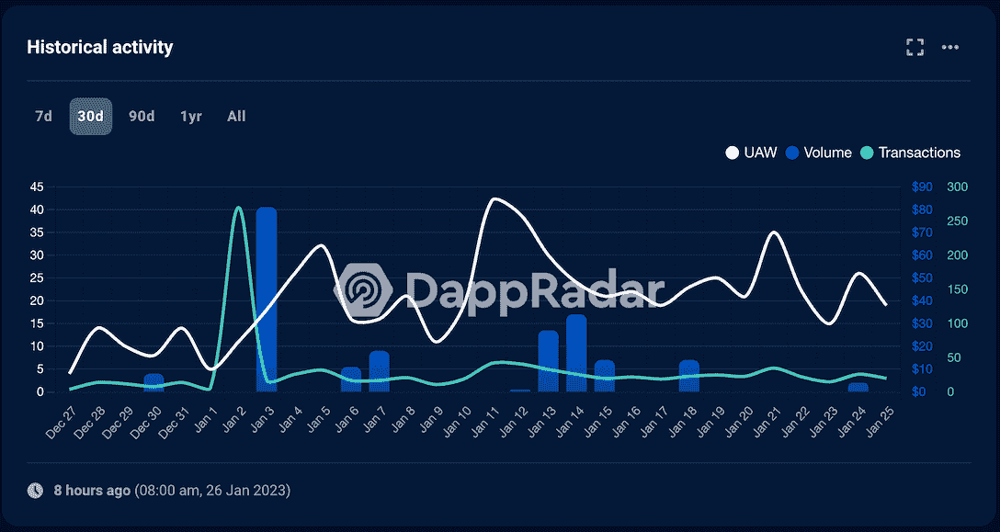
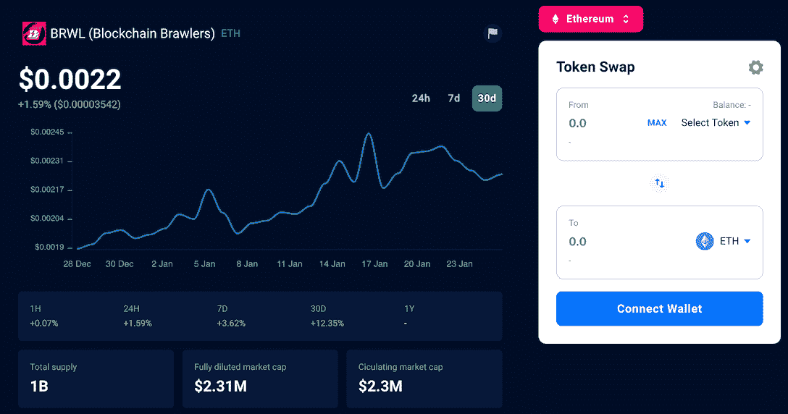

# 随着区块链格斗者带着多个事件冲进 2023 年，Wax 稳步上升

> 原文：<https://web.archive.org/web/https://dappradar.com/blog/wax-rises-steadily-as-blockchain-brawlers-dashes-into-2023-with-multiple-events>

## 关注区块链格斗家的《燃烧的十天》活动。

在过去的 30 天里，区块链蜡像馆的连锁经营活动稳步增长。除了这种复兴之外，区块链格斗家还举办了一系列活动，因为该游戏自 2022 年 12 月以来已经举办了多次活动。在所有活动中，PvP 竞赛和年终“地狱燃烧事件”尤其受到好评。因此，为了保持这一势头，Blockchain Brawlers 已经有了一些计划。

**内容:**

*   *[蜡生态系统的更新](https://web.archive.org/web/20230130162331/https://dappradar.com/blog/wax-rises-steadily-as-blockchain-brawlers-dashes-into-2023-with-multiple-events/#an)*
*   [*区块链格斗家宣布新的烧伤事件和比武*](https://web.archive.org/web/20230130162331/https://dappradar.com/blog/wax-rises-steadily-as-blockchain-brawlers-dashes-into-2023-with-multiple-events/#bb)
    *   [*十日燃烧事件*](https://web.archive.org/web/20230130162331/https://dappradar.com/blog/wax-rises-steadily-as-blockchain-brawlers-dashes-into-2023-with-multiple-events/#the)
    *   [*扣好安全带参加 B . e . s . t .*锦标赛](https://web.archive.org/web/20230130162331/https://dappradar.com/blog/wax-rises-steadily-as-blockchain-brawlers-dashes-into-2023-with-multiple-events/#up)
*   *[区块链群殴大战愈演愈烈](https://web.archive.org/web/20230130162331/https://dappradar.com/blog/wax-rises-steadily-as-blockchain-brawlers-dashes-into-2023-with-multiple-events/#is)*

## 蜡生态系统的更新

Wax 是区块链游戏和 NFT 用例的活跃构建者。区块链通过允许玩家拥有和交易独特的数字资产，在游戏行业中创造了一种全新的经济。这一创新不仅为开发者提供了新的收入模式，也为玩家创造了新的体验和奖励机制。

区块链蜡上游戏的繁荣是其生态系统最显著的特征。30 天交易的领先地位(图 1)很大程度上是由于其链上游戏活动。此外，就独特的活动钱包而言，WAX 最近已经超过了 BNB 连锁店(图 2)。

[Chart 1](https://web.archive.org/web/20230130162331/https://dappradar.com/industry-overview)

[Chart 2](https://web.archive.org/web/20230130162331/https://dappradar.com/industry-overview)

[Explore the WAX ecosystem](https://web.archive.org/web/20230130162331/https://dappradar.com/rankings/protocol/wax)

## 区块链斗殴者新烧伤事件和比赛

WAX 提供了广泛的游戏，包括战略、战斗、模拟等。但是区块链格斗家是一个被谈论很多的游戏。凭借其时髦的视觉风格和休闲而令人兴奋的游戏，区块链格斗家在游戏赚钱的领域很难被忽视。

[https://web.archive.org/web/20230130162331if_/https://www.youtube.com/embed/jTeJGknJkaU?feature=oembed](https://web.archive.org/web/20230130162331if_/https://www.youtube.com/embed/jTeJGknJkaU?feature=oembed)

去年，《区块链格斗家》在精炼其艺术风格和游戏性方面取得了许多里程碑式的成就。2023 年，该项目着眼于可持续性和可玩性。用户将通过一系列活动体验这些增强功能。

[Play Blockchain Brawlers](https://web.archive.org/web/20230130162331/https://www.bcbrawlers.com/)

### 燃烧的十天事件

从 2023 年 2 月 2 日开始，区块链格斗家将开始他们的“燃烧十天”活动。这项活动邀请玩家焚烧大量的 NFT 卡片和包裹。这种做法将有助于游戏的长期可持续性，并将对游戏的可玩性和游戏内经济产生直接影响。

具体来说，该事件可能会导致 70%以上的资产被烧毁，从而导致其流通数量大幅减少。这样，同类型的剩余资产的稀有性和价值就会上升。此外，从市场上消除重复的物品意味着用户有机会获得新的物品，允许更深入的游戏。

该项目知道让玩家摧毁他们的资产是困难的。所以作为回应，游戏会有多重激励和新的资产让烧钱有利可图。例如，超过 400 张薄荷#1 卡将被拍卖。

Blockchain Brawlers 已经整理了一系列文章，让用户了解整个燃烧事件。一个人如何参与？新的卡片将如何融入游戏？用户将在文章中获得这些问题的答案。

#### 内容更新时间表如下。

*   第 1 天—1 月 24 日—本次活动的理念和目标
*   第 2 天——1 月 25 日——预期结果及其如何影响我们的想法
*   第 3 天——食谱成本和活动节拍
*   第 4 天—配方发布的第 1 阶段(共 4 个阶段)
*   第 5 天—在活动持续期间，BoS 打磨和抛光功能
*   第 6 天—发布第 2 阶段(共 4 个配方)
*   第 7 天——计划失败
*   第 8 天——3 个配方的第 3 阶段发布
*   第 9 天——发布 4 个配方中的第 4 阶段
*   第 10 天—秘密物品 1 和秘密物品 2

[Learn more about the event](https://web.archive.org/web/20230130162331/https://medium.com/blockchain-brawlers/the-ten-days-of-burning-day-0-fae66f2ca4f2)

### 为 B.E.S.T .锦标赛系好安全带

1 月 29 日，该游戏将举办 Brawlers 电子竞技系列锦标赛或 B.E.S.T .这是为期一年的月度锦标赛的第二场。用户需要购买锦标赛通行证才能进入游戏。

这项 PvP 锦标赛要求玩家派出他们最久经沙场的格斗家将对手击倒在地以赚取分数。排行榜上的前 32 名选手将瓜分奖金池。

[Get your tournament Pass](https://web.archive.org/web/20230130162331/https://www.bcbrawlers.com/)

### 区块链争吵者变得越来越吵闹

区块链格斗家的早期活动成功地推动了用户参与。DappRadar 的跟踪也证实了区块链格斗家在过去 30 天里增加的牵引力。

[View more Blockchain Brawlers stats](https://web.archive.org/web/20230130162331/https://dappradar.com/wax/games/blockchain-brawlers/)

与此同时，游戏内活动的增加导致了对游戏内实用工具令牌的更大需求。因此，作为区块链格斗家的本土标志，BRWL 在过去 30 天里也呈现出强劲的上升趋势。

[View more BRWL token stats](https://web.archive.org/web/20230130162331/https://dappradar.com/hub/token/eth/BRWL/ETH?from=0x4086e77c5e993fdb90a406285d00111a974f877a)

关注下面的频道，并确保您了解区块链格斗家的最新消息。

*   [网站](https://web.archive.org/web/20230130162331/https://www.bcbrawlers.com/)(区块链格斗家)
*   [推特](https://web.archive.org/web/20230130162331/https://www.bcbrawlers.com/clkn/https/twitter.com/bc_brawlers)
*   [不和](https://web.archive.org/web/20230130162331/https://www.bcbrawlers.com/clkn/https/discord.gg/xpz249ME3C)
*   [中等](https://web.archive.org/web/20230130162331/https://www.bcbrawlers.com/clkn/https/medium.com/blockchain-brawlers)
*   [网站(蜡)](https://web.archive.org/web/20230130162331/https://www.wax.io/)
*   [推特(蜡)](https://web.archive.org/web/20230130162331/https://twitter.com/WAX_io)
*   [不和(蜡)](https://web.archive.org/web/20230130162331/https://discord.com/invite/dJtPetMdfb)

**免责声明** —这是一篇赞助文章。DappRadar 不认可本页面上的任何内容或产品。DappRadar 旨在提供准确的信息，但读者应该在采取行动之前总是自己做研究。DappRadar 的文章不能被认为是投资建议。