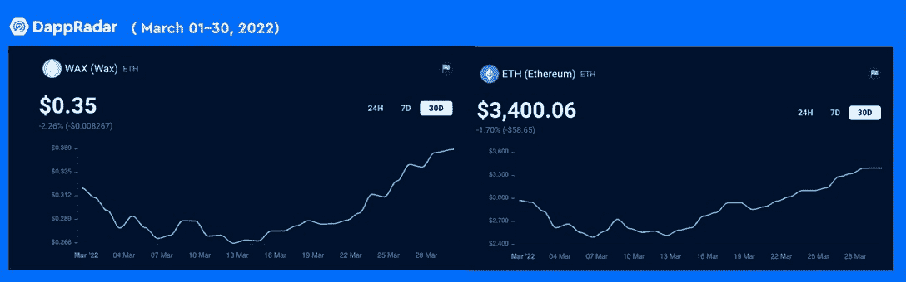
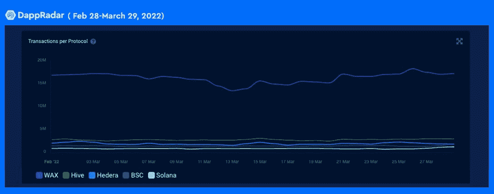
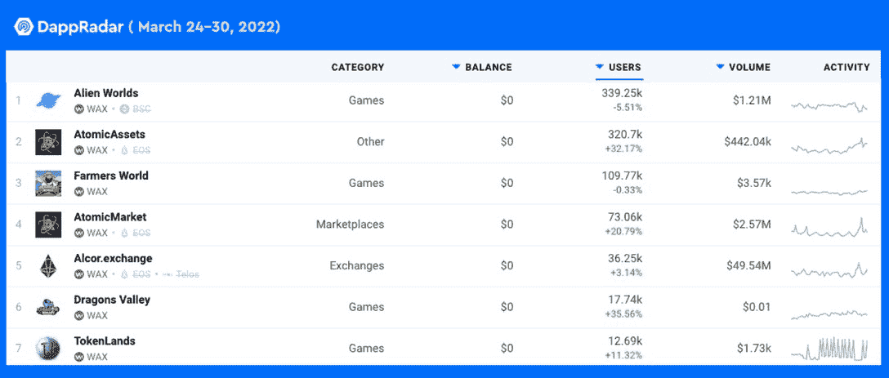

# 随着区块链格斗家获得成功，蜡令牌价格上涨

> 原文：<https://web.archive.org/web/https://dappradar.com/blog/wax-token-price-gets-boost-as-blockchain-brawlers-finds-success>

## WAX 是游戏和 dapps 最具活力的环保区块链之一

区块链格斗家将在区块链蜡像馆首次亮相，这一消息加上其最近发布的风火轮系列 2，提高了蜡像的价格。不断增长的区块链 WAX 生态系统使其成为许多用户和开发者的首选。 [**区块链格斗家**](https://web.archive.org/web/20220925012828/https://dappradar.com/blog/blockchain-brawlers-join-the-rowdiest-game-in-the-metaverse-and-earn-brwl) **，一款备受期待的以摔跤为主题的玩赚游戏，将 WAX 的人气带到了新的高度。**

过去一周，加密市场经历了强劲的反弹，BTC 回到了 47，000 美元，T2 联邦理工学院夺回了 3，400 美元。遵循类似的增长曲线，博彩区块链[蜡的本地令牌](https://web.archive.org/web/20220925012828/https://dappradar.com/hub/token/eth/WAX?from=0x39bb259f66e1c59d5abef88375979b4d20d98022)(蜡)在写作的 30 天内记录了 13%的增长。这种强有力的逆转导致了不同的观点，从预测牛市全面展开，到认为这只是持续熊市之前的一次缓解性反弹。

然而，只有时间才能证明哪一方的信徒是正确的。此外，仅仅通过趋势线做出象征性的价格预测对我们的理解来说意义不大。更重要的是，用户行为总是因部门而异。就游戏而言，让我们仔细看看 WAX dapps 最近的表现，以更好地理解是什么因素促成了当前的上升趋势。

## 区块链争吵者增加了 WAX 的繁荣

Blockchain Brawlers 是蜡区块链上一款备受期待的摔跤主题游戏。与 UFC 等激烈而残酷的比赛不同，区块链格斗家为这类游戏的区块链版本带来了欢闹的元素，给玩家带来了欢乐。令人兴奋，有趣，并且具有时髦的设计，区块链争吵者将于 3 月 30 日在 WAX 生态系统上首次亮相。准备好你的戒指和拳手，如果你想加入高空飞行，标志性摔跤手的乌合之众！

## WAX dapps 表现良好

蜡是任何 dapps 的首选环保区块链，尤其是 NFT 和视频游戏。蜡像区块链授权了一些最受欢迎的 NFT 游戏，为 AMC Theaters、Funko 和 Atari 等知名合作伙伴提供了一个生态系统。

WAX 提供了一个品牌成功推出 NFT 动力 dapp 所需的一切。目前，该生态系统拥有超过 400，000 名每日独立用户，2，300 万次每日交易和 1，200 万个蜡账户。WAX 卓越的技术性能和基础设施赢得了众多项目的信任。下图显示了过去 30 天主要区块链的交易情况。我们可以看到蜡的统治力是毋庸置疑的。

关于蜡上的顶 dapps，它们通常保持持续增长。具体来说，游戏 dapp 龙之谷的用户在过去七天增加了 33%，有 17，710 名用户访问了 dapp。此外，exchange AtomicMarket 的用户流量增加了近 23%，共有 74，380 名访客。此外，exchange Alcor 有 36.46 万用户访问 dapp，增长了 4.5%。值得注意的是，这些 dapps 在过去 24 小时内也保持了用户流量或实现了用户增长。

## 结束语

WAX 的区块链基础设施和生态系统为 dapps 的顺利推出提供了必要的温床。更重要的是，WAX 确保您建立一个安全、高效、环保的区块链。对于一般的最终用户，WAX 有一个 dapp 矩阵，由 30，000 多种具有广泛用途的产品支持。最后但并非最不重要的是，WAX 的 P2E 支持的游戏 dapps 的多样化选择永远不会让精明的游戏玩家失望。

了解更多关于 [WAX](https://web.archive.org/web/20220925012828/https://on.wax.io/games/) 的信息:

[网站](https://web.archive.org/web/20220925012828/https://on.wax.io/wax-io/)

[推特](https://web.archive.org/web/20220925012828/https://twitter.com/WAX_io)

[不和](https://web.archive.org/web/20220925012828/https://discord.com/invite/dJtPetMdfb)

[中等](https://web.archive.org/web/20220925012828/https://wax-io.medium.com/)

**免责声明** —这是一篇赞助文章。DappRadar 不认可本页面上的任何内容或产品。DappRadar 旨在提供准确的信息，但读者应该在采取行动之前总是自己做研究。DappRadar 的文章不能被认为是投资建议。