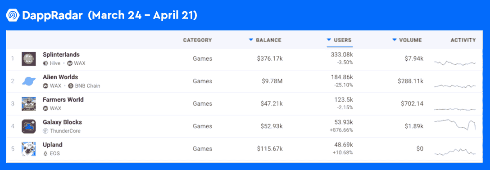

# 蜡把 NFT 收集变成真正的植树

> 原文：<https://web.archive.org/web/https://dappradar.com/blog/wax-turns-nft-collecting-into-real-tree-planting>

## 在 WAX 上制作一个 vIRL NFT 将会给收藏家一个特别的 NFT 奖金

**蜡有助于种植真正的树木，以抵消使用区块链产生的碳排放，从而使 NFT 收集更加环保。为了尽快实现区块链的大规模采用，WAX 将建立碳中性的区块链生态系统作为其首要任务之一。**

**概要:**

*   今天，工作证明仍然在加密货币行业发挥着重要作用，但它的非绿色本质也引发了许多争论。
*   WAX 是一个以游戏为中心的公共链，通过各种努力促进区块链的生态友好。
*   **WAX 与美国国家森林基金会合作，帮助 NFT 的收藏家用其碳抵消 vIRL NFTs 来植树，这是杰出艺术家 Krel 创作的一个系列。**

对加密货币的主要批评之一是它是能源密集型的，并且对我们的环境有害。根据 Digiconomist 的说法，以太坊上的一笔交易需要 77.07 千瓦时，这相当于两个家庭的日常用电量。随着分散式应用(dapps)越来越受欢迎，这也凸显了在追求区块链技术的过程中保持环境可持续性的紧迫性。

区块链发展和环境可持续性不应该冲突。相反，那些采用利害关系证明(PoS)共识机制的下一代区块链实施了一个更环保的解决方案。因此，人们可以预见一个碳中和网络的未来 3。在所有的零售连锁店中，WAX 是一个游戏规则改变者，它通过各种努力和实践推动区块链向生态友好型发展。

[https://web.archive.org/web/20221208165310if_/https://www.youtube.com/embed/VvmLWczNnyY?feature=oembed](https://web.archive.org/web/20221208165310if_/https://www.youtube.com/embed/VvmLWczNnyY?feature=oembed)

## 在蜡上制作碳补偿 NFTs 来种植真正的树

2021 年，WAX 发布了一系列碳抵消 NFT，即 vIRL NFTs，以实现其碳中和计划。那么，虚拟森林公园如何抵消收藏家在 NFT 的碳足迹呢？当[维尔·NFT 持有者赎回](https://web.archive.org/web/20221208165310/https://dappradar.com/blog/wax-community-composting-nfts-to-rebuild-forests)(堆肥)NFT 作为其实体物品时，瓦克斯承诺种植树苗。收集者每堆肥 1 美元，就会种植一棵树苗。

值得一提的是，这一系列令人惊叹的视觉效果是由才华横溢的艺术家 Kevin Crelerot(又名 Krel)创作的。他的工作具有象征性和意义。多亏了克尔，维尔·NFT 系列立刻以超现实、感性和诗意的元素吸引了收藏家的目光。

本周，2022 年地球日即将到来，WAX 希望让更多人意识到我们地球母亲的危急处境。这一次，碳抵消 vIRLs 将会给他们的收藏家带来一些特别的惊喜，一个诞生新 NFT 的神奇时刻。

它是如何工作的？

当 vIRL 持有者制作 NFT 时，它将引发一场区块链交易，导致一个独特的新 NFT 收藏品的铸造，其中有六件珍品。更重要的是，我们不要忘记，这笔交易还将通知[国家森林基金会](https://web.archive.org/web/20221208165310/https://cointelegraph.com/news/when-these-nfts-are-redeemed-trees-are-planted-to-offset-co2)种植一棵将在未来几十年存活的新鲜树苗。

## 蜡的绿色里程碑

蜡像区块链因流行的 dapps 而繁荣。如下图所示，在 DappRadar 追踪的众多区块链中，WAX 的 dapps 占据了 30 天排行榜前五名的三个席位。最值得注意的是，WAX 的成就并不以牺牲我们的环境为代价。

据 ClimateCare.org 称，去年早些时候，蜡已经抵消了 211 吨二氧化碳。它在区块链的能源消耗仍然非常低，每年只有 0.000223 太瓦。从长远来看，这部分电力的碳足迹约为每年 111 吨二氧化碳。这相当于 5.5 个美国人每年生产的数量。

## 最后的想法

WAX 设想成为区块链行业中最具竞争力的碳中和平台，并致力于此。经过多年的发展，WAX 已经在区块链博彩业建立了声誉。为了让用户参与到碳中和区块链的大计划中，WAX 毫不犹豫地采用了游戏化的方法。

收藏家可以通过购买原始的维尔·NFT 并进行手工制作来获得一个特殊的 NFT。这也将为我们的星球再添一株树苗。这是多么美妙啊！多亏了 WAX，NFT 爱好者现在可以将他们的热情转化为对环境的善行。所以，现在就去蜡碳胶印店，成为一名环保的 NFT 收藏家吧。

链接:

[网站](https://web.archive.org/web/20221208165310/https://wdny.io/carbon-offset-virls/)
[推特](https://web.archive.org/web/20221208165310/https://twitter.com/WAX_io)
[不和](https://web.archive.org/web/20221208165310/https://go.wax.io/Discord)

**免责声明** —这是一篇赞助文章。DappRadar 不认可本页面上的任何内容或产品。DappRadar 旨在提供准确的信息，但读者应该在采取行动之前总是自己做研究。DappRadar 的文章不能被认为是投资建议。