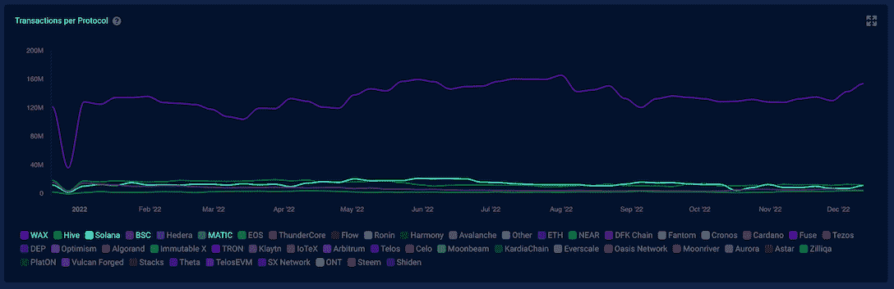
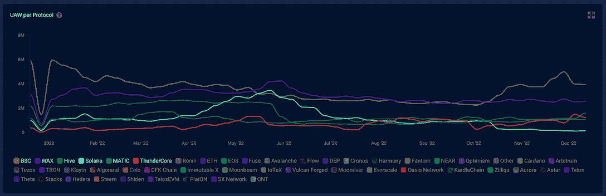
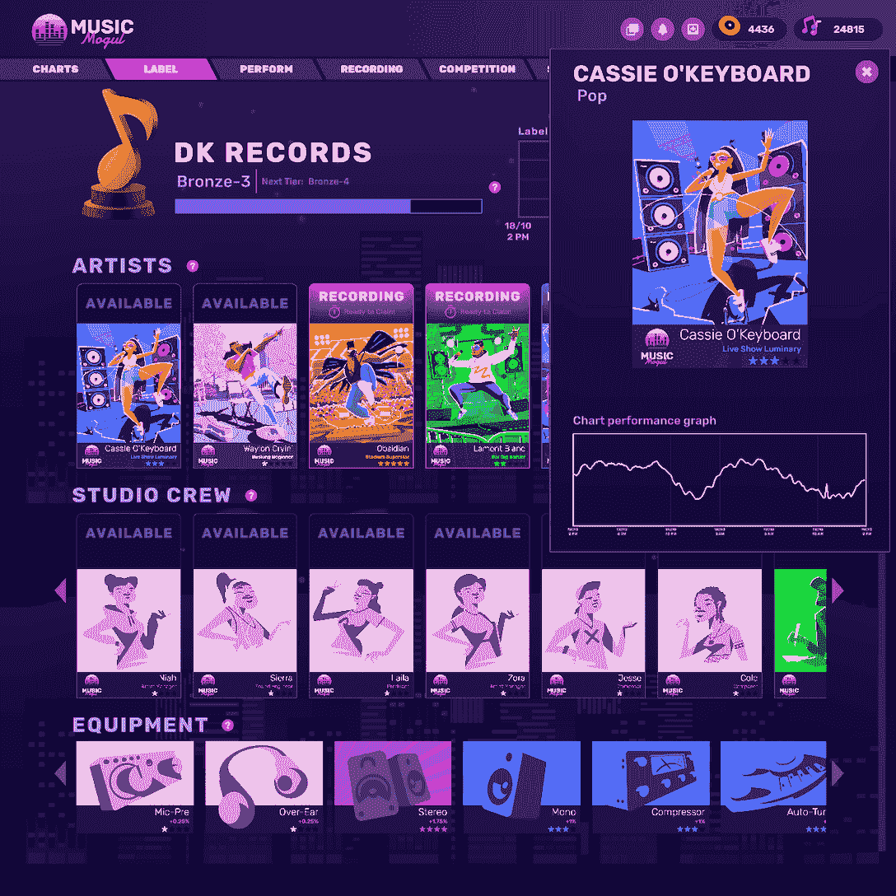

# 蜡包 2022:百万人的游戏之家

> 原文：<https://web.archive.org/web/https://dappradar.com/blog/wax-wrapped-2022-the-home-of-games-for-millions>

## 看看 WAX 在 2022 年取得的骄人成绩

**WAX 取得了非凡的一年，因为区块链生态系统是市场上最活跃的游戏社区之一，吸引了超过 200 万个独立的活跃钱包和每天 1 亿笔交易。超过 100 个 Web3 游戏选择了 Wax 来构建他们的项目，这不是没有原因的。**

随着 2022 年接近尾声，是时候反思今年 Web3 发生了什么。不用说，Web3 世界经历了充满起伏的一年。黯淡的宏观经济环境收紧了监管，负面的行业事件严重打击了市场利益相关者的信心。

但另一方面，该行业的发展和创新仍在继续，使 Web3 的发展保持在正轨上。在这篇文章中，我们来看看瓦克斯，它是达普拉达追踪的众多区块链中引人注目的一个。

**内容:**

*   *按编号打蜡*
*   *WAX 上杰出的游戏项目*
    *   *年度游戏——区块链格斗家*
    *   *值得关注的 NFT 游戏——音乐大亨*
*   *值得注意的 NFT 项目和伙伴关系*
*   *提高网络连接性和可访问性*
*   蜡的未来会怎样？

## 按数字打蜡

Wax 被誉为最成熟的游戏和 NFT web 3 生态系统。我们可以从 DappRadar 的行业数据中找到确凿的证据。

如下图所示，蜡像区块链上的用户活跃度是无与伦比的。在过去的一年里，WAX 在交易数量上远远超过了其竞争对手，过去四周的平均日交易量达到了 1.42 亿笔左右。这一数字高于今年第一个月平均每天 1.32 亿的数字。

与交易相比，蜡像区块链上的用户数量同样令人印象深刻，每天有超过 200 万个独特的活跃钱包(UAW)与区块链互动。就 UAW 而言，WAX 已经找到了 BNB 智能链(BSC)的竞争对手，因为这两家公司轮流成为今年每日活跃用户最多的区块链网络。

## WAX 上的优秀游戏项目

游戏无疑是蜡生态中最可见的细分领域。目前，DappRadar 上有 140 款游戏可以用来检查它们的实时性能。首先，让我们来看看区块链上最受欢迎的几本书。

*   **外星世界**——WAX 上排名第一的游戏，月 UAW 超过 60 万。用户可以收集 NFT，赌注延龄草代币，并开始 P2E 冒险。

*   **FGL** —拥有 15 年经验的手机游戏管理平台 RFOX 推出了 Wax 上的 FGL 令牌。它为所有的 [FGL 运动会](https://web.archive.org/web/20230102223227/https://www.fgltoken.com/)创造了全新的体验。

*   **Taco** —这是一个游戏项目[实用工具](https://web.archive.org/web/20230102223227/https://tacocrypto.io/)，允许用户进行交易、交换代币、管理他们的 NFT，并与最受欢迎的 dapps 互动。

*   埃及人(Acryptia)——一个 NFT 驱动的地牢[卡牌/冒险游戏](https://web.archive.org/web/20230102223227/https://play.acryptia.io/)。用户必须通过关卡，爬上高塔，赢得真正的奖励。

*   锻炉竞技场 —这是一款竞技性的 5v5 第一人称射击游戏，适合喜欢[动作和控制感的玩家。](https://web.archive.org/web/20230102223227/https://www.playforge.gg/)

*   Shnazzy E-Girls—[E-Girls](https://web.archive.org/web/20230102223227/https://linktr.ee/shnazzy.e.girls)是 10K 的一个 PFP 项目，旨在在 WAX 上建立游戏和流媒体社区。

*   **Clash Dome** —这个游戏平台让你可以玩街机游戏，并与其他玩家正面交锋，赢取真正的奖励。[今天开始](https://web.archive.org/web/20230102223227/https://clashdome.io/home)。

*   这款危险可爱的[游戏](https://web.archive.org/web/20230102223227/https://crittercraft.io/)一定会成为大众的最爱。收集和制作可爱的 NFT，玩贴纸游戏，登上排行榜。

*   R-Planet —玩家必须在 R-Planet 建造他们的基地，挖掘资源，训练机器人军队，等等。如果你有信心成为一名军事战略家，点击这里的。

*   **Immersys** —进入 [Immersys MMO 元宇宙](https://web.archive.org/web/20230102223227/https://immersys.io/)，体验前所未有的 Web3。产生 NFT，戴上 NFT，用它们赢得 FATAE 代币作为奖励。

*   其他游戏的关键是 RFOX 游戏生态系统的关键。kog 是 NFT，玩家可以使用它来增强他们的游戏体验，例如装饰物品、参加锦标赛和获得 VIP 活动的权限。获取最新的[并从今天开始玩](https://web.archive.org/web/20230102223227/https://kogs.gg/)。

### 年度游戏——区块链格斗家

[https://web.archive.org/web/20230102223227if_/https://www.youtube.com/embed/tUOSUxZiwaI?feature=oembed](https://web.archive.org/web/20230102223227if_/https://www.youtube.com/embed/tUOSUxZiwaI?feature=oembed)

Blockchain Brawlers 是一款玩家赚钱的游戏，今年登陆了区块链蜡像馆。这款游戏凭借其有趣的人物和独特的摔跤元素登上了行业巅峰。这个游戏是由《魔法:聚会》的创作者理查德·加菲尔德设计的。

在过去的 12 个月里，Blockchain Brawlers 发布了几个 Pack 系列，将 NFT 的 WAX 销售额从一个高度提升到另一个高度。值得注意的是，它的游戏 NFT 单日销售额在 4 月份接近 70 万美元。在玩法上，游戏也从 PvE 模式进化到了更刺激的 PvP 模式。

还需要一些 NFT 才能进入游戏？你可以从 OpenSea 获得一个入门包，里面有你打倒对手所需的一切。

[Get your Starter Pack](https://web.archive.org/web/20230102223227/https://opensea.io/collection/bc-brawlers?search[query]=Starter%20Pack)

### 值得关注的 NFT 游戏——音乐大亨

音乐大亨是音乐迷的大亨游戏。Tyranno Studios 的创新游戏邀请玩家在各种音乐流派中创建他们的 NFT 动力唱片公司。玩家可以建立一个新兴艺术家的花名册，送他们去巡回演出，并把他们安置在录音室里，攀登排行榜，创造历史。

这款游戏已经有一次成功的打包销售，在游戏上线前不久将会有更多的打包销售。想先睹为快吗？查看一些截图，并准备在此抢尽风头。

## 值得注意的 NFT 收藏

在蜡像区块链上已经创造了超过 3 亿个 NFT。这些应用于各种行业，如游戏、艺术、娱乐和音乐。此外，许多知名品牌利用 Wax NFTs 作为其在 Web3 中的首次亮相。为了探索 Wax 上的 NFTs，用户可以访问 vRIL Market，这也使 NFT 创作者和游戏开发者能够在几分钟内创造和推出 NFT 系列和游戏内物品。

最重要的是，花在 Wax NFTs 上的每一美元都代表着国家森林基金会种植的树木，以抵消碳排放，保持地球健康。

*   我拥有 AMC — AMC 剧院向其投资者 Connect 股东提供免费的 NFT。这款华丽奢华的 NFT 将不会再次铸造，对所有拥有它的人来说都是特别的。

*   NFT 投放 1000 万个钱包——今年 1 月，为了庆祝在区块链创造的 1000 万个钱包的记录，WAX 向其用户空投了 1000 万个 NFT。

*   **街头霸王经典** —这款传奇游戏与 WAX 合作，发布了 121 张独特的卡片。收集任何稀有卡中的所有卡都有机会赢得额外的奖励包。

*   **蜡制 vBots** — vBots 是 10，000 个独特的 1 合 1 NFTs，将通过活动、赠品、合作、游戏等方式免费赠送。

*   2 月 23 日，爱德华·摩根·福斯特的科幻小说集《思想机器》被拍卖。这件艺术品不仅是 NFT 的虚拟技术，也可以兑换成博物馆的实物复制品。

*   索尼电子公司(Sony Electronics)——为了庆祝 3 月 22 日索尼 LinkBuds 的发布，索尼和艺术家 j·德姆斯基(J. Demsky)与 WAX 合作，在一场即赢竞赛中送出了 260 包 NFT。

*   **美泰风火轮车库系列 2&3**——这些系列是经典风火轮玩具车系列的延伸，但在区块链上。作为一个收藏家，你也有机会赢得和赎回实物压铸模型，为您的货架在家里。

[Explore these collections on vIRL Market](https://web.archive.org/web/20230102223227/https://virl.com/collection/asset.a/amcinvestor)

## 提高网络连接性和可访问性

如果没有无缝的用户体验，Web3 应用将不会被广泛采用。在这方面，WAX 一直在努力创造一个连接更好、更方便用户的区块链。

*   6 月，WAX 推出了云钱包资源提升模型的新更新，缓解了在使用 dapps 之前购买和投资资源的需求。

*   为了给整个 web3 生态系统带来独特的 DeFi 体验，6 月 29 日带来了一个改进设计的 WAX DeFi 网站[,拥有自己的域名。](https://web.archive.org/web/20230102223227/http://www.waxdefi.io/)

*   9 月 28 日的 WAX 账户创建流程更新使用户能够通过单独的信用卡支付流程，直接使用 Moonpay 为云钱包账户提供资金。

*   WAX x 币安智能链桥为使生态系统更易访问和兼容迈出了重要的一步。用户现在可以通过这个桥梁在 WAX 和 BSC 之间转移任何区块链 Brawlers NFTs。

*   ETH x WAX Bridge 旨在促进两个生态系统之间 WAXP 令牌的轻松转移和交换。

*   9 月份为用户带来了另一个强大的工具，蜡块浏览器。它让用户快速、轻松地获得对蜡像区块链的数据驱动洞察。

*   11 月 14 日，备受期待的 WAX.io 推出，为用户提供更方便的网站导航。现在，你可以浏览 NFT 收集，游戏，统计，和更多，以更好地了解动态蜡生态系统。

*   在过去的一年里，Wax 与 EOS 网络基金会一起利用和改进了一些最好的 Web3 区块链技术，例如，羚羊技术。这项技术由社区主导的发布对于 WAX 以新的方式蓬勃发展至关重要，特别是在可伸缩性和网络效率方面。

## 蜡的未来会怎样？

毫无疑问，2022 年对于 WAX 来说是硕果累累的一年。继续完善技术，为 NFT、游戏和娱乐行业带来强大的网络是 WAX 的首要任务。

除此之外，WAX 将在 2023 年释放出更大的潜力。区块链格斗家和音乐大亨等优秀项目将有许多伟大的时刻。所以，系好你的安全带，加入一个有趣的新冒险蜡！

### 有用的链接

*   [网站](https://web.archive.org/web/20230102223227/https://wdny.io/carbon-offset-virls/)
*   [推特](https://web.archive.org/web/20230102223227/https://twitter.com/WAX_io)
*   [不和](https://web.archive.org/web/20230102223227/https://go.wax.io/Discord)

**免责声明** —这是一篇赞助文章。DappRadar 不认可本页面上的任何内容或产品。DappRadar 旨在提供准确的信息，但读者应该在采取行动之前总是自己做研究。DappRadar 的文章不能被认为是投资建议。