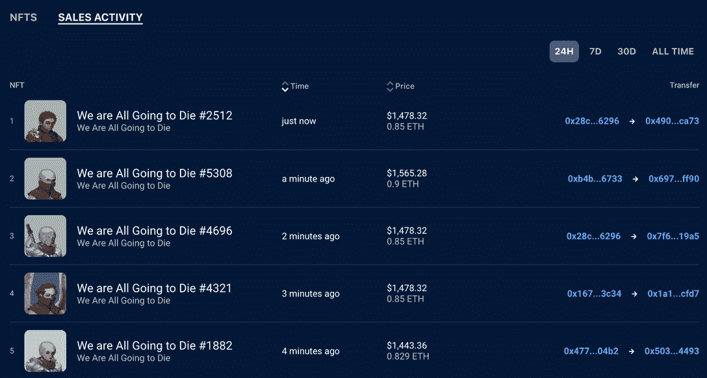

# 我们都要被变异猿烧死了

> 原文：<https://web.archive.org/web/https://dappradar.com/blog/we-are-all-going-to-die-burns-mutant-ape>

## 21 ETH NFT 牺牲在《权力的游戏》似的火仪式上

在有人花钱烧死了一只变异猿之后，我们都将死去成了本周的话题。这只猿猴价值 21 ETH(当时价值 36597 美元)，这一特技引起了人们的困惑、笑声和愤怒，因为人们试图弄清楚它为什么会发生。与其他似乎没有目的的新系列一样，这次焚烧背后的故事可能只是:一个值得讲述的好故事。

**总结**

*   ***6 月 6 日，我们都要以死来报答那些烧了他们的 NFT 的人。***
*   一名社区成员将一只变异猿烧成了一个燃烧的钱包，这个故事在网上获得了大量关注。
*   ***利用***[***【NFT 探险者】***](https://web.archive.org/web/20220630222035/https://dappradar.com/hub/nft-explorer) ***，我们可以看到*** [***我们都要死了***](https://web.archive.org/web/20220630222035/https://dappradar.com/hub/nft-explorer/collection/we-are-all-going-to-die/sales-activity) ***对于一个来得很快，不知道从哪里冒出来的集合来说，表现很好。***

NFT 世界弥漫着一种虚无主义的情绪。自从 [Terra 崩溃](https://web.archive.org/web/20220630222035/https://dappradar.com/blog/terra-validators-pause-network-as-luna-drops-to-zero/)和[地精出现](https://web.archive.org/web/20220630222035/https://dappradar.com/blog/what-is-goblin-town)以来，许多 web3 社区都有一种末日的氛围。也许是看到旧的方法不再奏效，新的项目忽略了规则，希望人们能在漫不经心的无政府状态中找到价值。

路线图、可见性、透明度和精心规划的铸造过程已经一去不复返。现在，新系列以缺乏清晰的沟通而自豪，它们背后的人正把保持隐蔽作为一种美德。团队正在免费分发他们的 NFT，效用的想法已经完全被抛到了九霄云外。

在这种鲁莽的背景下，听到[我们都要死了](https://web.archive.org/web/20220630222035/https://dappradar.com/hub/nft-explorer/collection/we-are-all-going-to-die)社区的一名成员烧死了一只价值 21 ETH 的[变异猿](https://web.archive.org/web/20220630222035/https://dappradar.com/hub/nft-explorer/collection/mutant-ape-yacht-club) NFT 也就不足为奇了。想到的第一个问题是，为什么？

## 变异猿祭祀篝火

故事的梗概很简单。我们都将死去是以太坊区块链上的 6666 个 NFT 的集合。该团队在 6 月 3 日免费分发了代币，从那时起，一枚代币的售价为 69.42 埃特，底价达到了 1.39 埃特的高度。谣传说这个项目已经进行了十个月了。其他人则认为它的推出过于仓促，[在妖精小镇的成功背后](https://web.archive.org/web/20220630222035/https://dappradar.com/blog/goblin-town-copycats-appear-in-dappradar-rankings)。

讲故事、传说和神话是《我们都将死去》吸引力的一大部分。有一个粉丝维基和一个强大的、专注的社区。美学是基于血和荣耀和出生通过火；想想《权力的游戏》的像素。焚烧 NFT(尤其是另一个收藏中的一个)的想法符合该项目的整体精神。

> 𝔗𝔥𝔢 21 𝔬𝔣 𝔱𝔥𝔢 𝔅𝔬𝔫𝔣𝔦𝔯𝔢 𝔴𝔦𝔩𝔩 𝔰𝔬𝔬𝔫 𝔪𝔞𝔨𝔢 𝔱𝔥𝔢𝔦𝔯 𝔪𝔞𝔯𝔨 𝔬𝔫 𝔱𝔥𝔦𝔰 𝔴𝔬𝔯𝔩𝔡. 𝔗𝔥𝔢𝔦𝔯 𝔰𝔞𝔠𝔯𝔦𝔣𝔦𝔠𝔢 𝔴𝔦𝔩𝔩 𝔟𝔢 𝔥𝔬𝔫𝔬𝔯𝔢𝔡 𝔴𝔦𝔱𝔥 𝔞 𝖌𝖗𝖆𝖓𝖉 𝖉𝖊𝖒𝖔𝖓𝖘𝖙𝖗𝖆𝖙𝖎𝖔𝖓 𝖔𝖋 𝖊𝖖𝖚𝖎𝖛𝖆𝖑𝖊𝖓𝖙 𝖊𝖝𝖈𝖍𝖆𝖓𝖌𝖊.
> 
> — 𝔚𝔢 𝔞𝔯𝔢 𝔄𝔩𝔩 𝔊𝔬𝔦𝔫𝔤 𝔱𝔬 𝔇𝔦𝔢 (@wagdie_eth) [June 6, 2022](https://web.archive.org/web/20220630222035/https://twitter.com/wagdie_eth/status/1533813914185699329?ref_src=twsrc%5Etfw)

Source: Twitter

6 月 6 日,《我们都要死了》宣布，它希望篝火“在这个世界上留下印记”。他们还说“他们的牺牲将以等价交换的盛大示范来表示敬意”。社区的工作是基于这样一种假设，即被烧毁的 NFT 的价值将会得到同等的回报。

一天后，6 月 7 日，变异猿#20438 被送去了一个烧化钱包。一次性钱包是一种普通的加密钱包，任何人都无法访问。这意味着猿被锁起来，永远失去了。烧纸钱包可以在这里找到[，你可以在这里](https://web.archive.org/web/20220630222035/https://opensea.io/BurnAddress)看到 NFT [。](https://web.archive.org/web/20220630222035/https://dappradar.com/hub/assets/eth/0x60e4d786628fea6478f785a6d7e704777c86a7c6/20438)

> 𝔏𝔢𝔱 𝔱𝔥𝔢 𝔞𝔰𝔥 𝔬𝔣 𝔱𝔥𝔦𝔰 𝔠𝔯𝔢𝔞𝔱𝔲𝔯𝔢 𝔟𝔢𝔠𝔬𝔪𝔢 𝔱𝔥𝔢 𝔰𝔱𝔞𝔯𝔱 𝔬𝔣 ℌ𝔢𝔯 𝔤𝔩𝔬𝔯𝔶.𝔗𝔥𝔢 𝔯𝔦𝔤𝔥𝔱 𝔬𝔣 𝔦𝔱𝔰 𝔭𝔬𝔴𝔢𝔯 𝔰𝔭𝔩𝔞𝔶𝔢𝔡 𝔬𝔲𝔱 𝔞𝔠𝔯𝔬𝔰𝔰 𝔱𝔥𝔢 𝔈𝔱𝔥𝔢𝔯.𝕷𝖔𝖓𝖌 𝕷𝖎𝖛𝖊 𝕳𝖊𝖗.[https://t.co/U9G6HbkRFl](https://web.archive.org/web/20220630222035/https://t.co/U9G6HbkRFl)
> 
> — 𝔚𝔢 𝔞𝔯𝔢 𝔄𝔩𝔩 𝔊𝔬𝔦𝔫𝔤 𝔱𝔬 𝔇𝔦𝔢 (@wagdie_eth) [June 7, 2022](https://web.archive.org/web/20220630222035/https://twitter.com/wagdie_eth/status/1533983956537856000?ref_src=twsrc%5Etfw)

[We are All Going to Die on the NFT Explorer](https://web.archive.org/web/20220630222035/https://dappradar.com/hub/nft-explorer/collection/we-are-all-going-to-die)

尽管有这些下降，平均销售价格仍然是健康的 1.16 ETH，如果我们看看最近的销售，最近有足够的交易活动表明，NFT 仍然有需求。在过去的一天里，销售额增长了 5.62%，更多像燃烧变异猿类这样的特技可能有助于在未来几周保持对该项目的兴趣。

[Sales activity for We are All Going to Die](https://web.archive.org/web/20220630222035/https://dappradar.com/hub/nft-explorer/collection/we-are-all-going-to-die/sales-activity)

## 基于叙事的非功能性写作的下一步是什么？

一系列引人注目的表演是否足以让这个系列保持强劲，还有待观察。关于我们都将死去的谣言正在网上悄悄流传，有更多的谣言可以提供给持有者，真正的效用可能会在未来几天或几周内揭晓。

请继续关注我们的[博客](https://web.archive.org/web/20220630222035/https://dappradar.com/blog/)和[推特](https://web.archive.org/web/20220630222035/https://twitter.com/DappRadar)订阅源，随着故事的展开，随时了解最新消息。用我们的 [NFT 探险家](https://web.archive.org/web/20220630222035/https://dappradar.com/hub/nft-explorer)和 [NFT 概览](https://web.archive.org/web/20220630222035/https://dappradar.com/nft)工具关注我们都将死去的表演。当观众转向一个新的故事，而故事不再足以吸引他们的注意力时，看看项目背后的团队如何驾驭即将到来的时期将是一件有趣的事情。

 NewsletterUnsubscribe at any time. [T&Cs](https://web.archive.org/web/20220630222035/https://dappradar.com/terms) and [Privacy Policy](https://web.archive.org/web/20220630222035/https://dappradar.com/privacy-policy)