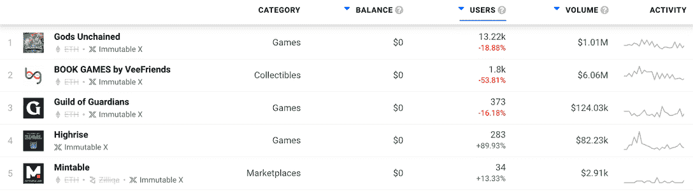
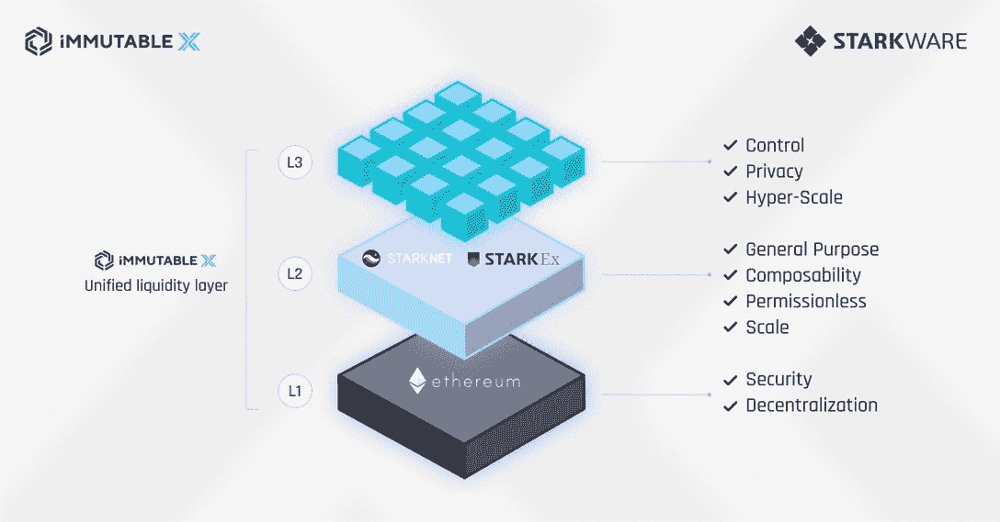

# Web3 游戏可以在不变的 X 和 StarkNet 上茁壮成长

> 原文：<https://web.archive.org/web/https://dappradar.com/blog/web3-games-can-thrive-on-immutable-x-and-starknet>

## StarkNet 被认为是以太坊扩展生态系统中最令人兴奋的项目之一

**区块链扩展公司 StarkNet 将与 Immutable X 合作，允许用户跨各种二层和三层网络无摩擦地交易 NFTs。这将意味着交易变得更加容易和顺畅，有利于个人玩家和整个社区。**

像游戏资产一样，公用事业 NFT 传统上一直难以在不损害分散化或安全性的情况下实现大规模的强大流动性。不可变 X 和 StarkNet 的目标是解决这些问题，让数百万用户在玩大型游戏时拥有自己的游戏内资产。

这种新的、增强的缩放解决方案允许玩家直接交易跨多个以太坊第二层和第三层汇总匹配的任何资产。因此，这解决了当今每个卷式解决方案都会出现的流动性细分问题。此外，这项创新有可能扩大到数十亿用户。

该协议将促进每秒数十万次交易，支持每天有数百万玩家拥有游戏中物品的游戏。或者至少，这是我的想法。随着 Illuvium，守护者协会，余烬剑，不变的 X 网络有一些有趣的产品排队。但是现有的游戏没有一个能吸引业界期待的数百万用户。

## 什么是不可变 X？

不可变 X 是一个高性能、特定于应用的 StarkEx ZK-roll up，有助于 NFT 和 ERC-20 的铸造、交易和转移。2022 年 4 月，超过 5000 万笔 NFT 在该平台上生成，而 Immutable 在 T2 处理的 NFT 交易比其他任何区块链或 L2 都多。

不变 X 上值得注意的[dapp 包括](https://web.archive.org/web/20221208085923/https://dappradar.com/rankings/protocol/immutablex)[被解放的神](https://web.archive.org/web/20221208085923/https://dappradar.com/immutablex/games/gods-unchained)、[守护者协会](https://web.archive.org/web/20221208085923/https://dappradar.com/immutablex/games/guild-of-guardians)，以及流行的 [NFT 市场 VeVe](https://web.archive.org/web/20221208085923/https://dappradar.com/immutablex/collectibles/veve) 。VeVe 在《回到未来》和《漫威漫画》等世界知名的知识产权收藏品交易中崭露头角。该网络非常专注于游戏和 NFT 项目，因此它不会试图与以太坊或其他协议竞争。相反，它正在将其定位为区块链游戏的中心，希望在不损害分散化和流动性的情况下扩大全球规模。

## 介绍 starnet

StarkNet 是一个 zk-rollup，但也允许开发人员部署定制的、可组合的 [CAIRO](https://web.archive.org/web/20221208085923/https://www.cairo-lang.org/) 智能合同，以及通过 [Warp](https://web.archive.org/web/20221208085923/https://github.com/NethermindEth/warp) 实现 EVM 兼容性的可靠性。StarkNet 被广泛认为是以太坊扩展生态系统中最令人兴奋的项目之一。此外，假设开发人员已经在第一层以太坊或另一个 EVM 兼容链(如 Polygon 或 BNB 链)上编写了智能合同，他们将能够在 L2 StarkNet 上传输和部署它们，只需进行最小的更改。Transpiling 是一个术语，指的是将一种语言编写的源代码转换成另一种具有类似抽象级别的语言。

这使得项目更容易从第 1 层迁移到第 2 层。虽然 StarkNet 仍然相对年轻，但它的 mainnet 已经运行了几个月，并拥有一个不断增长的 dapp 生态系统。

## 不可变 X 和 StarkNet 组合

首先，理解不可变 X 是一个旨在确保下一代 web3 游戏拥有全球扩展所需工具的平台是至关重要的。对于 dapp 开发者来说，如果你的项目需要复杂的 DeFi 交互，你可能会想要使用 StarkNet。如果你的游戏不使用复杂的机制，而是更直接地专注于游戏性，StarkEx 通常会提供更好的用户和开发者体验。

此外，一些项目可能希望将部分项目部署到 StarkNet，部分项目部署到 StarkEx。越来越常见的是，看到不可变 X 上的项目在 L1 上执行其资产或令牌启动，以利用该环境中的优势。

Immutable X 将在 StarkNet 上提供他们的整个产品套件，包括其订单簿、铸造工具、交易原语、钱包、市场等，以实现这一目标。除了现有的特定于应用程序的汇总。这意味着 CAIRO 签订铸造、交易和销售 NFT 的合同，由一个产品生态系统提供支持，该生态系统在 IMX 支持的卷上抽象出 NFT 之间的差异。

此外，每笔交易的一部分费用，只要是通过不可变的 X 序列器处理的，都将与 IMX 赌注奖励共享。为了更加清晰，请看下面的图表——不可变的是平台，而不仅仅是汇总。

## starnet 可以消除开发者的权衡

有了 StarkNet，开发者将能够部署定制的、可组合的智能合约，让项目很容易快速地将第一层 dapp 游戏迁移到不可变的 X。首先，Immutable X 将为拥有超过 1000 万活跃用户的游戏提供第三层，这些游戏需要专用吞吐量，并且不想与其他 dapps 争夺容量。

“这是以太坊的未来——用于不同目的和游戏的多个易拉宝，每个易拉宝都通过不可变的 X 进行抽象和统一的流动性——同时永远不会损害以太坊的安全性，”不可变的联合创始人 Robbie Ferguson 说。“下一个十亿玩家可以跨越数百个第三层，同时永远不会失去流动性和可组合性，这使得以太坊成为全球最强的区块链网络。安全、可组合、可扩展:欢迎使用 L323。”他继续说道。

以太坊仍然是游戏和 dapp 开发者的首选，Immutable X 专注于将世界上最好的游戏带到以太坊。然而，到目前为止，任何需要规模和可组合性的 dapp 游戏项目都别无选择，只能在一个可能不太安全的非以太坊第 1 层上启动。不可变 X 的使命是确保开发者不必在以太坊的安全性和流动性以及游戏的 UX 之间做出选择。

StarkNet 作为一个新的结算环境集成到 Immutable X 上，消除了许多以前开发人员的权衡，包括缺少定制智能契约、从第 1 层到第 2 层的复杂迁移以及可组合性。

此外，对 Immutable X 平台的这一更新将允许流动性在这些二层和三层环境之间自由流动。以太坊上最大的游戏可以不受限制地构建，并达到真实世界的规模。

目前有许多项目正在开发中，预示着 web3 游戏令人兴奋的未来。尽管每个项目都旨在创造出色的用户体验，并构建繁荣、长期的经济，但每个项目都有不同的要求。

 NewsletterUnsubscribe at any time. [T&Cs](https://web.archive.org/web/20221208085923/https://dappradar.com/terms) and [Privacy Policy](https://web.archive.org/web/20221208085923/https://dappradar.com/privacy-policy)