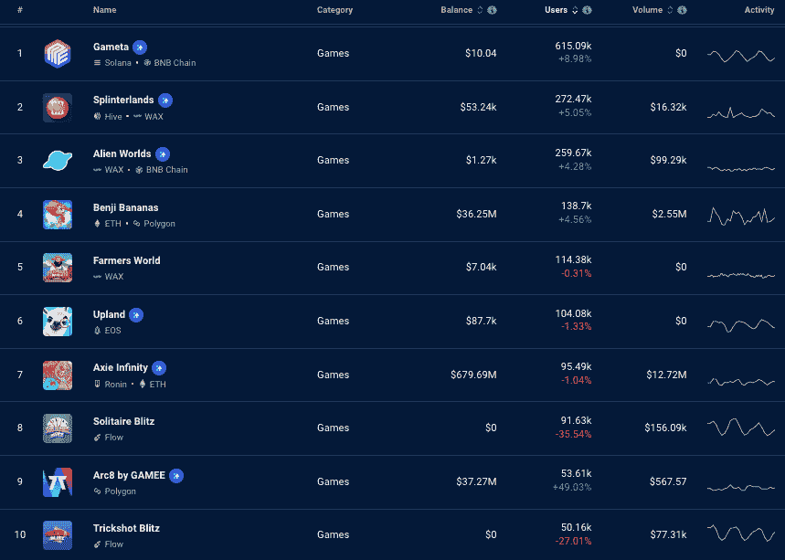

# Web3 手游为区块链带来百万用户

> 原文：<https://web.archive.org/web/https://dappradar.com/blog/web3-mobile-games-bring-millions-of-users-to-blockchain>

## 每周洞察区块链和 Web3 应用

**在过去的七天里，超休闲移动区块链游戏已经将超过 170 万用户从 Web2 带入 We b3 游戏。DappRadar 上目前排名前十的区块链游戏中有八个是移动优先的，让玩家收集可以在游戏中使用或兑换现金的奖励。**

如果你在区块链寻找下一个 Spotify、谷歌或亚马逊， [DappRadar 可以帮助](https://web.archive.org/web/20230119162810/https://dappradar.com/blog/tag/dapp-trends)我们每周[的 Dapp 趋势文章](https://web.archive.org/web/20230119162810/https://dappradar.com/blog/tag/dapp-trends)。各种类别和垂直领域发生了如此多的事情，关键是要知道哪些[区块链](https://web.archive.org/web/20230119162810/https://dappradar.com/rankings/protocol/fuse)、[游戏](https://web.archive.org/web/20230119162810/https://dappradar.com/rankings/category/games)、[金融 dapp](https://web.archive.org/web/20230119162810/https://dappradar.com/rankings/category/defi)和 [NFT 项目](https://web.archive.org/web/20230119162810/https://dappradar.com/blog/ten-things-everybody-should-know-about-nfts/)出于正确的原因产生了价值并赢得了观众。

在大规模采用区块链技术的道路上， [crypto 和解决用户登陆谜题的融入 NFT 的游戏](https://web.archive.org/web/20230119162810/https://dappradar.com/rankings/category/games)将发挥关键作用。像 [Gameta](https://web.archive.org/web/20230119162810/https://dappradar.com/multichain/games/gameta) 、 [Benji Bananas](https://web.archive.org/web/20230119162810/https://dappradar.com/multichain/games/benji-bananas) 、 [Upland](https://web.archive.org/web/20230119162810/https://dappradar.com/eos/games/upland) 和 [Trickshot Blitz](https://web.archive.org/web/20230119162810/https://dappradar.com/flow/games/trickshot-blitz) 这样的 Dapp 游戏让任何拥有移动设备的人在几乎没有先验知识、投资或风险的情况下获得密码。

使用超休闲手机游戏等日常活动作为诱饵，可以确保用户在互动时找到乐趣，而可靠的令牌组学可以鼓励日常使用和保留。

*   [游戏灵活区块链理工大学](https://web.archive.org/web/20230119162810/https://dappradar.com/blog/web3-mobile-games-bring-millions-of-users-to-blockchain/#Games-flex-blockchain-tech-)
*   谁不在手机上？
*   谁在使用安卓系统？
*   谁在 iOS 上？
*   [不全是钱](https://web.archive.org/web/20230119162810/https://dappradar.com/blog/web3-mobile-games-bring-millions-of-users-to-blockchain/#Not-all-about-money-)
*   [dapps 的进化](https://web.archive.org/web/20230119162810/https://dappradar.com/blog/web3-mobile-games-bring-millions-of-users-to-blockchain/#Evolution-of-dapps-)
*   [如何在移动区块链游戏中赚取](https://web.archive.org/web/20230119162810/https://dappradar.com/blog/web3-mobile-games-bring-millions-of-users-to-blockchain/#How-to-earn-in-mobile-blockchain-games-)
*   [总结](https://web.archive.org/web/20230119162810/https://dappradar.com/blog/web3-mobile-games-bring-millions-of-users-to-blockchain/#Summary)

## 游戏灵活区块链理工大学

正如 DeFi 的夏天给了我们更精细的金融和收益生成机制，并为大众开放了分散金融一样，区块链游戏通过休闲游戏让数百万人加入了 Web3。

廉价而快速的微交易、超快的加载时间、稳定的令牌模型和流畅的 UX 对于任何区块链游戏来说都是吸引用户的关键，更重要的是，留住用户。更有趣的是游戏如何测试区块链技术的新领域，如游戏内聊天和本地市场，以及向移动优先游戏的转移。

区块链奥运会受欢迎程度上升的另一个原因是“熊流血，牛奔跑”这句谚语在熊市中积累密码和投资在牛市中会有回报的想法在这一点上几乎被证明了。游戏玩家似乎已经抓住了一个他们认为是进入 Web3 的切入点的媒介。趋势很明显，80%的[十大区块链游戏](https://web.archive.org/web/20230119162810/https://dappradar.com/rankings/category/games)都有移动应用。

## 谁不在手机上？

*   [Axie Infinity](https://web.archive.org/web/20230119162810/https://dappradar.com/multichain/games/axie-infinity) (可从 app storess 下载，但不可从 app store 下载)
*   [外星世界](https://web.archive.org/web/20230119162810/https://dappradar.com/multichain/games/alien-worlds)(仅适用于桌面，适用于移动设备，但未优化)

## 谁在用安卓？

*   [Gameta](https://web.archive.org/web/20230119162810/https://dappradar.com/multichain/games/gameta)
*   [夹板垫](https://web.archive.org/web/20230119162810/https://dappradar.com/multichain/games/splinterlands)
*   [石基香蕉](https://web.archive.org/web/20230119162810/https://dappradar.com/multichain/games/benji-bananas)
*   [农民世界](https://web.archive.org/web/20230119162810/https://dappradar.com/wax/games/farmers-world)
*   [高地](https://web.archive.org/web/20230119162810/https://dappradar.com/eos/games/upland)
*   [孤独闪电](https://web.archive.org/web/20230119162810/https://dappradar.com/flow/games/solitaire-blitz)
*   [Arc8 by Gamee](https://web.archive.org/web/20230119162810/https://dappradar.com/polygon/games/arc8-by-gamee-1)
*   [特技闪电战](https://web.archive.org/web/20230119162810/https://dappradar.com/flow/games/trickshot-blitz)

## 谁在 iOS 上？

*   [夹板垫](https://web.archive.org/web/20230119162810/https://dappradar.com/multichain/games/splinterlands)
*   [石基香蕉](https://web.archive.org/web/20230119162810/https://dappradar.com/multichain/games/benji-bananas)
*   [旱地](https://web.archive.org/web/20230119162810/https://dappradar.com/eos/games/upland)
*   [孤独闪电](https://web.archive.org/web/20230119162810/https://dappradar.com/flow/games/solitaire-blitz)
*   [Arc8 by Gamee](https://web.archive.org/web/20230119162810/https://dappradar.com/polygon/games/arc8-by-gamee-1)
*   [特技闪电战](https://web.archive.org/web/20230119162810/https://dappradar.com/flow/games/trickshot-blitz)

有趣的是，[外星世界](https://web.archive.org/web/20230119162810/https://dappradar.com/multichain/games/alien-worlds)和 [Axie Infinity](https://web.archive.org/web/20230119162810/https://dappradar.com/multichain/games/axie-infinity) 这两款 OG 游戏在各自的应用商店中都没有手机应用。然而，Axie 有[的变通办法](https://web.archive.org/web/20230119162810/https://axieinfinity.com/)，该团队也正在开发一个官方的 Axie Infinity 应用。

《异形世界》于 2020 年初推出，正值 NFT 和区块链游戏炒作拉开序幕。其简单的机制允许玩家在探索行星时挖掘其本土令牌 TLM。过去，它被指责为严重的 bot 驱动。尽管如此,《外星世界》在 DappRadar 上的用户排名中保持了前 10 名的位置，并且即将有大量更新。

[https://web.archive.org/web/20230119162810if_/https://www.youtube.com/embed/NIGbNR5XUgg?feature=oembed](https://web.archive.org/web/20230119162810if_/https://www.youtube.com/embed/NIGbNR5XUgg?feature=oembed)

这两款游戏承载了更多的 OG 身份；因此，当新的进入者不断到来时，他们保持他们的表现也就不足为奇了。更有趣的是，看看他们是否能保持健康，不断增加观众，同时扩大游戏，使其保持新鲜和迷人。

## 不全是钱的问题

这里一个重要的细微差别是，休闲手机游戏传统上吸引那些希望通过有趣的机制来消磨时间的用户。声音、图像和关卡进展的可行性在游戏的上瘾性中扮演了他们的角色。赚钱是关键。另一方面，原生加密玩家看到了硬币的两面。

最近，我们在区块链附近的[上看到了两个突破性的游戏](https://web.archive.org/web/20230119162810/https://dappradar.com/rankings/protocol/near)分别是[纸牌闪电战](https://web.archive.org/web/20230119162810/https://dappradar.com/flow/games/solitaire-blitz)和[特技闪电战](https://web.archive.org/web/20230119162810/https://dappradar.com/flow/games/trickshot-blitz)。这两款游戏来自 Joyride Games，用 RLY 代币奖励玩家，这些代币[可以用来兑换菲亚特](https://web.archive.org/web/20230119162810/https://www.youtube.com/watch?v=AQ-EX5qVfjo)。它们专为移动设备打造，可在 iOS 和 Android 上使用。在过去的 30 天里，他们负责超过 75 万活跃的区块链游戏用户。

另一个例子是将免费的手机游戏 [Benji Bananas 转变为一个游戏赚取游戏](https://web.archive.org/web/20230119162810/https://dappradar.com/multichain/games/benji-bananas)，奖励用户令人垂涎的 APE 币，这是宇迦实验室和 Bored Ape 生态系统的产物。

[<picture></picture>](https://web.archive.org/web/20230119162810/https://dappradar.com/blog/how-to-play-and-win-benji-bananas)

此外，这些游戏的机制是众所周知和受欢迎的，不会产生任何巨大的语言障碍。Benji Bananas 是一个无休止的跑步者，Solitaire 可能是世界上最久经考验的游戏机械师，也是一个久经考验的时间传递者，而 PVP pool 则是由具有挑战性的物理和对胜利的渴望驱动的。

## 随身携带您的 Web3 之旅

使用 DappRadar 移动应用程序，再也不会错过 Web3。查看最受欢迎的 dapps 的性能，并关注您投资组合中的 NFT。您在 DappRadar 上的帐户会与我们的移动应用程序同步，这样您很快就可以选择实时接收提醒。

[Download the DappRadar app now](https://web.archive.org/web/20230119162810/https://dappradar.app.link/blog)[<picture></picture>](https://web.archive.org/web/20230119162810/https://play.google.com/store/apps/details?id=com.portfolio.dappradar)

## dapps 的进化

在 DappRadar，我们认识到玩家判断游戏的能力 dapp 需要的不仅仅是原始数据。我们正在努力改进区块链游戏跟踪，并提供更全面的信息。正在讨论的想法包括显示玩家评论、玩游戏所需的初始投资以及游戏的盈利潜力。

虽然玩简单游戏的免费代币听起来很有吸引力，但除非从一开始就实施严格的经济控制，否则这是不可持续的，因此，在过去的 18 个月里，我们看到了无数游戏的兴衰。

他们要么欺骗玩家，要么根本无法让象征经济学持续下去。这种性质的 Dapps 需要产生收入来继续分发免费代币。

像 Axie Infinity 这样的 OG 游戏也改进了他们的令牌组学模型，因为进入成本和 SLP 的价格变得太高，迫使玩家转向别处。更不用说 Axie Infinity 背后的团队 Sky Mavis 制作了其[罗宁·区块链和武士刀 DEX](/web/20230119162810/https://dappradar.com/blog/axie-infinity-engages-lift-off-katana-dex-shows-comeback/) 来促进 Axie 和任何未来游戏最具成本效益和效率的可能。

## 如何在移动区块链游戏中赚钱

大多数手机友好的区块链游戏基于内部令牌或珠宝提供游戏内奖励，以绕过应用商店关于加密和非功能性传输的规则和规定。例如， [VeVe NFT 市场](/web/20230119162810/https://dappradar.com/blog/veve-nft-marketplace-to-allow-users-to-cash-out/)使用价值相当于一美元的宝石。

这使得游戏可以奖励玩家一种虚拟的游戏内货币，他们可以在应用程序中消费和使用，或者兑换成法定现金。获取奖励通常需要下载或登录不同的平台，并将两者同步。这个过程也需要尽可能的顺利。

## 摘要

“游戏”这个词对不同的人有不同的含义。对于那些习惯了数百万美元的 3a 游戏的人来说，[区块链游戏](https://web.archive.org/web/20230119162810/https://dappradar.com/rankings/category/games)几乎肯定不会成功。尽管这方面的事情正在进展，但我们目前看到的游戏让人想起 2010 年初的手机游戏，并且大多显示简单有趣的游戏机制，由友好的 UX 和良好的设计水平支持。

[https://web.archive.org/web/20230119162810if_/https://www.youtube.com/embed/f_OA0eHPWhc?start=1632&feature=oembed](https://web.archive.org/web/20230119162810if_/https://www.youtube.com/embed/f_OA0eHPWhc?start=1632&feature=oembed)

Catch Robert’s latest gaming alpha!

可以说，区块链应用程序和加密货币的大规模采用只有在[复杂的区块链程序](/web/20230119162810/https://dappradar.com/blog/how-to-start-using-defi-dapps-and-crypto-wallets-on-solana/)被抽象出来，用户可以在几秒钟内上线后才能实现。虽然 DeFi 为该行业提供了更复杂的金融工具，但它在缓解用户的入门之旅方面几乎没有什么作用。

[区块链游戏](https://web.archive.org/web/20230119162810/https://dappradar.com/rankings/category/games)可能是释放区块链、智能合同和财务独立的真正潜力的关键。随着以移动为先的游戏在 2022 年大量涌现，推动创纪录数量的用户使用 dapps，我们可以预计 2023 年会更加有趣。

 NewsletterUnsubscribe at any time. [T&Cs](https://web.archive.org/web/20230119162810/https://dappradar.com/terms) and [Privacy Policy](https://web.archive.org/web/20230119162810/https://dappradar.com/privacy-policy)

***以上不构成投资建议。此处给出的信息仅供参考。请行使尽职调查，做你的研究。作者持有多种加密货币的头寸，包括 BTC、瑞士法郎和雷达。***