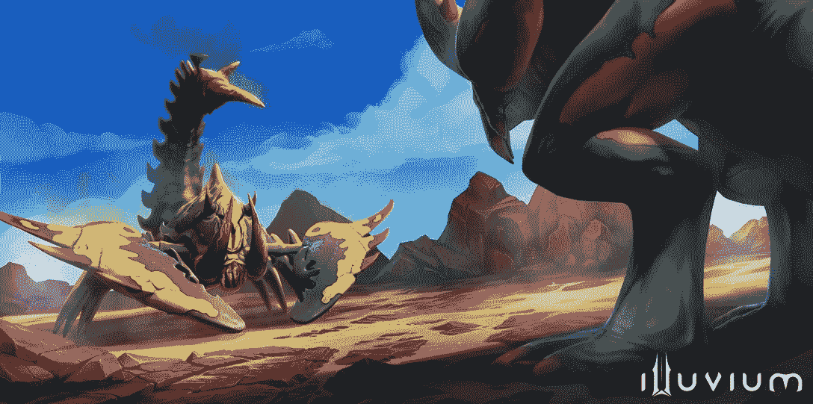

# 如何玩和赢:伊鲁威姆

> 原文：<https://web.archive.org/web/https://dappradar.com/blog/welcome-to-illuvium-an-nft-powered-game-and-strange-new-virtual-world-to-explore>

## 将 Web3 游戏带入未来的 AAA 级游戏

Illuvium 是一款开放世界的奇幻 RPG 游戏，玩家可以在其中战斗并捕捉被称为 Illuivials 的生物。开发人员已经开发这个游戏很长时间了，Web3 社区认为这个项目是通向大规模采用的一大步。现在，随着其私人测试版 Overworld 的发布，是时候看看这个游戏了，看看它是如何工作的。

**内容**

*   *[什么是冲积物？](https://web.archive.org/web/20221229065555/https://dappradar.com/blog/welcome-to-illuvium-an-nft-powered-game-and-strange-new-virtual-world-to-explore/#what-is)*
*   *[游戏如何入门](https://web.archive.org/web/20221229065555/https://dappradar.com/blog/welcome-to-illuvium-an-nft-powered-game-and-strange-new-virtual-world-to-explore/#get-started)*
*   *[如何打胜仗](https://web.archive.org/web/20221229065555/https://dappradar.com/blog/welcome-to-illuvium-an-nft-powered-game-and-strange-new-virtual-world-to-explore/#play-and-win)*
*   *[是什么让游戏具有创新性？](https://web.archive.org/web/20221229065555/https://dappradar.com/blog/welcome-to-illuvium-an-nft-powered-game-and-strange-new-virtual-world-to-explore/#what-innovative)*
    *   *[令牌](https://web.archive.org/web/20221229065555/https://dappradar.com/blog/welcome-to-illuvium-an-nft-powered-game-and-strange-new-virtual-world-to-explore/#tokens)*
    *   *[NFT 人物](https://web.archive.org/web/20221229065555/https://dappradar.com/blog/welcome-to-illuvium-an-nft-powered-game-and-strange-new-virtual-world-to-explore/#nft-characters)*
*   *[冲积层路线图上有什么？](https://web.archive.org/web/20221229065555/https://dappradar.com/blog/welcome-to-illuvium-an-nft-powered-game-and-strange-new-virtual-world-to-explore/#illuvium-roadmap)*
*   *[有用链接](https://web.archive.org/web/20221229065555/https://dappradar.com/blog/welcome-to-illuvium-an-nft-powered-game-and-strange-new-virtual-world-to-explore/#useful-links)*

球迷们已经等了几场比赛，就像他们等伊鲁维姆一样兴奋。标题已经在管道中有一段时间了，从我们捕捉到的罕见的一瞥来看，它似乎值得等待。

Illuvium 在 GAM3 颁奖典礼上获得了最佳 RPG 奖，这只会增加看到完整版本即将推出的呼声。

[https://web.archive.org/web/20221229065555if_/https://www.youtube.com/embed/SNl4tofTzmM?feature=oembed](https://web.archive.org/web/20221229065555if_/https://www.youtube.com/embed/SNl4tofTzmM?feature=oembed)

Overworld explainer

[Explore Illuvium Data](https://web.archive.org/web/20221229065555/https://dappradar.com/multichain/games/illuvium-1)

## 什么是 Illuivum？

建立在以太坊缩放协议不变 X 的基础上，Illuvium 是一个 3D 开放世界，玩家可以探索并积极塑造它。Illuvium 分散自治组织(DAO)正在开发游戏。

这个游戏主要是围绕着寻找和捕捉被称为 Illuvials 的奇怪野兽。玩家可以使用聚集的 Illuvials 来对抗其他玩家的生物。同时，玩家在战斗中的成功会获得奖励。

该游戏内置于虚幻引擎 5，游戏图形的黄金标准。它尤其擅长渲染动态生态系统中的大量细节环境、角色和其他项目。

## 如何在游戏中入门

今天就开始玩 Overworld public，[去 Illuvium 网站](https://web.archive.org/web/20221229065555/https://illuvium.io/?utm_source=DappRadar&utm_medium=deeplink&utm_campaign=visit-website)开始点击注册测试版或探索 over old。你将有机会注册参加游戏，一旦有空位，你将有机会进入游戏。

一旦 Illuvium 通知你可以玩，按照简单的指示，你将捕捉和战斗 Illuvium。这款游戏对 Mac 和 Windows 用户开放。你将需要一个不可变的支持 X 的钱包来玩 Illuvium。

[Find Immutable X Games](https://web.archive.org/web/20221229065555/https://dappradar.com/rankings/protocol/immutablex/category/games)

## 如何玩赢伊鲁威

Illuvium 在 0 层世界区域以免费模式开始，玩家可以在那里熟悉游戏玩法。然而，要开始从更高等级的地区收集 Illuvium NFTs，玩家必须选择付费版本。

游戏将玩家置于一个宇宙飞船坠毁后的外星世界，那里有极端和不稳定的天气，多样的风景和奇怪的生物。一旦他们登陆，玩家需要探索这个世界，捕捉生物，并发现方尖碑，以加快他们在地图上的旅行。玩家根据自己的喜好定制他们的主角。

有超过 100 种不同类型的火山在广阔的火山世界中漫游。游戏制作者将他们分成了几个具有不同亲和力和能力的类别。玩家可以在战斗中组合他们的战斗野兽以获得更好的胜算，或者他们可以将三个完全等级的 Illuvials 融合成一个更强大的单位。

[https://web.archive.org/web/20221229065555if_/https://www.youtube.com/embed/mzT88eN4gts?start=26&feature=oembed](https://web.archive.org/web/20221229065555if_/https://www.youtube.com/embed/mzT88eN4gts?start=26&feature=oembed)

### 人物

这五个职业是守护者、战士、盗贼、心灵术士和心灵感应。还有五种亲缘关系:水、土、火、气和自然(例如地球心灵术士)。此外，最多可以堆叠和组合两种亲合性以用于加电。玩家在他们的加密钱包中保存他们在区块链捕获的 Illuvial NFTs。在游戏中，他们将角色存储在碎片中。碎片的强度各不相同，更强的碎片能够支持更强大的 Illuvials。

### 战场

伊鲁威战役发生在等级竞技场和利维坦竞技场。玩家可以在捕捉到想要使用的光焰后进入配对队列。在后者中，玩家可以互相挑战，观众可以打赌谁是赢家。

战斗在自动战斗模式下进行，这意味着玩家不能在战斗中手动控制他们的光晕。他们只能在战斗开始前选择角色、武器和盔甲，这是影响战斗成功的唯一方法。

Illuvials do battle

除了 Illuvium 游戏，玩家还可以加入 Illuvium: Zero，在那里他们可以建造自己的工业综合体，并让它与基础 Illuvium 游戏互动。要创建这个综合体，玩家需要在他们的土地上耕种资源。

## 是什么让游戏具有创新性？

### 代币

该 Illuvium 游戏具有两个 ERC-20 代币:

*   ILV (Illuvium) 允许玩家从事产量耕作，打桩，以及 Illuvium DAO 治理。

*   sILV 帮助运行游戏，只能用于游戏内的购买。

用户可以通过 ILV 或西尔维获得奖励。在 ILV 接受奖励的人需要等待一年的锁定期，才能获得代币。这就是为什么 Illivium 可以确保 ILV 和其他硬币之间交易对的高流动性。在 sILV 中选择奖励的玩家会立即收到奖励。

[Check ILV Token Price](https://web.archive.org/web/20221229065555/https://dappradar.com/hub/token/eth/ILV?from=0x767fe9edc9e0df98e07454847909b5e959d7ca0e)

### NFT 人物

Illuvials 和其他游戏中的项目(武器，盔甲等。)在不可变的 X 上被表示为 Illuvium NFTs，并且具有真实世界的值。和大多数非功能性食物一样，越是强大、稀有和受欢迎的沉积物，ILV 就越值钱。这款游戏由伊鲁威姆·道(Illuvium DAO)制作，还包括一系列宣传和化妆用的 NFT，包括 Cosplay 和 Genesis 宣传套装，以标志着伊鲁威姆之旅的开始。

## 伊鲁维路线图上有什么？

作为首批真正的 AAA 级 Web3 视频游戏之一，人们对 Illuvium 的期望很高。从路线图来看，团队从项目开始就一直在努力工作，并且已经完成了几个重要的步骤。

这些包括原型开发，虚幻引擎过渡，令牌智能合同创建，第一部电影预告片，以及 V1 和 V2 的产量农场合同。

路线图中即将到来的里程碑包括:

*   私人 beta Overworld 的完成。
*   发布手机版游戏。
*   第二个主要的火山名称——关于这个神秘里程碑的消息还没有发布，但是听起来很令人兴奋。

[Explore Web3 Games](https://web.archive.org/web/20221229065555/https://dappradar.com/rankings/category/games)

## 有用的链接

*   [冲积物数据](https://web.archive.org/web/20221229065555/https://dappradar.com/multichain/games/illuvium-1)
*   [ILV 代币价格](https://web.archive.org/web/20221229065555/https://dappradar.com/hub/token/eth/ILV?from=0x767fe9edc9e0df98e07454847909b5e959d7ca0e)
*   [探索 Web3 游戏](https://web.archive.org/web/20221229065555/https://dappradar.com/rankings/category/games)
*   [寻找其他不可变的 X dapp](https://web.archive.org/web/20221229065555/https://dappradar.com/rankings/protocol/immutablex)

## 随身携带您的 Web3 之旅

使用 DappRadar 移动应用程序，再也不会错过 Web3。查看最受欢迎的 dapps 的性能，并关注您投资组合中的 NFT。您在 DappRadar 上的帐户会与我们的移动应用程序同步，这样您很快就可以选择实时接收提醒。

[Download the DappRadar app now](https://web.archive.org/web/20221229065555/https://dappradar.app.link/blog)[<picture></picture>](https://web.archive.org/web/20221229065555/https://play.google.com/store/apps/details?id=com.portfolio.dappradar)