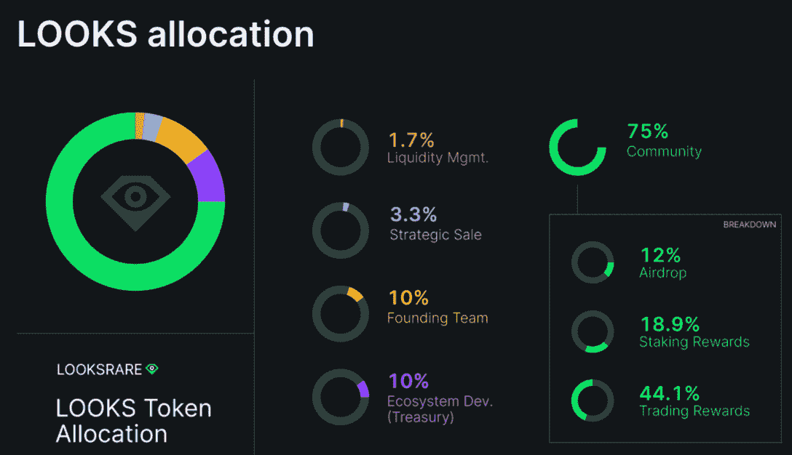
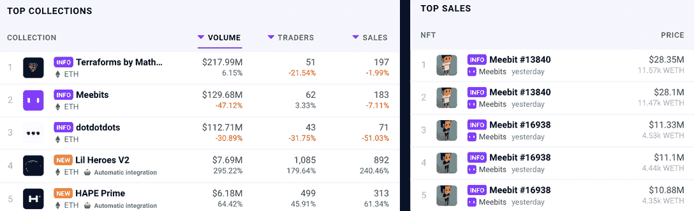
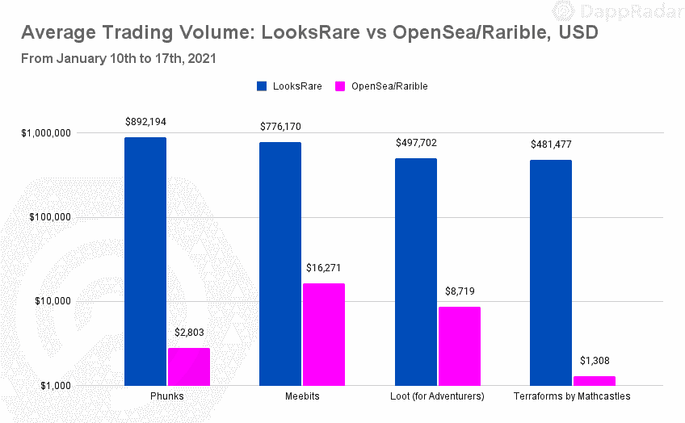
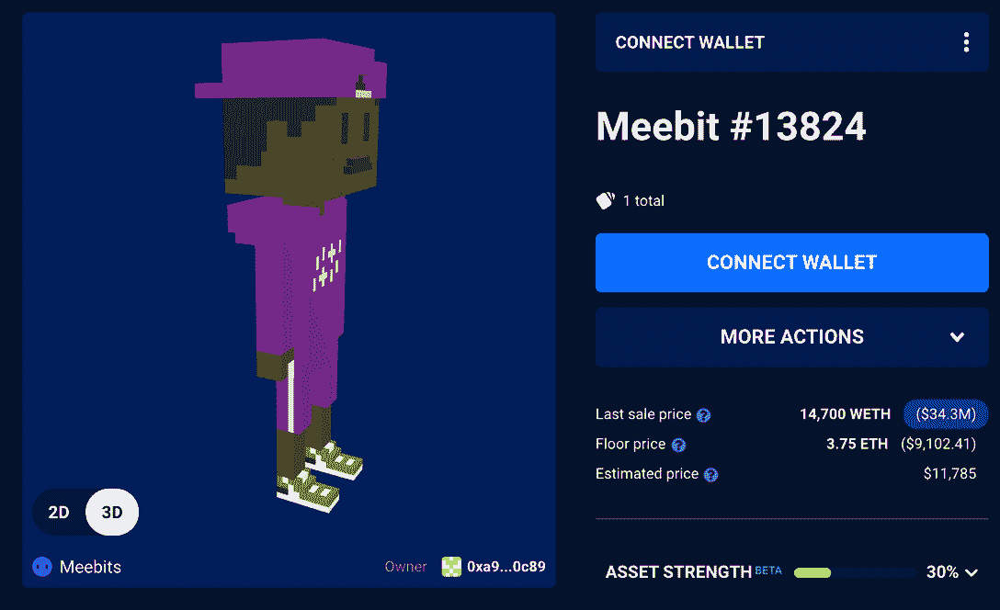
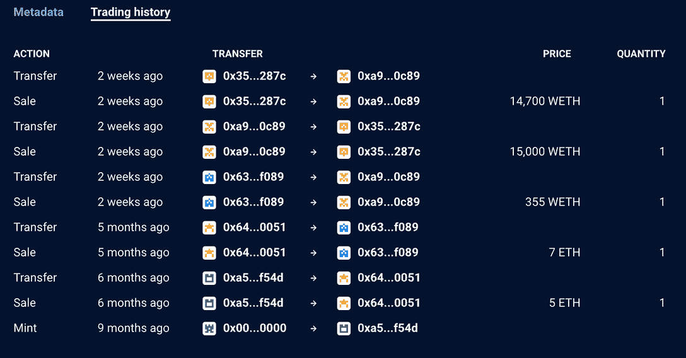
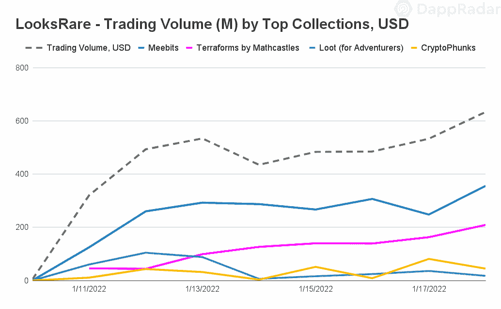
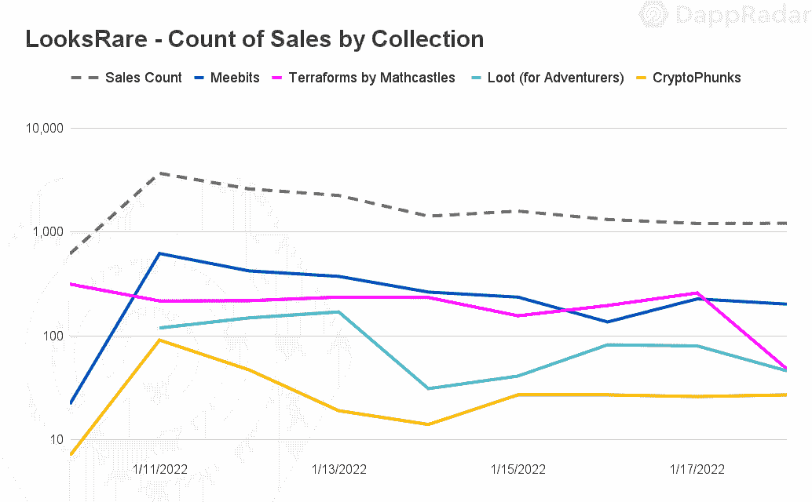
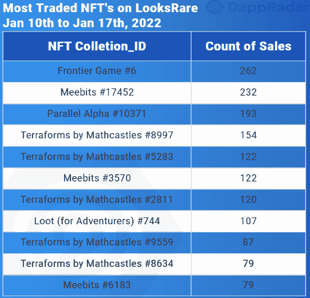
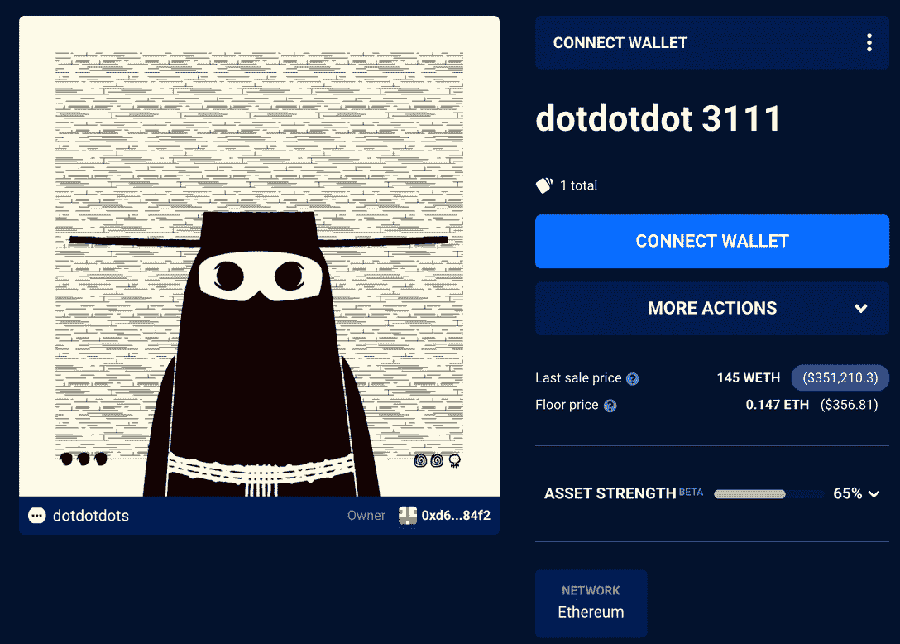
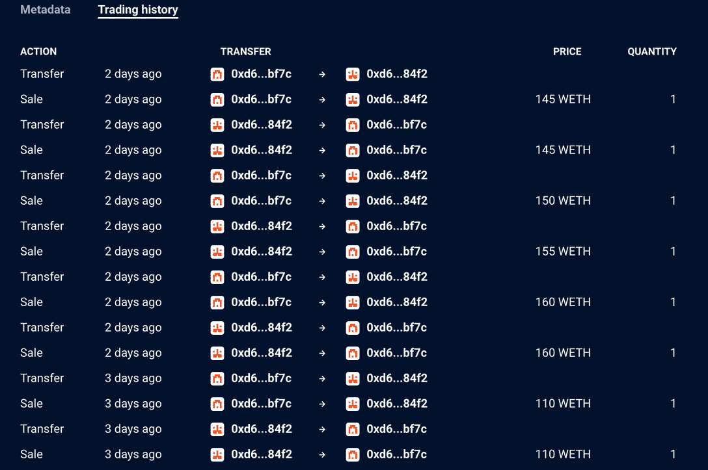

# 鲸鱼报道 LooksRare 奖励吸引了鲸鱼吗？

> 原文：<https://web.archive.org/web/https://dappradar.com/blog/whale-report-are-looksrare-rewards-attracting-whales>

## 鲸鱼在多大程度上参与了 LooksRare 上的人工交易？

以下文件属于一系列报告，这些报告分析了链上指标，以确定鲸鱼引起的模式。这一次，我们将注意力转移到以太坊的 NFT 市场 looks area 上的活动，旨在回答以下问题:looks area 奖励吸引了鲸鱼活动吗？

***whale 是一个术语，指持有大量特定资产(crypto 或 NFTs)的个人或实体。鲸鱼运动是一个简单的信号，它可以根据交易的规模、幅度、来源和目的地，显著影响加密或 NFT 资产的价格。***

自 1 月 10 日推出以来，以太坊 [NFT 市场 LooksRare 已经席卷了整个市场。凭借可靠的社区驱动方法和 2%的固定交易费，LooksRare 的表现远远超过了业内任何其他市场。自推出两周以来，它已经产生了比 OpenSea 多 153%的交易量，并在同期产生了超过 2600 万 LOOKS(1.04 亿美元)的交易回报。](/web/20221201193524/https://dappradar.com/blog/looksrare-nft-marketplace-hit-by-wash-trading-amidst-airdrop/)

LooksRare 上的巨大数字背后的驱动力是特定用户进行的人为交易，以刺激 LOOKS token 奖励。这些运动往往带有显著的货币价值，因此与鲸鱼活动有关。

但是 LooksRare 到底是如何激励这种行为的呢？以及鲸鱼在多大程度上参与了人工交易？

## 关键要点

*   从 1 月 10 日起，LooksRare 的平均交易规模为 201，000 美元，而同期 OpenSea 的交易规模为 950 美元。
*   自 1 月 10 日推出以来，LooksRare 已经创造了 47 亿美元的收入；其中 23%(11 亿美元)来自两个钱包之间的交易活动。
*   LooksRare 上交易量最大的四个 NFT 藏品的主要持有人(鲸鱼)没有参与任何人为的交易活动。
*   密比特、战利品、地形和隐蝠高度参与人工活动；涉及 Meebits 的交易的平均售价超过 769，000 美元。

## 目录

*   [长相奖励刺激高端交易](https://web.archive.org/web/20221201193524/https://dappradar.com/blog/whale-report-are-looksrare-rewards-attracting-whales/#LOOKS-rewards-stimulate-high-end-transactions-)
*   [旁观交易平均价值 201，000 美元](https://web.archive.org/web/20221201193524/https://dappradar.com/blog/whale-report-are-looksrare-rewards-attracting-whales/#Trades-on-LooksRare-worth-$201,000-on-average)
*   [深潜](https://web.archive.org/web/20221201193524/https://dappradar.com/blog/whale-report-are-looksrare-rewards-attracting-whales/#The-deep-dive)
*   长相奖励是在引诱 NFT 鲸吗？
*   [发现人为交易模式](https://web.archive.org/web/20221201193524/http://spotting-artificial-trading-patterns/)
*   [结论](https://web.archive.org/web/20221201193524/https://dappradar.com/blog/whale-report-are-looksrare-rewards-attracting-whales/#Conclusion)

## 奖励刺激高端交易

LooksRare 是一个基于以太坊的 NFT 市场。dapp 的核心前提是奖励使用该平台的 NFT 交易社区一个基础令牌，看起来——刺激交易活动——可以说是将焦点从领先市场 OpenSea 转移开所必需的。

根据 2021 年 6 月 16 日至 12 月 16 日期间在 OpenSea 上注册的用户交易活动，LOOKS 可以以不同的比例声称是空投。1.2 亿枚[LOOKS 代币最初被分配给社区，其中 78%已经被超过 116，000 个独特的钱包认领。](/web/20221201193524/https://dappradar.com/blog/looksrare-nft-marketplace-token-airdrop-is-live/)

*LOOKS token allocation structure*; **source:** LooksRare

长相最有趣的一面是市场设计的奖励模式。首先，LooksRare 增加了一个诱人的被动收入因素，高赌注，自动复利收益率超过 500%的 APY 写作。重要的是，在平台内下注的人有资格获得适用集合(交易量超过 1，000 ETH 的集合)产生的 2%交易费的总份额，不包括私人销售。

通过这种方式，买方和卖方在交易活动中获得报酬。并增加了利用它们下注以赚取更多的功能。

详细查看 1 月 16 日售出的 BAYC #8353，我们可以比较 LooksRare 上的实际销售情况，并模拟 OpenSea 上的交易。在这个例子中，卖家通过使用 LooksRare 获得了 1789 美元，买家获得了他们想要的 NFT，外加大约 5000 美元的 LOOKS tokens。如果不被滥用，这个系统运行良好。然而，很明显为什么有些人在占便宜。

## 旁观交易的平均价值为 20.1 万美元

LooksRare 上的最新一波人为活动与传统金融领域中的“清洗交易”有关。一种市场操纵形式，个人买卖同一资产，制造人为的误导性市场活动。在 dapp 行业，在 NFT 空间内，这个概念以同样的方式工作。

*Inflated sales highlighted to users on DappRadar *

所有者将 NFT 卖给由他们控制的另一个钱包，以模拟交易。一个人在同一次交易中同时成为 NFT 的买方和卖方，将立即优化他们的利润。

## 深潜

深入研究 2022 年 1 月 10 日至 1 月 17 日发生在 LooksRare 上的 17，000 笔 NFT 交易，我们看到平均交易规模为 61 ETH 或 201，000 美元。客观来看，今年 1 月，OpenSea 上的平均交易额约为 1000 美元。

此外，通过深入分析，我们观察到了用于执行这种类型的事务的特定集合。

Meebits 是交易量最大的收藏，交易超过 2200 次，平均价值 233 ETH 或 769000 美元。与 OpenSea 的交易数据相比，这是一个巨大的差异，在不到 400 次交易中，平均价格为 4.69 ETH。

*Inorganic trading activity – Meebits#13824;* **source:** [**DappRadar**](https://web.archive.org/web/20221201193524/https://dappradar.com/hub/assets/eth/0x7bd29408f11d2bfc23c34f18275bbf23bb716bc7/13824)

*Inorganic trading activity – Meebits#13824;* **source:** [**DappRadar**](https://web.archive.org/web/20221201193524/https://dappradar.com/hub/assets/eth/0x7bd29408f11d2bfc23c34f18275bbf23bb716bc7/13824)

地形、战利品(冒险者专用)和[隐头蝠](https://web.archive.org/web/20221201193524/https://dappradar.com/ethereum/collectibles/cryptophunks)反映了在 Meebits 中发现的相同趋势。涉及这些收款的活动伴随着高交易规模，表明存在人为交易。

此外，我们分析了过去 30 天内全行业最有价值的 100 笔 NFT 交易。我们发现 99%的事件发生在涉及 Meebits、Loot 或 CryptoPhunks 的 LooksRare 上，支持了之前的观点。此外，有趣的是，在样本中的前 25 笔交易中涉及到了同样的两个钱包。这两个钱包([钱包 1](https://web.archive.org/web/20221201193524/https://dappradar.com/hub/wallet/eth/0x35d0ca92152d1fea18240d6c67c2adfe0cca287c) 和[钱包 2](https://web.archive.org/web/20221201193524/https://dappradar.com/hub/wallet/eth/0xa99a76dddbb9678bc33f39919bc76d279c680c89) )在 8 天内为这 25 笔交易人工创造了超过 362，500 ETH 或 11 亿美元。

作为一个免版税的收藏，Loot 吸引了很多有问题的交易，这些交易很容易被定性为人工交易。然而，为了限制这种现象，2022 年 1 月 25 日，Loot 推出了 5%的版税费用，该费用将在每笔销售中扣除。这给国库带来了巨大的收益，因为人们继续清洗交易赃物，而没有意识到外观上的版税变化。根据 Etherscan 的记录，在该机制建立后不久，Loot Treasury 就收到了大约 450 ETH 的特许权使用费。

## 长相奖励在引诱 NFT 鲸吗？

在回顾了外貌奖励增加的无机活动背后的主要原因后，是时候回答外貌奖励是否在吸引鲸鱼了。乍一看，人们可能会认为高端活动在某种程度上与鲸鱼有关。然而，我们的分析却恰恰相反。

尽管 Meebits 和 Terraforms 是 LooksRare 上交易量最大的两个收藏，但这两个项目的前 10 名持有者(鲸鱼)的钱包都没有在样本中找到。截至 1 月 17 日，这 20 个钱包还没有参与任何一笔交易。

就战利品和隐头鲸而言，一些顶级持有者一直活跃在市场上。然而，在对鲸鱼钱包的交易进行特别分析后，没有迹象表明它们旨在清洗交易。在这两个系列的 seven whale 钱包上发现了超过 20 笔交易，但交易活动看起来很正常。

尽管高端交易可能预示着鲸鱼的活动，但可以肯定地说，LooksRare 上的情况并非如此。市场上交易量最大的 NFT 藏品的主要持有者根本没有参与人为交易。所有的迹象都表明，人为的外貌交易正被用来培育外貌。与此同时，扭曲了 NFT 的景观，以及上述系列的底价。

## 发现人为交易模式

虽然鲸鱼不参与人工交易，但识别这种类型的活动很重要，因为它会在市场上产生误导信息。利用前面的分析，我们可以找出大多数人为交易中的特定模式。

#### 1.没有版税

0%版税的交易集合便于人工交易。像 Meebits 或 Loot 这样的收藏已经非常多了。也可以观察到其他 0%费用的集合，如 n project 或 [dotdotdot](https://web.archive.org/web/20221201193524/https://dappradar.com/ethereum/collectibles/dotdotdots) 。此外，这并不意味着这些版权费的收藏都是人为交易的，但这些收藏肯定会增加这项活动的潜在回报。

#### 2.频率

需求高的 NFT 定期换手是常有的事；然而，如果一个 NFT 在不到 24-48 小时内被转移到不同的钱包超过两次，背后的活动可能与清洗交易有关。尤其是当出售价格看起来很低，钱包与交易相同的资产联系在一起的时候。同样的，如果同样的 NFT 在短时间内被卖出几次，这可能是人为活动的迹象。

#### 3.价格

除了高活性之外，资产出售的价格也可以表示人为交易；以高于平均收藏价格 50 倍甚至 100 倍的价格出售的 NFT 应该会触发警报。价格模式是人工交易落入鲸鱼运动监视之下的规则。

这三种模式的总和可以作为识别这种类型活动的基础。人为交易的一个明显例子是 dotdotdot #3111，一周内在同一个钱包之间交易了 26 次。26 次销售中有 23 次是 150 ETH 或以上。作为参考，dotdotdot 的底价是 0.13 ETH，在任何其他以太坊市场上记录的最高销售价格是 24 ETH。

*dotdotdot #3111 trading history;* **source:** [**DappRadar**](https://web.archive.org/web/20221201193524/https://dappradar.com/hub/assets/eth/0xce25e60a89f200b1fa40f6c313047ffe386992c3/3111)

*dotdotdot #3111 trading history;* **source:** [**DappRadar**](https://web.archive.org/web/20221201193524/https://dappradar.com/hub/assets/eth/0xce25e60a89f200b1fa40f6c313047ffe386992c3/3111)

## 结论

自 1 月 10 日推出以来，以太坊 NFT 市场 LooksRare 已经席卷了整个市场。凭借社区驱动的方法和 2%的固定交易费，该市场在过去两周内吸引了大量用户。

一个特别突出的方面是经常被称为 wash 交易的无机活动。在这种类型的运动中，NFT 被人为地交易了数百万美元，引发了人为活动产生的费用的收益效应。因此，公平地说，长相奖励机制刺激交易是出于培养长相的目的，而不是出于洗白交易的恶意。

此外，有趣的是，我们观察到 0%版税的收藏是针对这种活动类型的。Meebits、Terraforms 和其他符合这一模式的收藏产生了大量的无机物。此外，值得注意的是，鲸鱼或这些收藏品的顶级持有者几乎不参与市场，也没有人为活动。

虽然无机活动可能会随着时间的推移而降温，但识别它是很重要的。目标项目背后的团队已经在调整了。这就是 Loot 的情况，其中包括 LooksRare 中发生的交易的版税。另外，长相分布率会随着时间而降低。如果市场采用的方向正确，无机活动的回报将停止盈利。

 NewsletterUnsubscribe at any time. [T&Cs](https://web.archive.org/web/20221201193524/https://dappradar.com/terms) and [Privacy Policy](https://web.archive.org/web/20221201193524/https://dappradar.com/privacy-policy)