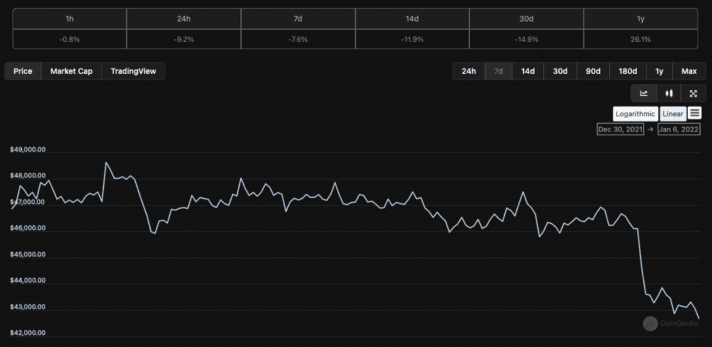
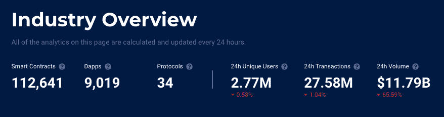
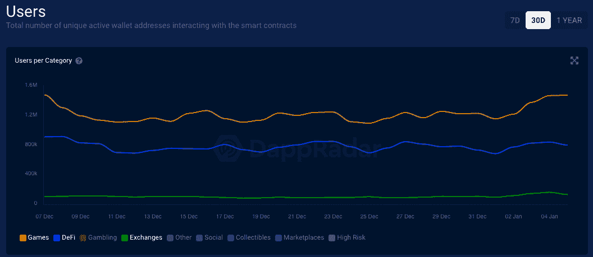

# 尽管发生了事故，鲸鱼仍然保留着秘密财富

> 原文：<https://web.archive.org/web/https://dappradar.com/blog/whales-hold-on-to-crypto-wealth-despite-crash>

## 指标指向市场信心

在过去 24 小时发生的加密崩溃中，大型加密投资者，也被称为鲸鱼，似乎抓住了他们的加密财富。比特币下跌，并带走了整个市场，因为整个加密市场市值以美元计算损失了 10%的价值。

加密市场在过去 24 小时内出现红色，部分原因是宏观经济对 3 月份加息的担忧，以及对通货膨胀的担忧。具有讽刺意味的是，加密市场应该保持强劲，但崩溃指向加密货币开始与更广泛的经济趋势一致。然而，在价格下跌的情况下，加密鲸表现出坚定的信心。

许多人一直在等待 BTC 向下移动到 42，000 美元的阻力位，看看它在此之后的走向。在过去的 24 小时内，BTC 下跌超过 8.4%，跌至最低点 42，866 美元。

随着美国股市周三收盘，宏观经济担忧似乎正在渗透到加密市场。美联储表示加息的速度比之前预期的要快。与此同时，美联储指出，在这种利率变动中，资产负债表将缩减。导致 BTC 跌至 2021 年 12 月 4 日以来的最低值，当时跌至 42，333 美元。

## 抵抗

然而，DappRadar 行业概览数据表明，在这种不确定的时期，鲸鱼投资者仍然持有他们的加密财富。截至发稿时，全区块链 24 小时独立用户仅下降了 0.5%，交易量略微下降了 1%多一点，交易量下降了 65%。量是所有跟踪的协议中所有智能合约的传入或传出值(包括令牌，如果可用)的总量。

[<picture></picture>](https://web.archive.org/web/20220929043945/https://dappradar.com/industry-overview)

成交量上升表明投资者在转移资金，而成交量下降表明价值保持不变。投资者似乎满足于持有你的加密资产。这在某种程度上表明了鲸鱼投资者群体目前对加密货币的信心。有趣的是，当我们在 DeFi、游戏和交换这三个关键类别中查看连接到 dapps 的钱包数量时，我们看到所有活动都略有增加。

进入 2022 年仅仅六天，我们已经有了区块链空间中出现的用户活动的叙述。“玩即赚”游戏看起来将继续朝着鼓励大众接受的方向前进。以太坊外的 DeFi on chains 正在蓬勃发展，因为用户开始探索跨多个区块链的全面选项。此外，当我们进入 2022 年时，鲸鱼在市场上显示出强大的信心指标。

 NewsletterUnsubscribe at any time. [T&Cs](https://web.archive.org/web/20220929043945/https://dappradar.com/terms) and [Privacy Policy](https://web.archive.org/web/20220929043945/https://dappradar.com/privacy-policy)

***以上不构成投资建议。此处给出的信息仅供参考。请行使尽职调查，做你的研究。作者持有 ETH，BTC，AGIX，HEX，LINK，GRT，CRO，OMI，不可变 X，ENS，GALA，AVASTR，GMEE，CUBE，RADAR，FLOW，FTM，BNB，SPS，WRLD，ADA。***