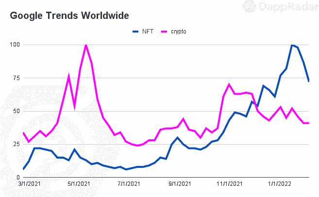
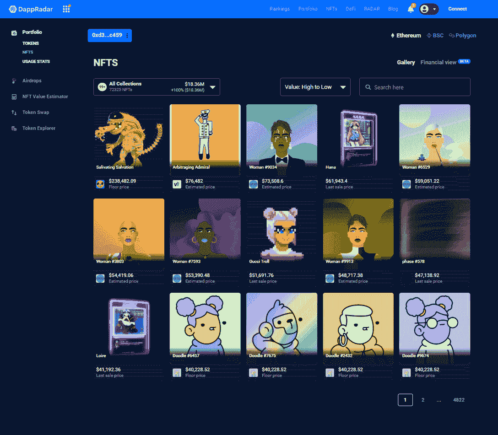
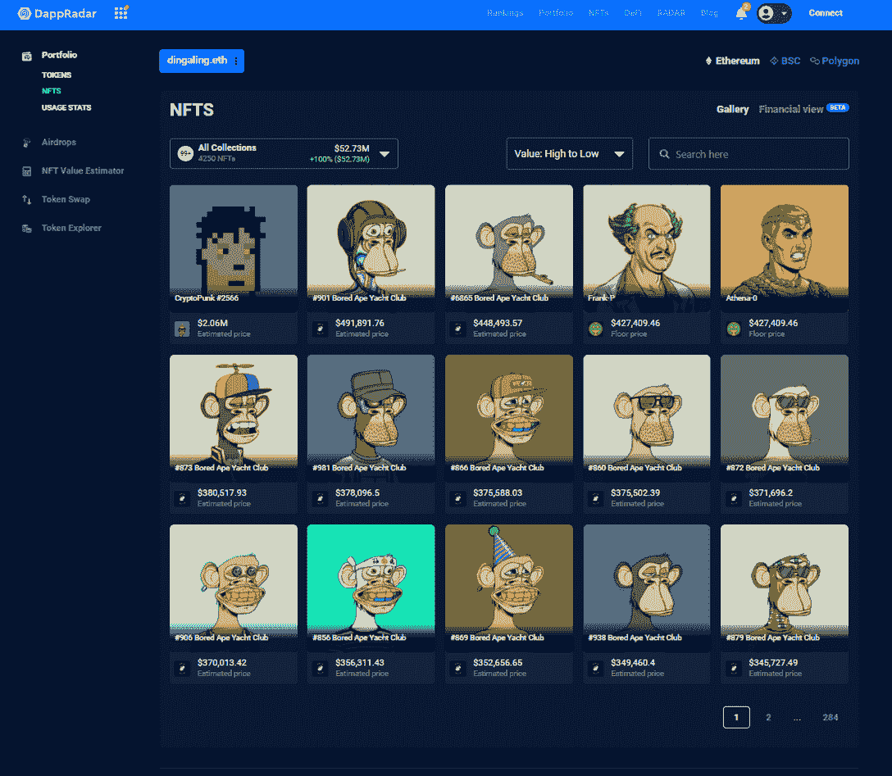
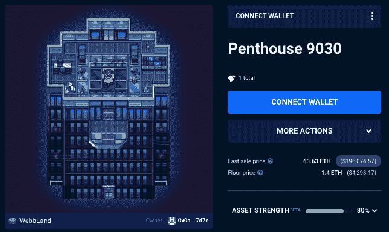
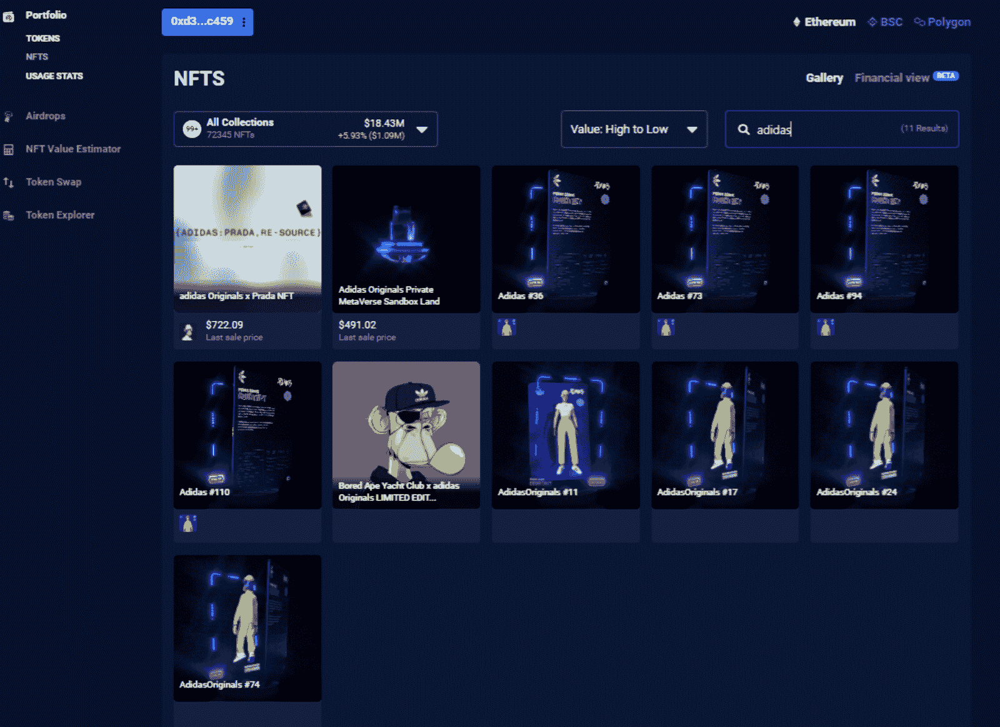
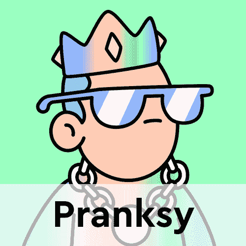

# 著名的 NFT 收藏家遵循什么样的交易模式？

> 原文：<https://web.archive.org/web/https://dappradar.com/blog/whales-report-trading-patterns-nft-collectors>

## 深入探究三位公认的 NFT 收藏家的钱包:Pranksy、Dingaling 和 Wilcox

在这篇鲸鱼报道中，我们来看看三位 NFT 收藏家的交易模式和习惯；恶作剧丁加林和威尔科克斯。他们什么时候买入，什么时候卖出，如何通过抛售 NFT 资产来获利？

NFT 市场正经历着一个积极的趋势，尽管更悲观的情况影响着加密市场。名人和品牌在空间中曝光率的增加以及基于社区的市场的推出等因素进一步提高了 NFT 指标。客观来看，NFT 在 40 天内积累了 67 亿美元的交易量(加上 LooksRare 上的 157 亿美元交易量)，占令人印象深刻的 2021 年第四季度的 60%。

随着 NFT 市场继续上行，有必要分析一下该领域一些最具影响力的参与者目前在做什么。我们谈论的是 NFT 鲸或具有强大购买力的顶级持有者。在这份报告中，我们将注意力转向这一领域最著名的三位 NFT 收藏家，根据他们过去六个月的交易行为来确定趋势和模式。

## 关键要点

*   根据 DappRadar 投资组合工具，范围内的三只鲸鱼钱包的净值超过 2.427 亿美元。
*   NFT 鲸遵循不同的投资策略；虽然 Pranksy 是一个活跃的 NFT 交易者(超过 5，000 个铸造的 NFT 和超过 5，200 个翻转的 NFT)，但像 Wilcox 这样的其他投资者往往更被动(1，000 个铸造的 NFT，不到 100 个翻转的 NFT)。
*   鲸鱼高度暴露于元宇宙，尤其是虚拟土地和体素化身 NFT。

## 目录

*   [了解 NFT 鲸鱼](https://web.archive.org/web/20230102102329/https://dappradar.com/blog/whales-report-trading-patterns-nft-collectors/#getting)
*   [高度接触虚拟世界](https://web.archive.org/web/20230102102329/https://dappradar.com/blog/whales-report-trading-patterns-nft-collectors/#exposure)
*   [鲸鱼钱包容易被假冒](https://web.archive.org/web/20230102102329/https://dappradar.com/blog/whales-report-trading-patterns-nft-collectors/#fake)
*   [向涂鸦者示爱](https://web.archive.org/web/20230102102329/https://dappradar.com/blog/whales-report-trading-patterns-nft-collectors/#doodles)
*   [幼虫实验室的混合感知](https://web.archive.org/web/20230102102329/https://dappradar.com/blog/whales-report-trading-patterns-nft-collectors/#mixed)
*   [支持新项目](https://web.archive.org/web/20230102102329/https://dappradar.com/blog/whales-report-trading-patterns-nft-collectors/#supporting)
*   [关闭](https://web.archive.org/web/20230102102329/https://dappradar.com/blog/whales-report-trading-patterns-nft-collectors/#closing)

## 了解 NFT 鲸

鲸鱼是行业中最相关的概念之一。持有大量特定代币的钱包，包括非现金交易券，被认为是鲸鱼。这些钱包强烈地影响着市场，甚至对购买或出售施加足够的压力。

这一次，我们关注三位著名的 NFT 收藏家或 NFT 鲸:[恶作剧者](https://web.archive.org/web/20230102102329/https://dappradar.com/hub/wallet/eth/0xd387a6e4e84a6c86bd90c158c6028a58cc8ac459)、[丁加林](https://web.archive.org/web/20230102102329/https://dappradar.com/hub/wallet/eth/0x54be3a794282c030b15e43ae2bb182e14c409c5e)和[威尔科克斯](https://web.archive.org/web/20230102102329/https://dappradar.com/hub/wallet/eth/0xa25803ab86a327786bb59395fc0164d826b98298)。前两者也应被视为 NFT 的影响者，因为他们积极参与 NFT 社区。

Pranksy 可能是最著名的 NFT 收藏家，拥有最大的 NFT 以太坊收藏之一。这个人是 NFTBoxes 背后的头脑，NFT boxes 是一套包括现有收藏和来自数字艺术家的策划作品的 NFT，在撰写本文时，拥有超过 32，000 件 NFT，净资产估计超过 1.2 亿美元。Pranksy 是涂鸦(101 件)的第四大持有者，拥有超过 2100 只 CryptoKitties，1450 只 Avastars，并控制着沙盒内的一个大包裹。超过 34 万人在推特上关注这位收藏家的账户。

此外，在过去的六个月里，Pranksy 已经收购了超过 2100 件。他们在同一时间段内卖出了 5200 张 NFT，这表明这个人遵循积极的投资策略。

Source: [DappRadar portfolio](https://web.archive.org/web/20230102102329/https://dappradar.com/hub/wallet/eth/0xd387a6e4e84a6c86bd90c158c6028a58cc8ac459) / Pranksy’s wallet

丁加林是 NFT 空间的另一个重要人物，拥有最有趣的收藏之一。Dingaling 目前持有超过 3，600 件 NFT，是 Bored Ape 游艇俱乐部(BAYC)的第二大持有人，拥有 106 件。除了在 BAYC 生态系统中的高曝光率(超过 300 NFTs)，丁加林还是一个狂热的顶级摄影师和 Ghxsts 收藏家。

此外，Dingaling 拥有近 400 个像素库 NFT，60 个酷猫 NFT，并在沙盒中管理着一个位置良好的大地块。此人拥有近 80，000 名 Twitter 粉丝，并支持 LooksRare 社区。这只钱包的 NFT 投资组合的净值估计为 5340 万美元。

Source: [DappRadar portfolio](https://web.archive.org/web/20230102102329/https://dappradar.com/hub/wallet/eth/0x54be3a794282c030b15e43ae2bb182e14c409c5e) / Dingaling’s wallet

威尔科克斯是范围内的第三个钱包。虽然 Pranksy 和 Dingaling 仍然是匿名的，但它们在社交平台上很活跃，在 NFT 社区很有影响力。另一方面，威尔科克斯完全不为人知，只有关于他真实身份的传闻。尽管如此，威尔科克斯是最大的隐朋克鲸，也是第四大密比特鲸。因此，从幼体实验室的角度来分析鲸鱼的模式是值得的。这个钱包可以容纳超过 1200 个 NFT，包括 Pixel Vault 和 CyberKongz 的曝光。尽管没有如此大的收藏，威尔科克斯的钱包价值估计为 6670 万美元。

与恶作剧相反，威尔科克斯遵循被动的投资策略，他的交易活动不如其他鲸鱼活跃。在过去的六个月里，威尔科克斯已经创造了 1000 多个 NFT，但转手的还不到 100 个。被动策略最适合做长期投资的个人，他们在未来几年可能不会参与强劲的交易活动。

## 高度接触虚拟世界

自从 Meta 宣布之后，人们对元宇宙的兴趣直线上升，而从中获益最大的非功能性虚拟世界子类。数字包裹 NFT 的[价值被大幅评估](https://web.archive.org/web/20230102102329/https://dappradar.com/blog/dapp-industry-overview-november-2021/#value)。像沙盒、分散土地、Somnium Space 或 CryptoVoxels 这样的成熟项目，以及像 [WorldWideWebb3](https://web.archive.org/web/20230102102329/https://dappradar.com/ethereum/collectibles/worldwide-webb-land) 或[nftwolds 这样的较新的虚拟世界项目都是如此。](https://web.archive.org/web/20230102102329/https://dappradar.com/ethereum/games/nft-worlds)

有趣的是，这些 NFT 鲸对数字土地有很高的曝光率。例如，Pranksy 是沙盒中一大片土地的所有者，并在过去六个月中翻转了 500 多块沙盒土地。此外，Pranksy 拥有 130 多个 NFT 世界，这是最近最热门的虚拟世界项目之一。NFT 世界的地板价格在两个月内上涨了 1046%。Pranksy 的钱包还展示了全球 Webb 和大约 50 个分散式 NFT 的互操作像素化世界的 100 套公寓，包括可穿戴设备和名称。

Source: Penthouse 9030, [DappRadar](https://web.archive.org/web/20230102102329/https://dappradar.com/hub/assets/eth/0xa1d4657e0e6507d5a94d06da93e94dc7c8c44b51/9030)

丁加林在元宇宙的吸引力更倾向于头像——元宇宙的另一个重要方面。他们的钱包里展示了许多重要阿凡达项目的作品，包括 157 个体素、150 个体素和 17 个 RTFKT 的克隆 x。

丁加林也是沙盒和分散土地和各种元键森林公园的大块土地的所有者。

威尔科克斯也对元宇宙头像表现出了兴趣。钱包目前持有沙盒体素，一块密码体素土地，元密钥 NFTs，和五个赛博空兹 VX。

## 鲸鱼钱包容易被假冒

众所周知，鲸鱼对市场有很大的影响力。出于同样的原因，诈骗项目不断寻找使它看起来像他们的钱包参与这些类型的项目。与假集合相关联的合同将代币发送到接收地址，而没有任何触发交易的动作，使得代币看起来像造币厂。

一个明显的例子是在恶作剧的钱包。总共有 4700 张假阿迪达斯 NFT 似乎是由这位著名收藏家铸造的，尽管所有这些都是该运动服装品牌发行的 NFT 的假冒版本。丁加林的情况也是如此，他似乎创造了其中的 476 个 NFT，而威尔科克斯与其他 99 个有亲缘关系。

Source: DappRadar

鲸鱼和名人的钱包将仍然是这些类型的演员的共同目标，因此有必要使用 DappRadar portfolio 等分析工具来确认真正的 NFT 的有效性。

## 给涂鸦者一些爱

Doodles 于 10 月推出，现已成为 NFT 的顶级项目之一。底价已经巩固在 10 ETH 以上，是需求最大的收藏品之一。意识到这一潜力的收藏家之一是 Pranksy。尽管没有创作出一个涂鸦，Pranksy 在 2021 年获得了大约 60 个涂鸦，今年又增加了 41 个。

在写作方面，Pranksy 是第四大涂鸦持有者，拥有这个流行收藏的一些独特的 NFT。丁加林还获得了两件收藏品，而威尔科克斯没有任何涂鸦。持有多幅涂鸦的 NFT 收藏家包括加里·维、卢皮菲和 T2·史蒂夫·青木。

[<picture></picture>](https://web.archive.org/web/20230102102329/https://dappradar.com/hub/assets/eth/0x8a90cab2b38dba80c64b7734e58ee1db38b8992e/7020)[<picture></picture>](https://web.archive.org/web/20230102102329/https://dappradar.com/hub/wallet/eth/0xd387a6e4e84a6c86bd90c158c6028a58cc8ac459/nfts)[<picture></picture>](https://web.archive.org/web/20230102102329/https://dappradar.com/hub/assets/eth/0x8a90cab2b38dba80c64b7734e58ee1db38b8992e/7141)

## 对幼虫实验室的不同看法

CryptoPunks、Meebits 和 Autoglyphs 背后的团队幼虫实验室是 web3 领域最有影响力的品牌之一。CryptoPunks 可能是 NFT 主流趋势的象征，而 Meebits 的分布奠定了一个基本的公用事业蓝图，成为其他项目的标准。

威尔科克斯是最大的隐朋克鲸(246 只朋克鲸)，拥有 281 只密比特，是第四大持有者，这表明了对幼虫实验室 NFTs 的特殊感情。

丁加林似乎是最中立的。他们持有最多元化的投资组合之一，投资于一些最具吸引力的 NFT 项目。作为第二大 BAYC 持有者，丁加林在一个钱包里展示了幼虫和宇迦实验室的空间。我们在这个钱包里看到三个密码朋克和 20 个密比特，尽管明显倾向于 BAYC NFTs 至少在过去的六个月里没有人动过它们。

最近，恶作剧似乎对幼虫实验室不那么感兴趣了。首先，令人惊讶的是缺少密码朋克。更令人吃惊的是，他在 2021 年 8 月卖出了 96 个米比特，只剩下一个米比特。他更喜欢其他 web3 品牌还是 voxel 头像仍然是个谜。然而，值得注意的是，他的策略是通过至少拿着一块来保持暴露在幼虫实验室中。

## 支持新项目

这些鲸鱼拥有众多成熟的项目，每个人都有自己的偏好。接触顶级项目是被期待和证明的，而这些鲸鱼对新项目的支持对 NFT 空间是积极的。

除了 Doodles、Clone-X 和志那都红豆等著名系列之外，我们还看到鲸鱼支持最近推出的项目，如不到一个月前推出的黑仔 GFs 系列。Pranksy 的钱包里至少有 50 个 gf，另外 9 个属于 Dingaling。CryptoBatz，Mfers 和党的退化也出现在这些鲸鱼的控股。

## 关闭

这些报告中分析的三款钱包都是该领域最受认可的收藏家，每一款都有其独特的风格。虽然 Pranksy 拥有许多 CryptoKitties、Avastars 和虚拟土地，但 Dingaling 拥有一个多元化的收藏，包括几乎所有的顶级 NFT 项目。威尔科克斯更喜欢专注于幼虫实验室，这是一个在这些鲸鱼中产生混合情绪的品牌。

尽管如此，这些鲸鱼收藏家还是有一些共同点。最突出的一点是，这些收藏家青睐元宇宙叙事——无论他们拥有数字土地还是体素头像。

还有对新项目的支持。随着每天数十个 NFT 的推出，这个空间无疑在增长。看到鲸鱼识别并投资新项目，展示仍在可承受范围内的收藏方式，并表明它们的潜力，这是积极的。

总而言之，这些收藏家遵循多元化战略，在那些有既定路线图、高绩效团队以及通常有形的公共事业支持的项目中获得曝光。