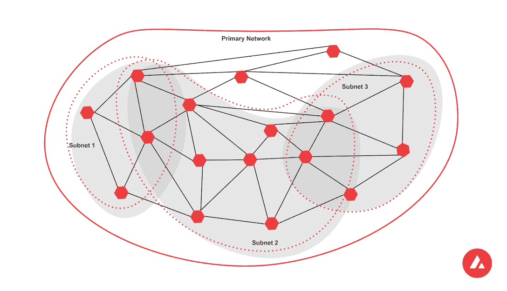
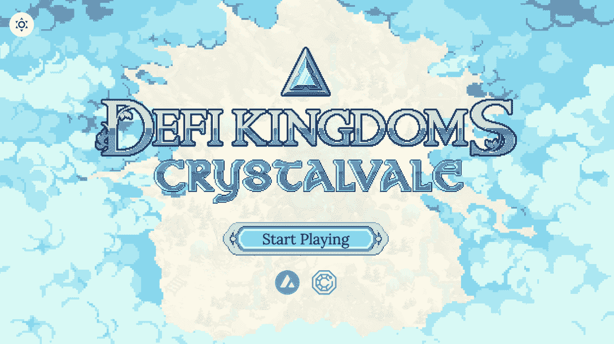

# 什么是雪崩子网，为什么它们对 Dapp 的成功至关重要

> 原文：<https://web.archive.org/web/https://dappradar.com/blog/what-are-avalanche-subnets-and-why-are-they-critical-to-dapp-success>

## 让任何人都能够根据用户需求构建定制的区块链网络

**雪崩子网是雪崩生态系统中可定制、可配置、特定于应用的区块链。雪崩子网可以减少开发者的开发成本和时间，同时提供更好的用户体验，为开发者提供更多更好的工具来制作 dapps。** **更重要的是，这些深思熟虑的设计可以提供一个简单的途径来获得广泛采用所需的自然无缝的 Web3 体验。**

**内容**

*   [什么是雪崩子网？](https://web.archive.org/web/20221127184531/https://dappradar.com/blog/what-are-avalanche-subnets-and-why-are-they-critical-to-dapp-success/#what)
*   [雪崩子网有什么好处？](https://web.archive.org/web/20221127184531/https://dappradar.com/blog/what-are-avalanche-subnets-and-why-are-they-critical-to-dapp-success/#benefits)
*   有子网的成功使用案例吗？
*   [如何创建本地子网？](https://web.archive.org/web/20221127184531/https://dappradar.com/blog/what-are-avalanche-subnets-and-why-are-they-critical-to-dapp-success/#how)
*   [雪崩基金会鼓励加速子网采用的想法](https://web.archive.org/web/20221127184531/https://dappradar.com/blog/what-are-avalanche-subnets-and-why-are-they-critical-to-dapp-success/#foundation)。

随着 [DeFi](https://web.archive.org/web/20221127184531/https://dappradar.com/defi) 和 [NFT](https://web.archive.org/web/20221127184531/https://dappradar.com/nft) 应用的爆炸式增长，没有一个单一的链可能满足所有 Web3 用户的需求。结果，更多的 T4 区块链电视网加入了竞争。更值得注意的是，这些新的市场参与者开始专注于为用户提供更有针对性的服务和功能。

[雪崩](https://web.archive.org/web/20221127184531/https://dappradar.com/rankings/protocol/avalanche)子网是最有前途的扩展解决方案。数字不会说谎。仅 DeFi 王国的 Crystalvale 子网的平均日交易量就超过了 Polygon 的总和。

## 什么是雪崩子网？

[子网](https://web.archive.org/web/20221127184531/https://docs.avax.network/subnets)是雪崩确认器的动态子集，它们一起工作以实现一个或多个区块链状态的一致性。通俗地说，子网是更大的雪崩网络内的子网，它们定义了自己的规则，可以根据特定的用户需求进行定制。

[Source](https://web.archive.org/web/20221127184531/https://docs.avax.network/subnets)

子网是整个雪崩生态系统的一部分，连接到由三个区块链组成的核心雪崩主网络。然而，通过子网，dapp 运行在他们自己的网络上，而不是在共享的 L1 网络上，数百个 dapp 同时发出嗡嗡声，争夺相同的资源。

这两种方法有什么区别？如果一个 dapp 有巨大的流量峰值(就像我们在今年早些时候 Crabada 推出子网之前看到的那样)，那么它可能会降低所有其他 dapp 的速度。子网消除了这个问题，从根本上解决了区块链的网络拥塞问题。

同时，子网具有高度灵活性和可定制性。它们允许开发人员配置功能，例如选择哪个令牌付费，谁验证网络活动，以及哪个虚拟机促进操作。

## 雪崩子网有什么好处？

子网管理自己的成员资格，并可以建立自己的令牌组学和规则。此外，它允许其验证器设置某些自定义属性。这些特性为 dapps 增添了一系列独特的优势。

简单来说，每个子网都是一个独立的、功能齐全的分散式网络。项目可以发行本地令牌，并设计符合其需求的业务模型。这样的设计可以使区块链专用于特定的用途，无论是针对传统金融、元宇宙 dapp 还是 Web3 游戏进行优化。

此外，开发人员可以创建一个子网，其中只有某些预定义的验证器可以加入。这样，就创建了一个私有子网，其中的内容只有那些验证者才能访问。这非常适合那些希望将其信息限制在特定受众范围内或遵守一套法规遵从性标准的组织。

[Learn unique benefits of Avalanche Subnets](https://web.archive.org/web/20221127184531/https://docs.avax.network/subnets#advantages)

## 子网有什么成功的使用案例吗？

许多 dapps 已经在利用雪崩子网来优化性能和增强用户体验。更重要的是，这一切都是在继承雪崩式安全和去中心化的同时发生的。

[DeFi 王国](https://web.archive.org/web/20221127184531/https://dappradar.com/avalanche/games/defi-kingdoms)——跨链、即玩即赚的 MMORPG——于 2022 年 3 月作为子网加入 Avalanche。值得注意的是，这个名为 [Crystalvale](https://web.archive.org/web/20221127184531/https://defikingdoms.com/crystalvale/) 的子网目前执行的日常事务比一些第 1 层区块链(如 Polygon、Hedera 和 EOS)更多。例如，在推出 Crystalvale 子网后， [DeFi 王国](https://web.archive.org/web/20221127184531/https://dappradar.com/avalanche/games/defi-kingdoms)仅用了六周时间就平均每天完成了大约一百万笔交易。

子网也可以像游戏 dapps 一样受益于 DeFi 项目。例如，Dexalot 正在构建其 Avalanche 子网，以便为其用户带来更好的分散交易体验。最终，Dexalot 使用户能够使用中央限价指令簿交易所安全高效地交易加密货币，而不会出现滑动或保管风险。

在子网上线后，Dexalot 将能够提供一个经济、高效、安全的理想交易环境，并具有可扩展性和进一步定制的可能性。

## 如何创建本地子网？

随着 Web3 的大规模采用，对高质量 dapps 的需求也将继续增长。Avalanche 以其速度、安全性和灵活性为开发人员铺设了一条红地毯，使 Web3 应用程序开发过程简单而顺利。

子网使开发人员能够按需扩展，彻底检查他们的基础设施，以便在几个小时而不是几天、几周、几个月甚至几年内大规模增长。Avalanche 坚信，在一个像 Web3 这样变化如此迅速的领域，腾出更多时间进行创意和执行好想法至关重要。

这些链接允许开发人员快速启动子网。

*   [子网概述](https://web.archive.org/web/20221127184531/https://www.avax.network/subnets)
*   [子网常见问题解答](https://web.archive.org/web/20221127184531/https://support.avax.network/en/articles/6158840-subnet-faq)
*   [子网文档](https://web.archive.org/web/20221127184531/https://docs.avax.network/subnets/)
*   [教程:如何创建本地子网](https://web.archive.org/web/20221127184531/https://docs.avax.network/subnets/create-a-local-subnet/)
*   [雪崩探测器(主平台+子网)](https://web.archive.org/web/20221127184531/https://stats.avax.network/dashboard/network-activity/)
*   [雪崩开发者不和](https://web.archive.org/web/20221127184531/https://discord.com/invite/RwXY7P6)

艾娃实验室和雪崩基金会举办黑客马拉松、研讨会、Twitter 空间和更多的活动，以帮助实现出色的 Web3 想法。开发者可以通过关注[雪崩推特](https://web.archive.org/web/20221127184531/https://twitter.com/avalancheavax)或加入[雪崩事件电报](https://web.archive.org/web/20221127184531/https://t.me/avalanchesummit)来寻找即将到来的事件的信息。

## 雪崩基金会鼓励加速子网采用的想法。

今年 3 月，[雪崩基金会启动了雪崩多元宇宙](https://web.archive.org/web/20221127184531/https://medium.com/avalancheavax/avalanche-foundation-launches-multiverse-an-up-to-290m-incentive-program-to-accelerate-growth-of-c815ac5692c7)，这是一项高达 2 . 9 亿美元的激励计划，旨在促进子网的采用和发展。该计划侧重于生态系统扩展理念，包括但不限于区块链游戏、DeFi、NFTs 和机构用例。

有兴趣参与该计划的开发人员和企业家应通过此链接完成[表格。](https://web.archive.org/web/20221127184531/https://avalancheavax.typeform.com/to/AHipnhBh)

了解有关雪崩和子网的更多信息:

[雪崩](https://web.archive.org/web/20221127184531/https://www.avax.network/)

[雪崩子网](https://web.archive.org/web/20221127184531/https://docs.avax.network/subnets)

[推特](https://web.archive.org/web/20221127184531/https://twitter.com/avalancheavax)

[电报](https://web.archive.org/web/20221127184531/https://t.me/avalancheavax)

[中等](https://web.archive.org/web/20221127184531/https://medium.com/avalancheavax)

[不和](https://web.archive.org/web/20221127184531/https://chat.avax.network/)

**免责声明** —这是一篇赞助文章。DappRadar 不认可本页面上的任何内容或产品。DappRadar 旨在提供准确的信息，但读者应该在采取行动之前总是自己做研究。DappRadar 的文章不能被认为是投资建议。