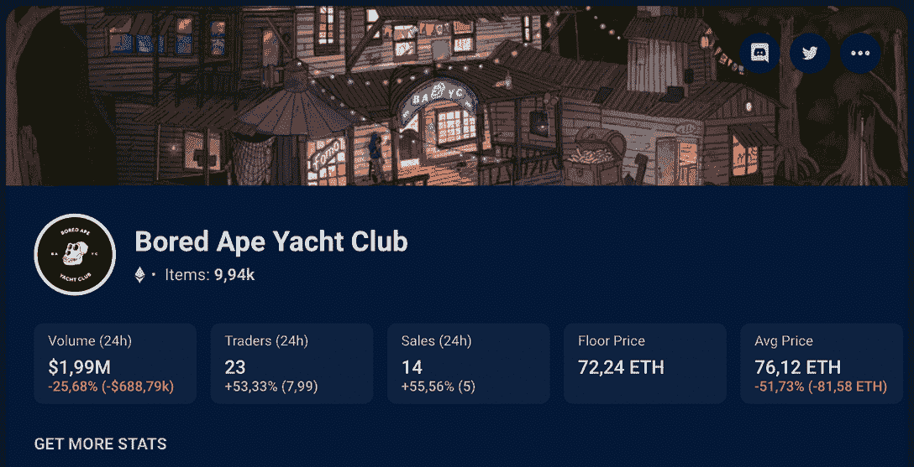
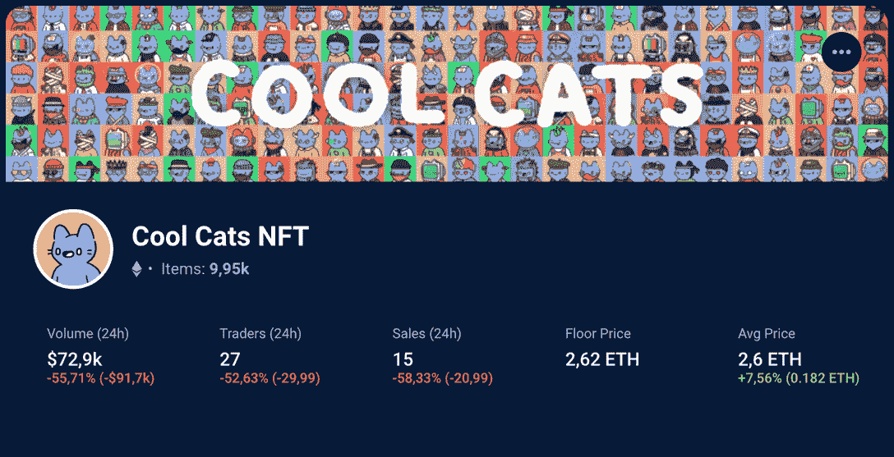
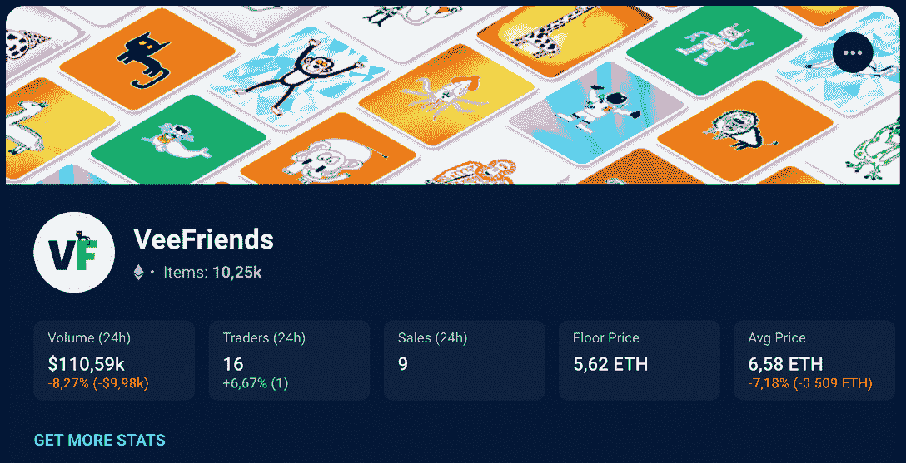
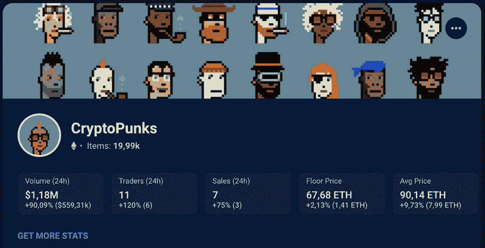
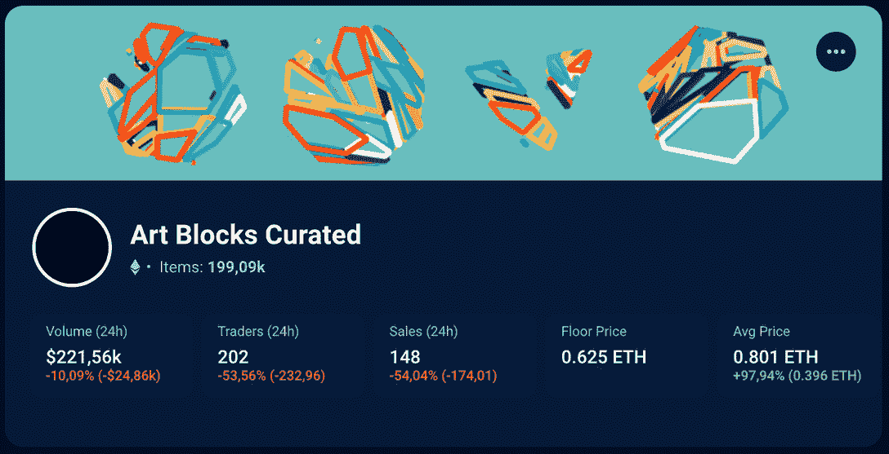
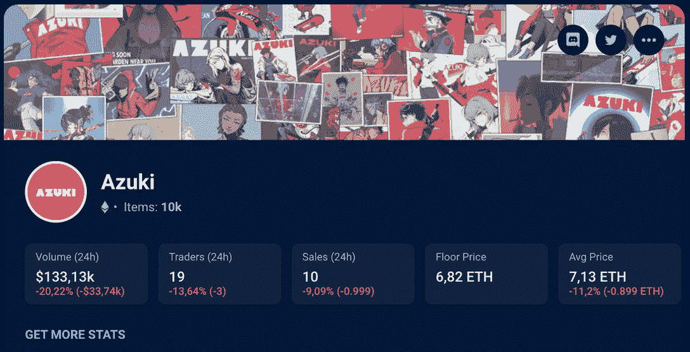
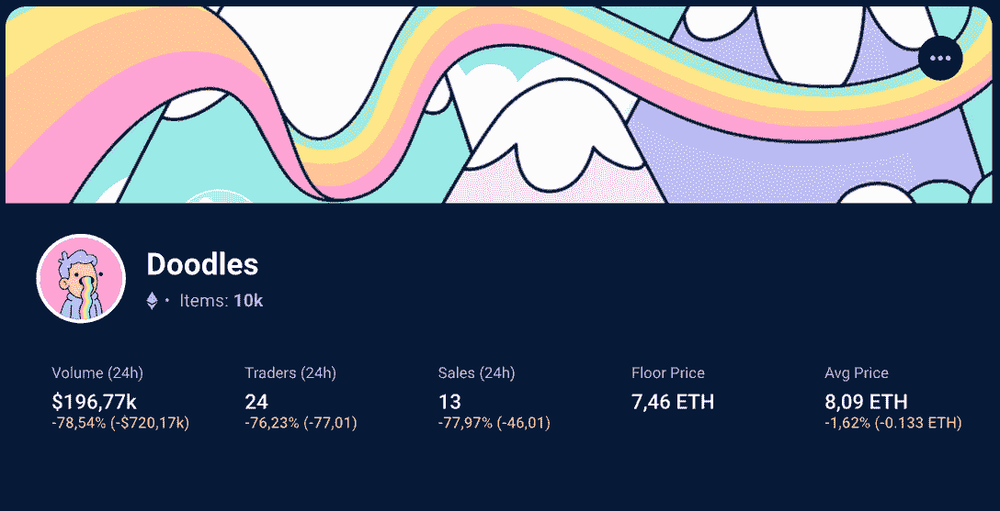
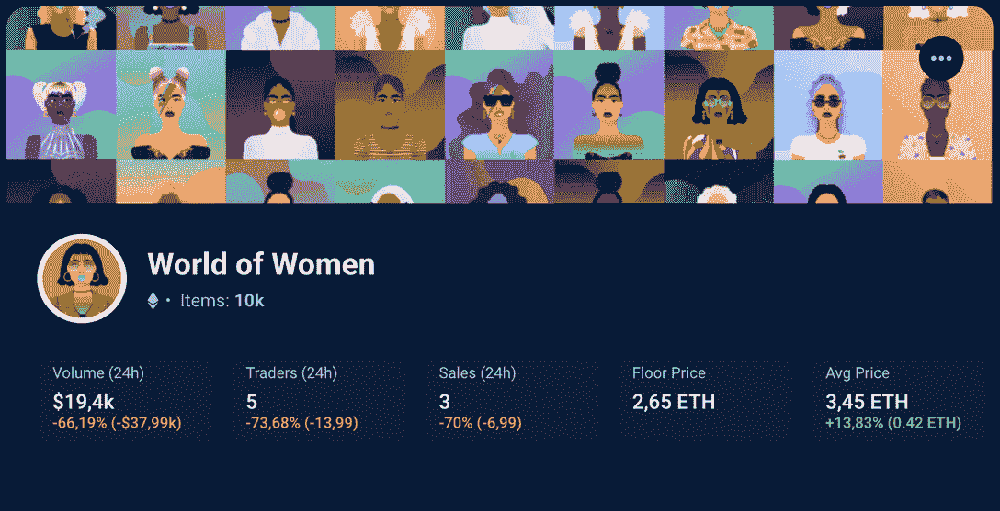
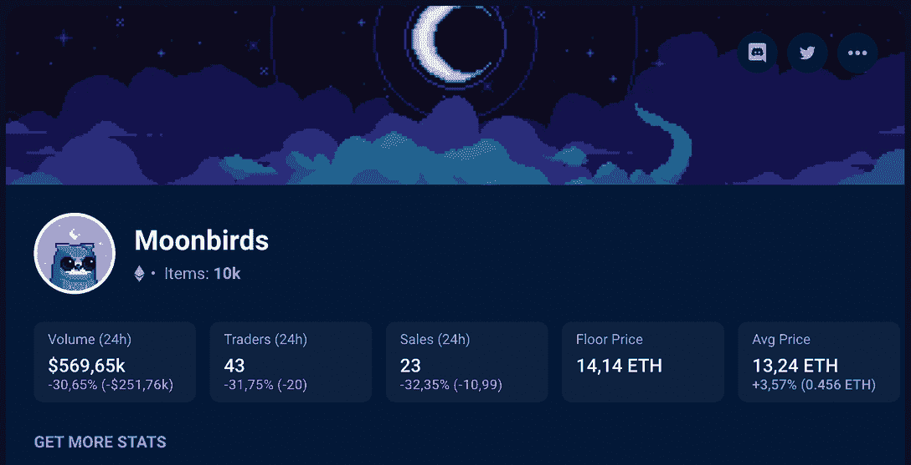
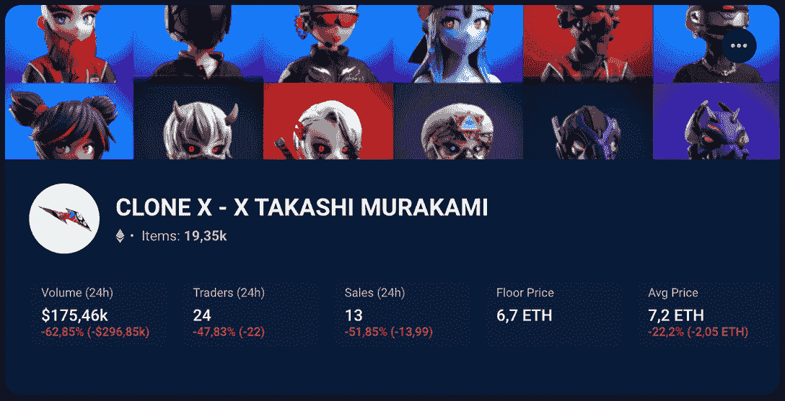

# 什么是蓝筹 NFT 收藏&如何找到它们

> 原文：<https://web.archive.org/web/https://dappradar.com/blog/what-are-blue-chip-nft-collections>

## 深入了解已经在这个领域站稳脚跟的 NFT 项目

在 NFT 空间航行需要了解最新的和最突出的项目。但是，当新的收藏上升到顶峰并在几周内消失时，也有蓝筹 NFT 收藏。另一方面，这些产品展示了使其在市场上与众不同的特征，因此受到高度重视。在整篇文章中了解它们！

## 什么是蓝筹 NFT 收藏？

所谓的蓝筹 NFT 藏品是指那些在 NFT 市场不太长的时间里表现出高而稳定的市场价值的项目。

传统上，蓝筹股投资与股票市场联系在一起，是那些市场上的知名公司，如苹果、可口可乐和迪士尼。换句话说，财务状况良好、收入稳定的企业。

Dapp industry 在 [Q2 2022 年报告](https://web.archive.org/web/20230210022216/https://dappradar.com/blog/dapp-industry-report-q2-nfts-and-web3-games-keep-enduring-market-conditions-as-shockwaves-from-the-terra-collapse-reach-cefi-and-vcs#Demand-for-NFTs-up-despite-volume-slump)中的分析显示， ***“蓝筹 NFT 集合不断使其被视为比密码本身更安全的资产类别。”***

## 是什么让 NFT 收藏成为蓝筹股？

尽管 NFT 的行业并不算古老，而且一切都发展得如此之快，但一些藏品表现出了更大的稳定性。

就这些投资而言，它们是蓝筹，因为它们是这个行业中最稳定的，而众所周知，这个行业的波动性非常大。

但究竟是什么让它成为蓝筹股呢？看看下面的一些线索:

*   蓝筹股 NFT 收藏具有长期价值主张；
*   项目背后的团队在行业中有着稳固的声誉；
*   令牌有一个明显的用例，超出了投机的范畴；
*   最后，他们周围有一个充满激情的社区。

因此，当你在寻找这种类型的 NFT 机会时，这就是你可以寻找的。

[<picture></picture>](https://web.archive.org/web/20230210022216/https://dappradar.com/blog/what-are-non-fungible-tokens-nfts)[<picture></picture>](https://web.archive.org/web/20230210022216/https://dappradar.com/nft/marketplaces)[<picture></picture>](https://web.archive.org/web/20230210022216/https://dappradar.com/nft/sales)

## 值得了解的顶级蓝筹 NFT 收藏

既然我们已经知道了如何识别蓝筹 NFT 藏品，那么是时候了解这个领域中一些最突出的项目了。

这里有十个你应该知道的项目:

### 无聊猿游艇俱乐部

无聊猿游艇俱乐部是以太坊区块链上的 10，000 个无聊猿 NFT 的集合，世代创造，非常有价值。

随着几个全球名人加入这个系列，BAYC 已经连续几个月在 DappRadar 的排名中位列 NFT 系列的前五名。

宇迦实验室的其他成熟的 NFT 收藏包括突变猿游艇俱乐部和无聊猿养狗俱乐部——也是该领域的蓝筹股。

*   [在我们的完整文章](https://web.archive.org/web/20230210022216/https://dappradar.com/blog/what-is-bored-ape-yacht-club)中了解更多关于无聊猿游艇俱乐部的信息。​​

### 酷猫

酷猫是第一批在 NFT 引起轰动的公司之一。

该系列包括超过 9，999 只随机生成的数字猫，允许其持有者独家访问其社区活动。

说到酷猫社区，这里有一些名人，比如迈克·泰森和 T2。

### 虚拟朋友

加里·维纳查克设计的蓝筹股 NFT 系列旨在利用这一革命性技术建立一个创意社区。

一旦你拥有了这些收藏品中的一件，你就可以加入这个艺术团体，与 web3 行业的领导者分享你对商业和 NFTs 的热情。

### 密码朋克

crypto punk 是以太坊上的第一个 NFT 项目，至今仍是最受欢迎的项目之一。太空中的每个人都听说过他们。

CryptoPunks 于 2017 年年中推出，包括超过 10，000 个独特的数字化身，这些化身是 ERC-721 标准的灵感来源。

更重要的是，它也是一个名人的最爱，Jay-Z 和 T2 以及小威廉姆斯都加入了这个社区。

*   **参见** : [什么是密码朋克:简单解释](https://web.archive.org/web/20230210022216/https://dappradar.com/blog/what-are-cryptopunks-a-simple-explanation)

### 艺术街区

凭借独特的外观，[Art Blocks NFT](https://web.archive.org/web/20230210022216/https://dappradar.com/hub/nft-explorer/collection/art-blocks-curated)赢得了蓝筹股的地位，部分原因是它们的创意设计。特别是[铬黄曲线系列](https://web.archive.org/web/20230210022216/https://dappradar.com/blog/chromie-squiggles-squiggle-into-the-spotlight)。

该项目包括各种各样的数字艺术，从抽象到更传统的作品。这些产品的销量在 2021 年 8 月首次达到顶峰，NFT 的售价高达数百万美元。

除了潜在的稳定性，这个项目还吸引了许多偏爱这种类型 NFT 的艺术爱好者。

### 志那都红豆

2022 年 1 月，亲民党 NFT 系列的志那都红豆引起了公众的关注，幸运的是，它拥有一个忠实的社区。

这 10，000 个受动漫启发的 NFT 从一开始就注定要精心策划一个复杂而充满希望的路线图。

尽管志那都红豆面临着与创作者 Zagabond 之前的系列相关的挑战，产生了争论和怀疑，但许多有影响的人加入了社区。

### 涂鸦

[Doodles](https://web.archive.org/web/20230210022216/https://dappradar.com/hub/nft-explorer/collection/doodles-official) 是一个丰富多彩、由社区驱动的 NFT 系列，是最受欢迎的项目之一，销量最高。

它包括超过 10，000 个生殖化身，通常以更高的价格转售。任何拥有涂鸦 NFT 的人都可以参与投票，帮助决定该项目的未来。

最终，Doodles 的目标是成为一家领先的网络娱乐公司，制作音乐、动画、游戏和现场直播。

### 女人的世界

由 Yam Karkai 创建的[世界女性 NFT](https://web.archive.org/web/20230210022216/https://dappradar.com/hub/nft-explorer/collection/world-of-women-nft) 系列是一个关注女性赋权的社交平台。

该项目包括超过 10，000 个数字化身，可以代表女性的独特性，是网络多样性的主要代表之一 3。

除了最初的系列，WoW 还推出了第二个系列，名为[女性银河世界](https://web.archive.org/web/20230210022216/https://dappradar.com/hub/nft-explorer/collection/world-of-women-galaxy)，以进一步扩展他们的宇宙。

*   你可以在我们的完整文章中读到关于女性世界的所有内容。

### 月鸟

[Moonbirds](https://web.archive.org/web/20230210022216/https://dappradar.com/hub/nft-explorer/collection/moonbirds) 是一个生成性的 NFT 系列，是一个最好的例子，说明了一个有影响力的人领导项目及其背后的社区的重要性。

10，000 只月鸟的收集于 2022 年 4 月推出，在短短几天内就已经在二级销售上实现了超过 100，000 ETH。

亲民党 NFT 收藏为其社区提供了广泛的好处，包括能够以 NFT 为赌注-提升其价值。

### CloneX

RTFKT Studios [CloneX NFT 系列](https://web.archive.org/web/20230210022216/https://dappradar.com/hub/nft-explorer/collection/clonex)的 20，000 个下一代虚拟形象甚至在 2021 年末推出之前就是这个空间的巨大承诺。

该系列由日本艺术家村上隆设计，他负责每件 NFT 作品的高品质和细节。

该系列背后的故事也非常丰富，包括未来与元宇宙的整合，甚至允许 CloneX 与耐克合作。

## 为什么 NFT 这么受欢迎？

近几个月来，由于各种原因，NFT 变得非常流行。首先，它们为收藏家和投资者提供了一种投资数字资产的新方式。

它们也是独一无二的，无法复制，这使得它们比加密货币等传统数字资产更有价值。

最后，NFT 通常与著名品牌或艺术家联系在一起，这增加了它们的收藏价值。

## 我如何跟踪蓝筹股 NFT 集合？

如果你想了解你最喜欢的蓝筹股 NFT 系列的最新情况，你会喜欢 DappRadar 工具的。从全面的 [NFT 收藏品浏览器](https://web.archive.org/web/20230210022216/https://dappradar.com/hub/nft-explorer/)开始，在这里您可以发现新的和即将推出的收藏品，并跟踪以太坊网络上的大多数项目。

[https://web.archive.org/web/20230210022216if_/https://www.youtube.com/embed/fkEaXYLOW-s?feature=oembed](https://web.archive.org/web/20230210022216if_/https://www.youtube.com/embed/fkEaXYLOW-s?feature=oembed)

我们的 [NFT 价值估计器](https://web.archive.org/web/20230210022216/https://dappradar.com/hub/nft-value-estimator)工具也通过[使用机器学习来计算](https://web.archive.org/web/20230210022216/https://dappradar.com/blog/nft-value-estimator)几个 NFT 的估计值，从而改进您的研究。

最后但同样重要的是，你可以使用 [DappRadar 排名](https://web.archive.org/web/20230210022216/https://dappradar.com/rankings/category/marketplaces)查看顶级收藏 dapps 和 NFT 市场。

你想继续学习 NFTs 吗？因此，你必须关注 DappRadar [博客](https://web.archive.org/web/20230210022216/https://dappradar.com/blog/)和 [Youtube](https://web.archive.org/web/20230210022216/https://www.youtube.com/c/DappRadar) 频道，了解一些易于理解的教育内容，我们的 [Twitter](https://web.archive.org/web/20230210022216/https://twitter.com/DappRadar) 账户将更新 NFT 空间的最新消息。

***以上不构成投资建议。此处给出的信息仅供参考。请尽职调查并自行研究。***

 NewsletterUnsubscribe at any time. [T&Cs](https://web.archive.org/web/20230210022216/https://dappradar.com/terms) and [Privacy Policy](https://web.archive.org/web/20230210022216/https://dappradar.com/privacy-policy)