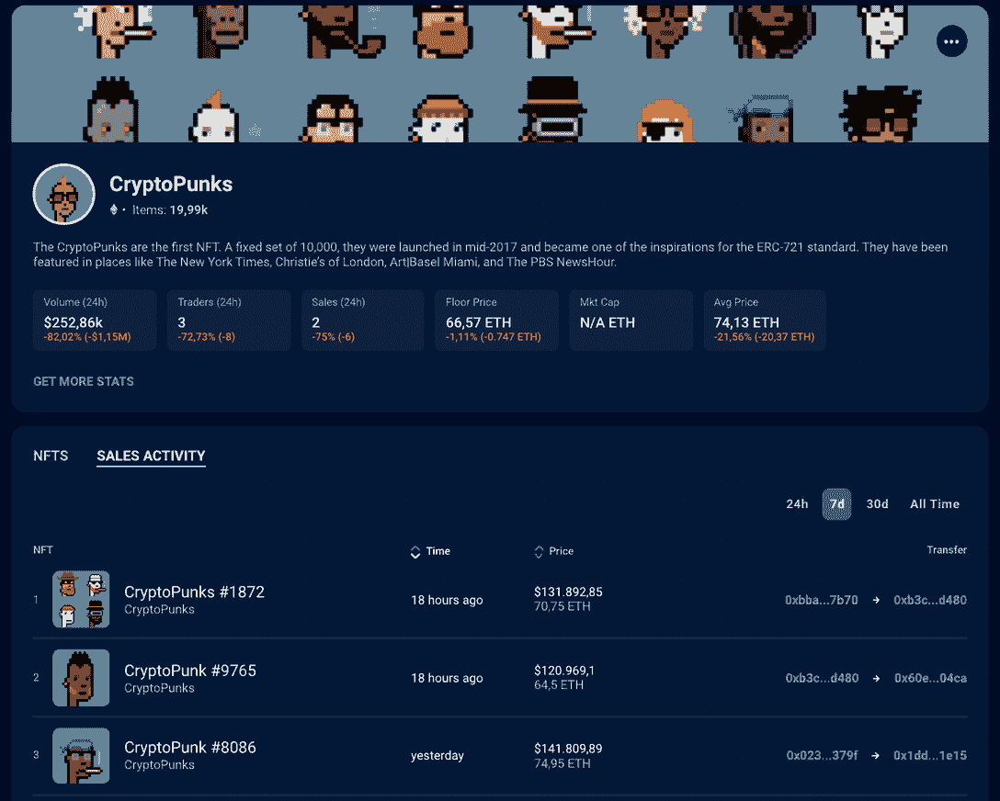
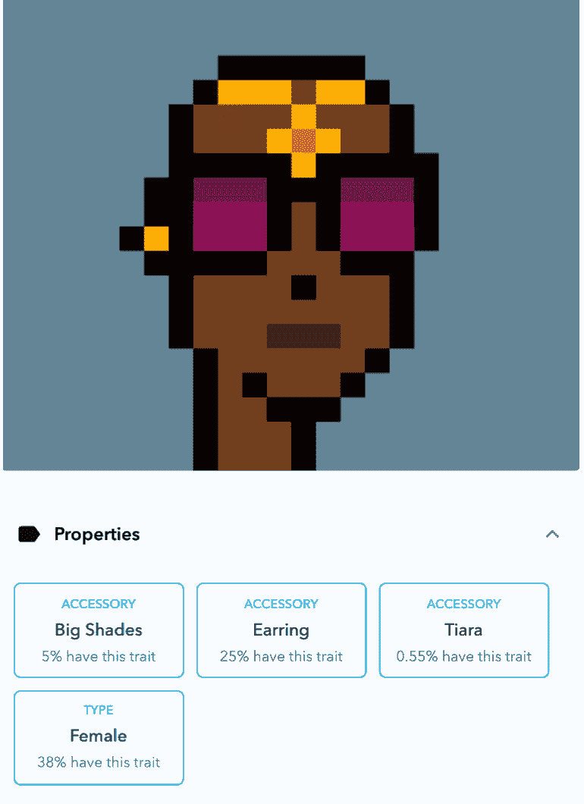
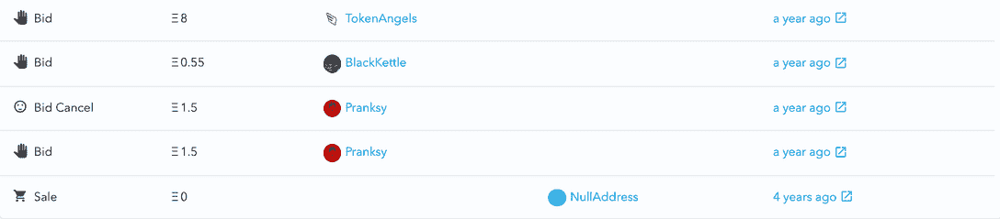

# 什么是密码朋克:一个简单的解释

> 原文：<https://web.archive.org/web/https://dappradar.com/blog/what-are-cryptopunks-a-simple-explanation>

## 了解所有关于百万美元像素化的脸

CryptoPunks 是当今最受关注的 NFT 系列之一。但是为什么呢？这些缺乏插图的像素化人脸是如何变得如此受欢迎的，为什么它们的价值会如此成倍地增长？

## 什么是加密朋克？

为了充分理解这个故事，首先理解什么是隐朋克是至关重要的。隐朋克是一种不可替代的象征或 NFT。NFT 是在区块链上发行的独特的数字物品，在许多方面与现实世界中的物品具有相似的质量。想想实物商品，如限量版运动鞋或服装、可收藏的棒球卡或原创艺术品。

在我们进一步讨论之前，有必要重申一下，CryptoPunks 是第一批 NFT 收藏，因此应该被视为 NFT 世界的“洞穴绘画”。

由于是谁创造了它们，它们的稀缺性以及它们的品质，有些比其他的更有价值。在现实世界中，这些物品可以放在保险箱里，或者自豪地简单展示。就非传统艺术而言，隐朋克的主人可以把它们放在他们的区块链钱包里，或者在他们的虚拟艺术画廊里展示

[Track CryptoPunks with the DappRadar NFT Collection Explorer](https://web.archive.org/web/20221208172806/https://dappradar.com/hub/nft-explorer/collection/cryptopunks/)

## 为什么密码朋克被用作价值储存手段？

在进一步讨论之前，理解价值储存的概念以及它在这里的重要性也是至关重要的。文森特·梵高的原作无疑是一种价值储存手段。即它应该随着时间的推移而增值。这主要是因为这幅画和它的创作者的一些特点。他死了，但他被尊为艺术家，他的“品牌”享誉全球。

一辆全新的特斯拉并不是一个价值储存库，因为一旦你把车开出前院，它的价值就会贬值 10/15%左右，并且终生如此。

因此，具有真正稀缺性和独特性的 NFT，可以被认为是一种价值的数字存储，但只有当它具有历史意义、著名的创造者、卓越的用途，或者，例如，在游戏中的艺术卓越性时。

## 密码朋克是怎么开始的？

伟大的事情都是从小处开始的。crypto punks 故事的开始很有趣，因为它似乎是一个大规模实验，以衡量人们对 NFT 所有权的兴趣。

加密朋克是以太坊上第一个不可替代的代币，也可以说是今天大多数数字艺术、收藏品、虚拟世界和区块链游戏项目的 ERC-721 标准的灵感来源。

当创作者[幼虫实验室](https://web.archive.org/web/20221208172806/https://www.larvalabs.com/)在 2017 年 6 月推出 CryptoPunks 时，他们免费发布了 1 万个与以太坊区块链绑定的所有权证明。任何人都可以免费申请一个，只要他们有一个以太坊钱包并支付了油费。

没错，免费！每个角色都是由算法生成的，这意味着没有两个角色是相同的，有些角色的特征比其他角色更罕见。更重要的是，永远不会超过原来的 10000 个密码朋克。

立刻，两件事应该跃入脑海:稀缺性——事实上，只有 10，000 个朋克已经或将要被创造出来。此外，每个朋克的特质决定了他们的市场价值。与前面给出的物理例子并没有什么不同。

思考比特币的价值也是进一步理解加密朋克的良好开端，因为比特币已经被设定为有限的数量，因此，证明其价值随着时间的推移而增加。

## 为什么 CryptoPunks NFTs 价值百万？

一个密码朋克的底价从一开始就稳步上升。免费得到它们的原主人将它们以小利润卖给新主人，新主人可能也会这样做。

在这一点上，这些所有者可能不知道他们手中有什么，很可能是一个极其罕见的朋克转手，当时的金额少得可怜。幸运的是，因为一切都存储在区块链上，我们可以挖掘得更深。

根据 DappRadar 的数据，以最近的高价值 crypto 朋克销售为例，我们可以回溯其 4 年的历史，看看价格从哪里开始，然后跟随它的旅程到 266，000 美元。

*   你可以点击查看我们关于[如何评估加密朋克的指南。](/web/20221208172806/https://dappradar.com/blog/how-to-value-cryptopunks/)

## 我怎样才能买到一个隐朋克 NFT？

如果你有兴趣购买一个密码朋克，并且你的密码钱包里有足够的 ETH，你可以通过 NFT 收藏的官方网站[购买。](https://web.archive.org/web/20221208172806/https://cryptopunks.app/#getapunk)

在市场上，连接元掩码后，您可以对任何出售的 NFT 出价。

值得提醒的是，[无聊猿游艇俱乐部](https://web.archive.org/web/20221208172806/https://dappradar.com/blog/what-is-bored-ape-yacht-club)的[宇迦实验室](https://web.archive.org/web/20221208172806/https://www.yuga.com/)于 2022 年 3 月从幼虫实验室收购了 CryptoPunks 和 [Meebits](https://web.archive.org/web/20221208172806/https://dappradar.com/hub/nft-explorer/collection/meebits) 系列。所以现在，拥有一个密码朋克，你就获得了社区的商业权利。

## 加密朋克知识产权协议

在整个 NFT 社区的漫长等待之后，该收藏于 2022 年 8 月在 Twitter 上宣布了知识产权协议。

“我们相信向持有人提供知识产权许可将为朋克们打开无尽的创造力和可能性之门，我们也很幸运能够在未来的旅程中继续前行。”——通过[推特线程](https://web.archive.org/web/20221208172806/https://twitter.com/cryptopunksnfts/status/1559284220442320897)。

如[条款和条件](https://web.archive.org/web/20221208172806/https://licenseterms.cryptopunks.app/)中所述，所有者保留他们使用朋克创作的任何衍生作品的所有权利、所有权和利益。

奢侈珠宝零售商蒂芙尼&公司是首批跟随朋克潮流的品牌之一。所谓的[nftiff 是 CryptoPunk NFT 持有者的特别通行证](https://web.archive.org/web/20221208172806/https://dappradar.com/blog/new-dapps-report-nftiff-nfts-turned-into-wearable-jewelry)，允许他们将自己的 NFT 变成一条个性化的宝石镶嵌项链。太棒了，不是吗？

*   **另请阅读:** [所有权和版权如何为非专利技术服务？](https://web.archive.org/web/20221208172806/https://dappradar.com/blog/how-do-ownership-and-copyright-work-for-nft)

## 追踪密码朋克#2000 的旅程

CryptoPunk#2000 于 2021 年 4 月 13 日以超过 266，000 美元的价格售出，为进一步研究提供了一个完美的例子。

如前所述，所有的密码朋克都是独一无二的，所以第一站是找出是什么让这个朋克如此特别——如果有的话。

两个最罕见的特征是只在 5%的朋克身上出现的大墨镜和只在 0.55%的朋克身上出现的头饰。事实上，它是女性，还戴着耳环，这也是很有价值的特征。

现在让我们来看看密码朋克自诞生以来的历史，有趣的是，所有者从未将朋克挂牌出售，而是不断收到各种报价。这本身就表明他们手里有值钱的东西。

四年前，朋克被转让给了它的主人，直到 2020 年，围绕 NFT 所有权的炒作才真正开始影响媒体。

这个厚颜无耻的出价是由现在众所周知的 NFT 和秘密艺术影响者 Pranksy 提出的。可以肯定的是，Pranksy 发现了一个拥有优秀品质的朋克，而他的主人可能并不欣赏这一点。但是，在 1.5 ETH 的无耻出价被忽视后，Pransky 放弃了 NFT，取消了报价。

然后，好像恶作剧的出价给了朋克合法性，更多的出价飞来。先是 0.55 ETH 的出价被忽略，然后是 8 ETH 的出价。据推测，该投标也被忽略，因此被投标人取消。

然后事情开始变得非常有趣，一个用户出价 50 ETH，显示一个密码朋克作为他们的头像。但是，投标再次被拒绝。Pranksy 似乎误判了 2000 号密码朋克的主人。

然后，在一段时间没有竞价或挂牌活动之后，一切又恢复了生机。2021 年 4 月 12 日，有人出价 72.69 ETH，当日价值约 152，000 美元。又一次，投标被取消了。

这里发生的事情是，一个所有者耐心地接受匿名买家的出价超过 4 年，总是相信他们的朋克值更多的钱，并通过这些出价来加强这种观点。

在所有的出价和拒绝之后，所有者最终将密码朋克标价为 120 ETH 或 25 万美元左右，几乎比上次最高出价高出 50 ETH。在撰写本文时，这个密码朋克在 5 小时后以 120 ETH 或 266，000 美元的价格售出。对于他们声称免费的东西来说，一点也不差。

购买 NFT 的人相信它的价值有一天会超过 120 ETH，或者他们计划在当前的购买狂潮中卖掉它。无论哪种方式，价值都来自于它的稀缺性，作为 ETH 储存价值的能力，CryptoPunks 是第一个 NFT 系列的事实，以及使其更值得拥有的独特特征。

## 如何追踪密码朋克？

dappar Dar NFT 追踪页面提供了 NFT 顶级收藏、销售和市场的信息，并提供了关于 CryptoPunk 销售的实时数据。

就像本文中给出的例子一样，还有无数的例子显示了 NFT 的寿命，收到和拒绝的报价，以及整体而言，其价值的上升。

此外，DappRadar 还定期制作 NFT 评估报告，更详细地解释使非功能性测试更受欢迎的特征和品质。

请务必观看下面的视频，了解如何使用 [DappRadar 投资组合跟踪器](https://web.archive.org/web/20221208172806/https://dappradar.com/hub/wallet/)管理您的 NFT，并获得您投资的详细概览。

[https://web.archive.org/web/20221208172806if_/https://www.youtube.com/embed/wUN0ZdgNRjY?feature=oembed](https://web.archive.org/web/20221208172806if_/https://www.youtube.com/embed/wUN0ZdgNRjY?feature=oembed)

达普拉达将继续关注 NFT 空间的最新消息。请确保关注我们的[博客](https://web.archive.org/web/20221208172806/https://dappradar.com/blog/)、 [Youtube](https://web.archive.org/web/20221208172806/https://www.youtube.com/c/DappRadar) 频道和官方 [Twitter](https://web.archive.org/web/20221208172806/https://twitter.com/DappRadar) 账户，以获取教育内容&最热门的趋势。

## 有用的链接

*   [NFT 收藏探索者上的密码朋克](https://web.archive.org/web/20221208172806/https://dappradar.com/hub/nft-explorer/collection/cryptopunks/)
*   [用于加密朋克 NFT 的 NFT 值估计器](https://web.archive.org/web/20221208172806/https://dappradar.com/hub/nft-value-estimator/cryptopunks)
*   [NFT 追踪和最高销售额](https://web.archive.org/web/20221208172806/https://dappradar.com/nft/sales)
*   [如何给 CryptoPunks 估值](/web/20221208172806/https://dappradar.com/blog/how-to-value-cryptopunks/)
*   [追踪你的 NFT 投资组合](https://web.archive.org/web/20221208172806/https://dappradar.com/hub/wallet/)

 NewsletterUnsubscribe at any time. [T&Cs](https://web.archive.org/web/20221208172806/https://dappradar.com/terms) and [Privacy Policy](https://web.archive.org/web/20221208172806/https://dappradar.com/privacy-policy)

***以上不构成投资建议。此处给出的信息仅供参考。请尽职调查并自行研究。***