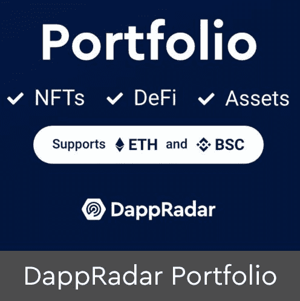

# 什么是 Dapps？了解所有关于分散式应用的信息

> 原文：<https://web.archive.org/web/https://dappradar.com/blog/what-are-dapps>

## dapps 及其工作原理介绍

应用程序是我们生活的一个重要组成部分——我们用它们来联系朋友，保持有序，完成任务。但是当 app 在一个分散的网络上，而不是在一个集中的网络上，会发生什么呢？这正是分散式应用程序(Dapps)出现的时候。**什么是 Dapps？**它们是如何工作的？我们为什么要关心分权呢？在这篇博客文章中，我们将仔细研究这项新技术，并探索 Dapps 如何改变我们使用网络的方式。敬请期待！

## 什么是 Dapps 或分散式应用？

分散式应用程序是在分散式网络上运行的应用程序。它类似于你在手机或电脑上找到的常规应用程序，但它不是由任何一个人或实体集中控制的。为什么？因为 Dapps 从对等网络而不是从单个服务器运行。

[https://web.archive.org/web/20221209163932if_/https://www.youtube.com/embed/AbXzqHuKOus?feature=oembed](https://web.archive.org/web/20221209163932if_/https://www.youtube.com/embed/AbXzqHuKOus?feature=oembed)

## Dapps 是如何工作的？

Dapps 建立在分散式网络之上，例如[以太坊区块链](https://web.archive.org/web/20221209163932/https://dappradar.com/hub/tokens/ethereum/all/1)。当您使用 dapp 时，您实际上是在与它所基于的分散式网络进行交互。

这就是为什么 dapps 能够抵制审查，不受信任。因为没有中央实体控制 dapp，没有人能审查它或关闭它。

他们是正在改变我们与互联网连接和互动方式的 Web3 运动的一部分。

### 什么是区块链？

区块链是交易的数字日志，由计算机网络验证和维护。每个单独的记录集是一个块，它链接到前一个块，因此成为一个块链。这就是为什么它被称为区块链。

网络中的每个节点或计算机都确认新添加数据的正确性。因此，区块链知道在任何给定时间某个钱包中有多少代币，使得篡改不可能。

维护区块链的节点或计算机通过某种机制获得奖励。机制的类型取决于区块链的类型。这可以通过挖掘奖励、赌注奖励或者例如基于交易费用的奖励来实现。当区块链是分散的，每个人都可以自由参与时，它被认为是最优的。

[<picture></picture>](https://web.archive.org/web/20221209163932/https://dappradar.com/rankings)[<picture></picture>](https://web.archive.org/web/20221209163932/https://dappradar.com/hub/wallet)[<picture></picture>](https://web.archive.org/web/20221209163932/https://dappradar.com/hub/swap)

### 什么是智能合约？

区块链不仅用于跟踪代币交易。区块链像以太坊一样允许用户在区块链上启动计算机程序。

[智能合同](https://web.archive.org/web/20221209163932/https://dappradar.com/blog/what-is-a-smart-contract)是区块链上的协议，提供服务并执行该服务，无需第三方。

例如，智能合约可以允许两个不同令牌之间的令牌交换。简而言之，智能契约会这样陈述:如果你给我令牌 A，我就给你令牌 b，这个特定的动作不需要中间人。或者，换个角度想，中间人被算法取代了。

然而，技术术语真的重要吗？大多数人不会在意，他们只是想知道这项技术对他们有什么好处。尽管我们相信知识是采用的重要基础，但创造流畅的用户体验和真正的效用对主流采用来说更为重要。

## Dapps 有哪些不同的类型？

正如移动设备需要应用程序才能成为日常生活的必需品一样，区块链也需要同样的燃料才能进入每个人的手中。

Dapps 以穿越不同类别的[应用的形式提供燃料，例如](https://web.archive.org/web/20221209163932/https://dappradar.com/rankings)[游戏](https://web.archive.org/web/20221209163932/https://dappradar.com/topic/games)、[金融](https://web.archive.org/web/20221209163932/https://dappradar.com/defi)、[赌博](https://web.archive.org/web/20221209163932/https://dappradar.com/topic/gambling)和[交易所](https://web.archive.org/web/20221209163932/https://dappradar.com/topic/exchanges)。

### 1.游戏 Dapps

用区块链技术制作的视频游戏通常被称为 Web3 游戏。这些[游戏 dapp](https://web.archive.org/web/20221209163932/https://dappradar.com/rankings/category/games)受益于区块链的属性，例如不信任、不变性和透明性，从而为游戏玩家提供更好的体验。

它们也是最常用的 dapp 类型。玩家可以参与游戏的决策，从他们在游戏中的表现中获利，并拥有他们在游戏中的物品。

*   一些最常用的游戏 dapps 是 [Axie Infinity](https://web.archive.org/web/20221209163932/https://dappradar.com/multichain/games/axie-infinity) 、[外星世界](https://web.archive.org/web/20221209163932/https://dappradar.com/multichain/games/alien-worlds)和[高地](https://web.archive.org/web/20221209163932/https://dappradar.com/eos/games/upland)。

### 2.金融 Dapps

[金融 dapps](https://web.archive.org/web/20221209163932/https://dappradar.com/rankings/category/defi) 为用户提供传统金融服务的分散替代方案——这就是[分散金融(DeFi)](https://web.archive.org/web/20221209163932/https://dappradar.com/blog/decentralized-finance-defi-dappradars-ultimate-guide) 的用武之地。这些 dapps 建立在以太坊这样的区块链上，使用[智能合约](https://web.archive.org/web/20221209163932/https://dappradar.com/blog/what-is-a-smart-contract)来自动化金融交易。

通过金融 dapps，用户可以获得贷款、交易和兑换加密货币，而无需通过银行或其他金融机构。

*   一些最常用的金融 dapps 是 [PancakeSwap](https://web.archive.org/web/20221209163932/https://dappradar.com/blog/what-is-pancakeswap-and-how-to-use-it) 、 [MetaMask](https://web.archive.org/web/20221209163932/https://dappradar.com/blog/what-is-metamask) 、 [Uniswap](https://web.archive.org/web/20221209163932/https://dappradar.com/blog/what-is-uniswap-and-how-to-use-it) 和[蹦极](https://web.archive.org/web/20221209163932/https://dappradar.com/multichain/defi/bungee)。

### 3.赌博 Dapps

赌博 dapp 是最受欢迎的 dapp 类型之一，因为它们提供了传统在线赌场的分散替代方案。这些 dapps 使用区块链创建可证明是公平的游戏，玩家可以对事件的结果下注。

它们还允许用户对真实世界事件的结果下注，比如体育比赛。

*   一些最常用的赌博 dapps 是 [TTPlinko](https://web.archive.org/web/20221209163932/https://dappradar.com/thundercore/gambling/tt-plinko) 、[严肃骰子](https://web.archive.org/web/20221209163932/https://dappradar.com/thundercore/gambling/serious-dice)和 [BetSwirl](https://web.archive.org/web/20221209163932/https://dappradar.com/multichain/gambling/betswirl) 。

### 4.NFT 市场 Dapps

NFT 市场 dapps 是用户可以购买、出售或交易不可替代代币(NFT)的平台。这些 dapps 使用区块链来验证 NFT 的真实性，并提供一种安全的交易方式。

自 2020 年末 NFT 繁荣以来，它们变得越来越受欢迎，现在在区块链各地都可以买到。

*   一些最常用的 NFT 市场 dapps 是 [OpenSea](https://web.archive.org/web/20221209163932/https://dappradar.com/multichain/marketplaces/opensea) 、[魔法伊甸园](https://web.archive.org/web/20221209163932/https://dappradar.com/solana/marketplaces/magic-eden)和[原子市场](https://web.archive.org/web/20221209163932/https://dappradar.com/multichain/marketplaces/atomicmarket)。

## 我怎样才能找到最好的 Dapps？

当谈到寻找和监控最好的去中心化应用时，没有比 DappRadar 的顶级 d apps 排名更好的地方了。

幸运的是，我们在多个区块链上跟踪来自多个不同 dapps 的数据，并在我们的平台上提供这些数据，为用户提供了出色的体验。

[https://web.archive.org/web/20221209163932if_/https://www.youtube.com/embed/HSVvtpxWNWs?feature=oembed](https://web.archive.org/web/20221209163932if_/https://www.youtube.com/embed/HSVvtpxWNWs?feature=oembed)

我们还在我们的[博客](https://web.archive.org/web/20221209163932/https://dappradar.com/blog/)上发布每日新闻和教程，介绍您需要了解的最热门的应用程序，以跟上未来技术的发展。

此外，在[DappRadar Portfolio Tracker](https://web.archive.org/web/20221209163932/https://dappradar.com/hub/wallet/)中，您可以通过连接 web3 钱包来管理您的数字资产、加密货币和 NFTs。

*   **阅读** : [你可以用 DappRadar 做的 5 件大事](https://web.archive.org/web/20221209163932/https://dappradar.com/blog/things-you-can-do-with-dappradar)

## Dapps 有什么好处？

Dapps 允许用户通过分散金融创造财富，通过不可替代的代币拥有数字所有权，并参与具有现实世界影响的虚拟经济。

dapp 允许用户在区块链上利用他们的资产，而不需要使用集中的一方。用户不需要将代币放在交易所，这意味着他们失去了对自己资产的完全控制权。

此外，dapp 不会受到服务中断或审查的影响。区块链从不下沉。政府可以屏蔽一个网站的网址，但他们不能拒绝访问智能合同或 dapp。

### 我为什么要关心去中心化？

我们所知的互联网是集中的，这意味着一小群实体控制着它。这可以从脸书和谷歌等大型科技公司存储和控制我们数据的方式中看出。

然而，去中心化提供了一种方式来重新控制我们的数据，并让用户对他们的在线活动有更多的权力。在一个去中心化的互联网中，没有单一的故障点，也没有中央权力机构可以控制或审查我们在网上做的事情。

这就是 dapps 如此重要的原因。这就是为什么 dapps 属于未来。

毕竟，你为什么不应该关心你的隐私、自由和安全呢？

## 如何开始使用 Dapps？

要使用 dapp，你需要一个钱包。当使用您的桌面浏览器时，我们建议您安装[元掩码](https://web.archive.org/web/20221209163932/https://dappradar.com/blog/what-is-metamask)。这个 web3 钱包可以连接到各种区块链服务，包括以太坊、币安智能链和多边形。

*   [在此下载元掩码](https://web.archive.org/web/20221209163932/https://www%2Cmetamask.io/)
*   [在此了解如何使用元掩码](https://web.archive.org/web/20221209163932/https://dappradar.com/blog/explained-how-to-use-metamask-for-exchanging-tokens)
*   [如何将币安智能链连接到 Metamask](https://web.archive.org/web/20221209163932/https://dappradar.com/blog/how-to-provide-liquidity-on-apeswap)
*   [如何将多边形连接到元蒙版](https://web.archive.org/web/20221209163932/https://dappradar.com/blog/set-up-metamask-on-layer-2-and-avoid-ethereum-gas-fees)

一旦你这样做了，你需要去 [DappRadar](https://web.archive.org/web/20221209163932/https://www.dappradar.com/) 并找到你正在寻找的 dapp。也许你想开始赚取更多的代币利息，或者你正在寻找一个很酷的游戏来玩。

## 什么是 Dapps:总结

Dapps 是区块链权力下放的许多功能的基础。区块链上的这些应用程序省去了中间人，赋予了用户权利。

DappRadar 是世界领先的 dapp 分析和数据网站。为了更多地探索去中心化应用程序的世界，并理解它们提供的好处，我们建议在下面添加书签 DappRadar 并注册我们的每周时事通讯。

 NewsletterUnsubscribe at any time. [T&Cs](https://web.archive.org/web/20221209163932/https://dappradar.com/terms) and [Privacy Policy](https://web.archive.org/web/20221209163932/https://dappradar.com/privacy-policy)