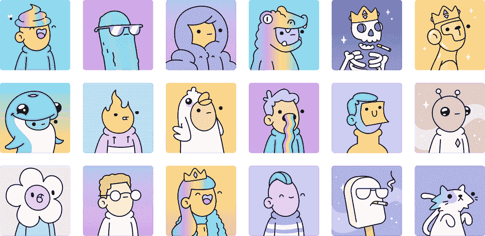
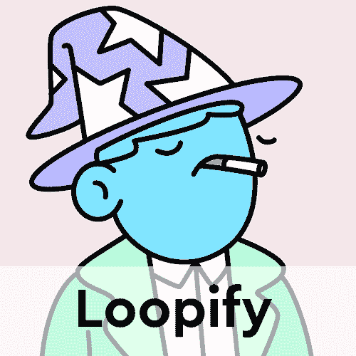
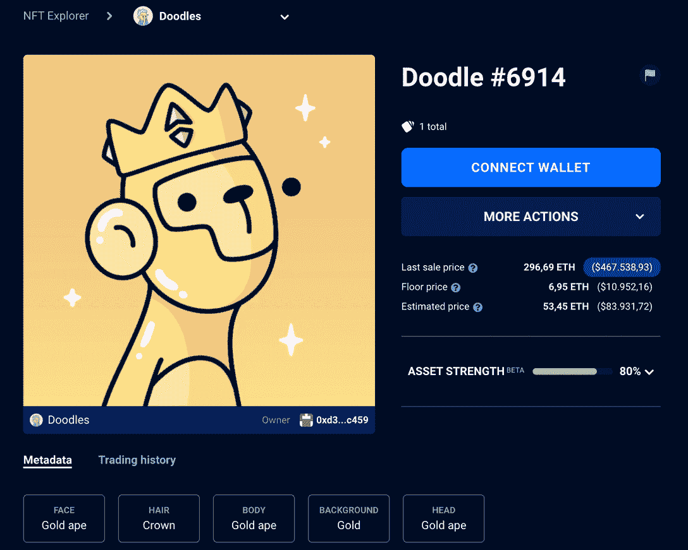
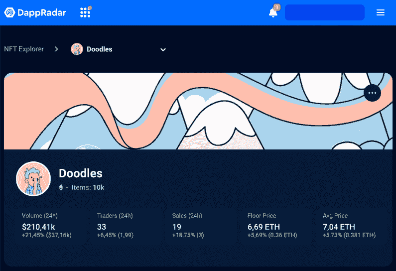

# 什么是涂鸦 NFTs &如何获得它们

> 原文：<https://web.archive.org/web/https://dappradar.com/blog/what-are-doodles-nfts>

## 了解蓝筹项目给 NFT 空间带来的创意和色彩

随着 2021 年 10 月充满希望的首次亮相，NFT 涂鸦系列已经成为太空中最受欢迎的作品之一。但是除了大肆宣传，这些收藏品还有什么用途呢？如何购买涂鸦并加入专属社区？遵循这个指南，了解什么是涂鸦 NFT 以及它们如何改变 web3。

## 什么是涂鸦 NFT？

[Doodles](https://web.archive.org/web/20220925225516/https://dappradar.com/hub/nft-explorer/collection/doodles-official) 是 2022 年最著名、最有价值的 NFT 系列之一。有 10，000 个独特的 NFT 随机生成，具有不同的特性和稀有性，它们背后都有创意和丰富多彩的艺术。

自推出至撰写本文之时，Doodles 的总成交量已达 4.828 亿美元。根据 DappRadar 上的统计数据，该系列中每件 NFT 的平均售价为 14320 美元。

除了 NFT 是今年发布的最漂亮的之一这一事实之外，整个项目从一开始就做得非常好。凭借强大的团队和伟大的品牌，Doodles 征服了蓝筹 NFT 收藏的地位。

### 什么是 NFT？

[涂鸦等不可替代的代币](https://web.archive.org/web/20220925225516/https://dappradar.com/blog/what-are-non-fungible-tokens-nfts)是在区块链上发行的具有唯一标识符的数字资产。这意味着这个智能合约可以代表独特的照片、视频、歌曲等等。每一幅 NFT 都是独一无二的，它的所有权永远在区块链注册，因此没有人可以质疑它的真实性。

根据 DappRadar 的报告，2022 年第一季度，非金融交易产生了 120 亿美元的交易。由于这些流行的 NFT 集合，成千上万的人冒险进入了 web3 和 crypto 的世界，而这些项目的路线图才刚刚开始。

*   **阅读更多** : [什么是蓝筹 NFT 精选&如何找到它们](https://web.archive.org/web/20220925225516/https://dappradar.com/blog/what-are-blue-chip-nft-collections)

## 谁创造了涂鸦？

涂鸦是由 web3 领域的三位经验丰富的企业家创作的:斯科特·马丁，又名[烤焦的吐司](https://web.archive.org/web/20220925225516/https://twitter.com/burnttoast)，插图背后的艺术家是斯科特·马丁；乔丹·卡斯楚，在社区中被称为 [Poopie](https://web.archive.org/web/20220925225516/https://twitter.com/poopie) ，2013 年区块链建筑商；埃文·基斯特，或称[郁金香](https://web.archive.org/web/20220925225516/https://twitter.com/evankeast)，NFT 的顾问和营销人员，也曾与 CryptoKitties 合作。

## 是什么让 Doodles NFTs 与众不同？

涂鸦流行的一个最明显的原因是它们的创意、原创和丰富多彩的设计。该项目的团队确保为每个令牌提供各种各样的插图，以便每个令牌都是独一无二的。

此外，Doodles 在社交媒体上有一个非常活跃的社区。不断有新的更新和功能被开发，团队随时准备回答任何问题。

该团队的透明度和专业性无疑是提高藏品艺术质量的一大优势。然而，是什么让 NFT 与众不同，将取决于所有者的观点。

## 我可以用我的涂鸦 NFT 做什么？

找出 NFT 的[效用对任何寻找机会的人来说都是至关重要的，然而，许多人经常忘记这一点，只是为了炒作而一头扎进收藏品中。](https://web.archive.org/web/20220925225516/https://dappradar.com/blog/what-is-nft-utility)

不过，在这种情况下，从一开始，Doodles 团队就指出了他们的路线图，以及他们希望如何从 PFP NFTs 发展成为一个更大的 web3 项目。

如你所知，现在涂鸦在 NFT 被认为是蓝筹股投资。*这并不一定意味着这是一个无风险的机会*，但它被认为是其他非金融交易中稳定且有前途的。所以很多人把涂鸦作为价值的储存。

此外，Doodles 还是一个 [DAO(分散自治组织)](https://web.archive.org/web/20220925225516/https://dappradar.com/blog/what-is-a-dao-how-does-it-work)，这意味着它的社区可以决定项目的下一步。如果你拥有一个 NFT，你就有资格投一票。

但是如果你对这些都不感兴趣，并且你认为不值得将这些照片用作个人资料图片，你也可以在 NFT 最好的市场上以高于平均价格的价格出售。

## 是什么让涂鸦如此成功？

在撰写本文时，NFT 涂鸦已经产生了约 5 亿美元的二级交易量。虽然它仍然是总销量最高的 NFT 系列之一，但和这个领域的其他东西一样，它的价值也容易波动。

今年 1 月，底价超过了 9 ETH，当时约为 3800 美元。另一方面，同年 8 月，楼面价在 6，7 ETH 左右。考虑到分散应用市场的总体状况，这并不太令人担忧。

这一成功背后的主要原因可以归结为强大的品牌团队、良好的品牌和营销、合作伙伴关系和明星代言，以及该系列发布的*时机*。

领先的 NFT 影响者已经加入了涂鸦社区，并公开宣布他们对该项目的支持。[著名数字资产收藏家 Pranksy](https://web.archive.org/web/20220925225516/https://twitter.com/pranksy?s=20&t=f5f1tSVFgmP-nMNMSyKsbQ) 在 2022 年初以 112 万美元购买了 Doodle #6914，创造了该项目的历史最高纪录。此外，随着加密货币市场暴跌，[这些 NFT 设法更好地保持其价值](https://web.archive.org/web/20220925225516/https://dappradar.com/blog/dropping-eth-price-has-buyers-flocking-to-punks-ape-and-doodles)——尽管它们仍然下跌。

看看涂鸦社区的其他名人和他们的钱包。

[<picture></picture>](https://web.archive.org/web/20220925225516/https://dappradar.com/hub/assets/eth/0x8a90cab2b38dba80c64b7734e58ee1db38b8992e/7020)[<picture></picture>](https://web.archive.org/web/20220925225516/https://dappradar.com/hub/wallet/eth/0xd387a6e4e84a6c86bd90c158c6028a58cc8ac459/nfts)[<picture></picture>](https://web.archive.org/web/20220925225516/https://dappradar.com/hub/assets/eth/0x8a90cab2b38dba80c64b7734e58ee1db38b8992e/7141)

## 我怎样才能得到一个涂鸦 NFT？

如果你已经读到这里，并有兴趣购买自己的涂鸦，这里我们将解释如何做。

首先，你需要确保你有足够的资金进行交易，并支付以太坊网络的燃气费。使用 [DappRadar Token Swap](https://web.archive.org/web/20220925225516/https://dappradar.com/hub/swap/eth) 查看 ETH 与您的货币的兑换。

接下来，给自己买一个类似 MetaMask 的加密钱包。仔细按照步骤创建您的地址并购买了 ETH 令牌后，您可以购买自己的涂鸦 NFT。

这些收藏品只在 NFT 最好的市场中的三个出售，分别是 T1、T2、开放海洋、T4、俏皮假期和 T7。一旦你选择了平台，你就可以浏览列表并在做出决定后完成购买。值得记住的是，密切关注并小心你所在页面的真实性，以避免落入骗局。

## 如何选择你的涂鸦 NFT？

如你所知，涂鸦收藏品是独一无二的，有着与其他 9，999 种不同的特点。这些 NFT 的元数据包括面部、头发、身体、背景和头部特征。此外，他们可以是许多不同类型的角色，如猫，外星人，泡菜，猿，或简单的普通人-就像这个系列中能得到的一样简单。

因此，在你买第一个你觉得可爱的 NFT(它们都很可爱)之前，你应该了解它的性能和价值。

通过使用[DappRadar Collections Explorer](https://web.archive.org/web/20220925225516/https://dappradar.com/hub/assets/eth/0x8a90cab2b38dba80c64b7734e58ee1db38b8992e/6914)，你可以根据特征过滤涂鸦，并根据价格进行分类。如果你正在寻找灵感，你也可以看看[名人的 NFT 投资组合](https://web.archive.org/web/20220925225516/https://dappradar.com/blog/celebrity-wallets-a-dive-into-crypto-hollywood)，看看他们投资了什么。

*   **在我们的报道中进一步阅读:** [如何评价涂鸦 NFT](https://web.archive.org/web/20220925225516/https://dappradar.com/blog/how-to-value-doodles-nfts)

## 涂鸦 NFTs 的下一步是什么？

这个项目还不到一年，一个全面的路线图已经制定出来了。尽管最初是 NFT 的收藏品，涂鸦项目一直着眼于扩大其收藏品和其他。

了解更多关于即将到来的涂鸦项目如下。

### 太空涂鸦

最初系列的一种扩展包，[太空涂鸦](https://web.archive.org/web/20220925225516/https://doodles.app/space)于 2022 年 2 月发布。Doodles 系列中的每个 NFT 都可以通过空间涂鸦进入太空(或月球)。从视觉上看，它们只不过是 NFT 被运送到平流层的动画，但它们开启了涂鸦者的扩张之旅。

### 涂鸦 2

在整个 NFT 空间，一个更大的、因此也更令人期待的新奇事物将会出现，从而推动涂鸦社区的发展。

该项目的第二个 NFT 系列将是 Doodles 2，预计于 2022 年夏天发布。

> 涂鸦 2…即将推出。[https://t.co/8gw3OeeQfs](https://web.archive.org/web/20220925225516/https://t.co/8gw3OeeQfs)pic.twitter.com/c33BB0GLqPT2
> 
> — doodles (@doodles) [June 22, 2022](https://web.archive.org/web/20220925225516/https://twitter.com/doodles/status/1539444678642352129?ref_src=twsrc%5Etfw)

该系列的宣布伴随着所谓的 *Dooplicator* 而来，这是一种能够复制原始系列的 NFT 的机器，为更多成员加入社区提供了空间。

在 2022 年 6 月的 NFT 纽约市，创作者宣布涂鸦 2 不会像最初的设定那样基于以太坊。

虽然该项目尚未公布该系列的更多细节，但 6 月底举行了一场[Genesis box](https://web.archive.org/web/20220925225516/https://doodles.app/auction)的拍卖，其中包括新系列 NFT 的罕见服装和配饰。

在一个尚未公布的区块链上将会有另外 10，000 个 NFT，有更多不同的特征使它们独一无二。

### web3 的未来

从一开始，Doodles 团队就声称有大计划。该项目旨在成为领先的网络娱乐公司。音乐和视频制作、动画、游戏和现场活动随时随地进行。

为此，Doodles 已经宣布与电商巨头 Shopify 合作；并任命音乐人[法瑞尔·威廉姆斯为首席品牌官](https://web.archive.org/web/20220925225516/https://decrypt.co/103503/doodles-nfts-announces-pharrell-as-chief-brand-officer-fundraise-led-by-alexis-ohanian)。

## 我怎样才能追踪 NFT 涂鸦系列？

有兴趣密切关注 Doodles NFTs 更新吗？然后你必须检查 DappRadar NFT 工具。

*   从 [NFT 收藏探索者](https://web.archive.org/web/20220925225516/https://dappradar.com/blog/introducing-the-new-dappradar-nft-collection-explorer)开始，在那里你可以潜入以太坊上每一个最好的收藏，甚至看到它们的实力；
*   其次是 [NFT 价值估算器](https://web.archive.org/web/20220925225516/https://dappradar.com/blog/nft-value-estimator)，所以你可以用机器学习算法估算一个涂鸦的当前价格；
*   以基本的 [NFTs 概述](https://web.archive.org/web/20220925225516/https://dappradar.com/nft)结束，以获取排名和最高实时销售额。

[Track Doodles with the DappRadar NFT Collection Explorer](https://web.archive.org/web/20220925225516/https://dappradar.com/hub/nft-explorer/collection/doodles-official)

当然，您可以并且应该使用 DappRadar 继续学习 NFTs。在关于涂鸦 2 的新闻出现之前，我们会在 DappRadar 博客上为你更新所有涂鸦的细节。

你也可以关注我们的 [Twitter](https://web.archive.org/web/20220925225516/https://twitter.com/DappRadar) 账户和 [YouTube](https://web.archive.org/web/20220925225516/https://www.youtube.com/c/DappRadar) 频道，获取一些关于 NFT 空间趋势的精彩和最新内容。

我们希望你喜欢和我们一起了解关于涂鸦 NFTs 的一切。订阅我们的时事通讯，在您的收件箱中收到更多类似的文章。

 NewsletterUnsubscribe at any time. [T&Cs](https://web.archive.org/web/20220925225516/https://dappradar.com/terms) and [Privacy Policy](https://web.archive.org/web/20220925225516/https://dappradar.com/privacy-policy)