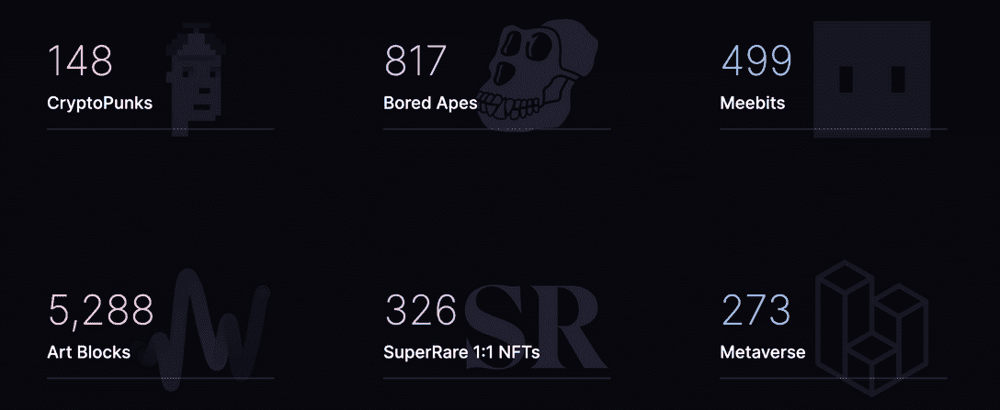
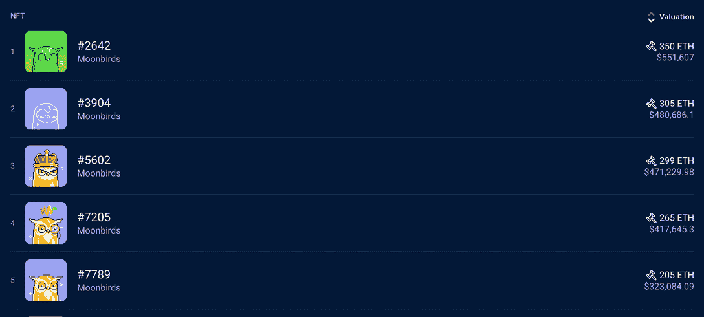

# 什么是月鸟，一个周末就打破所有记录的 NFT 系列？

> 原文：<https://web.archive.org/web/https://dappradar.com/blog/what-are-moonbirds-the-nft-collection-that-broke-all-records-in-a-weekend>

## 了解有关破纪录的 NFT 系列的一切。

月鸟是 PROOF Collective 的 NFT 系列，在官方造币厂发行后的两天内，这些 pixel birds 创造了一些令人印象深刻的记录。Moonbirds 由 10，000 个实用功能的 PFP 组成，作为 PROOF Collective 的 avatar collection 开发。该系列于 4 月 16 日推出，在不到十天的时间里，其平均交易价格飙升至 40 多 ETH。

总结:

*   [什么是证明集体？](https://web.archive.org/web/20221007150626/https://dappradar.com/blog/what-are-moonbirds-the-nft-collection-that-broke-all-records-in-a-weekend/#what-is)
*   月鸟和证据有什么关系？
*   收藏月鸟 NFT 对收藏者有什么好处？
*   [两天内表演破纪录的月鸟](https://web.archive.org/web/20221007150626/https://dappradar.com/blog/what-are-moonbirds-the-nft-collection-that-broke-all-records-in-a-weekend/#record)
*   [月鸟队对可乐士队对志那都红豆队](https://web.archive.org/web/20221007150626/https://dappradar.com/blog/what-are-moonbirds-the-nft-collection-that-broke-all-records-in-a-weekend/#vs)
*   [为什么楼面价这么高？](https://web.archive.org/web/20221007150626/https://dappradar.com/blog/what-are-moonbirds-the-nft-collection-that-broke-all-records-in-a-weekend/#why-is)
*   月鸟发射了奇怪的东西。
*   月鸟的下一步是什么？

为了更好地理解[月鸟 NFTs](https://web.archive.org/web/20221007150626/https://dappradar.com/ethereum/collectibles/moonbirds) 作为区块链空间的一种现象，重要的是后退一步，看看这个项目背后的团队。作为 PROOF Collective 的官方 [PFP 系列](https://web.archive.org/web/20221007150626/https://dappradar.com/blog/top-10-most-popular-avatar-pfp-nft-collections)，Moonbirds 拥有这一重要的联系。

## 什么是证明集体？

证明集体是一个由 NFT 收藏家和艺术家组成的小而有影响力且相对富裕的团体。要加入，你必须持有 NFT 的证明，这是一个收集了 1000 张 NFT 通行证的集合，在撰写本文时底价为 52 [ETH](https://web.archive.org/web/20221007150626/https://dappradar.com/rankings/protocol/ethereum) 。

成为会员后，用户可以通过 Discord、Podcast、真实事件等获得有关 NFT 世界的前沿和独家信息。此外，俱乐部允许其成员参与专为集体成员创建的协作项目。

按集体证明的项目:

*   [月鸟](https://web.archive.org/web/20221007150626/https://dappradar.com/hub/nft-explorer/collection/moonbirds)
*   [用心表达你](https://web.archive.org/web/20221007150626/https://dappradar.com/hub/nft-explorer/collection/emotes-by-heart-you-v2)
*   Grails

作为一个封闭的社会，关于这个高端 NFT 俱乐部的细节很少。然而，官方 PROOF 网站分享说，目前持有 1000 张通行证的人收藏了超过 15 万张 NFT。

此外，这个会员组合中的一大块包括 800 多件无聊猿游艇俱乐部的艺术品和 5000 多件 T2 艺术作品。换句话说，PROOF 成员既有很多钱，又对有价值的收藏品有很好的判断力。

查看 DappRadar 的 NFT 探索者，寻找更多的 NFT 蓝筹项目。

## 月鸟和证明有什么关系？

[Moonbirds](https://web.archive.org/web/20221007150626/https://dappradar.com/hub/nft-explorer/collection/moonbirds) 是由 PROOF 团队创建的个人资料图片 NFT 系列，以此来表示其成员。值得注意的是，Moonbirds 收藏比最初的 PROOF Collectors pass 项目大十倍。这个想法是为了让一批新的 NFT 收藏家利用独家的 PROOF Discord 频道和活动。

重要的是，每个证明集体 NFT 有一个点，以薄荷两个月鸟 NFT。这意味着 20%的月鸟收藏被保留给集体成员。几乎所有剩余的月鸟 NFT 都通过一个 allowlist 机制流向了证明集体之外的收藏家。共有 125 个月鸟 NFT 进入了未来合作和营销活动的证明库。

## 收藏月鸟 NFT 对收藏者有什么好处？

国家森林基金通常向持有者发放津贴。持有[月鸟 NFT](https://web.archive.org/web/20221007150626/https://dappradar.com/ethereum/collectibles/moonbirds) 的最大好处之一是获得上面提到的独家集体不和频道。这是新收藏家加入讨论和进入梦寐以求的私人俱乐部的机会。

除了独家的 Discord 访问，Moonbirds 的持有者还有机会以类似赌注的方式锁定他们的 NFT。创造者将这种锁定机制命名为嵌套。一旦月鸟 NFT 被锁定并筑巢，它会给它的主人带来额外的好处。值得注意的是，NFT 筑巢的时间越长，它带给主人的回报就越多。此外，升级后的巢穴可以增加掉落和奖励。

正如大多数正在验证的东西一样，月鸟项目的奖励机制和路线图是保密的。尽管如此，Moonbirds 官方网站强调筑巢将给主人带来丰厚的回报。

## 两天内表演破纪录的月鸟

4 月 16 日，周六，10000 台[月鸟 NFT](https://web.archive.org/web/20221007150626/https://dappradar.com/hub/nft-explorer/collection/moonbirds)正式上市。乍看之下，没有什么令人印象深刻的。然而，在接下来的几个小时里，Moonbirds 成为 NFTs 历史上票房最高的项目之一，在 48 小时内在二级市场产生了超过 66，000 [ETH](https://web.archive.org/web/20221007150626/https://dappradar.com/rankings/protocol/ethereum) 的交易量。

DappRadar 的 NFT 探索者可以帮助你快速找到正在崛起的项目。

自推出以来，Moonbirds 吸引了大量交易的一个重要细节是该系列的底价。Moonbirds 公共铸币价格为 2.5 [ETH](https://web.archive.org/web/20221007150626/https://dappradar.com/rankings/protocol/ethereum) ，而 PROOF Collective 成员免费铸造，只需支付与交易相关的汽油费。对于一万件 NFT 藏品来说，这确实是一个相对较高的入门价格。

然而，一个更令人印象深刻的壮举是该系列在 OpenSea 早期受到的狂热，价格飙升。4 月 16 日，月鸟 NFT 的平均售价约为 10 英镑。

这是从 2.5 ETH 铸币价格的急剧增加，对于免费铸造的证明集体持有者来说，这是更大的收入来源。四个多月后，月鸟系列的底价仍然没有令人失望，目前为 13.77 [ETH](https://web.archive.org/web/20221007150626/https://dappradar.com/rankings/protocol/ethereum) 。

当然，也不是所有的月鸟都以底价出售。看看 [Moonbirds Single Dapp 页面](https://web.archive.org/web/20221007150626/https://dappradar.com/ethereum/collectibles/moonbirds)上的最高销售额，我们可以看到这些 NFT 中的一些已经为该系列积累了大量的销量。迄今为止十大最昂贵的月鸟销量都超过了 100 ETH 的价值，[最昂贵的一辆](https://web.archive.org/web/20221007150626/https://dappradar.com/hub/assets/eth/0x23581767a106ae21c074b2276d25e5c3e136a68b/2642)换主为 350 [ETH](https://web.archive.org/web/20221007150626/https://dappradar.com/rankings/protocol/ethereum) 或

$551,607.

## 月鸟对克隆克斯对志那都红豆

让我们来看看 NFT 领域的其他一些蓝筹项目，并客观地看待这些令人印象深刻的数据。

CloneX 和[志那都红豆](https://web.archive.org/web/20221007150626/https://dappradar.com/hub/nft-explorer/collection/azuki)是市场上交易量最大的两个系列，都将在 2022 年受到欢迎。根据新的 Dapps 报告的[一月版，CloneX 在二级市场的第一周就创造了大约 1 . 2 亿美元的交易量。请记住，Moonbirds 已经在不到 48 小时内创造了 1.91 亿美元的收入，远远超过了这个数字。](https://web.archive.org/web/20221007150626/https://dappradar.com/blog/new-dapps-report-nft-collectibles-january-2022-edition)

志那都红豆是目前 NFT 领域的另一个高价值项目。根据新的 Dapps 报告第三期 1 月版,该藏品在二级市场交易两周之后，交易量达到 1 . 22 亿美元。月鸟再一次在几个小时内超过了这个数量。

正如你所看到的，Moonbirds 在发行几天后就远远超过了业内的知名公司。这是一次非凡的表演，为未来的系列树立了高标准。此外，月鸟的底价仍然优于 CloneX 和志那都红豆。

要全面评估月鸟，请阅读达普拉达的深度报告。

## 为什么楼面价这么高？

在 NFT 领域，可以说，价值是由特定收藏品的所有者决定的。因此，通常，当一个新的收藏铸造时，许多“脚蹼”正在寻找快速赚钱，并在最近铸造的 NFT 上获得最小的利润。然而，月鸟的情况远非寻常。

更令人印象深刻的壮举是社区如何评价他们的月鸟 NFTs。该系列的公开造币价格为 2.5 ETH，相对较高。然而，考虑到关系到独家证明集体项目，高薄荷价格是有点预期。当这个系列第一次上市时，底价已经定在了 8 英镑左右。对于这种规模的收藏来说，这是前所未有的。

然而，心态和社区在这一破纪录的表现中发挥了重要作用。想要得到一只月鸟 NFT 的收藏者大多被成为收藏者的想法所吸引。

这是一个备受尊敬的艺术家和收藏家群体，需要排他性。通常，这种排他性是基于足够的财富而实现的。从这个意义上来说，一个已经很富裕的社区对其资产的估值，与之前一般的 NFT 空间有很大不同。这不免让人对这些人如何致富产生了好奇。

## 月鸟发射了奇怪的

Moonbirds 于 5 月 22 日发布了 10，000 个 NFT 的集合。这是最初的月鸟团队的一个附带项目，空投给“筑巢”他们的鸟的月鸟持有者。

古怪是今年 7 月最受欢迎的 NFT 系列之一，主要是因为它与月鸟的“血统”。该系列已经累积了超过 11，000 [ETH](https://web.archive.org/web/20221007150626/https://dappradar.com/rankings/protocol/ethereum) 的交易量。关于实用性，团队还没有为项目指定任何具体的东西。但有一点是肯定的，持有奇怪的东西会让你成为集体生态系统的一部分。

你可以阅读 DappRadar 关于古怪现象的深度报道，以了解该计划的详细内容。

## 月鸟的下一步是什么？

最近，PROOF 团队证实，正在为其社区开发实用令牌。然而，目前细节很少，证据的象征性举措将在 2023 年 Q1 奥运会上全面展示。

Moonbirds 是一个令人印象深刻的现象，它揭示了 PFP 收藏可以在几天内轻松获得数百万的数量。所需要的只是合适的支持。达普拉达将继续关注 PROOF 和 Moonbirds 系列，因为它们是迄今为止 NFT 领域交易量最大、收入最高的资产。

要密切关注高端系列，请查看下面有用的链接。

*   NFT 探险家
*   [NFT 值估计器](https://web.archive.org/web/20221007150626/https://dappradar.com/hub/nft-value-estimator)
*   [DappRadar NFTs](https://web.archive.org/web/20221007150626/https://dappradar.com/nft)
*   [DappRadar 排名](https://web.archive.org/web/20221007150626/https://dappradar.com/rankings)
*   [新的 Dapps 报告](https://web.archive.org/web/20221007150626/https://dappradar.com/blog/category/new-dapps-report)

此外，您还可以加入 [DappRadar PRO 社区](https://web.archive.org/web/20221007150626/https://dappradar.com/token/pro)，获取这些项目的最新销售数据。

[<picture></picture>](https://web.archive.org/web/20221007150626/https://dappradar.com/ethereum/collectibles/moonbirds)[<picture></picture>](https://web.archive.org/web/20221007150626/https://dappradar.com/token/pro)[<picture></picture>](https://web.archive.org/web/20221007150626/https://dappradar.com/nft/collections) NewsletterUnsubscribe at any time. [T&Cs](https://web.archive.org/web/20221007150626/https://dappradar.com/terms) and [Privacy Policy](https://web.archive.org/web/20221007150626/https://dappradar.com/privacy-policy)