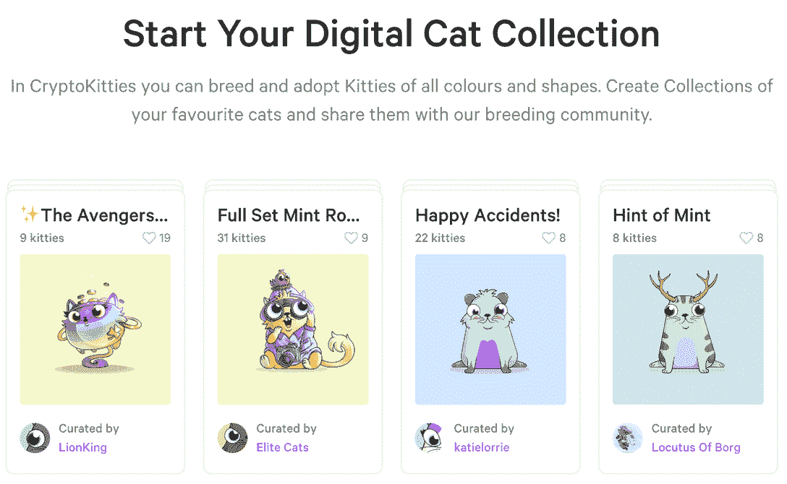
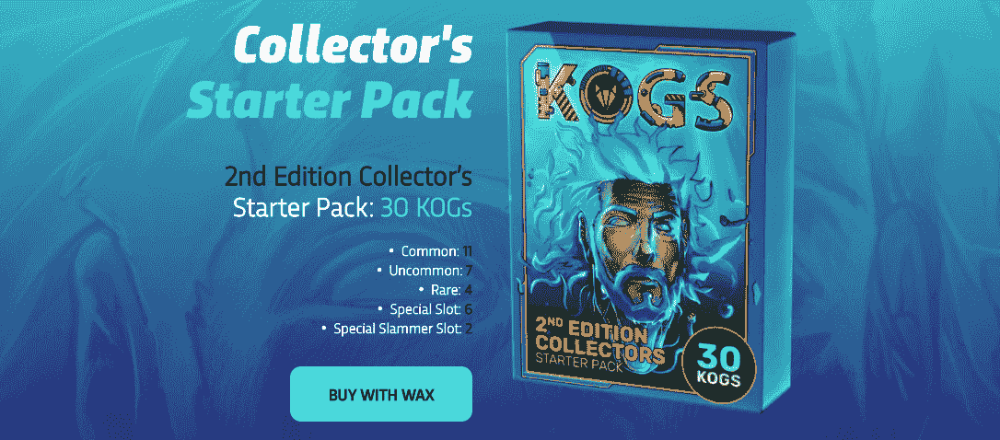
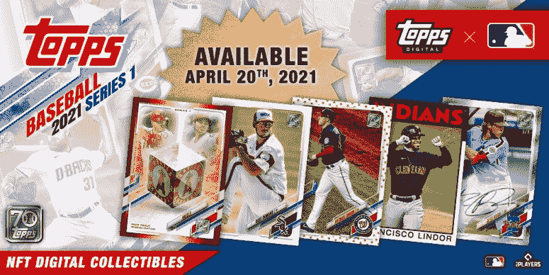
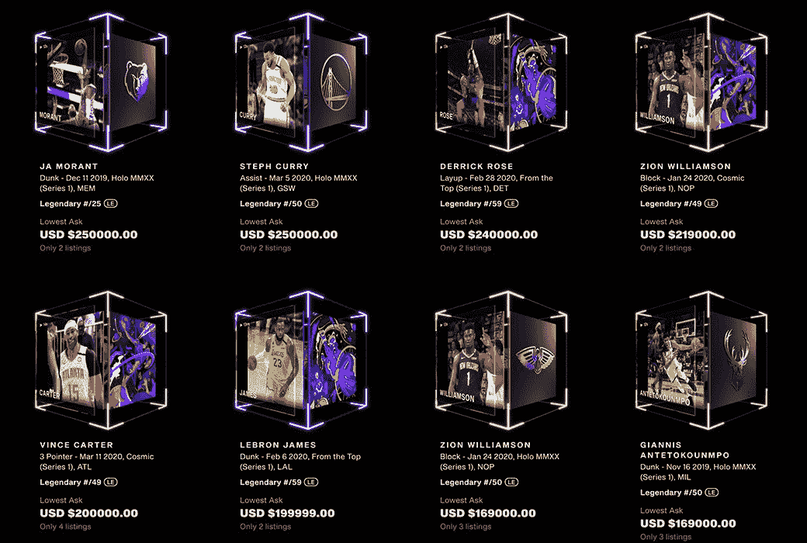
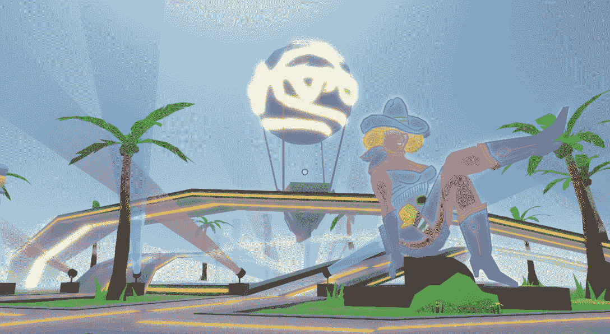
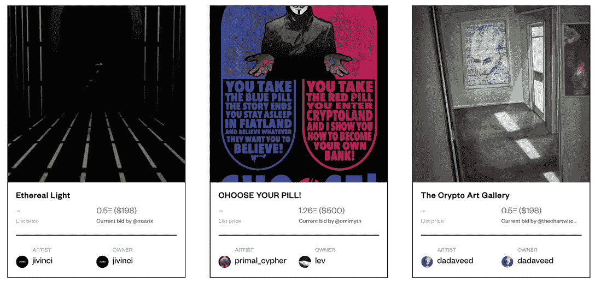
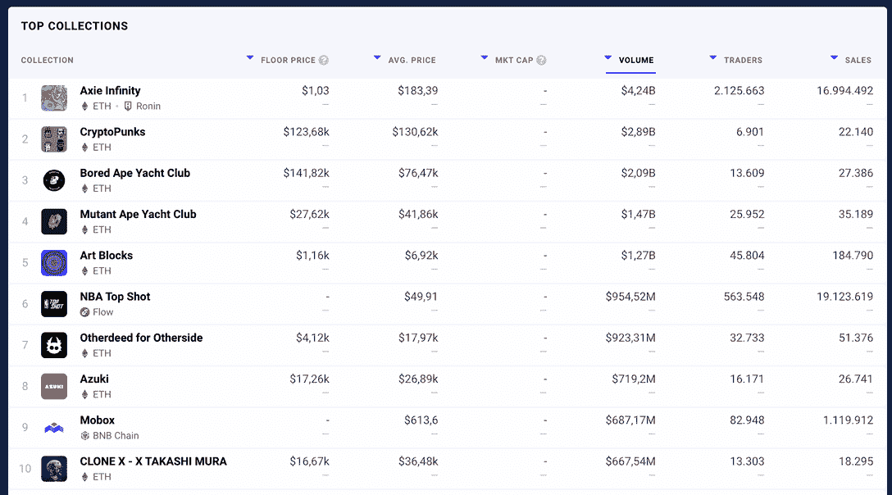
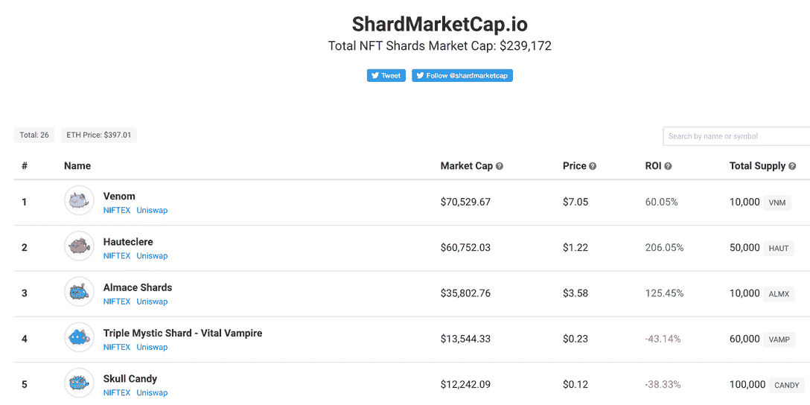

# 什么是不可替换的令牌

> 原文：<https://web.archive.org/web/https://dappradar.com/blog/what-are-non-fungible-tokens-nfts>

## 了解更多关于具有巨大增长潜力的行业的信息

NFT 是最近谈论最多的话题之一。像阿迪达斯、普拉达和皮克斯这样的名人和品牌已经在这些数字资产上投入了数百万，每个名人似乎都有一个属于自己的 NFT。尽管如此，大多数人仍然没有弄清楚这一切的意义。毕竟，**什么是不可替代的令牌** (NFTs)？是什么让它们如此特别，为什么让你理解这种趋势如此迫切？只是一种趋势吗？本文将涵盖这些和许多其他问题，所以请继续阅读，直到最后了解关于 NFTs 的所有内容。

## 什么是不可替换的令牌？

不可替代代币(或简称 NFTs)是在以太坊或 Solana 等区块链上发行的独特数字物品。在许多方面，它们与现实世界中的物品具有相似的性质。

想想实物商品，比如限量版运动鞋、可收藏的棒球卡，或者 Supreme 等服装品牌的限量版吊坠。除此之外，还有一张亲笔签名的原创专辑，甚至是一份房产契约。

所有这些东西都代表着独特的东西，它们的原创性得到了某种程度的确认，在这种情况下，是通过当地法律或商标签名来确认的。然而，不可替代的代币受到区块链技术的支持，这使得它们的价值和真实性不容置疑。

### 非功能性测试是唯一的和可区分的

这些数字产品通过存储在区块链上的唯一序列号(即它们的令牌 ID)相互区分开来。序列号的工作方式与条形码相同，代码对应于特定物品的信息:它的外观、区别属性、制作它的艺术家或组织等等。

### 可证明是真实的

虽然被认为有价值的实物商品，如名牌服装或专业机械，通常都有真品证书，但非专利技术公司有智能合同来做到这一点。不可替代代币的创建过程在智能合约上注册，在区块链上制作，任何人都可以公开查看。

## 不可替换的令牌有什么用？

除了有趣的图片，NFT 还可以用于许多不同的方式。继续阅读，了解不可替换令牌最重要的实用程序。

### NFTs 作为所有权合同

最终，NFT 可以是数字收藏品、游戏项目，也可以是音乐会门票，或者是打开某扇门的数字钥匙。因此，您可以将 NFT 视为所有权的数字合同。

区块链上的这些代币可以证明某人拥有某件艺术品或数字收藏品，但它们也可以表明你拥有你最喜欢的乐队的终身门票。

在 DappRadar，我们通过完整的行业概览来跟踪 NFT 行业。顶级销售、顶级收藏和 NFT 市场排名为用户的投资决策提供指导。你可以在我们的 NFT 页面上找到这些信息。也可以大致了解一下自己钱包里的 NFT，或者朋友偶像钱包里的 NFT。查看下面的视频，了解[DappRadar](https://web.archive.org/web/20220724072740/https://dappradar.com/hub/wallet/)上的投资组合。

[https://web.archive.org/web/20220724072740if_/https://www.youtube.com/embed/WHL_uYv8riA?start=1&feature=oembed](https://web.archive.org/web/20220724072740if_/https://www.youtube.com/embed/WHL_uYv8riA?start=1&feature=oembed)

### 作为游戏化投资的 NFTs

使用 NFTs 的第一批有形用例之一是通过游戏化的投资，例如[cryptokities](https://web.archive.org/web/20220724072740/https://dappradar.com/ethereum/games/cryptokitties)和[cryptopk](https://web.archive.org/web/20220724072740/https://dappradar.com/ethereum/collectibles/cryptopunks)。2020 年，该行业出现了大量活动，但在 2021 年确实出现了爆炸式增长。

用户通常有机会赢得 NFT,因为在营销活动中，他们经常被用作“注册诱饵”。此外，用户可以直接购买 NFT 的。 [CryptoKitties](https://web.archive.org/web/20220724072740/http://cryptokitties.co/) 是这个过程的一个很好的例子，它增加了培育新小猫以创造新杂交小猫的游戏机制。

游戏的前提是收集 CryptoKitties 和它们的性状，这些性状决定了它们的长相。不同的密码猫不仅仅是随机的。作为从区块链“读取”该密码猫的特征或数字信息的结果，图像被分配给每个密码猫序列号。

另一个值得关注的例子是 CryptoPunks。密码朋克已经存在很久了。在 2017/18 年的大加密泡沫之前，以及在 [CryptoKitties](https://web.archive.org/web/20220724072740/https://dappradar.com/app/3/cryptokitties) 看到阳光并以数千笔交易挤满以太坊区块链之前。

CryptoPunks 故事的开始很有趣，因为它似乎是一个大规模的实验，以衡量人们对 NFT 所有权的兴趣。当 creators 幼虫实验室在 2017 年 6 月推出 CryptoPunks 时，他们免费发布了 10，000 个与以太坊区块链绑定的所有权证明。每一个角色都是由算法生成的，这意味着没有两个角色是相同的，有些角色的特征比其他角色更罕见。更重要的是，永远不会超过原来的 10000 个密码朋克。

立刻，两件事应该跃入脑海。稀缺性——事实上，只有 10，000 个朋克已经被创造出来，而且永远不会被创造出来。此外，每个朋克的特质决定了他们的市场价值。与前面给出的物理例子并没有什么不同。思考比特币的价值也是进一步理解加密朋克的良好开端，因为比特币已经被设定为有限的数量，因此，证明其价值随着时间的推移而增加。

#### 他们用来做什么？

上面描述的 NFT 是为了通过每件收藏品的稀缺性和独特性来获得收藏的乐趣和经济收益。 [CryptoPunks](https://web.archive.org/web/20220724072740/https://dappradar.com/blog/what-are-cryptopunks-a-simple-explanation) 专注于最稀有朋克的收藏和所有权。由于其独特和罕见的性质，这些朋克的价值在 2021 年成倍增长，似乎正在成为一种新的资产类别和有形的价值储存。

根据 2021 年 2 月的 [Dapp 行业报告](https://web.archive.org/web/20220724072740/https://dappradar.com/blog/dapp-industry-report-february-2021) CryptoPunks 已经产生了 7900 万美元的交易量。在最昂贵的 NFT 收藏品中，有三件每件售价超过 100 万美元。2021 年 3 月，一个外星朋克卖到了 756 万美元，创下了新纪录。

加密朋克是在 ETH 买的，但是 ETH 的价值没动那么多。2 月 1 日是 1300 美元，然后接近 2000 美元的峰值。月底，ETH 是 1500 美元。与此同时，NFT 收藏的这些神秘朋克的价值翻了三倍。在所有的宣传中，重要的是要记住，作为第一个系列，CryptoPunks 被认为是行业中的怪物，这本身就有价值。

这两个例子为 NFTs 提供了易于理解的用例，但是另一个完全更复杂的系统正在出现。如果不是比真实世界的物品更有价值的话[，NFT 将变得非常有价值。](/web/20220724072740/https://dappradar.com/blog/beeples-69m-christies-auction-shows-the-potential-of-nfts/)

### 音乐和流行文化中的 NFTs

如上所述，NFT 以数字所有权的形式存在于现实世界中。上面的例子指的是数字收藏品和价值存储，如艺术品或独特稀缺的 NFT 项目。但是它们的使用范围要广得多，目前正在更详细地探索。

一个变革时机已经成熟的行业是娱乐和音乐行业。多年来，创意人士和音乐家一直抱怨财富分配不公。NFT 有能力将权力放回创作者手中，大牌艺术家已经开始加入进来。

阿姆、唐·迪亚波罗、Wkend、Aphex Twin、列昂之王和史努比·道格等已经在 2021 年首映了他们自己的 [NFT 系列](https://web.archive.org/web/20220724072740/https://dappradar.com/nft)和[，这个名单还在继续增长](https://web.archive.org/web/20220724072740/https://dappradar.com/nft)。

在所有情况下，艺术家们向他们的粉丝传递的不仅仅是普通的音乐专辑或视频，而是完整的视听体验。例如，唐·迪亚波罗(Don Diablo)以 600 ETH 的价格出售了有史以来第一场长达一小时的 NFT 音乐会，即在撰写本文时约 120 万美元。史努比·多格扔掉了一本摄影集《与狗同行》，它汇集了史努比·多格早年的记忆。甚至现在臭名昭著的 FYRE 音乐节的组织者也参与了进来！

音乐产业被颠覆的另一种方式是像 Euler Beats 这样的 NFT 平台。 [Euler Beats 是一个在线音乐 NFT 项目](/web/20220724072740/https://dappradar.com/blog/euler-beats-enigma-collection-auctioned-for-3-million/)，拥有 27 首原创曲目，每首曲目 120 张拷贝。欧拉 Beats 推出时，他们以每张 0.271 ETH 的价格卖出了 27 张主唱片。这些主记录是由用户在区块链上生成的，因此买方永远不知道他们会收到什么。从这些主记录中，其他买家最多可以购买 120 份。每卖出一版，这些拷贝的价格就会上涨。

另一个案例是，一个病毒式 Youtube 的创建者将原作作为 NFT 出售。[《我的世界》:2011 年创作的最后一个 mine cart](https://web.archive.org/web/20220724072740/Minecraft: The Last Minecart created in 2011)是[第一个病毒视频](https://web.archive.org/web/20220724072740/https://www.youtube.com/watch?v=8uyxVmdaJ-w)，由走廊数码公司的创始人萨姆·格尔斯基和尼科·普林格创作。在撰写本文时，这款独一无二的数码收藏品在 NFT 市场上的售价为 16.29 ETH，约合 35，000 美元。这部短片是走廊数码公司发行的第一部病毒式视频短片，似乎打开了更多病毒式艺术品销售的闸门。

模因一直是一种流行的传递信息的方式。现在，原始图像的所有者正在从他们的遗产中获利。现年 21 岁的佐罗斯在四岁时被拍到站在一栋着火的大楼前，脸上带着恶魔般的傻笑，成为网络红人。现在，病毒迷因中的女子已经以 47.3 万美元的价格卖出了原始照片。

### 作为数字收藏品的 NFTs

随着一波新的数字收藏品冲击一级和二级市场，区块链蜡像最近越来越受欢迎。在以太坊上[每周百万美元的 NFT 销售额中，这位自称为](/web/20220724072740/https://dappradar.com/blog/binance-smart-chain-enters-top-10-nft-sales-for-first-time/)[NFTs](https://web.archive.org/web/20220724072740/https://dappradar.com/blog/is-wax-king-of-nfts/)之王的人一直保持相对低调。相反，Wax 一直在有计划地开展业务。他们甚至通过与独立乐队 Weezer 的合作，从品牌附属的数字收藏品转向音乐。这可以说是展示了未来非功能音乐人的可能性。

[每一次在 NFT 举行的初级蜡品销售都会立即售罄](https://web.archive.org/web/20220724072740/https://dappradar.com/blog/is-wax-king-of-nfts)，其中大多数都含有超过 100，000 NFT 的蜡品。此外，T2 二级市场的销售继续飙升。

2020 年通过 Wax 发布的品牌附属产品是 Kogs 系列。Kogs 是对 20 世纪 90 年代实物收藏品 POGS 的巧妙发挥。如今，虽然许多书一文不值，但也有一些很有价值。此外，Kogs 不仅仅是另一款 NFT 应用。用户可以像收集和交易其他 NFT 一样收集和交易它们，但这些数字收藏品也可以在 [beta Kogs 游戏中用作可玩的游戏部件。](https://web.archive.org/web/20220724072740/https://www.kogs.gg/yearslong-dream-of-100-on-chain-gameplay-becomesreality)它们也可以在 RFOX 游戏生态系统中使用，以解锁特殊的特性和功能。

世界著名的收藏卡制造商 Topps 将在 2020 年多次成功推出 Wax 后，首次在 Wax 区块链推出他们的美国职业棒球大联盟(MLB)系列 1 NFT 系列。该版本将包括基础卡，标志性的复古设计，动画集，等等。标准包的价格为 5 美元，包含 6 张卡，高级包的价格为 100 美元，包含 45 张卡。这些高级包有更高的机会包含稀有或传奇卡。

Wax 推出低价值、高销量的 NFT 收藏品的方式似乎开始吸引更多的观众。价格合理的收藏品的吸引力正在引起共鸣，看看 Wax 是否能在这一成功的基础上继续发展，并为他们的军火库增加更多的高飞行 dapps，这将是一件有趣的事情。

另一个在 2021 年爆发的 NFT 项目是 NBA Top Shot 以及它运作的特定区块链 Flow。迄今为止，NBA Top Shot 已成为销售额最大的 NFT 市场。NBA Top Shot 吸引了主流篮球迷和职业球员，自 2020 年底上线以来，市场交易总额超过 5 亿美元，销售额超过 400 万美元。相比之下，2017 年推出的 CryptoPunks 在[的历史销售额](https://web.archive.org/web/20220724072740/https://email.mg2.substack.com/c/eJwtUcuupCAQ_RpZduQh6oLFJDf3C-7elFAqaQUD5Z3491PdPUkFDvXknPJAuOZyuzNXEq9jovtEl_Bv3ZEIi7gqlikGZzprjLGCUZBDN4hYp6UgHhB3R-VCcV7zHj1QzOlVIKXqRrE5Zb21MvTBDBbAd0qHEbW3HoxF1evPWLhCxOTR4S-WOycUu9uIztroP436Zks5LVda47zjw-eDPQeUJxKDLVZiFox8uU_Kz0gUkUu_l7gziUZ_Vdjxh6k1qtNfjbI7ppU2DsiWXzUXYjzv2T9_4oGV4DjfqQGrfyUQvDNaEZ1qlWSTcjSjNg_5MDgM0uMyYqssyGGB1vTjEOZejqNXujHtsapHvWZu45-v34viIiQOBDjPAgHK28sSTnwfV4p0T5iAyYaPuvTZ0VvvacWEhXcXJiAnrdRtr8aB1_JfTZZfK2O6ttWCx4bMVcnRhgEXnkv_ALR5qEM)刚刚超过 3 亿美元。

[NBA Top Shot 卡包在几分钟内就销售一空](https://web.archive.org/web/20220724072740/https://dappradar.com/blog/nba-top-shot-dominates-nft-space-with-40-million-sales/),并吸引了加密领域有影响力的人士和主要演员的注意。在推特上，天使投资人[罗米恩·希思称对 NBA Top Shot](https://web.archive.org/web/20220724072740/https://twitter.com/RomeenSheth/status/1358928026520715264)的需求是“疯狂的”，并表示在过去的 30 天里，他们的销售额达到 3000 万美元，他们“正在成为有史以来增长最快的市场”罗曼是对的。

### NFTs 作为虚拟土地

当谈到虚拟土地，有越来越多的选择。NFT 可以是对例如分散土地、沙箱、密码体素和许多其他游戏和虚拟空间中的独特虚拟土地的所有权的证明。

2017 年，随着虚拟世界的承诺，分散土地在短短一个多小时内筹集了 2600 万美元，玩家可以拥有土地并在其上建造房屋。四年后，这个世界正在迅速发展。美术馆正在开放，游戏被添加到游戏世界，与此同时，人们通过创造和销售数字时尚来赚钱。隐体素和沙盒也有类似的趋势，对虚拟土地的需求非常高。

在虚拟世界中，商家通过出售商品来赚取真实的钱。用户可以访问分散的商店，购买虚拟物品，例如 CryptoKitty，他们虚拟家庭的艺术品，或者他们游戏中化身的新装备或配件。说到虚拟土地——每块土地都是一个 NFT，代表虚拟世界中的一块土地。

Vegas Plaza inside Decentraland

在这个场景中，让每块 NFT 土地独一无二的是它的地理位置。每个 NFT 的价格也取决于市场。就像现实世界中的房地产一样，价格因位置不同而不同。你那块地周围的客流量越大，或者离另一块高价地越近，它的售价就越高。

对于那些读过或看过欧内斯特·克莱恩(Ernest Cline)的《一号玩家》(Ready Player One)的人来说，你可能开始把拼图拼在一起，并开始意识到我们观察到的世界并不遥远。

### 作为艺术的 NFTs

艺术界被区块链和 NFTs 颠覆的时机已经成熟。数字艺术家长期以来一直在寻找一种方式来利用他们的辛勤工作，最重要的是获得报酬。像 Pixabay 这样的网站为艺术家提供了创作署名作品的机会，但不是经济收益。

像“分散的土地”这样的虚拟世界已经爆发出数字艺术家想要在虚拟画廊展示他们作品的活动；给观众和潜在买家一个新的，互动的方式来发现和购买艺术品。

像 [Rarible、](https://web.archive.org/web/20220724072740/http://superrare.co/)、 [KnownOrigin](https://web.archive.org/web/20220724072740/https://knownorigin.io/) 和最近的 [Nifty Gateway](https://web.archive.org/web/20220724072740/http://niftygateway.com/) 这样的数字艺术品市场已经出现，艺术家可以将他们的艺术品标记为 NFT，拍卖它们，并允许用户以固定价格出价或直接购买。如果这些用户碰巧也拥有虚拟房屋甚至画廊，他们可以把这些挂在墙上，让人们也能体验他们的收藏。这个领域的后起之秀之一是 Beeple，他在 Instagram 上成名，现在通过 NFTs 赚了几百万。

艺术家的另一个惊人的好处是，像 SuperRare 这样的平台为创作者提供了终身价值。即艺术家在最初的第一次销售后的每一次销售中赚取一定的百分比。

[The SuperRare UX is very appealing](https://web.archive.org/web/20220724072740/https://superrare.co/)

Rarible 是 2020 年末引起真正轰动的最著名的市场之一，其创新理念是向其社区提供 RARI 治理令牌。 [Rarible](https://web.archive.org/web/20220724072740/https://dappradar.com/ethereum/marketplaces/rarible) 通过采用 DeFi boom 的一项关键技术，有效地提高了它的声誉。

此外，像 MullArt 这样的 dapps 已经在 2021 年到来，并向 NFT 市场的创作者、买家和卖家空投免费代币，以推广他们自己的 NFT 艺术项目。最近，[林赛·罗韩在 Rarible](https://web.archive.org/web/20220724072740/https://app.rarible.com/lindsaylohan) 上发布了自己的个人资料，以略高于 50，000 美元的价格出售了自己创作的“[比特币闪电”。额外转售的部分将归这位女演员所有，她还宣布将捐赠给“接受比特币的慈善机构”。她追随了其他在该平台上创造了第一张 NFT 的名人，包括美国亿万富翁马克·库班和说唱歌手酱爆弟弟。](https://web.archive.org/web/20220724072740/https://decrypt.co/57366/lindsay-lohan-bitcoin-lightning-nft-sells-50000)

最近，由 Beeple 和 B20 token 制作的数字艺术品成为人们关注的焦点，因为加密艺术正在经历重大增长。他的作品《十字路口》在二级市场上以 660 万美元的价格卖出，因此，B20 代币的价值大幅上升。

与此同时，像 SuperRare 和 Rarible 这样的 NFT 市场在过去 12 个月里增长迅猛。目前，人们对 NFTs 有很大的兴趣，随之而来的是密码艺术大放异彩的新时刻。B20 token 是 NFT 空间中最有趣的项目之一，因为它分散了价值数百万美元的艺术品的所有权，而大多数人都无法获得这些艺术品。B20 是一种象征，它将 20 多件数码艺术品的所有权分割开来，这些艺术品是由美国艺术家毕普创作的，毕普目前是现代艺术领域的一颗新星。

## 我在哪里能买到 NFT？

根据你想要投资的 NFT 收藏，你可以在不同的平台上购买不可替代的代币。一些项目有自己的市场——大多数游戏和 metaverses 都是如此，但你也可以在专门的市场上找到 NFT 出售。

**要了解更多信息，请阅读我们的文章** [购买、交易和出售非金融资产的十大最佳 NFT 市场](https://web.archive.org/web/20220724072740/https://dappradar.com/blog/top-10-best-nft-marketplaces)

你知道你也可以在 DappRadar 买卖 NFT 吗？你所要做的就是使用我们的投资组合跟踪器。

## 如何评价 NFT？

不可替代代币的价格可能会因多种因素而有很大差异。收藏受欢迎程度、实用性和个体稀有性只是其中的一部分。

为了更好地了解一个特定的 NFT 值多少钱，您可以使用的最佳工具也是来自 DappRadar。我们的 [NFT 价值估算器](https://web.archive.org/web/20220724072740/https://dappradar.com/hub/nft-value-estimator)建立在一个直观的界面上，该界面由高级分析提供支持，并且完全免费！

## NFT 最著名的收藏品是什么？

了解哪些 NFT 集合是最受欢迎的，一定会让你明白什么是不可替代的代币，以及它们真正有价值的原因。

幸运的是，您可以通过交易量、平均价格和其他重要指标，使用[dappar Dar NFT 排名](https://web.archive.org/web/20220724072740/https://dappradar.com/nft)来发现不同区块链最受欢迎的收藏。

根据截至 2022 年 7 月的**DappRadar 数据，有史以来排名前十的 NFT 收藏见下图。**

发现新推出的和即将推出的 NFT 系列，并使用超级先进的 [NFT 浏览器](https://web.archive.org/web/20220724072740/https://dappradar.com/hub/nft-explorer)根据机器学习算法、历史销售和元数据获得估计的 NFT 价值！

[<picture></picture>](https://web.archive.org/web/20220724072740/https://dappradar.com/hub/nft-explorer)

## NFT 如何改进游戏？

互联网为游戏玩家提供了各种机会，让他们可以在网上玩游戏赚钱，做他们最喜欢的事情。如今，职业游戏玩家和内容创作者收入数百万，而社区成员被大型游戏开发商雇佣的故事比比皆是。

然而，大多数游戏玩家永远不会赚一分钱，只会把钱花在他们最喜欢的爱好上。[区块链游戏](https://web.archive.org/web/20220724072740/https://dappradar.com/blog/category/games)拥有强大的能力来改变这一点，并为游戏玩家带来更多力量。

由于区块链技术和游戏资产的令牌化，游戏设计师现在能够将特定资产分配给特定玩家。玩家钱包里有了这些物品的代币，就可以随心所欲地使用、出售或交易。他们花在游戏上的时间越多，他们获得的资源就越有价值。

从本质上来说，一个从玩到赚的游戏是免费分发的，就像一个免费的游戏一样。然而，在目前的区块链游戏市场，有大量的游戏需要初始投资。此外，一些游戏是免费的，但需要用户投资才能产生价值。

目前的区块链游戏市场每天有几千名用户，还不成熟。我们才刚刚起步。2010 年，iOS 和 Android 上的手机游戏应用仅产生了 8.16 亿美元的收入。

目前，区块链游戏市场必须克服各种挑战，以吸引主流用户。对许多人来说[获得任何加密货币已经是一个相当大的挑战](https://web.archive.org/web/20220724072740/https://dappradar.com/blog/use-dapps-in-a-few-taps)，更不用说用户在购买任何加密货币之前首先需要在交易所证明自己的身份。

## 什么是 NFT 切分？

2020 年 NFT 空间的另一个发展是切分。分片是将 NFT 分成更小块的过程。创造不可替代代币部分所有权的机会。

NIFTEX 平台支持将 NFT 划分为符合 ERC20 标准的可替换部分。这些碎片可以像任何其他 ERC20 一样在 NIFTEX 交易所交易。

细分有很多优点。其一，它有助于释放 NFT 所有者的流动性，降低获得有价值的非金融交易的成本，并极大地提高 NFT 市场的深度。

在 DappRadar，我们对分片的潜力感到非常兴奋，我们建立了一个专用的跟踪平台—[ShardMarketCap](https://web.archive.org/web/20220724072740/https://shardmarketcap.io/)。

[<picture></picture>](https://web.archive.org/web/20220724072740/https://shardmarketcap.io/)

ShardMarketCap allows users to analyze the shards of NFTs from the Niftex exchange.

ShardMarketCap 允许用户分析来自 Niftex 交换的 NFT 碎片。

更进一步的想法是 Beeple 和 B20 令牌。随着加密艺术的大幅增长，Beeple 制作的数字艺术品成为人们关注的焦点。他的艺术品《十字路口》在二级市场上以 660 万美元的价格售出，因此 B20 代币的价值大幅上升。

B20 token 是 NFT 空间中最有趣的项目之一，因为它分散了对大多数人无法获得的价值数百万美元的艺术品的所有权。B20 是一种象征，它将 20 多件数码艺术品的所有权分割开来，这些艺术品是由美国艺术家毕普创作的，毕普目前是现代艺术领域的一颗新星。

随着 NFTs 变得越来越有价值，社区简单地找到了允许更多用户访问的方法。正是这种程度的创新使得区块链、戴普和 NFT 空间看起来如此有趣。

## 有哪些名人拥有 NFT？

如你所知，不可替换的代币在富人和名人中非常流行。帕丽斯·希尔顿、史努比·道格、贾斯汀比伯、塞丽娜·威廉姆斯和艾米纳姆是公开投资自己的 NFT 的一些大牌明星。在 DappRadar，你可以追踪名人的秘密 to get 钱包来获得灵感。

## 最后的想法

通过 NFTs 引入数字所有权确实令人兴奋。真正的数字所有权即将到来，整个世界似乎正在转向更加数字化的生活。部分是受新冠肺炎·疫情的刺激。

随着越来越多的人需要保护自己免受外界影响，我们可能会一直生活在数字环境中吗？

如果是这样，我们将需要在这些虚拟世界中做事情，而 NFTs 可以为真正的数字所有权提供完美的解决方案。现在你对什么是不可替代的代币有了更深的理解，并且是最新的，以决定它是否值得投资。

您想了解更多关于激动人心的分布式应用世界中的最佳项目吗？关注 DappRadar [博客](https://web.archive.org/web/20220724072740/https://dappradar.com/blog/)、 [YouTube](https://web.archive.org/web/20220724072740/https://www.youtube.com/c/DappRadar) 频道和 [Twitter](https://web.archive.org/web/20220724072740/https://twitter.com/dappradar) 。

## 有用的链接

*   [探索 NFT 市场](https://web.archive.org/web/20220724072740/https://dappradar.com/nft)
*   [追踪您的钱包持有量和 NFT 值](https://web.archive.org/web/20220724072740/https://dappradar.com/hub/wallet/)
*   [关于 NFTs 的更多信息](https://web.archive.org/web/20220724072740/https://dappradar.com/blog/category/collectibles)

## NFT 估价报告

*   [如何估值:NBA 顶级投篮](/web/20220724072740/https://dappradar.com/blog/how-to-value-nba-top-shot-nfts/)
*   [如何估值:CryptoPunks](/web/20220724072740/https://dappradar.com/blog/how-to-value-cryptopunks/)
*   [如何估值:CryptoKitties](/web/20220724072740/https://dappradar.com/blog/how-to-value-cryptokitties-nft-collectibles/)
*   [如何赋值:Hashmasks](/web/20220724072740/https://dappradar.com/blog/how-to-value-hashmasks-nfts/)
*   [如何估值:异形词 NFTs](/web/20220724072740/https://dappradar.com/blog/how-to-value-alien-worlds-nfts/)
*   [如何评估 Sorare NFTs](/web/20220724072740/https://dappradar.com/blog/how-to-value-sorare-nfts/)
*   [如何对 Axie Infinity NFTs 进行估值](/web/20220724072740/https://dappradar.com/blog/how-to-value-axie-infinitys-axie-nfts/)

 NewsletterUnsubscribe at any time. [T&Cs](https://web.archive.org/web/20220724072740/https://dappradar.com/terms) and [Privacy Policy](https://web.archive.org/web/20220724072740/https://dappradar.com/privacy-policy)