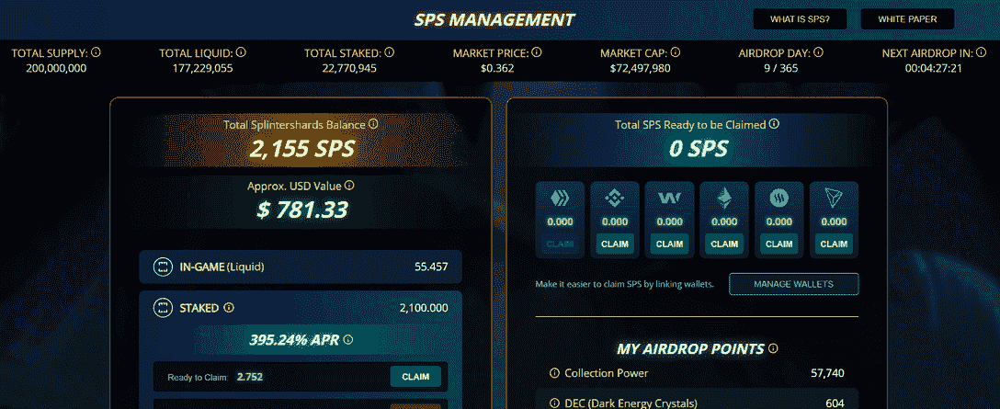

# 什么是碎片硬盘，也称为 SPS 令牌

> 原文：<https://web.archive.org/web/https://dappradar.com/blog/what-are-splintershards-also-known-as-sps-tokens>

## 对分裂国家治理令牌的简单解释

SplinterShards，简称 SPS，是交易卡牌游戏 Splinterlands 的治理标志。在 Splinterlands 生态系统中拥有股份的每个游戏玩家在 365 天内每天都可以获得 SPS 奖励。

SPS 或 SplinterShards 是 Splinterlands 的治理标志，这是蜂巢区块链上的一种纸牌游戏。通过游戏，玩家可以获得 DEC 代币，例如在以太坊领先的 DeFi 平台 Uniswap 上有一个 DEC-ETH 流动性池。此外，玩家可以将他们的 NFT 游戏卡连接到蜡像区块链，在热门市场上交易他们的 NFT。无论你在 Splinterlands 的什么地方有股份，你都可以要求 SPS 代币。

Splinterlands 的开发者已经创建了一个 SPS 管理仪表板，用户可以从各种区块链链接他们所有的钱包。用户可以链接币安智能链、Wax、以太坊、Steem、Hive 和、Tron。无论他们在哪里拥有资产，所有钱包都将决定 SPS 空投奖励。SPS 用户可以申请的金额取决于他们的资产占社区空投总点数的比重。

拥有高级卡、即将到来的游戏资料片的虚拟土地或大量 DEC 代币的用户会自动获得奖励。你在 SPS 生态系统中的股份越大，你每天收到的 SPS 奖励就越多，直到 2022 年夏天。

SPS 代币也将在实际游戏中获得奖励，这是意料之中的事。这些特殊的比赛还没有公布，但是开发者在他们的文档中戏弄了这些选项[。](https://web.archive.org/web/20221209165733/http://sps.splinterlands.com/)

Splinterlands.com

## 但是你能用 SPS 做什么呢？

短期来看，SPS 持有者将在促销活动中获得折扣和额外奖励，但治理令牌的计划更进一步。SPS 代币持有者将有能力投票决定游戏的未来走向。令牌持有者可以创建开发提案，并审核第三方 dapp 提案以纳入生态系统。

Splinterlands 在币安智能链上推出了 SPS。这意味着你可以在 PancakeSwap 或通过 [DappRadar Swap](https://web.archive.org/web/20221209165733/https://dappradar.com/hub/swap/bsc/BNB/SPS?to=0x1633b7157e7638c4d6593436111bf125ee74703f) 交易 SPS。

此外，用户可以在 Splinterlands 网站上下注他们的 sp。一旦用户取消资产，每周将有 25%的用户解锁。这意味着拆堆将在 4 周后完成。服用目前是通过高 APY 推广的。

## 让我们解释一下夹板岛

夹板岛是区块链蜂巢上的一种纸牌游戏。玩家只需要创建一个账号就可以开始游戏了。这个游戏提供了一套免费的卡片，允许任何人捡起来玩。通过赢得战斗，玩家可以获得 DEC 代币。赢得战斗也意味着你的级别上升，更高的级别带来更好的奖励。

Splinterlands 提供定期锦标赛，而玩家可以随时相互战斗，并在每月排名中攀升。夹板地的战术元素隐藏在战斗准备中。游戏给玩家一组限制，在这些限制内，双方玩家都需要在一个时间限制内建立他们的甲板。当双方玩家都选择了他们的卡，战斗开始。这些战斗的结果是由选择的牌决定的，不能受玩家的影响。

 NewsletterUnsubscribe at any time. [T&Cs](https://web.archive.org/web/20221209165733/https://dappradar.com/terms) and [Privacy Policy](https://web.archive.org/web/20221209165733/https://dappradar.com/privacy-policy)