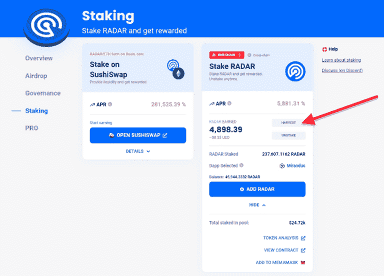
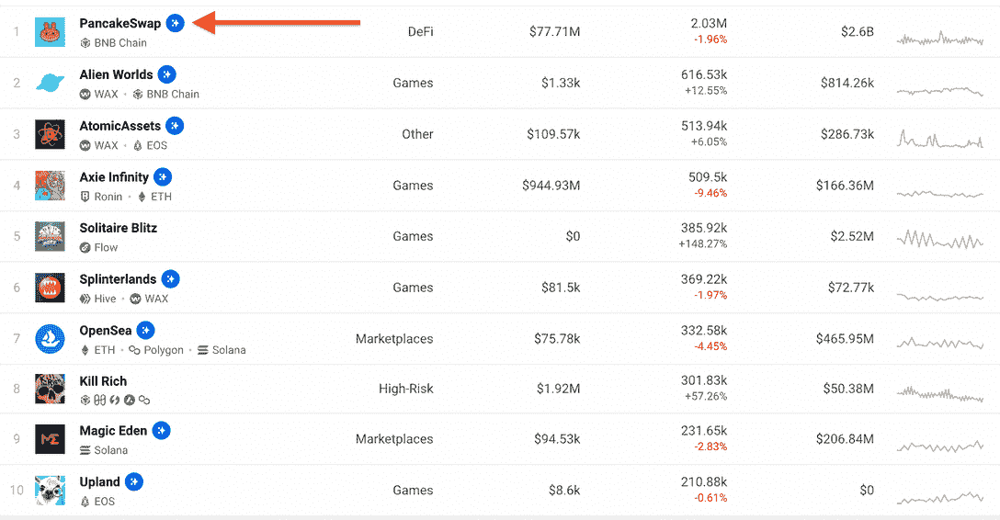

# 标桩雷达有什么好处？

> 原文：<https://web.archive.org/web/https://dappradar.com/blog/what-are-the-benefits-of-staking-radar>

## 如何收获奖励，获得 LP 代币，并通过雷达提升您最喜爱的 dapps

在 DappRadar 生态系统中，RADAR 充当着治理和实用工具的角色。代币赋予持有者通过治理塑造 DappRadar 未来的发言权，允许提前访问独家 DappRadar PRO 内容，并以各种方式奖励代币持有者。在今天的文章中，我们将重点讨论如何通过标桩雷达获取收益。

RADAR 的推出是 DappRadar 推动去中心化治理和鼓励用户共同参与平台开发的重要一步。我们将这种创新方法命名为 Contribute2Earn (C2E)。

有了 C2E，用户的贡献将得到奖励。用户如何参与收获奖励？雷达跟踪是主要的方法。如果你还没有学会如何利用雷达，[这篇文章将指导你完成](/web/20221128040553/https://dappradar.com/blog/how-to-stake-radar-and-harvest-rewards-on-another-blockchain/)它。也可以用下面的视频教程。

[https://web.archive.org/web/20221128040553if_/https://www.youtube.com/embed/pThbMD_ceXs?feature=oembed](https://web.archive.org/web/20221128040553if_/https://www.youtube.com/embed/pThbMD_ceXs?feature=oembed)

一旦你具备了这些基础知识，让我们开始激动人心的部分——锁定雷达的好处:

*   [收获奖励](https://web.archive.org/web/20221128040553/https://dappradar.com/blog/what-are-the-benefits-of-staking-radar/#harvest)
*   [接收 LP 令牌](https://web.archive.org/web/20221128040553/https://dappradar.com/blog/what-are-the-benefits-of-staking-radar/#lp)
*   [提升你最喜欢的 dapps](https://web.archive.org/web/20221128040553/https://dappradar.com/blog/what-are-the-benefits-of-staking-radar/#boost)

## 如何收获雷达？

要获取雷达，只需用户将雷达对准任何符合条件的区块链。另外值得一提的是，雷达支持[跨链打桩](/web/20221128040553/https://dappradar.com/blog/how-to-stake-radar-and-harvest-rewards-on-another-blockchain/)。它允许雷达令牌持有者在一条链上下注他们的雷达，然后在另一条链上要求奖励。

最初，我们支持以太坊和 BNB 链，不久将有 Polygon 加入。从技术上讲，该服务支持未来的任何其他区块链。

一旦锁定了雷达，你的钱包以后会获得额外的雷达。截图右侧有一个“收获”按钮。点击它。你制造了更多的雷达。

## 如何领取 LP 代币？

提供流动性有助于围绕雷达令牌建立健康的经济。作为流动性提供者，你需要将两种不同的代币放入一个池中，为交易池做贡献。例如，您可以将 RADAR 和 ETH 组合成一对，将它们注入 RADAR-ETH 池。

作为流动性提供者，您将获得 LP 代币。这些是你的雷达池份额的收据。

请记住，在提供流动性时，您可能不得不应对非永久性损失。当一个代币的价值上升很多，而另一个保持不变时，就会发生这种情况。

## 如何用雷达助推自己喜欢的 dapps？

标桩雷达的另一个令人兴奋的特性是，它给了令牌标桩者提升能力。用户可以用 Boost Power 做什么？它允许用户在我们的生态系统中只为以太坊 dapp 显示对一个 dapp 的支持。dapp 获得的助力越大，就越容易成为焦点。

在下面的图片中，你可以看到一些闪烁的蓝色星星图标。没错！我们已经有用户给他们喜欢的 dapps 配备了 Boost Power。

增强力量是一个很好的方式来表达对你最喜欢的 dapp 的支持，但是在未来，这个功能将会为那个特定的 dapp 的整个社区释放无数的力量。敬请关注 [Twitter](https://web.archive.org/web/20221128040553/https://twitter.com/dappradar) 和 [Discord](https://web.archive.org/web/20221128040553/https://discord.gg/4ybbssrHkm) ，了解未来的所有福利！

现在你已经准备好了所有的知识，你可以在这里得到一些[雷达，然后](https://web.archive.org/web/20221128040553/https://dappradar.com/hub/token/eth/RADAR/ETH?from=0x44709a920fccf795fbc57baa433cc3dd53c44dbe)[在这里](https://web.archive.org/web/20221128040553/https://dappradar.com/token/overview)享受跑马圈地的好处。