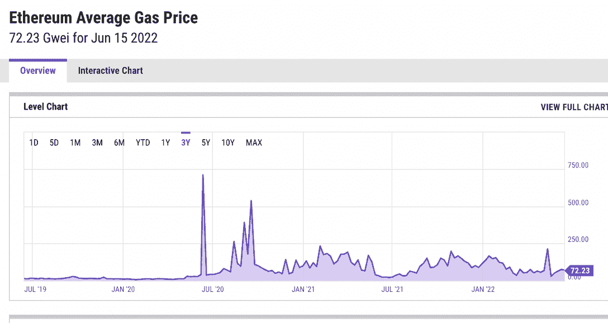
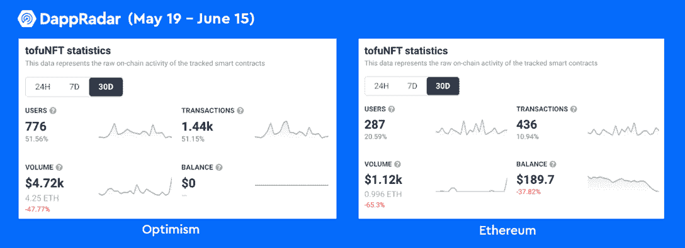
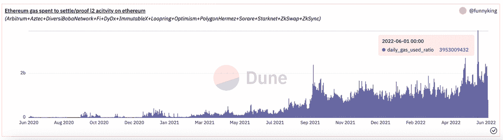

# 不可替换令牌的最佳第 2 层区块链是什么

> 原文：<https://web.archive.org/web/https://dappradar.com/blog/what-are-the-best-layer-2-blockchains-for-non-fungible-tokens>

## 激烈竞争中的领先者是乐观主义、Arbitrum、不变的 X 和 ZK 空间

许多第 2 层解决方案已经出现，以解决以太坊的扩展问题。这些第 2 层解决方案以接近零的成本提供了闪电般的速度和即时交易终结。

虽然第二层仍处于婴儿期，但它们在不断进化，每天都有新的 dapps 出现在它们的生态系统中。在本文中，我们将概述领先的第 2 层协议的最新 NFT 前景。

**总结**

*   第 2 层解决方案是 NFTs 走向主流所必需的。
*   目前最受用户欢迎的 NFT 二层解决方案包括[乐观](https://web.archive.org/web/20220704234824/https://dappradar.com/rankings/protocol/optimism)、[仲裁](https://web.archive.org/web/20220704234824/https://dappradar.com/ethereum/other/arbitrum)、[不可变 X](https://web.archive.org/web/20220704234824/https://dappradar.com/rankings/protocol/immutablex) 和 [ZK 空间](https://web.archive.org/web/20220704234824/https://zks.org/)。
*   DappRadar 跟踪多个第二层区块链上的用户活动。Dapp [排名](https://web.archive.org/web/20220704234824/https://dappradar.com/rankings)帮助用户发现各种区块链上的优质项目。
*   此外，用户还可以使用 DappRadars [NFT 浏览器](https://web.archive.org/web/20220704234824/https://dappradar.com/hub/nft-explorer)来检查和交易 NFT。

## 为什么第 2 层解决方案对 NFTs 是必要的？

自 2020 年末以来，不可替代令牌已成为密码行业最具活力的领域之一。根据 DappRadar BGA Report 2021 的数据，NFT 地区全年交易量为 23 美元，其中游戏 NFT 占 20%。

以太坊是智能合约的先驱，也是大多数 NFT 用户的自然选择。然而，NFT 获得了如此巨大的牵引力，以至于巨额投资导致以太坊第一层区块链出现拥堵。因此，交易成本飙升。

正如我们在下面的[图中所看到的，在 2020 年 DeFi 夏季和 NFTs 的兴起之后，以太坊燃气费出现了显著的上涨，并且总体趋势仍然保持不变。](https://web.archive.org/web/20220704234824/https://ycharts.com/indicators/ethereum_average_gas_price)

source: ycharts

以太坊的可扩展性问题从根本上降低了 NFT 用户的利润，并凸显了实施第 2 层的紧迫性，这是一个解决扩展困难的解决方案。

好消息是，许多第 2 层解决方案在过去的一年里取得了里程碑式的成就，并开始为 NFTs 提供更高效、更廉价的基础设施。

今天的文章将关注一些帮助 NFTs 发展的顶级第 2 层协议。

## 乐观:NFT 市场的新贵

乐观采用[乐观汇总](https://web.archive.org/web/20220704234824/https://dappradar.com/blog/ethereum-rollups-a-simple-explanation)优化交易，进一步降低天然气成本。乐观主义与以太坊完美兼容，并且非常容易部署，它的流线型体验得到了开发者的广泛支持。今年早些时候推出的 [OP 令牌](https://web.archive.org/web/20220704234824/https://dappradar.com/hub/token/eth/OP/ETH?from=0x4200000000000000000000000000000000000042)证明了这种扩展解决方案的受欢迎程度。

乐观在铸造或交易 NFT 中有什么优势？对于那些信任以太坊安全性，寻找更实惠的交易成本的人来说，开发者友好的乐观主义是明智的选择。

[看看 DappRadar 遇见乐观主义](https://web.archive.org/web/20220704234824/https://www.youtube.com/watch?v=YT_4uioKLsg)

说明这一点的一个很好的例子是 [tofuNFT](https://web.archive.org/web/20220704234824/https://dappradar.com/optimism/marketplaces/tofunft) 对乐观主义的扩展。NFT 市场的独立用户和交易量在 30 天内增长了 51%。值得注意的是，乐观的用户数量和交易量已经大大超过了以太坊。更详细的对比如下。

在下面的视频中，了解如何将乐观主义与元掩码联系起来。

[https://web.archive.org/web/20220704234824if_/https://www.youtube.com/embed/VliU0f4kmS8?feature=oembed](https://web.archive.org/web/20220704234824if_/https://www.youtube.com/embed/VliU0f4kmS8?feature=oembed)

另一个值得注意的 dapp 是 NFT 本土的乐观市场，今年一月在乐观频道首次亮相。Quixotic 目前每月向区块链发送超过 12，000 个用户，在过去 30 天内产生 500，000 美元。

## 阿比特鲁姆:NFT 联盟日益强大

[Arbitrum](https://web.archive.org/web/20220704234824/https://dappradar.com/ethereum/other/arbitrum) 是另一个第 2 层扩展解决方案，采用了[乐观汇总](https://web.archive.org/web/20220704234824/https://dappradar.com/blog/ethereum-rollups-a-simple-explanation)。它继承了以太坊的安全性，支持以太坊智能合约和工具，同时提供极其廉价和快速的交易。

关于 NFT 的景观，我们注意到一个被称为 NFT 联盟的强大网络已经形成，为未来 NFT 在阿尔比特鲁姆的景观奠定了基础。目前，联盟中有 21 个 NFT 项目、6 个市场、4 个游戏项目和 4 个 DeFi 项目。

放大后，我们发现了一些令人兴奋的项目，如唐吉诃德的姐妹市场 [Stratos](https://web.archive.org/web/20220704234824/https://stratosnft.io/) 、RPG 冒险游戏[奥术](https://web.archive.org/web/20220704234824/https://www.arcanemagic.net/)、社会实验和生成艺术项目[随机漫步 NFT](https://web.archive.org/web/20220704234824/https://www.randomwalknft.com/) 等等。

NFT 联盟是一个自愿的、社区运营的项目，因此他们并不代表 Arbitrum 上的整个 NFT 景观。但是，在一定程度上，NFT 联盟网络中项目的增加可以反映用户对 Arbitrum NFT 基础设施的支持。

## 不变的 X:由 StarkWare 驱动的 NFT 旗舰

与上面提到的两个不同，StarkWare 的第二层产品 StarkNet 使用[零知识(ZK) rollup](https://web.archive.org/web/20220704234824/https://dappradar.com/blog/ethereum-rollups-a-simple-explanation) 技术来解决以太坊的伸缩问题。针对以太坊网络中存在的可扩展性问题，StarkWare 设计了 StarkEx 作为定制的扩展引擎，以满足 NFT 和 DeFi dapps 的特定需求。不可变 X ( [IMX](https://web.archive.org/web/20220704234824/https://dappradar.com/rankings/protocol/immutablex) )是最早受益于 StarkEx 强大功能的一批。

[不可变 X](https://web.archive.org/web/20220704234824/https://dappradar.com/rankings/protocol/immutablex) 是第一个专门为 NFTs 和游戏 dapps 服务的第 2 层扩展协议。此外，用户可以在其平台上创建零汽油成本的 ERC-721 和 ERC-20 代币。凭借这样的成本效益和独特的价值主张，Immutable X 已经成为许多 NFT 游戏的首选。

在生活在永恒不变的 dapps 中，我们可以找到一些著名的游戏，如[被解放的神](https://web.archive.org/web/20220704234824/https://dappradar.com/immutablex/games/gods-unchained)、[伊鲁威](https://web.archive.org/web/20220704234824/https://dappradar.com/immutablex/games/illuvium)、[由 VeeFriends](https://web.archive.org/web/20220704234824/https://dappradar.com/immutablex/collectibles/book-games-by-veefriends) 制作的图书游戏，等等。

## ZKSea:体育迷的潜在 NFT 市场

基于 [ZK 滚动技术](https://web.archive.org/web/20220704234824/https://dappradar.com/blog/ethereum-rollups-a-simple-explanation)，L2 实验室推出了 ZKSpace，这是一个全功能的第二层协议，为 DEX、支付和 NFTs 提供基础设施。

通过利用 ZK 汇总，ZKSea，一个由 ZK 空间支持的 NFT 市场，专注于为不断增长的非功能性桌面用户群提供可销售和可负担的体验。

ZKSea 允许用户以各种加密货币支付交易费用，如 [ETH](https://web.archive.org/web/20220704234824/https://dappradar.com/hub/token/eth/ETH) 、 [USDT](https://web.archive.org/web/20220704234824/https://dappradar.com/hub/token/eth/USDT?from=0xdac17f958d2ee523a2206206994597c13d831ec7) 、 [WBTC](https://web.archive.org/web/20220704234824/https://dappradar.com/hub/token/eth/WBTC?from=0x2260fac5e5542a773aa44fbcfedf7c193bc2c599) ，或 ZK 空间的原生令牌 [ZKS](https://web.archive.org/web/20220704234824/https://dappradar.com/hub/token/eth/ZKS/ETH?from=0xe4815ae53b124e7263f08dcdbbb757d41ed658c6) 。相比之下，不可变 X 用户只需向 IMX 支付交易费用。

ZKSea 一直致力于为该平台创造独特的定位。最近，NFT 市场与哥伦比亚足球巨星詹姆斯·大卫·罗德里格斯·卢比奥签署了一份战略合作协议。

这次合作将为 ZKSea 的社区带来一系列有特色的 NFT。因此，或许 ZKSea 的差异化策略是建立一个迎合体育迷的 NFT 市场。

## 最后的想法

随着 NFTs 引起主流兴趣，使铸造和交易更快、更便宜、更容易获得和可扩展的第二层解决方案将在进一步释放 NFTs 的潜力方面发挥重要作用。

将项目直接迁移和部署到第 2 层的大趋势已经开始了。根据下面的图表，我们可以看到越来越多的以太坊气体被用于第二层交易，在 6 月 1 日达到历史峰值。当天，每日 1000 亿天然气限额中的 39.5 亿用于结算 L2 交易。

source: Dune

在可预见的未来，第二层空间将见证更加激烈的竞争。但这对开发者、NFT 用户和创作者来说可能是好事，因为协议将关注差异化、定制化，并为他们的用户提供独特的服务。

DappRadar 将继续监测第二层协议和 NFT 领域的最新发展。在 [Twitter](https://web.archive.org/web/20220704234824/https://twitter.com/dappradar) 、 [Discord](https://web.archive.org/web/20220704234824/https://discord.gg/4ybbssrHkm) 和 [Youtube](https://web.archive.org/web/20220704234824/https://www.youtube.com/c/DappRadar) 上关注我们，跟上区块链世界的动态。