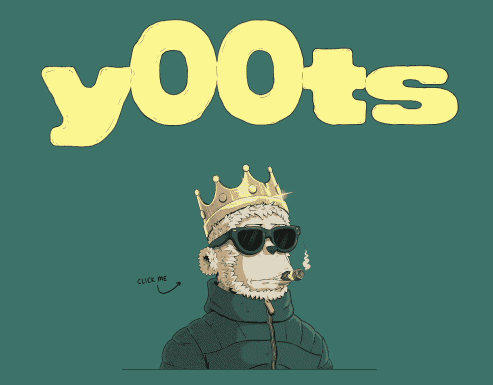
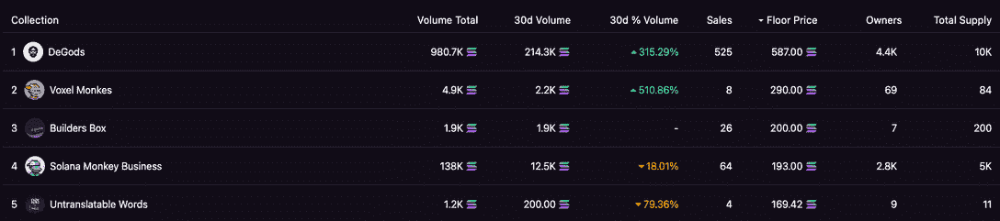
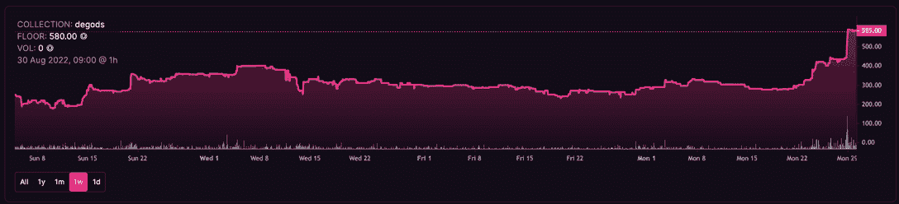

# 什么是 y00tss NFTs &你在 y00t 列表上吗？

> 原文：<https://web.archive.org/web/https://dappradar.com/blog/what-are-y00ts-nfts-are-you-on-the-y00tlist>

## Solana de gods 背后的团队为您带来了一系列独特的 NFT

*9 月 6 日更新*

来到索拉纳的 y00ts NFT 系列激起了整个隐密世界的兴趣。15，000 个 NFT 的集合将在 Solana 区块链上运行，由成功的 Solana DeGods 集合背后的同一团队开发。

y00ts 背后的团队承诺使用创新的奖学金制度和透明的名单，建立一个由 15，000 名 Web3 中最酷的人组成的社区。此外，该团队希望为他们称为ⓨ的 NFTs 测试一个新的版权和所有权系统，这是一个常见的版权符号ⓒ.的定制替代物

这个系列还没有推出，但是候选人已经排满了等候名单。所有成功的申请者都将通过一个名为 y00tlist 的相关 Twitter 账户[收到通知。专门的 Twitter 页面对所有成功的申请者都很透明。y00ts 网站被简化了，但是有一些很酷的功能。例如，单击页面上的 y00ts 图像会显示替代的 y00ts 徽标和字符。](https://web.archive.org/web/20221214105756/https://twitter.com/y00tlist)

*   什么是 y00ts？
*   y00t NFTs 的价格是多少？
*   我如何获得灰尘？
*   我如何得到一个 y00t NFT？
*   [版权、IP 和 y00t](https://web.archive.org/web/20221214105756/https://dappradar.com/blog/what-are-y00ts-nfts-are-you-on-the-y00tlist/#Copyrights,-IP-and-y00ts)
*   [y00ts](https://web.archive.org/web/20221214105756/https://dappradar.com/blog/what-are-y00ts-nfts-are-you-on-the-y00tlist/#Projects-and-workflow-for-y00ts)的项目和工作流程
*   ⓨ如何让创作者赚钱？
*   [y00ts 店是什么？](https://web.archive.org/web/20221214105756/https://dappradar.com/blog/what-are-y00ts-nfts-are-you-on-the-y00tlist/#What’s-the-y00ts-store?-)
*   [定制 y00ts](https://web.archive.org/web/20221214105756/https://dappradar.com/blog/what-are-y00ts-nfts-are-you-on-the-y00tlist/#Customizing-y00ts)
*   如果我不是艺术家，我能赚钱吗？
*   [DeGods NFTs 浪涌](https://web.archive.org/web/20221214105756/https://dappradar.com/blog/what-are-y00ts-nfts-are-you-on-the-y00tlist/#DeGods-NFTs-Surging-)
*   [y00ts 摘要中的 NFTs](https://web.archive.org/web/20221214105756/https://dappradar.com/blog/what-are-y00ts-nfts-are-you-on-the-y00tlist/#y00ts-NFTs-in-summary-)

## y00ts 是什么？

[y00ts](https://web.archive.org/web/20221214105756/https://twitter.com/y00tsNFT) 是由 [Dust Labs](https://web.archive.org/web/20221214105756/https://twitter.com/dust_labs) 设计的关于索拉纳区块链的 NFT 系列，也是 [DeGods NFT 系列](https://web.archive.org/web/20221214105756/https://twitter.com/DeGodsNFT)背后的团队。在 y00ts 的想法出现之前，它被称为 [Duppies](https://web.archive.org/web/20221214105756/https://twitter.com/DuppiesNFT) 。他们最初计划将其作为 DeGods 生态系统的扩展系列。

然而，在 2022 年 7 月初，该团队[宣布](https://web.archive.org/web/20221214105756/https://twitter.com/DuppiesNFT/status/1545629163272384512?s=20&t=V9OafRA9fQu-oP1oeLyTZQ)预计在 7 月底或 8 月初推出 Duppies mint，但在[推特被黑](https://web.archive.org/web/20221214105756/https://twitter.com/frankdegods/status/1538044839710797824?s=20&t=V9OafRA9fQu-oP1oeLyTZQ)后，该团队改变了计划，称“我们尝试了一些狗屎。我们学到了一些东西。现在我们正在尝试一些新的东西。”

y00ts NFTs 系列似乎是围绕一只羊的单一图像制作的，各种元数据层叠在顶部，赋予 y00ts 它们的特性。

## 你要花多少钱？

y00ts 系列中的 NFT 数量将为 [15，000 NFT](https://web.archive.org/web/20221214105756/https://www.y00ts.com/scholarship)，为了打造一个 y00ts NFT，用户将需要 DeGods 生态系统的本地令牌 [DUST](https://web.archive.org/web/20221214105756/https://coinmarketcap.com/currencies/dust-protocol/) 。查看创始人在 Twitter 上的评论，可以发现铸造一个 y00ts NFT 需要 375 个灰尘令牌。在写作时，375 DUST 的价格约为 1320 美元，约合 36 索尔。

## 怎么去灰尘？

作为 DeGods 生态系统的原生令牌，用户可以通过下注 DeGods NFTs 赚取尘埃。然而，如果你没有德戈斯 NFT 或灰尘，令牌可以在二级市场上购买。

例如，用户使用 [Jupiter Aggregator](https://web.archive.org/web/20221214105756/https://jup.ag/swap/SOL-DUST) 或索拉纳区块链上的另一个分散交易所购买灰尘。要在 Jupiter 上购买 DUST，首先，连接一个 [Solana 钱包](/web/20221214105756/https://dappradar.com/blog/how-to-set-up-a-solana-blockchain-wallet/)，导航到 Jupiter 聚合器网站，将 [Dust 协议合同](https://web.archive.org/web/20221214105756/https://solscan.io/token/DUSTawucrTsGU8hcqRdHDCbuYhCPADMLM2VcCb8VnFnQ)输入交换页面的“你收到”部分:

***dustawucrtsgu 8 hcqrdhdccbuyhcpadmlm 2 vccb 8 vnfnq***

之后，选择您希望接收的灰尘量，并确认交换。为了节省时间，[使用此链接](https://web.archive.org/web/20221214105756/https://jup.ag/swap/SOL-DUST)和正确的接收输入，并将您选择的令牌交换为 DUST。

## 我如何得到一个 00t NFT？

要在即将到来的 y00tss mint 的允许名单上，用户必须获得 y00t 名单的奖学金。y00tslist 类似于项目的预售，只是在这个过程中，用户必须提交一份申请，由团队决定是批准还是拒绝。那些被批准参加 y00ts 列表的人将需要 375 灰尘来铸造他们的 y00t NFT。

在写作时，名单已满，并可能超额认购，所以在这个阶段，这是一个等待初始造币厂的情况。在那之后，你将能够在 Solana 的二级 NFT 市场上找到 y00ts NFTs，如[魔法伊甸园](https://web.archive.org/web/20221214105756/https://dappradar.com/solana/marketplaces/magic-eden)。该团队将 2022 年 9 月 2 日定为 y00ts 系列的发布日期。

## 版权、IP 和 y00ts

y00ts 集合中真正吸引人的是他们对想要授予 NFT 持有者的权利和许可的处理方式。[大多数 NFT 收藏的当前设置](https://web.archive.org/web/20221214105756/https://dappradar.com/blog/how-do-ownership-and-copyright-work-for-nft)是持有者[只保护他们持有的单个非专利技术的知识产权](https://web.archive.org/web/20221214105756/https://dappradar.com/blog/how-do-ownership-and-copyright-work-for-nft)。另一种选择是 CCO，或 creative commons，这实际上意味着 NFT 持有者的资产[存储在公共领域](https://web.archive.org/web/20221214105756/https://dappradar.com/blog/how-do-ownership-and-copyright-work-for-nft)。

当 NFT 持有者想要在他们的 NFT 周围[建立企业、子社区、粉丝艺术、](https://web.archive.org/web/20221214105756/https://dappradar.com/blog/how-do-ownership-and-copyright-work-for-nft)等等，这通常会增加兴趣，从而增加 NFT 的价值。然而，目前的设置不支持整个集合受益的想法。

考虑 y00ts 概述的系统的最简单方式是，ⓨ被用作注册版权的一种方式，NFT 集合是管理机构。每个收藏都有自己的ⓨ注册处，在那里很容易跟踪谁被批准使用 NFT 的知识产权。这允许项目以 Web3 的速度认可和拒绝使用请求。

该项目的团队声称 y00ts 是这个新的ⓨ系统的试验场，并且在白皮书中明确表示“这是我们认为这个系统如何工作的粗略近似值”。接受批评，看看事情会如何发展。

## y00ts 的项目和工作流程

项目的要点、流程以及团队如何看待它的工作方式如下:

创建“y00ts st0re”供艺术家提交他们定制版本的 traits。

*   持有者也可以雇佣艺术家为他们做委托工作。

*   艺术家将拥有他们作品的知识产权，并收取 10%的版税
*   持有者可以从商店购买社区创造的特征。
    *   如果艺术家愿意，他们也可以将特征设置为自由。

*   持有人每月只能将一个定制特征应用到他们的 NFTs。
    *   定制的特征不能改变特征的形状/大小/名称。
        *   t 恤不能变成毛皮大衣(也必须保持同样的尺寸)
        *   不会更改元数据

*   社区成员可以创建并正式注册子社区/子 Dao
    *   他们可以收取入场费
    *   对他们的子社区的所有销售收取 1%的版税

## ⓨ如何让创作者赚钱？

随着ⓨ注册，y00ts 的团队认为他们可以为每个相关的利益相关者打开几个货币化层。独立艺术家和 1/1 艺术家可以:

*   创造个人特质&为它们充电
*   在系列中创造时尚品牌(跨越多种特质)
*   为持有者做有偿(或无偿)佣金工作
*   永远通过 10%的版税收款

艺术家被鼓励在 y00ts 商店出售他们的作品，因为如果他们获得了ⓨ的注册，他们可以在首次出售后收取版税。

## y00ts 店是什么？

y00ts 商店将是一个定制 y00ts 特征的市场，任何人都可以提交任何原始 y00ts 特征的定制以供批准。

**审批标准:**

*   必须适合与原始特征相同的空间(不能将 t 恤变成毛皮大衣)
*   必须可通过原始元数据标签识别(帽子不能变成皇冠)
*   没有仇恨言论或色情图像
*   不直接使用现有的版权知识产权
*   符合与该系列相匹配的质量标准

一旦获得批准，提交的个人将拥有该特征的ⓨ。

**拥有某个特征的ⓨ使您能够:**

*   在 y00ts 商店设置特性的价格
*   设置可用特性的供应
*   把整个ⓨ卖给别人
*   从每笔交易中收取 5%的版税

没有人能复制这种特质/风格/主题/品牌。如果衍生品试图上市，它们将不会被批准。此外，该团队表示，六个月后，y00ts 商店中将不再添加用户生成的特征。在这一点上，创作者可以将 y00ts 分成他们各自的作品。

你可以单独出售限量供应的帽衫，或者换成另一种款式。

从这一点开始，y00ts 商店增加的所有新特征将通过与大型服装和生活品牌的有限供应合作来实现。

## 定制 y00ts

要获得定制权，持有者必须将其 y00t 存储 30 天，然后将ⓨ令牌添加到 y00t 的元数据中。

*   任何 y00 最多只能容纳 6 个ⓨ's
*   元数据示例:“ⓨ令牌:1”

持有人可以使用这个ⓨ令牌将 y00ts 商店定制的ⓨ特征应用到他们的 y00t 上。值得注意的是，新的特征必须与其元数据上的 y00t 属性相匹配。例如，将黑色连帽衫换成定制的金色连帽衫，元数据保持不变:连帽衫。

一旦ⓨ令牌被使用，y00t 持有者可以随时将任何特征交换回原来的 y00t 基础。但是，在应用 y00ts 商店的新定制特征之前，他们必须再等待 30 天。由于赌注的要求，持有人必须小心他们选择什么特征。

值得注意的是，如果持有者从未使用过ⓨ代币，y00t 将简单地收集它们。因此，NFT 有可能以附加代币的溢价出售。

## 我不是艺人能赚钱吗？

想象一下，如果阿姆和史努比·道格因为他们给整个 BAYC 系列带来的价值和他们独特的特质而得到补偿。这两个超级巨星持有 BAYC 给了这个系列更多的诱惑。然而，这两位名人并没有因为这种营销帮助而获得报酬。相反，他们可以在自己的创意作品中自由使用他们拥有的 BAYC。

[https://web.archive.org/web/20221214105756if_/https://www.youtube.com/embed/RjrA-slMoZ4?feature=oembed](https://web.archive.org/web/20221214105756if_/https://www.youtube.com/embed/RjrA-slMoZ4?feature=oembed)

ⓨ的真正力量在于它可以促进社区内小型俱乐部的创建。想要建立一个子社区的人可以通过 y00ts 商店找到一位艺术家，委托定制一套带有他们的标志或徽章的特征，并在ⓨ.注册该俱乐部

任何活跃的社区成员都可以基于共同的兴趣、迷因或其他任何东西来创建他们的俱乐部。关键是，由于他们拥有ⓨ的全部特征，他们可以将这个子社区货币化。他们可以从销售的每一辆 y00t 车上收取版税。他们也可以为这些特征收取前期费用。

## DeGods NFTs 浪涌

y00ts 系列终于在今天，9 月 6 日，在克服了 Solana 生态系统中最初的阻塞程序错误延迟后上线了。期待已久的收藏是由 NFT 软件公司 Dust Labs 制作的，在 yoots 发布期间筹集了 700 万美元。Dust Labs 是索拉纳 Dust 系列产品背后的同一个团队。

在写这篇文章的时候，DeGods 是索拉纳的 NFT 系列，最高底价为 587 索尔，约合 18500 美元。在过去的 30 天里，该收藏品的交易量也增长了超过 300 %( T2)。

这种提升可能是由于有人猜测，一旦 y00ts 系列推出，德高斯 NFT 的持有者将有权获得一些赠品或利益。当然，对 DeGods 持有者来说，圣杯是免费的 y00ts NFTs。

10 天前，DeGod 的底价在 280 索尔左右，约合 9000 美元，而现在，大约是 585 索尔。有些甚至售价接近 600 索尔，约合 19600 美元。实际上，当市场上的一些其他非功能性食品价格直线下降时，德古德 NFT 的价格已经翻了一番。

## y00ts，DeGods Twitter 帐户被暂停

今天，8 月 31 日，有消息称，社交媒体平台 Twitter 已经暂停了 NFT 官方账号，以及 Y00ts 和其他与车队相关的账号。

情况仍在发展，DeGods 背后的团队正在等待 Twitter 支持的解决方案，以澄清此事。此外，该团队警告说，这也可能是一种攻击，并要求社区不要点击任何可疑的链接。

## y00ts NFTs 汇总

y00ts 项目可能会让 Solana 在 NFTs 方面崭露头角，因为它在大多数情况下仍然是位于以太坊的 NFT 收藏馆的副手。此外，y00ts 旨在为 NFTs 实现其版权和所有权的常识性版本，这可能会产生一些令人兴奋的结果，因为创作者和 NFT 的崇拜者继续推动该技术可以利用的边界。

DappRadar 会报道 y00ts 是一个 NFT 系列，一经推出就吸引眼球吗？这很难说，但最初来自社区和创作者的噪音是激烈的。发布后，我们将监测底价和平均售价，以检查该系列的变化。

DappRadar 用户现在可以在 Solana 和领先市场 [Magic Eden](https://web.archive.org/web/20221214105756/https://dappradar.com/solana/marketplaces/magic-eden) 上追踪和分析 [NFT 的收藏。](https://web.archive.org/web/20221214105756/https://dappradar.com/nft/protocol/solana)

[<picture></picture>](https://web.archive.org/web/20221214105756/https://dappradar.com/blog/what-are-non-fungible-tokens-nfts)[<picture></picture>](https://web.archive.org/web/20221214105756/https://dappradar.com/nft/marketplaces)[<picture></picture>](https://web.archive.org/web/20221214105756/https://dappradar.com/nft/sales)

***以上不构成投资建议。此处给出的信息仅供参考。请行使尽职调查，做你的研究。作者持有多种加密货币的头寸，包括 BTC、瑞士法郎和雷达。***

## 随身携带您的 Web3 之旅

使用 DappRadar 移动应用程序，再也不会错过 Web3。查看最受欢迎的 dapps 的性能，并关注您投资组合中的 NFT。您在 DappRadar 上的帐户会与我们的移动应用程序同步，这样您很快就可以选择实时接收提醒。

[Download the DappRadar app now](https://web.archive.org/web/20221214105756/https://dappradar.app.link/blog)[<picture></picture>](https://web.archive.org/web/20221214105756/https://play.google.com/store/apps/details?id=com.portfolio.dappradar)