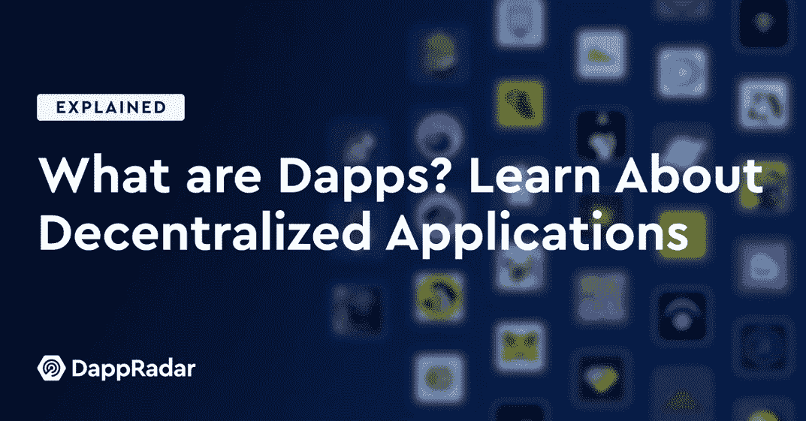
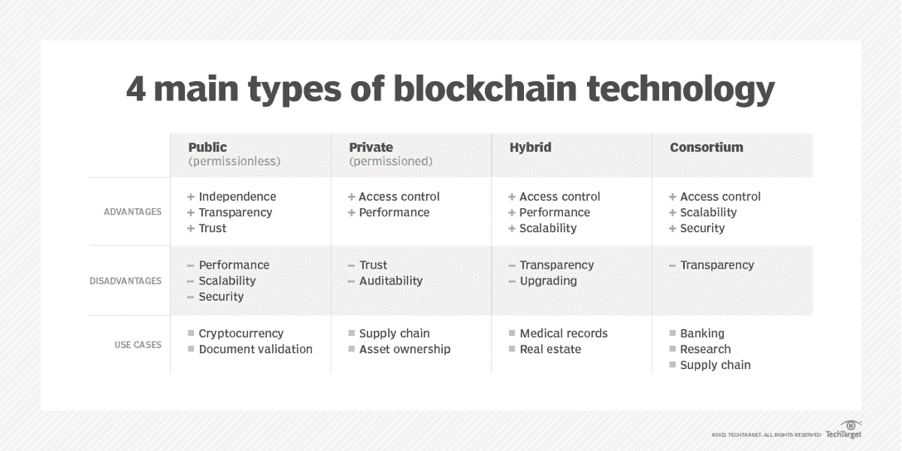
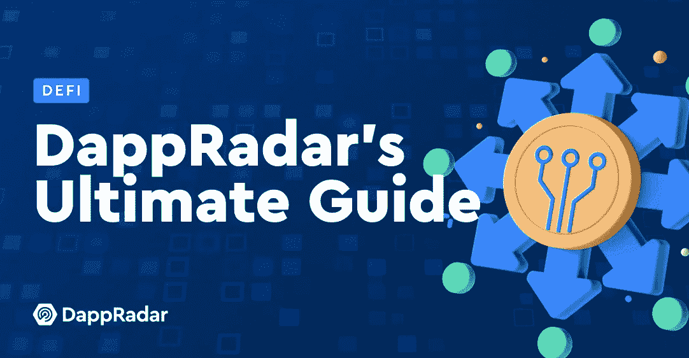
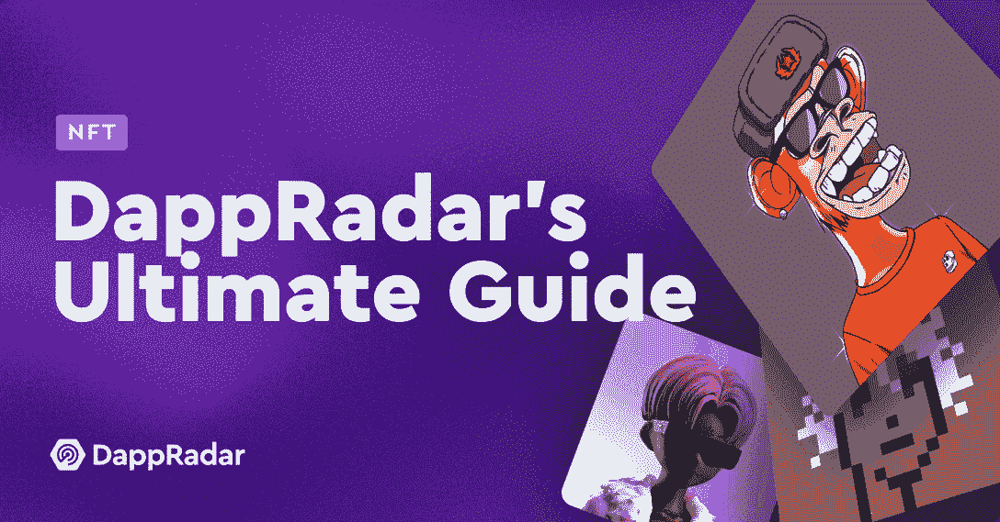

# 什么是区块链？达普拉达的终极指南

> 原文：<https://web.archive.org/web/https://dappradar.com/blog/what-is-a-blockchain-dappradars-ultimate-guide>

## 了解将永远改变我们生活方式的技术

2009 年，一位名为中本聪的匿名人士创建了一个数字账本系统，允许两个用户之间点对点共享信息，区块链一词因此而闻名。从那时起，“什么是区块链”这个问题就成了网上搜索次数最多的信息之一。

这项成就受到了称赞，因为用户无法操纵或入侵系统，而中本聪的发现导致了比特币的诞生，或被一些人称为神奇的互联网货币。

几年后，一位名叫 Vitalik Buterin 的年轻人也考虑通过添加可编程代码，将区块链用于现实生活中的应用，这就是所谓的智能合同。他的概念催生了以太坊和我们今天看到的庞大的去中心化应用产业。更重要的是，正如应用程序为终端用户提供了移动设备的真正用途一样，dapps 为他们的密码提供了用户、拥护者和崇拜者[现实世界的实用工具](https://web.archive.org/web/20220930122334/https://dappradar.com/blog/what-are-dapps)。

随着所有这些新技术的快速创新和变化，人们有疑问是很自然的。幸运的是，DappRadar 会保护你。

*   [区块链背景](https://web.archive.org/web/20220930122334/https://dappradar.com/blog/what-is-a-blockchain-dappradars-ultimate-guide/#Background-to-blockchain)
*   什么是区块链？
*   区块链是如何工作的？
*   什么是区块链矿工？
*   什么是共识机制？
*   [工作证明共识](https://web.archive.org/web/20220930122334/https://dappradar.com/blog/what-is-a-blockchain-dappradars-ultimate-guide/#Proof-of-Work-Consensus-)
*   [利益相关共识证明](https://web.archive.org/web/20220930122334/https://dappradar.com/blog/what-is-a-blockchain-dappradars-ultimate-guide/#Proof-of-Stake-Consensus-)
*   [其他共识机制](https://web.archive.org/web/20220930122334/https://dappradar.com/blog/what-is-a-blockchain-dappradars-ultimate-guide/#Other-consensus-mechanisms)
*   区块链是如何使用加密技术的？
*   第一个区块链是什么？
*   所有的区块链都一样吗？
*   [什么是第 1 层和第 2 层区块链？](https://web.archive.org/web/20220930122334/https://dappradar.com/blog/what-is-a-blockchain-dappradars-ultimate-guide/#What-are-Layer-1-and-Layer-2-blockchains?)
*   区块链是新的互联网吗？
*   区块链制造密码机吗？
*   [什么是燃气费？](https://web.archive.org/web/20220930122334/https://dappradar.com/blog/what-is-a-blockchain-dappradars-ultimate-guide/#What-are-gas-fees?-)
*   区块链环保吗？
*   区块链的特色如何支持可持续发展？
*   什么是区块链应用程序？
*   什么是区块链钱包？
*   [我现在可以用区块链技术做些什么？](https://web.archive.org/web/20220930122334/https://dappradar.com/blog/what-is-a-blockchain-dappradars-ultimate-guide/#What-can-I-do-with-blockchain-technology-today?-)

## 区块链的背景

区块链的崛起正值 2008 年金融危机后人们对断裂的传统经济体系的认识提高之际。2008 年的股市和房市崩溃源于始于 90 年代末的次贷市场的空前增长。一些美国政府支持的抵押贷款机构向信用评分低、贷款违约风险较高的借款人提供住房贷款。

他们为什么这样做？因为不管客户是立即违约还是以后违约，抵押贷款经纪人仍然获得了可观的利润。更重要的是，穆迪等评级机构似乎与银行家同流合污，拒绝下调评级，直到为时已晚。中间人是导致崩溃的一个关键因素，也是比特币诞生的核心原因。

中本聪在 2009 年 1 月全球金融危机期间推出了比特币，引人注目地在代码中留下了一个复活节彩蛋。“财政大臣即将对银行进行第二次纾困”的消息在创世纪板块中打上了时间戳，这暗示了创造者制造这种数字货币的动机。然而，必须明确指出的是，尽管关于比特币的创造者存在许多理论，但没有人确切知道。

无论如何，区块链技术都有可能消除中介，并已经在支付、银行以及最近通过不可替代的令牌实现的数字所有权方面扰乱了传统金融行业。简而言之，区块链技术基于三大支柱:分布式分类帐、对等网络和加密安全。

## 什么是区块链？

区块链因其存储数据的方式而得名——在链接在一起形成链的区块中。Blocks 记录并确认交易的时间和顺序，然后记录到网络中的区块链中，该网络由网络参与者同意的规则管理。随着交易数量的增长，区块链也在增长。

每个块包含一个散列，它是一个数字指纹或唯一标识符，加上最近有效交易的时间戳批次和前一个块的散列。最后一个块哈希将块链接在一起，并阻止任何块被更改或在两个现有块之间插入块。理论上，这种方法可以防止区块链被篡改。

区块链旨在允许数字信息被记录和分发，但不能被编辑。这样，区块链是不可变的分类账或交易记录的基础，不能被更改、删除或销毁。

## 区块链是如何工作的？

区块链网络中的数字交易被分组在密码安全的块中，其他交易在同一时间范围内发生。然后，该块被广播到网络。

区块链网络包括验证和中继交易信息的节点或参与者。被称为矿工的参与者验证交易块，矿工使用计算能力来解决加密难题并验证交易块。第一个解密和验证区块的矿工将获得奖励。

每个被验证的块被连接到先前被验证的块，从而创建块链。每个被验证的块被连接到被验证的块，创建块链。散列法为输入到系统中的字符串分配一个固定值。区块链的散列能力产生了确定性的、可快速计算的和抗原像的系统。加密散列函数应该抵抗对其[原像](https://web.archive.org/web/20220930122334/https://en.wikipedia.org/wiki/Preimage#Inverse_image)的攻击。

## 什么是区块链矿工？

挖掘只是对网络中的节点进行计算工作的一种隐喻，希望获得新的令牌。实际上，矿商本质上是在为他们作为区块链审计员的工作获取报酬。他们或他们的计算机执行验证区块链交易合法性所需的繁重工作。

然而，当矿商通过将一大群矿商聚集在一起的公司来集中他们的资源时，问题就出现了。这些矿工然后分享区块链网络提供的奖励和费用。

但是，随着区块链的成长，越来越多的计算机加入进来试图解决问题；因此，问题变得更具挑战性，网络变得更大，理论上链分布得更远，使破坏或黑客攻击变得更具挑战性。

然而，实际上，采矿权已经集中在少数几个矿池手中。这些大型组织拥有庞大的计算和电力资源，能够根据工作验证证明来维护和发展区块链网络。因此，像[以太坊这样的网络正在向利益证明](https://web.archive.org/web/20220930122334/https://dappradar.com/blog/ethereum-2-0-five-things-you-need-to-know)机制发展。

[<picture></picture>](https://web.archive.org/web/20220930122334/https://dappradar.com/blog/what-are-dapps)

## 什么是共识机制？

根据定义，共识意味着普遍同意，即一群人达成了广泛的一致，每个人都很高兴，可以继续进行。在区块链中，共识机制是一种算法，可确保区块链系统正常工作，保护网络安全，网络中的所有节点同步，并且所有交易都得到验证。

此外，尽管有许多久经考验的机制，但区块链是一种允许创新的技术；新的区块链网络正在出现，希望改善现有系统，创新新的共识机制。首先，我们将深入探讨最常见的达成共识的方法。

### 工作证明共识

比特币共识机制被称为工作证明(PoW)。Satoshi 建议将 PoW 作为防止重复支出和保护网络免受想要改变网络结果的用户攻击的最佳方式。PoW 使用网络的综合电力，这意味着随着网络变得越来越强大，它将需要更多的电能来保持安全。

PoW 的主要问题是，随着网络变得更加广泛，它需要更多的电力。环境影响是不希望的，因为大多数化石燃料使用大部分电力。比特币、莱特币、以太坊 1.0 和 Monero 是使用 PoW 共识算法的标准区块链网络。然而，以太坊正计划成为 PoS 区块链。

### 利害关系证明共识

利害关系证明或 PoS 是另一种流行的共识算法；在他的例子中，用户成为矿工，不需要采矿机器，不像 PoW 算法。我们可以使用[泰佐斯](https://web.archive.org/web/20220930122334/https://dappradar.com/rankings/protocol/tezos)区块链的机制来充分理解 PoS 算法是如何工作的。

参与共识的用户被称为每个级别的代表。网络不要求所有代表都参与，并且参与条件会发生变化。在区块链上产生和存储的 PRNG(伪随机数发生器)用于随机选择将参与共识的代表。PoS 算法的主要问题是用户通过使用更多的令牌来获得更多的网络优势。

### 其他共识机制

后来，区块链网络公司采用了利益验证共识方法，参与者必须在区块链中拥有股份——通常是通过拥有一些加密货币——才有机会选择、验证和确认交易。这种方法节省了大量的计算能力资源，因为不需要挖掘。

此外，一些团队试图用定制的解决方案来解决问题。委托股权证明或 dPoS 是另一种验证交易和区块链网络安全的共识算法，越来越受欢迎。而附近的区块链，例如，使用一种共识机制称为茄。茄科植物将系统模拟为一个单一的区块链。每个块的事务列表被分成物理块，每个分片一个块。所有块累积成一个块。

Harmony 的共识算法被称为快速拜占庭容错(FBFT)，是对[著名的 PBFT 算法](https://web.archive.org/web/20220930122334/https://www.nature.com/articles/s41598-022-08587-1#:~:text=PBFT%20is%20an%20algorithm%20based,(N%2D1)%2F3.)的升级。FBFT 比 PBFT 更快且更具可扩展性，因为使用了 BLS(Boneh–Lynn–Shacham)聚合签名来显著降低通信成本。

正如你所知，区块链共识机制和复杂的算法和密码处理的世界可能会变得有点沉重。除非你计划建造一个区块链或者只是渴望更深层次的知识，否则这些信息大部分都是不必要的。底线是区块链是根据几个简单的标准来评判的:安全性、速度和成本。

使用 [NFT 浏览器](https://web.archive.org/web/20220930122334/https://dappradar.com/hub/nft-explorer)发现您最喜爱的 NFT 系列，并获得可操作的准确数据。

## 区块链中的密码学

密码术是保护重要数据免受未授权访问的方法。在区块链中，加密技术被用作区块链网络中两个节点之间的健壮安全机制和安全交易。

区块链使用两种类型的安全方法，即加密和哈希。这两者之间的主要区别是加密技术用于在 P2P(点对点)网络中加密消息。同时，散列保护区块链中的块信息和链接块。

## 第一个区块链是什么？

密码学家大卫·查姆(David Chum)在他 1982 年的论文“由相互怀疑的团体建立、维护和信任的计算机系统”中首次提出了一种类似区块链的协议 1991 年，Stuart Haber 和 W.Scott Stornatta 希望创建不能被篡改的文档时间戳，并将文档收集到一个块中。

第一个区块链的完整描述包含在比特币白皮书中，其中中本聪描述了他们版本的区块链系统。他们还提出，对等网络应该创建一个时间戳来形成一个不可变的记录。

## 区块链都一样吗？

从纯技术的角度来看，区块链网络主要有四种类型:公共区块链、私人区块链、联合区块链和混合区块链。这些平台各有其优点、缺点和理想用途。

通常围绕网络需要能够向用户提供什么服务来做出选择。例如，在过去的几年里，BNB 连锁店有一个明确的使命，那就是抓住那些缺乏自信和喜欢玩游戏的人群。可以说，如果没有 EVM 兼容的低成本区块链，他们不可能取得今天的成就。使用 TechTarget 的下表，我们可以大致了解每种设置的区别、优点和缺点。

如共识部分所述，网络结构中还存在其他技术差异。旧的网络仍然使用 PoW，而新的网络更喜欢 PoS 机制，尽管两者都不完美。此外，为了更清楚地了解每个区块链及其机制，您可以深入我们的区块链指南并了解更多。

## 什么是第 1 层和第 2 层区块链？

随着越来越多的 dapps 加入[以太坊网络](https://web.archive.org/web/20220930122334/https://dappradar.com/rankings/protocol/ethereum)，第一层区块链遭遇拥塞，导致交易费用高昂。[第 2 层](https://web.archive.org/web/20220930122334/https://dappradar.com/blog/what-are-layer-1-and-layer-2-blockchains)的发明为第 1 层区块链的扩展提供了一个可行的解决方案。第二层区块链提供了解决第一层区块链可扩展性的方案。

这种技术将事务捆绑在一起，并在 L2 环境中执行它们，然后将更新的数据发送回 mainnet。因此，以太坊网络不再单独处理数以千计的[DeFi](https://web.archive.org/web/20220930122334/https://dappradar.com/blog/decentralized-finance-defi-dappradars-ultimate-guide)交易，而是在第二层卸载计算。

下一步是将事务数据发送回第 1 层，有两种方法可以进行汇总:乐观和零知识。

以下是一些需要记住的主要区别:

*   第一层是底层突出的区块链建筑。[以太坊](https://web.archive.org/web/20220930122334/https://dappradar.com/rankings/protocol/ethereum)和[比特币](https://web.archive.org/web/20220930122334/https://dappradar.com/hub/token/eth/WBTC?from=0x2260fac5e5542a773aa44fbcfedf7c193bc2c599)都是第一层区块链。
*   第 2 层是指通过二级区块链减少拥塞的扩展解决方案。第二层链的例子有[乐观](https://web.archive.org/web/20220930122334/https://dappradar.com/rankings/protocol/optimism)、[仲裁](https://web.archive.org/web/20220930122334/https://dappradar.com/ethereum/other/arbitrum)和 StarkNet。
*   第 2 层区块链通过汇总技术解决可伸缩性问题，主要是乐观汇总和零知识汇总。

## 区块链是新的互联网吗？

下一波在线创新被称为 Web3，下一代互联网，将存在于区块链。它将是去中心化的，这意味着它不会被像脸书、谷歌或推特这样的实体所控制。此外，a16z 等大品牌和投资公司都在投入资源建设 Web3。

## 区块链制造密码吗？

简而言之，密码不是区块链发明的；更准确地说，加密货币是一种基于分布在许多计算机上的网络的数字资产，就像区块链一样。这种分散的结构使它们能够在政府和中央当局的控制之外存在。

例如，一种本地货币，在以太坊上是 ETH，在雪崩上是 AVAX，用于交易和支付汽油费。如前所述，用户的燃气费和交易费由出借计算资源的用户分摊。

最重要的是，你不需要自己的区块链来创造一种加密货币。例如，达普拉达在以太坊区块链和后来的 BNB 链上发射了雷达。达普拉达不是区块链，也永远不会是。永远不要说不！

***查看更多达普拉达的终极指南:***

[<picture></picture>](https://web.archive.org/web/20220930122334/https://dappradar.com/blog/decentralized-finance-defi-dappradars-ultimate-guide)

## 什么是煤气费？

燃气费是用户在区块链上完成交易所支付的费用。这些费用补偿了区块链矿商用于验证区块链交易的计算能力。他们通常以区块链本地的加密货币支付。

天然气费用不断变化，有些网络比其他网络更贵。由于网络拥塞，以太坊是出了名的最贵，而像 BNB 链和多边形这样的网络以其低廉的用户成本而闻名。查看我们的指南，寻找从最低以太坊燃气费中获益的最佳时机[。](https://web.archive.org/web/20220930122334/https://dappradar.com/blog/when-are-ethereum-gas-fees-lowest)

## 区块链环保吗？

区块链虽然消除了对中介的需求，并带来了交易各方之间的信任，但同时也消耗了在我们已知的系统上运行它们所需的大量能量。不幸的是，这一过程造成了绝大部分的温室气体排放。

用一些数字来说明这个问题，[剑桥比特币电力消耗指数](https://web.archive.org/web/20220930122334/https://ccaf.io/cbeci/index)估计比特币采矿网络每年消耗近 70 太瓦时(TWh)的电力，在国家电力消耗中排名第 40 位。相比之下，根据美国中央情报局(CIA)编制的 2016 年数据，爱尔兰(排名第 68 位)使用的比特币消费量略高于三分之一，即 25 TWh，奥地利排名第 42 位，每年消耗 64.6 TWh 的电力。

但我们也看到了积极的变化，因为新的共识机制正在被发明出来，以减少有害的环境影响，可再生能源选项被推广到现有的模式中。此外，随着 [NFTs 的受欢迎程度稳步增长](https://web.archive.org/web/20220930122334/https://dappradar.com/blog/dapp-industry-report-q2-nfts-and-web3-games-keep-enduring-market-conditions-as-shockwaves-from-the-terra-collapse-reach-cefi-and-vcs)，特别是随着[元宇宙](https://web.archive.org/web/20220930122334/https://dappradar.com/blog/what-is-the-metaverse)的推出，我们很可能会在短期内看到更多的问题而不是解决方案。

## 区块链的特色如何支持可持续发展？

在气候变化的推动下，世界各地的组织都有望达到新的能耗标准并减少碳排放。世界领先的企业和国家也在以前所未有的规模投资可持续发展，努力实现目标。

关于气候变化和全球公认的协议，区块链可以提供更多的透明度。此外，它可以简化减排量的跟踪和报告，解决重复计算的问题。因此，可以用它来跟踪《巴黎协定》国家自主贡献的执行情况。

传统的电力网络是集中式的，导致能源输送效率低下，例如未使用的剩余能源。因为区块链允许公众跟踪环境数据和是否达到承诺，它可以阻止公司和政府执行环境承诺或误报成就的 180 度大转弯。

区块链也非常适合点对点(P2P)可再生能源交易，允许消费者出售、购买和交换可再生能源。他们可以通过使用代表一定能量的代币或数字资产来实现。

未来，对更多数字服务和产品的更高需求将会出现，并迫使企业做出调整。更有效的结算和灵活的支付是迫切需要的，并将通过 [DeFi](https://web.archive.org/web/20220930122334/https://dappradar.com/blog/decentralized-finance-defi-dappradars-ultimate-guide) 实现，这是一种正在成熟的帮助组织降低成本的方法。

## 什么是区块链应用程序？

运行在区块链上的应用程序被称为[分散式应用程序，简称 dapp](https://web.archive.org/web/20220930122334/https://dappradar.com/blog/what-are-dapps) 。它们也被称为 dApps(尽管你在 DappRadar 的其他地方找不到这个拼写)、Web3 应用程序和区块链应用程序。

Dapps 建立在分散的网络上，比如区块链以太坊。当您使用 dapp 时，您会与它所基于的分散式网络进行交互。它类似于你在手机或电脑上找到的常规应用程序，但任何一个人或实体都不能集中控制它。为什么？因为 Dapps 从对等网络而不是从单个服务器运行。

[https://web.archive.org/web/20220930122334if_/https://www.youtube.com/embed/AbXzqHuKOus?feature=oembed](https://web.archive.org/web/20220930122334if_/https://www.youtube.com/embed/AbXzqHuKOus?feature=oembed)

DappRadar 是世界领先的 dapp 发现和跟踪网站。成立于 2018 年，当时只有几个区块链和几个 dapp，[我们现在在 40 多个区块链](https://web.archive.org/web/20220930122334/https://dappradar.com/rankings)跟踪超过 4000 个 dapp。在过去的几年里，人们接触到了更多的 dapp，人们越来越明显地发现，他们最喜欢的令牌都与 dapp 或区块链有关。

通过这种方式，dapps 开始要求更多的关注，因为他们成为各自网络的价值驱动者，可以说是在 [DeFi](https://web.archive.org/web/20220930122334/https://dappradar.com/blog/decentralized-finance-defi-dappradars-ultimate-guide) 和引入总价值锁定指标的夏天开始的。

## 什么是区块链钱包？

[区块链钱包](https://web.archive.org/web/20220930122334/https://dappradar.com/blog/category/crypto-wallet)，也称为加密钱包，是一种用于接收、发送、收集和跟踪加密资产所有权的应用程序或设备。与现实世界中存放现金或支付卡的钱包不同，加密钱包不会精确地存储加密货币。

相反，它们提供对加密货币的安全访问，因此它们更像是使用银行账户或支付系统。在交易加密货币时，将加密钱包视为您的身份。你钱包的地址就是这笔交易在区块链上被记录的方式。

区块链钱包有硬件(一种类似于 u 盘的设备)和软件(在线钱包和应用程序)两种选择。由于处于离线状态，硬件钱包可能更安全，不会受到恶意行为者的攻击，但它们缺乏功能，可能会被损坏或丢失。

另一方面，[像 MetaMask 这样的软件钱包更容易使用](https://web.archive.org/web/20220930122334/https://dappradar.com/blog/what-is-metamask)，并且包含各种选项。不过，它们的安全性取决于钱包提供商提供的水平和用户的意识。永远不要点击你不知道或不理解的链接，这是一个需要保持在列表顶端的规则。

[https://web.archive.org/web/20220930122334if_/https://www.youtube.com/embed/Odixm1ehnfw?feature=oembed](https://web.archive.org/web/20220930122334if_/https://www.youtube.com/embed/Odixm1ehnfw?feature=oembed)

## 今天我可以用区块链技术做什么？

您可以在几分钟内设置一个区块链钱包，并使用我们的区块链和 dapp 类别过滤器扫描 DappRadar，开始与 dapps 互动。选择是多种多样的，并不是所有的选择都是出于经济动机。你可以用 Game-fi 寻找游戏、金融 dapps，或者两者的结合。

有[社交媒体、博客](https://web.archive.org/web/20220930122334/https://dappradar.com/rankings)和 [NFT 市场 dapps](https://web.archive.org/web/20220930122334/https://dappradar.com/nft/marketplaces) ，还有[专注于秘密艺术](https://web.archive.org/web/20220930122334/https://dappradar.com/rankings)而不是流行头像收藏的平台。

你可以开始做的一件重要事情是尝试加密货币，在你的区块链钱包中持有一些，并使用像 [Uniswap](https://web.archive.org/web/20220930122334/https://dappradar.com/multichain/exchanges/uniswap-v3) 和 [Pancakeswap](https://web.archive.org/web/20220930122334/https://dappradar.com/blog/what-is-pancakeswap-and-how-to-use-it) 这样的平台完成代币互换。你可以[注册空投](https://web.archive.org/web/20220930122334/https://dappradar.com/blog/explained-cryptocurrency-crypto-airdrops)，这基本上是免费的代币，作为一种营销工具。有时候会有标准或者事情要提前做。

所有这些都将拓展你在现实世界中对区块链技术的工作知识，并让你迈出去中心化金融世界的第一小步。

你可以做的另一件事是[参与区块链上运行的你最喜欢的平台](https://web.archive.org/web/20220930122334/https://dappradar.com/blog/dappradar-and-layer3-launch-first-bounty-contest)和服务的决策。许多 dapps 有一个[治理令牌](https://web.archive.org/web/20220930122334/https://dappradar.com/blog/what-is-governance-in-the-dapp-ecosystem)，持有者用它来[投票表决提案](https://web.archive.org/web/20220930122334/https://dappradar.com/blog/what-is-governance-in-the-dapp-ecosystem)。你持有的代币越多，你的投票权就越大。

这些只是今天你可以用区块链技术做的几件事。此外，实践方法往往最适合任何新技术。

***查看更多达普拉达的终极指南:***

[<picture></picture>](https://web.archive.org/web/20220930122334/https://dappradar.com/blog/what-are-non-fungible-tokens-nfts) NewsletterUnsubscribe at any time. [T&Cs](https://web.archive.org/web/20220930122334/https://dappradar.com/terms) and [Privacy Policy](https://web.archive.org/web/20220930122334/https://dappradar.com/privacy-policy)