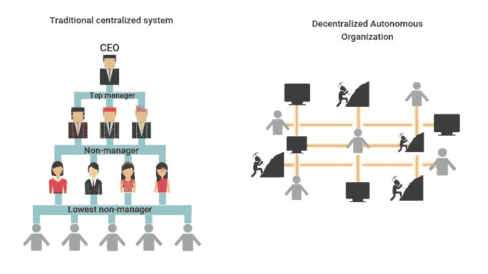
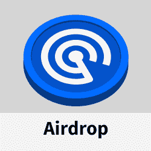

# 什么是刀&它是如何工作的？

> 原文：<https://web.archive.org/web/https://dappradar.com/blog/what-is-a-dao-how-does-it-work>

## 了解分散自治组织

你可能听说过 DAO 这个术语，但是它到底是什么意思呢？**什么是刀？**简而言之，他们是依靠区块链技术运行的组织，没有传统的管理结构。好奇？在这篇博文中，深入探讨 Dao 是如何工作的，发现成功的例子并了解它们的好处和挑战。

## 什么是刀？

DAO 是加密领域的最新创新之一，是“分散自治组织”的缩写。

从本质上讲，一个 DAO 是一个虚拟的社区领导的实体，没有任何中央领导。所有的决策和资金管理都是通过区块链基于共识的投票进行的。

传统上，组织闭门运作，只有少数几个人有权接触财务或对影响组织中所有事情和每个人的决策有任何发言权。现在终于是时候放下旧的束缚，消除等级制度，将真正的民主引入决策过程了。最好的方法是通过一把刀。

## Dao 是如何工作的？

一个道的条条框框都写在源码里了。传统上写在纸上，成千上万的节点通过基于共识的算法一起执行这些规则和规定。如果社区决定投票赞成，他们总是愿意接受改变。

Source: [https://nirolution.com/decentralized-autonomous-organization/](https://web.archive.org/web/20220929103610/https://nirolution.com/decentralized-autonomous-organization/)

由于智能合同将大部分决策过程自动化并减少了人为错误，Dao 不需要第三方。

在资助情况下很有用，例如当一定比例的成员同意资助某个项目时自动分配资金。

只有当一定数量的成员投票赞成变革时，变革才会获得批准，从而鼓励所有成员提出更重要的意见，并保证组织内不受约束的合作。

这是在成员之间互不了解甚至不一定信任的情况下实现的。此外，不需要信任。

发生的一切都是完全透明的，在一个所有交易都记录在不变的账本上的环境中，成员们遵循标准的共识规则。

*   **进一步阅读:** [如何在草原上造刀](https://web.archive.org/web/20220929103610/https://dappradar.com/blog/how-to-create-a-dao-on-velas)

## 道的起源

第一个 DAO 于 2016 年 4 月在区块链以太坊由一个开发团队使用 Christoph Jentzsch 编写的开源代码推出。

这个道依靠代币销售的众筹，让购买代币的人成为组织的投资者。这个想法获得了巨大的成功，仅仅一个月后，就有超过 11，000 名令牌持有者蜂拥而至，筹集了相当于 1.5 亿美元的 ETH 资金。

可悲的是，这项 DAO 实验在 2016 年 6 月失败了，当时黑客利用其漏洞，偷走了 DAO 价值 5000 万美元的资产。[由于以太坊区块链的硬分叉，攻击被逆转](https://web.archive.org/web/20220929103610/https://www.coindesk.com/learn/2016/06/25/understanding-the-dao-attack/)并且资产得到恢复，但是这一事件严重破坏了社区对这一概念的信任。

在这方面相对沉寂之后，由于分散金融(DeFi)的兴起，DAOs 开始经历新的兴趣。

### **什么是 DeFi？**

[DeFi](https://web.archive.org/web/20220929103610/https://dappradar.com/blog/decentralized-finance-defi-dappradars-ultimate-guide) 是一个广义的术语，用来描述从传统的集中式金融系统到基于区块链的分散技术实现的点对点金融的转变。

[https://web.archive.org/web/20220929103610if_/https://www.youtube.com/embed/Bmo5dXvqYxE?feature=oembed](https://web.archive.org/web/20220929103610if_/https://www.youtube.com/embed/Bmo5dXvqYxE?feature=oembed)

虽然 DeFi 平台为金融交易提供了基础设施，但它们也可以作为 Dao 使用分散技术来管理自己。

## 怎样才能加入道？

区块链上的加密货币钱包地址代表 DAO 成员。这些地址可以属于人类、机器人、物联网设备或其他 Dao。

要成为 DAO 的成员，您需要拥有项目的特定数量的本机令牌，这些令牌称为治理令牌。这些代币可以购买，作为礼物收到，或者通过参与与道相关的任务而获得。越多的人想要加入一个特定的道，其令牌的真实世界价值就越大。

成为会员通常会让你进入一个付费的不和谐频道，在那里你可以与其他会员交流。在 Dao 中，沟通是至关重要的，通常治理过程始于不和谐。

例如，如果你想在 DappRadar 平台的治理方面有发言权，你可以加入 [DappRadar PRO](https://web.archive.org/web/20220929103610/https://dappradar.com/token/pro) ，这让你可以获得关于不和的独家[治理讨论](https://web.archive.org/web/20220929103610/https://dappradar.com/token/governance)。

[<picture></picture>](https://web.archive.org/web/20220929103610/https://dappradar.com/token/airdrop)[<picture></picture>](https://web.archive.org/web/20220929103610/https://docs.dappradar.com/v/radar-token/radar-tokenomics )[<picture></picture>](https://web.archive.org/web/20220929103610/https://discord.gg/dappradar)

成员根据他们拥有的相关代币数量获得投票权。换句话说，一个区块链地址拥有的令牌越多，它的所有者对 DAO 的控制就越大。这类似于传统组织中的股东，因为令牌代表 DAO 的股份。

### 道成员是做什么的？

一个 DAO 的成员可以提交提案和投票决定，如选择或解雇其领导，雇用服务供应商，支付奖金，等等。

例如，在游戏 DAO 中，社区可以对游戏的新功能或更新、图形设计师或配音演员的选择等进行投票。

成员也可以将他们的投票权委托给他们更信任的人，类似于传统组织中的代理投票。

投票是由一个分散的投票系统促成的(比如[快照](https://web.archive.org/web/20220929103610/https://vote.dappradar.com/#/))。DAO 成员在团体投票中使用代币作为投票，您拥有的代币越多，您可以投的票就越多。

## 最成功的 Dao 有哪些？

今天，分散自治组织的概念被应用在许多加密项目中。一些最成功的 Dao 包括:

### Uniswap

加密世界中最重要的 dapps 之一， [Uniswap](https://web.archive.org/web/20220929103610/https://dappradar.com/blog/what-is-uniswap-and-how-to-use-it) 是一个基于社区的分散式交换，首先建立在以太坊网络上。就其规模和历史而言，Uniswap 是现有 Dao 的最佳范例之一。任何持有本地令牌 [UNI](https://web.archive.org/web/20220929103610/https://dappradar.com/ethereum/defi/uni) 的人都可以成为该组织的成员，并获得该组织管理层的投票权。

### 分散土地

众所周知，[顶级元宇宙虚拟世界](https://web.archive.org/web/20220929103610/https://dappradar.com/blog/top-10-best-metaverse-virtual-worlds-with-land-nfts)，[，](https://web.archive.org/web/20220929103610/https://dappradar.com/blog/what-is-decentraland-an-open-world-economy-in-the-metaverse)由 DAO 管理。利益相关者，任何拥有游戏中的象征法力的人，都可以参与到分散的决策中。简而言之，分散的道是一个什么样的游戏的未来[先睹为快。](https://web.archive.org/web/20220929103610/https://dappradar.com/blog/gaming-dappradars-ultimate-guide)

## 道的利与弊

既然“什么是道”是一个你可以很容易回答的问题，那么让我们来强调一下它们最大的好处和缺点。

### Dao 的缺点

DAOs 可能会面临一些挑战，因为没有什么是完美的。以下是一些潜在的问题:

*   依赖于底层的区块链技术；
*   容易受到黑客攻击或其他利用；
*   有限的可扩展性。

### Dao 的优势

尽管存在挑战，Dao 还是提供了许多优势，值得您的组织考虑。其中一些是:

*   由于智能合同，减少了对中间商的需求；
*   社区驱动的决策；
*   提高透明度和问责制；
*   潜在的低成本；
*   无边界操作；
*   更大的民主和平等。

## 什么是道:总结

分散自治组织的概念很吸引人，有可能永远改变组织和公司的运作方式。

不管它的成员在地球上的什么地方，他们的数量、教育水平或背景如何，他们都可以利用这一新的范式。

也就是说，Dao 仍处于起步阶段，从长远来看，还有许多工作等待着成功。

## 通过 DappRadar 继续了解 DAOs

DappRadar 的整个团队都知道保持对最大的 Dao 的了解有多重要，以及它们如何在未来指导我们。

如果你想了解更多关于区块链的事情，一定要阅读我们的博客和 YouTube 频道。

通过在 Twitter 上关注 DappRadar，你还可以获得关于 web3 行业的最新消息。你还可以加入独家的 [DappRadar PRO](https://web.archive.org/web/20220929103610/https://dappradar.com/token/pro) 社区，参与 [Discord](https://web.archive.org/web/20220929103610/https://discord.gg/4ybbssrHkm) 讨论，并从最新的 DeFi 统计数据中受益。

 NewsletterUnsubscribe at any time. [T&Cs](https://web.archive.org/web/20220929103610/https://dappradar.com/terms) and [Privacy Policy](https://web.archive.org/web/20220929103610/https://dappradar.com/privacy-policy)